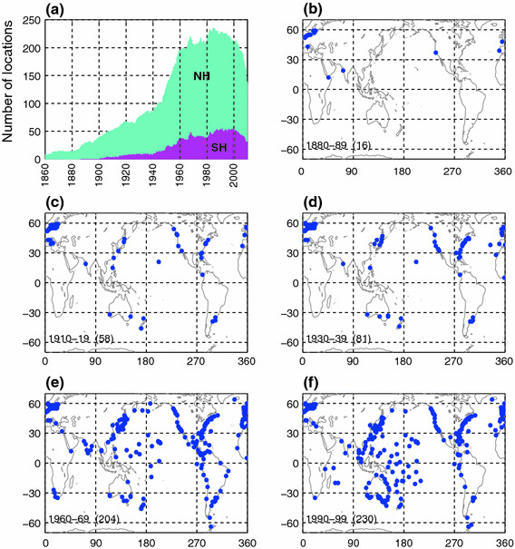
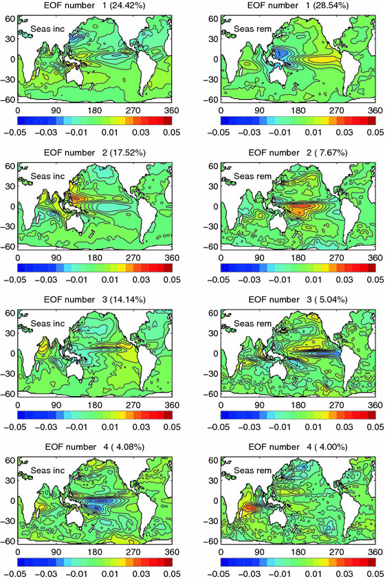
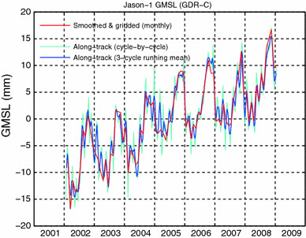
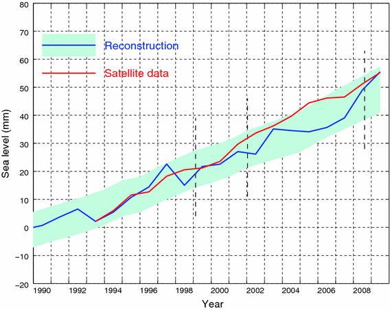
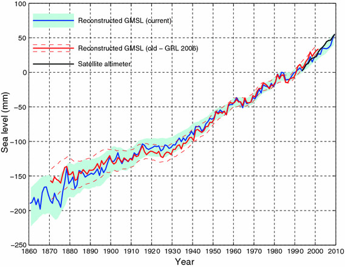
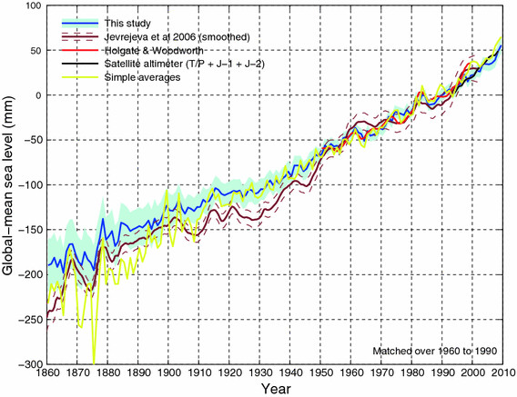
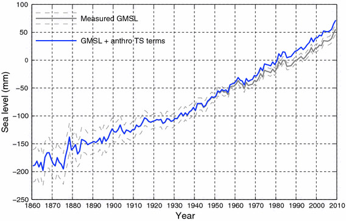
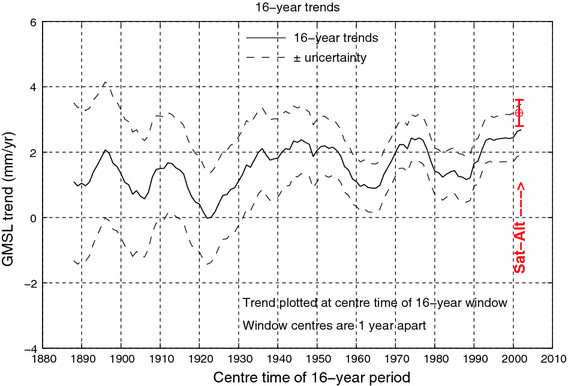

=======================
Church and White (2011)
=======================

:Title: Sea-Level Rise from the Late 19th to the Early 21st Century

:Corresponding author: J. A. Church

:Citation: Church, J. A. & White, N. J. (2011). Sea-Level Rise from the Late 19th to the Early 21st Century. Surveys in Geophysics, 32, 585–602.

:Keywords: Sea level, Climate change, Satellite altimeter, Tide gauge

Abstract
--------

We estimate the rise in global average sea level from satellite altimeter data for 1993Ð2009 and from coastal and island sea-level measurements from 1880 to 2009. For 1993-2009 and after correcting for glacial isostatic adjustment, the estimated rate of rise is 3.2 ± 0.4 mm year$^{-1}$ from the satellite data and 2.8 ± 0.8 mm year$^{-1}$ from the in situ data. The global average sea-level rise from 1880 to 2009 is about 210 mm. The linear trend from 1900 to 2009 is 1.7 ± 0.2 mm year$^{-1}$ and since 1961 is 1.9 ± 0.4 mm year$^{-1}$. There is considerable variability in the rate of rise during the twentieth century but there has been a statistically significant acceleration since 1880 and 1900 of 0.009 ± 0.003 mm year$^{-2}$ and 0.009 ± 0.004 mm year$^{-2}$, respectively. Since the start of the altimeter record in 1993, global average sea level rose at a rate near the upper end of the sea level projections of the Intergovernmental Panel on Climate ChangeÕs Third and Fourth Assessment Reports. However, the reconstruction indicates there was little net change in sea level from 1990 to 1993, most likely as a result of the volcanic eruption of Mount Pinatubo in 1991.

Introduction
------------

Rising sea levels have important direct impacts on coastal and island regions where a substantial percentage of the world's population lives (Anthoff et al. 2006). Sea levels are rising now and are expected to continue rising for centuries, even if greenhouse gas emissions are curbed and their atmospheric concentrations stabilized. Rising ocean heat content (and hence ocean thermal expansion) is an important element of climate change and sea-level rise. The remaining contributions to sea-level rise come principally from the melting of land ice: glaciers and ice caps (which include the small glaciers and ice caps fringing the major ice sheets) and the major ice sheets of Antarctica and Greenland, with additional contributions from changes in the storage of water on (or in) land. (See Church et al. 2010 for a summary of issues). Correctly estimating historical sea-level rise and representing global ocean heat uptake in climate models are both critical to projecting future climate change and its consequences. The largest uncertainty in projections of sea-level rise up to 2100 is the uncertainty in global mean sea level (GMSL) and thus improving estimates of GMSL rise (as well as regional variations in sea level) remains a high priority.

Since late 1992, high quality satellite altimeters (TOPEX/Poseidon, Jason-1, and OSTM/Jason-2) have provided near global measurements of sea level from which sea-level rise can be estimated. However, this altimeter record is still short (less than 20 years) and there is a need to know how sea level has varied over multi-decadal and longer time scales. Quantifying changes in the rate of sea-level rise and knowing the reasons for such changes are critical to improving our understanding of twentieth century sea-level rise and improving our projections of sea-level change for the twenty first century and beyond.

For the period prior to the altimeter record, estimates of sea-level change are dependent on a sparsely distributed network of coastal and island tide-gauge measurements (Wood.worth and Player 2003). Even today, there are many gaps in the global network of coastal and island sea-level measurements and the network was sparser early in the twentieth century and in the nineteenth century. Many previous studies have used the individual sea-level records (corrected for vertical land motion) to estimate the local rate of sea-level rise (as a linear trend; e.g. Douglas 1991) and some studies attempted to detect an acceleration in the local rate of sea-level rise (Woodworth 1990; Woodworth et al. 2009; Douglas 1992). However, these individual records have considerable interannual and decadal var.iability and thus long records are required to get accurate estimates of the local trends in sea level (Douglas 2001). These authors assumed that these long-term trends are either representative of the global averaged rise or a number of records have been averaged, in some cases regionally and then globally, to estimate the global average rate of rise. However, the modern satellite record has made it clear that sea level is a dynamic quantity and it does not rise uniformly around the globe.

Sea level at any location contains the inßuences of local and regional meteorological effects (including storm surges), modes of climate variability (for example the El Nino-Southern Oscillation) and long-term trends (from both the ocean surface and land move.ments), including the impact of anthropogenic climate change. As the altimeter record has clearly demonstrated, GMSL has much less short term variability (more than an order of magnitude) than sea level at individual locations because while the volume of the oceans is nearly constant the distribution changes with time. While the variability at individual locations can be minimised by low pass filtering, there remains significant energy at yearly to decadal periods that may be either positively or negatively correlated between stations, thus confounding estimates of GMSL rise when few records are available.

To date, there have been two approaches to determining time series of GMSL from coastal and island tide gauges. The first and most straight forward approach averages the sea-level records (corrected for land motion) from individual locations. When there are only a small number of locations with continuous records, this approach is relatively straight forward, although care must be taken to remove data inhomogeneities. When more gauges are used, the records usually have different lengths and starting times. It is then necessary to average the rates of rise over some time step and integrate the results to get the sea-level change. Holgate and Woodworth (2004) used this approach and Jevrejeva et al. (2006) used a virtual station method of averaging neighbouring station sea-level changes in several regions and then averaging to get the global mean sea-level change. No attempt was made to interpolate between the locations of observations and thus to estimate deep ocean sea level. Thus these are essentially estimates of coastal sea-level change. However, note that White et al. (2005) argued that over longer periods the rates of coastal and global rise are similar.

The second approach uses spatial functions which represent the large-scale patterns of variability to interpolate between the widely distributed coastal and island sea-level observations and thus to estimate global sea level (as distinct from coastal sea level). This technique was first developed by Chambers et al. (2002) for interannual sea-level variability and extended by Church et al. (2004) to examine sea-level trends. The Church et al. approach uses the Reduced Space Optimal Interpolation technique (Kaplan et al. 2000) developed for estimating changes in sea-surface temperature and atmospheric pressure. The spatial functions used are the empirical orthogonal functions (EOFs) of sea-level variability estimated from the satellite altimeter data set from TOPEX/Poseidon, Jason-1 and OSTM/Jason-2 satellite data, which now cover the period from January 1993 into 2011. We use data from January 1993 through December 2009 in this paper.

Here, we update previous estimates of GMSL rise for the period of the instrumental record using a longer (17 years) altimeter data set and an expanded in situ sea-level observational data set extending back to 1860. We use the Reduced Space Optimal Interpolation technique to quantify the rate of sea-level rise and the changes in the rate since 1880.

Methods and Data
----------------

In Situ Sea-Level Data
~~~~~~~~~~~~~~~~~~~~~~

We use monthly sea-level data downloaded from the Permanent Service for Mean Sea Level (PSMSL; Woodworth and Player 2003) web site (http://www.psmsl.org) in August 2010. Careful selection and editing criteria, as given by Church et al. (2004) were used. The list of stations used in the reconstruction is available on our web site at http://www.cmar.csiro.au/sealevel/sl_data_cmar.html. Tide gauge records are assigned to the nearest locations (with good satellite altimeter data) on the 1˚-by-1˚ grid of the satellite altimeter based EOFs. Where more than one record is assigned to a single grid point they are averaged. Changes in height from 1 month to the next are stored for use in the reconstruction.

The number of locations with sea-level data available for the reconstruction is larger than in our earlier 2004 (Church et al. 2004) and 2006 (Church and White 2006) studies, particularly prior to 1900 (Figure 1). In the 1860s there are only 7-14 locations available, all north of 30˚N. In the 1870s, there is one record available South of 30˚N but still none in the southern hemisphere and it is only in the second half of the 1880s (Fort Denison, Sydney, Australia starts in January 1886) that the first southern hemisphere record becomes available. While we attempted the reconstruction back to 1860, the results showed greater sensitivity to details of the method prior to the 1880s when the first southern hemisphere record is available (see below for further discussion). As a result, while we show the reconstruction back to 1860, we restricted the subsequent analysis (computation of trends, etc.) to after 1880. The number of locations with data available increases to 38 in 1900 (from 71 individual gauges), including several in the southern hemisphere, to about 85 locations in 1940 (from 130 individual gauges but with still less than 10 in the southern hemisphere), and to about 190 in 1960 (from about 305 individual gauges with about 50 locations in the southern hemisphere). The number of locations peaks in May 1985 at 235 (from 399 individual gauges, with slightly less than one-third in the ocean-dominated southern hemisphere; Figure 1). The largest gaps are in the Southern Ocean, the South Atlantic Ocean and around Africa (Figure 1f). Through the 1990s there are at least 200 locations available from between 370 and 400 gauges. For the last few years there are fewer records available because of the unavoidable delay in the transmission by national authorities of monthly and annual mean information to the PSMSL. In December 2009, there are 135 locations available from 250 gauges.

   Figure 1: The number and distribution of sea-level records available for the reconstruction. (a) The number of locations for the globe and the northern and southern hemispheres. (b-f) indicate the distribution of gauges in the 1880s, 1910s, 1930s, 1960s and 1990s. The locations indicated have at least 60 months of data in the decade and the number of records are indicated in brackets.

Sea-level measurements are affected by vertical land motion. Corrections for local land motion can come from long-term geological observations of the rate of relative local sea-level change (assuming the relative sea-level change on these longer times scales is from land motions rather than changing ocean volume), or from models of glacial isostatic adjustment, or more recently from direct measurements of land motion with respect to the centre of the Earth using Global Positioning System (GPS) observations. Here, the ongoing response of the Earth to changes in surface loading following the last glacial maximum were removed from the tide-gauge records using the same estimate of glacial isostatic adjustment (GIA; Davis and Mitrovica 1996; Milne et al. 2001) as in our earlier study (Church et al. 2004).

We completed the analysis with and without correction of the sea-level records for atmospheric pressure variations (the "inverse barometer" effect). The HadSLP2 global reconstructed atmospheric pressure data set (Allan and Ansell 2006) was used for this correction.

We tested the impact of correcting the tide-gauge measurements for terrestrial loading and gravitational changes resulting from dam storage (Fiedler and Conrad 2010). For the large number of tide gauges used in the period of major dam building after 1950 (mostly over 200), the impact on global mean sea level is only about 0.05 mm year^{-1} (smaller than the 0.2 mm year^{-1} quoted by Fiedler and Conrad, which is for a different less globally-distributed set of gauges). Tests of similar corrections for changes in the mass stored in glaciers and ice caps, and the Greenland and Antarctic Ice Sheets show that these effects have an even smaller impact on GMSL.

Satellite Altimeter Data Processing Techniques
~~~~~~~~~~~~~~~~~~~~~~~~~~~~~~~~~~~~~~~~~~~~~~

The TOPEX/Poseidon, Jason-1 and OSTM/Jason-2 satellite altimeter missions measure sea surface height (SSH) relative to the centre of mass of the Earth along the satellite ground track. A number of instrumental and geophysical corrections must be applied. Every 10 days (one cycle) virtually global coverage of the worldÕs ocean, between 66˚N and S, is achieved. Our gridded data set as used here goes to 65˚N and S.

Our satellite altimeter data processing mostly follows the procedures, and uses the edits and tests, recommended by the providers of the satellite altimeter data sets, and are similar to those described in Leuliette et al. (2004). The documents for the three missions used are Benada (1997) for TOPEX/Poseidon, Aviso (2003) for Jason-1 and CNES (2009) for OSTM/Jason-2.

Orbits from the most recent versions of the Geophysical Data Records (GDR Þles; MGDR-B for TOPEX/Poseidon, GDR-C for Jason-1 and GDR-T for OSTM/Jason-2) are used. GDR corrections from the same Þles for tides, wet troposphere, dry troposphere, ionosphere, sea-state bias (SSB), inverse barometer correction (when required) and the mean sea surface are applied in accordance with these manuals, except for some TOPEX/ Poseidon corrections: firstly, the TOPEX/Poseidon wet troposphere correction has been corrected for drift in one of the brightness temperature channels (Ruf 2002) and offsets related to the yaw state of the satellite (Brown et al. 2002). Secondly, the inverse barometer correction (when used) has been recalculated using time-variable global-mean over-ocean atmospheric pressure, an improvement on the GDR-supplied correction which assumes a constant global-mean over-ocean atmospheric pressure. This approach makes the correction used for TOPEX/Poseidon consistent with the Jason-1 and OSTM/Jason-2 processing.

Calibrations of the TOPEX/Poseidon data against tide gauges have been performed by Gary Mitchum and colleagues (see, e.g., Nerem and Mitchum 2001). Here and in earlier publications, we have used the calibrations up to the end of 2001 (close to the end of the TOPEX/Poseidon mission). One of the problems these calibrations address is the changeover to the redundant "side B" altimeter electronics in February 1999 (at the end of cycle 235) due to degradation of the ÔÔside AÕÕ altimeter electronics which had been in use since the start of the mission. An alternative processing approach to address the side A to side B discontinuity is to use the separate Chambers et al. (2003) SSB models for TOPEX sides A and B without any use of the Poseidon data, as this correction does not address the substantial drift in the Poseidon SSH measurements, especially later in the mission. No tide-gauge calibrations are applied to Jason-1 or OSTM/Jason-2 data. The altimeter data sets as used here are available on our web site at http://www.cmar.csiro.au/sealevel/sl_data_cmar.html.  

The Analysis Approach
~~~~~~~~~~~~~~~~~~~~~

The full details of our approach to estimating historical sea level were reported in Church et al. (2004). Briefly, the reconstructed sea level H^r(x, y, t) is represented as 

H^r(x, y, t) = U^r(x, y) \alpha(t) + \epsilon

where U^r(x, y) is a matrix of the leading empirical orthogonal functions (EOFs) calculated from monthly satellite altimeter data mapped (using a Gaussian filter with a length scale of 300 km applied over a square with sides of 800 km) to a one degree by one degree grid for the ice free oceans between 65ûS and 65ûN, \epsilon is the uncertainty, x and y are latitude and longitude and t is time. This matrix is augmented by an additional "mode" that is constant in space and used to represent any global average sea-level rise. In the reduced space optimal interpolation, the amplitude of the constant mode and these EOFs are calculated by minimising the cost function

S(\alpha) = (K U^r \alpha - H^0)^T M^{-1} (K U^r \alpha - H^0) + \alpha^T \Lambda \alpha

This cost function minimises the difference between the reconstructed sea levels and the observed coastal and island sea levels H^0, allowing for a weighting related to the observational uncertainties, omitted EOFs and also down-weights higher order EOFs. K is a sampling operator equal to 1 when there is observed sea-level data available and 0 otherwise, \Lambda is the diagonal matrix of the eigenvalues of the covariance matrix of the altimeter data and M is the error covariance matrix given by

M = R + KU' \Lambda' U'^{T}K^T

where R is the matrix of the covariance of the instrumental errors (assumed diagonal here) and the primes indicate the higher order EOFs not included in the reconstruction.

The EOFs are constructed from the covariances of the altimeter sea-level data after removal of the mean. Any overall increase in sea level as a result of ocean thermal expansion or the addition of mass to the ocean is difficult to represent by a finite number of EOFs. We therefore include an additional "mode" which is constant in space to represent this change in GMSL.

Because the sea-level measurements are not related to a common datum, we actually work with the change in sea level between time steps and then integrate over time to get the solution. The least squares solution provides an estimate of the amplitude of the leading EOFs, global average sea-level and error estimates.

Christiansen et al. (2010) tested the robustness of various reconstruction techniques, including an approach similar to that developed by Church et al. (2004) using thermosteric sea level calculated from climate model results. They used an ensemble of model results (derived by randomising the phase of the principal components of the model sea level, see Christiansen et al. (2010) for details). For a method similar to that used here (including the additional "constant" mode and for a 20 year period for determining the EOFs), the trend in the ensemble mean reconstruction was within a few percent of the true value when 200 gauges were available (with about a 10% variation for the inter.quartile range of individual estimates, decreasing to about 5% when a 50 year period for determining the EOFs was available). When only 40 gauges were used, the ensemble mean trend was biased low by a little under 10% (with an interquartile range of about 15%). They further showed that the reconstructions tend to overestimate the interannual variability and that a longer period for determining the EOFs is important in increasing the correlation between the reconstructed and model year to year variability. Reconstructions that do not use the constant mode perform poorly compared to those that do. These results are similar to our own tests with climate model simulations, with the reconstruction tending to have a slightly smaller trend. Christiansen et al. also found a simple mean of the tide gauges reproduces the trend with little bias in the ensemble mean and about a 10% variation in the interquartile range. However, the simple mean has larger interannual variations and correlates less well with the model interannual variability.

The GMSL estimates are not sensitive to the number of EOFs (over the range 4Ð20 plus the constant mode) used in the reconstruction, although the average correlation between the observed and reconstructed signal increases and the residual variance decreases when a larger number of EOFs is used. For the long periods considered here and with only a small number of records available at the start of the reconstruction period, we used only four EOFs which explain 45% of the variance, after removal of the trend.

Computation of EOFs
~~~~~~~~~~~~~~~~~~~

For each altimeter mission the along-track data described above are smoothed onto a 1˚-by-1˚-by-1 month grid for the permanently ice-free ocean from 65˚S to 65˚N. The smoothing uses an e-folding length of 300 km and covers 90% of the global oceans. The three data sets are combined by matching means at each grid point (rather than just the global average) over the common periods between TOPEX/Poseidon and Jason-1 and between Jason-1 and OSTM/Jason-2. This is an attempt to overcome the problem of different geographically correlated errors in the missions, for example due to different sea-state bias corrections. The overlap between TOPEX/Poseidon and Jason-1 was from 15-January-2002 to 21-August-2002 (T/P cycles 344-365, J-1 cycles 1-22) or, effectively, February to July 2002 in our monthly data sets. The overlap between Jason-1 and OSTM/ Jason-2 was from 12-July-2008 to 26-January-2009 (J-1 cycles 240-259 and J-2 cycles 1-20) or, effectively, August to December 2008 in our monthly data sets.

Separate versions of the altimeter data sets with and without the inverse barometer correction and with and without the seasonal signal are produced, as follows:

* Only whole years (in this case 17 years) are used.
* Grid points with gaps in the time series (e.g. due to seasonal sea ice) are ignored.
* The data are area (cos(latitude)) weighted.
* The global-mean trend is removed.
* The GIA correction appropriate for this data is applied (Mark Tamisiea, NOC Liverpool, private communication).

In the original (Church et al. 2004; Church and White 2006) reconstructions, the EOFs were defined with the 9 and 12 years (respectively) of TOPEX/Poseidon and Jason-1 satellite altimeter data available at those times. There are now 17 years of monthly satellite altimeter data available, almost twice as long as the original series. This longer time series should be able to better represent the variability and result in an improved reconstruction of global average sea level, as found by Christiansen et al. (2010). After removing the global average trend and the seasonal (annual plus semi-annual) signal, the first four EOFs account for 29, 8, 5 and 4% of the variance (Figure 2). If the seasonal signal is not removed, the first four EOFs account for 24, 18, 14 and 4% of the variance. These EOFs characterise the large-scale interannual variability, particularly that associated with the El Nino-Southern Oscillation phenomenon, and for the case where the seasonal signal has not been removed, also include the seasonal north/south oscillation of sea level.

   Figure 2: The EOFs used in the sea-level construction. The four EOFs on the left include the seasonal signal and represent a combination of the seasonal signal and interannual variability. The corresponding four EOFs on the right are after the seasonal signal has been removed from the altimeter data. The EOFs are dimensionless and of unit length. 

Sensitivity of the Results
~~~~~~~~~~~~~~~~~~~~~~~~~~

To complete the reconstruction, we need to specify two parameters: the instrumental error covariance matrix R and the relative weighting of the "constant" mode to the EOFs. Church and White (2006) used the first differences between sets of nearby sea-level records to compute an average error estimate of the first differences of 50 mm and assumed errors were independent of and between locations (i.e. the error covariance matrix was diagonal). When the seasonal signal was removed, tests indicated the residual variance increased when a smaller error estimate was used but was not sensitive to the selection of larger values. Similarly, the residual variance increased when the weighting of the ÔÔconstantÕÕ mode was less than 1.5 times the first EOF but was not sensitive to larger values. The computed trends for the 1880Ð2009 increased slightly (0.06 mm year -1 or about 4%) when the relative weighting was increased by 33% from 1.5 to 2.0 or the error estimate was decreased by 40% to 30 mm. Prior to 1880 when there were less than 15 locations available and none in the southern hemisphere, there was considerably greater sensitivity to the parameter choice than for the rest of the record and hence we focus on results after 1880. When the seasonal signal was retained in the solution, a larger error estimate of 70 mm was appropriate. This solution also had a larger residual variance and a slightly greater sensitivity in the trend to the parameter choice and hence we focus on the solution with the seasonal signal removed, as in our earlier studies.

As a further test of the effectiveness of the EOFs to represent the interannual variability in GMSL, we computed EOFs using shorter periods of 9 and 12 years, similar to our earlier analyses (Church et al. 2004; Church and White 2006). The resulting estimates are well within the uncertainties.

The atmospheric pressure correction makes essentially no difference to the GMSL time series for the computations with the seasonal signal removed and no difference to the computations including the seasonal signal after about 1940. However, prior to 1940, the correction does make a significant difference to the GMSL calculated with the seasonal signal included. These results suggests some problem with the atmospheric correction prior to 1940 and as a result we decided not to include this correction in the results. This issue seems to be related to the HadSLP2 data set not resolving the annual cycle and, possibly, the spatial patterns well for the Southern Hemisphere south of 30 S for the 1920s and 1930s, presumably because of sparse and changing patterns of input data at this time and in this region. This is being investigated further.

Results
-------

We present results for two periods: from 1880 to 2009 and the satellite altimeter period from January 1993 to December 2009. The latter is only a partial test of the reconstruction technique because the EOFs used were actually determined for this period.

The reconstructed and satellite estimates of GMSL have somewhat different error sources. The two largest uncertainties for the reconstructed sea level are the incomplete global coverage of sea-level measurements (particularly in the southern hemisphere), and uncertainties in land motions used to correct the sea-level records. The former contributes directly to the formal uncertainty estimates that are calculated on the basis that the sea-level records are independent. In estimating uncertainties on linear trends and accelerations, we recognise the series are autocorrelated and the number of effective degrees of freedom is only a quarter of the number of years of data. Previous tests using various GIA models suggest an additional uncertainty in trends of about ±0.1 mm year^{-1} (Church et al. 2004) that should be added in quadrature to the uncertainty in the trend estimate from the time series (but not for estimates of the acceleration in the rate of rise). The annual time series of GMSL and the estimated uncertainty estimates are available at http://www.cmar.csiro.au/sealevel/sl_data_cmar.html.

1993-2009
~~~~~~~~~

The global mean sea level can be computed cycle-by-cycle (every 10 days) directly from the along track satellite data or from the mapped (monthly) satellite data. After averaging the cycle-by-cycle data set over 3 cycles these two estimates for the Jason-1 mission (February 2002 to January 2009; Figure 3) are very similar; the differences have a standard deviation of 1.0 mm. The trends are different by only 0.2 mm year^{-1}, with the trend from the gridded data set being higher numerically, but not statistically different from the trend from the along-track data set.

   Figure 3: Comparison of the satellite-altimeter estimates of GMSL from the along-track data (including all ocean areas where valid data are available) and the mapped data (for a fixed grid) for the duration of the Jason-1 altimeter mission.

The reconstructed and altimeter GMSL both increase from 1993 to the end of the record (Figure 4). The larger year-to-year variability of the reconstructed signal (compared with the altimeter record) of ~4-5 mm is less than the one standard deviation uncertainty estimates of about ±7 mm. For almost all of the record, the reconstruction is within the one standard deviation uncertainty estimate of the altimeter record. The uncertainty of the reconstruction increases slightly in the last couple of years because of the smaller number of tide gauge records available through the PSMSL.

   Figure 4: Global average sea level from 1990 to 2009 as estimated from the coastal and island sea-level data (blue with one standard deviation uncertainty estimates) and as estimated from the satellite altimeter data from 1993 (red). The satellite and the in situ yearly averaged estimates have the same value in 1993 and the in situ data are zeroed in 1990. The dashed vertical lines indicate the transition from TOPEX Side A to TOPEX Side B, and the commencement of the Jason-1 and OSTM/Jason-2 records.

After correcting for the GIA, the linear trend from the altimeter data from January 1993 to December 2009 is 3.2 ± 0.4 mm year^{-1} (note the GIA values appropriate for correcting the altimeter data are different to that necessary for the in situ data). The uncertainty range (1 standard deviation) comes from fitting a linear trend to the data using uncertainties on the annual averages of 5 mm and is consistent with an updated error budget of altimeter sea-level trend uncertainties (Ablain et al. 2009). They estimate the largest uncertainties are related to the wet tropospheric (atmospheric water vapour) correction, the bias uncertainty of successive missions, orbit uncertainty and the sea-state bias correction. These total to about 0.4 mm year -1, similar to our uncertainty estimate. The reconstructed global average sea-level change over the same period is almost the same as for the altimeter data. However, as a result of different interannual variability, the trend of 2.8 ± 0.8 mm year^{-1} is smaller but not significantly different to the altimeter estimate after correction for glacial isostatic adjustment.

1880-2009
~~~~~~~~~

The GMSL time series (Figure 5) are not significantly different from our earlier 2006 result (Church and White 2006). The total GMSL rise (Figure 5) from January 1880 to December 2009 is about 210 mm over the 130 years. The trend over this period, not weighted by the uncertainty estimates, is 1.5 mm year^{-1} (1.6 mm year^{-1} when weighted by the uncertainty estimates). Although the period starts 10 years later in 1880 (rather than 1870), the total rise (Figure 5) is larger than our 2006 estimate of 195 mm mostly because the series extends 8 years longer to 2009 (compared with 2001).

   Figure 5: Global average sea level from 1860 to 2009 as estimated from the coastal and island sea-level data (blue). The one standard deviation uncertainty estimates plotted about the low passed sea level are indicated by the shading. The Church and White (2006) estimates for 1870-2001 are shown by the red solid line and dashed magenta lines for the 1 standard deviation errors. The series are set to have the same average value over 1960-1990 and the new reconstruction is set to zero in 1990. The satellite altimeter data since 1993 is also shown in black.

The interannual variability is mostly less than the one standard deviation uncertainty estimates, which range from ~25 mm in 1880 to a minimum of ~6 mm in 1988 (as shown in Figure 5, where the yearly GMSL time series is plotted over the envelope of smoothed (±3 year boxcar) 1 standard deviation limits). However, there are a number of features which are comparable to/larger than the uncertainty estimates. Firstly, there is a clear increase in the trend from the first to the second half of the record; the linear trend from 1880 to 1935 is 1.1 ± 0.7 mm year^{-1} and from 1936 to the end of the record the trend is 1.8 ± 0.3 mm year^{-1}. The period of relatively rapid sea-level rise commencing in the 1930s ceases abruptly in about 1962 after which there is a fall in sea level of over 10 mm over 5 years. Starting in the late 1960s, sea level rises at a rate of almost 2.4 mm year^{-1} for 15 years from 1967 and at a rate of 2.8 ± 0.8 mm year^{-1} from 1993 to the end of the record. There are brief interruptions in the rise in the mid 1980s and the early 1990s.

The linear trend from 1900 to 2009 is 1.7 ± 0.2 mm year^{-1} and from 1961 to 2009 is 1.9 ± 0.4 mm year^{-1}. However, there are significant departures from a linear trend. We estimate an acceleration in GMSL by fitting a quadratic to the time series, taking account of the time variable uncertainty estimates. From 1880 to 2009, the acceleration (twice the quadratic coefficient) is 0.009 ± 0.003 mm year^{-2} (one standard deviation). This estimate is slightly less than but not significantly different from the (one standard deviation) estimate of Church and White (2006) of 0.013 ± 0.003 mm year^{-2}, but still significantly different from zero at the 95% level. From 1900 to 2009, the acceleration is also 0.009 ± 0.004 mm year^{-2}. If the variable uncertainty estimates are ignored the equivalent accelerations are 0.010 and 0.012 mm year^{-2}.

Discussion
----------

There are other recent estimates of changes in GMSL for this period widely available (Jevrejeva et al. 2006; Holgate and Woodworth, 2004; Fig. 6). They all agree approximately with our updated GMSL time series and the longer of these estimates (Jevrejeva et al. 2006) also has an acceleration in the 1930s and a pause in the rise commencing in the 1960s. These changes are also present in a number of individual sea-level records (Woodworth et al. 2009). However, note that the interannual variability in the Jevrejeva et al. series is unrealistically large in the early part of the record and larger than their uncertainty estimates. The Jevrejeva et al. estimate of sea level prior to 1850 (Jevrejeva et al. 2008) indicates an acceleration in the rate of rise commencing at the end of the eighteenth century. Note that their pre-1850 estimate uses only three-sea level records. We do not attempt to extend our construction back prior to 1860. If instead of the recon.struction technique, we employed a straight average of tide gauges, the overall trend back to 1910 is very similar but there is larger interannual variability (Figure 6). Prior to 1910, the variability is even larger (consistent with the results of Christiansen et al. (2010), with unrealistic decadal trends of ±10 mm year^{-1}.

One source of error is the poor corrections for land motion. Bouin and Wooppelmann (2010) used GPS time series for correcting tide-gauge records for land motion from all sources and estimated a global average sea-level rise of 1.8 mm year^{-1} for the twentieth century, consistent with the present results and early studies (e.g. Douglas 1991). These GPS series are just now beginning to be long enough to provide useful constraints on land motion from all sources (not just GIA).

A significant non-climatic influence on sea level is the storage of water in dams and the depletion of ground water from aquifers, some of which makes it into the ocean. Chao et al. (2008) estimated that about 30 mm of sea-level equivalent is now stored in man-made dams and the surrounding soils; most of this storage occurred since the 1950s. Globally, the rate of dam entrapment has slowed significantly in the last decade or two. The depletion of ground water (Konikow et al. personal communication; Church et al. in preparation) offsets perhaps a third of this terrestrial storage over the last two decades and the rate of depletion has accelerated over the last two decades.

   Figure 6: Global average sea level from 1860 to 2009 as estimated from the coastal and island sea-level data (blue) compared with estimates of Jevrejeva et al. (2006, brown), Holgate and Woodworth (2004, red) and from a simple average of the gauges (yellow). All series are set to have the same average value over 1960-1990 and the reconstructions are set to zero in 1990. The satellite altimeter data since 1993 is also shown in black.

We remove this direct (non-climate) anthropogenic change in terrestrial water storage (both dam storage and aquifer depletion) from our observations to focus on the sea-level change related to climatic influences. The resulting time series (Figure 7) shows a slightly faster rate of sea-level rise since about 1960 and a slightly larger acceleration for the periods since 1880 and 1900. Terrestrial storage contributed to the sea level fall in the 1960s but does not fully explain it. The volcanic eruptions of Mt Agung in 1963, El Chichon in 1982 and Mt Pinatubo in 1991 probably contribute to the small sea level falls in the few years following these eruptions (Church et al. 2005; Gregory et al. 2006; Domingues et al. 2008) but it has not yet been possible to quantitatively explain the mid 1960s fall in sea level (Church et al. in preparation).

   Figure 7: Global average sea level from 1860 to 2009 as estimated from the coastal and island sea-level data (grey) and after correcting for the changes in terrestrial storage associated with the building of dams and the deletion of aquifers (blue). Note these series are virtually identical before 1950.

The acceleration in the rate of sea-level rise since 1880 is in qualitative agreement with the few available long (mostly northern hemisphere) sea-level records and longer term estimates of sea level from geological (e.g. salt-marsh) data (for example Donnelly et al. 2004; Gehrels et al. 2006). These data mostly indicate an acceleration at the end of the nineteenth or start of the twentieth century (see Woodworth et al. 2011, this volume, for a summary and references).

In addition to the overall increase in the rate of sea-level rise, there is also considerable variability in the rate. Using the yearly average data, we computed trends for successive 16 year periods (close to the length of the altimeter data set) from 1880 to the present (Figure 8). We find maxima in the rates of sea-level rise of over 2 mm year^{-1} in the 1940s and 1970s and nearly 3 mm year^{-1} in the 1990s (Figure 8). As in earlier studies (using 10 and 20 year windows; Church and White 2006; Church et al. 2008), the most recent rate of rise over these short 16 year windows is at the upper end of a histogram of trends but is not statistically higher than the peaks during the 1940s and 1970s. Consistent with the findings of Christiansen et al. (2010), our computed variability in the rates of rise are almost a factor of two less than those where an average of tide gauges (Holgate and Woodworth 2004; Holgate 2007) is used to estimate GMSL. The rate of sea-level rise since 1970 has now been quantitatively explained (Church et al. in preparation) by a gradual increase in ocean thermal expansion, with fluctuations at least partly related to volcanic eruptions, and an increasing cryospheric contribution. The contribution from glaciers and ice caps (Cogley 2009), and the Greenland Ice Sheet (Rignot et al. 2008, 2011) both increased in the 1990s. There are also recent indications of an increasing contribution from the West Antarctic Ice Sheet (Rignot et al. 2011). The larger rate of rise in the 1940s may be related to larger glacier and ice-cap contributions (Oerlemanns et al. 2007) and higher temperatures over Greenland resulting in larger sea-level contributions at that time.

   Figure 8: Linear trends in sea level over successive 16 year periods for the yearly averaged reconstructed sea-level data. The trend from the satellite altimeter data are shown at the end of the time series.

The rate of sea-level rise as measured both by the satellite altimeter record and the in situ reconstruction of about 3 mm year^{-1} since 1993 is near the upper end of the sea-level projections for both the Intergovernmental Panel on Climate Change's Third (Church et al. 2001) and Fourth (Meehl et al. 2007 - see also Hunter 2010) Assessment Reports. However, note that the in situ data also indicates that there was little net change in GMSL from 1990 to 1993, most likely as a result of the volcanic eruption of Mount Pinatubo in 1991 (Domingues et al. 2008; Church et al. in preparation).

Significant progress has been made during the last decade in estimating and understanding historical sea-level rise. However, much remains to be done. Of particular importance is the maintenance and continuation of the observing network and associated infrastructure such as the PSMSL archive. The in situ sea-level data set continues to provide a very valuable contribution to our understanding of late nineteenth, twentieth and early twenty first century sea-level rise. Data archaeology and paleo observations to extend the spatial and temporal coverage of in situ sea-level observations need to be vigorously pursued. Modern GPS measurements at tide-gauge locations, which are now beginning to provide valuable information on vertical land motion (e.g., Bouin and Woppelmann 2010) should be continued and expanded. This applies in particular to the use of in situ data to monitor the accuracy of satellite altimeter measurement systems. Increasing the number and geographical distribution of these GPS observations is a priority. Of course a major priority is maintaining a continuous record of high-quality satellite-altimeter observations of the oceans and continuing to improve the International Terrestrial Reference Frame and maintaining and expanding the associated geodetic networks. These improved observations need to be combined with more elegant analysis of the observations, including, for example, considering changes in the gravitational field associated with evolving mass distributions on the Earth and using observations of sea-level rise, ocean thermal expansion and changes in the cryosphere in combined solutions.

:Acknowledgments: This paper is a contribution to the Commonwealth Scientific Industrial Research Organization (CSIRO) Climate Change Research Program. J. A. C. and N. J. W. were partly funded by the Australian Climate Change Science Program. NASA & CNES provided the satellite altimeter data, PSMSL the tide-gauge data.

References
----------

Ablain MA, Cazenave A, Valladeau G, Guinehut S (2009) A new assessment of the error budget of global mean sea level rate estimated by satellite altimetry over 1993-2008. Ocean Sci 5:193-2001

Allan R, Ansell T (2006) A new globally complete monthly historical gridded mean sea level pressure dataset (HadSLP2): 1850-2004. J Clim 19:5816-5842

Anthoff D, Nicholls RJ, Tol RSJ, Vafeidis AT (2006) Global and regional exposure to large rises in sea-level: a sensitivity analysis. Tyndall Centre for climate change Research Working paper 96

Aviso (2003) AVISO and PODAAC user handbook - IGDR and GDR jason products. Edition 2.0. SMM.MU-M5-OP-13184-CN

Benada JR (1997) PO.DAAC Merged GDR (TOPEX/POSEIDON) Generation B user’s handbook, version 2.0, JPL D-11007

Bouin MN, Woppelmann G (2010) Land motion estimates from GPS at tide gauges: a geophysical evaluation. Geophys J Int 180:193-209. doi:10.1111/j.1365-246X.2009.04411.x

Brown S, Ruf CS, Keihm SJ (2002) Brightness temperature and path delay correction for TOPEX micro.wave radiometer yaw state bias. Technical report to the TOPEX/Poseidon Science Working Team, 8 August 2002, University of Michigan

Chambers DP, Melhaff CA, Urban TJ, Fuji D, Nerem RS (2002) Low-frequency variations in global mean sea level: 1950Ð2000. J Geophys Res 107:3026. doi:10.129/2001JC001089

Chambers DP, Hayes SA, Reis JC, Urban TJ (2003) New TOPEX sea state bias models and their effect on global mean sea level. J Geophys Res 108:3305. doi:10.1029/2003JC001839

Chao BF, Wu YH, Li YS (2008) Impact of artificial reservoir water impoundment on global sea level. Science 320:212Ð214. doi:10.1126/science.1154580

Christiansen B, Schmith T, Thejll P (2010) A surrogate ensemble study of sea level reconstructions. J Clim 23:4306Ð4326. doi:10.1175/2010JCLI3014.1

Church JA, White NJ (2006) A 20th century acceleration in global sea-level rise. Geophys Res Lett 33:L10602. doi:10.1029/2005GL024826

Church JA, Gregory JM, Huybrechts P, Kuhn M, Lambeck K, Nhuan MT, Qin D, Woodworth PL (2001) Changes in Sea Level. In: Houghton JT, Ding Y, Griggs DJ, Noguer M, van der Linden P, Dai X, Maskell K, Johnson CI (eds) Climate change 2001: the scientific basis. Contribution of working group 1 to the third assessment report of the intergovernmental panel on climate change. Cambridge University Press, Cambridge

Church JA, White NJ, Coleman R, Lambeck K, Mitrovica JX (2004) Estimates of the regional distribution of sea-level rise over the 1950 to 2000 period. J Clim 17:2609Ð2625

Church JA, White NJ, Arblaster J (2005) SigniÞcant decadal-scale impact of volcanic eruptions on sea level and ocean heat content. Nature 438:74Ð77. doi:10.1038/nature04237

Church J, White N, Aarup T, Wilson SW, Woodworth P, Domingues C, Hunter J, Lambeck K (2008) Understanding global sea levels: past, present and future. Sustain Sci 3:9Ð22. doi:10.1007/ s11625-008-0042-4

Church JA, Woodworth PL, Aarup T, Wilson SW (eds) (2010) Understanding sea-level rise and variability. Wiley-Blackwell Publishing, Chichester

CNES (2009) OSTM/Jason-2 Products Handbook. SALP-MU-M-OP-15815-CN

Cogley JG (2009) Geodetic and direct mass-balance measurements: comparison and joint analysis. Ann Glaciol 50:96-100

Davis JL, Mitrovica JX (1996) Glacial isostatic adjustment and the anomalous tide gauge record of eastern North America. Nature 379:331Ð333

Domingues CM, Church JA, White NJ, Gleckler PJ, Wijffels SE, Barker PM, Dunn JR (2008) Improved estimates of upper-ocean warming and multi-decadal sea-level rise. Nature 453:1090Ð1093. doi: 10.1038/nature07080

Donnelly JP, Cleary P, Newby P, Ettinger R (2004) Coupling instrumental and geological records of sea level change: evidence from southern New England of an increase in the rate of sea level rise in the late 19th century. Geophys Res Lett 31:L05203. doi:10.1029/2003GL018933

Douglas BC (1991) Global sea level rise. J Geophys Res 96:6981Ð6992

Douglas BC (1992) Global sea level acceleration. J Geophys Res 97:12,699-12,706

Douglas BC (2001) Sea level change in the era of the recording tide gauge. In: Douglas BC, Michael S, Kearney MS, Leatherman SP (eds) Sea level rise. International Geophysical Series, vol 75, Academic Press, San Diego

Fiedler JW, Conrad CP (2010) Spatial variability of sea level rise due to water impoundment behind dams. Geophys Res Lett 37:L12603. doi:10.1029/2010GL043462

Gehrels WR, Marshall WA, Gehrels MJ, Larsen G, Kirby JR, Eirksson J, Heinemeier J, Shimmield T (2006) Rapid sea-level rise in the North Atlantic Ocean since the Þrst half of the nineteenth century. The Holocene 16:949Ð965. doi:10.1177/0959683606hl986rp

Gregory JM, Lowe JA, Tett SFB (2006) Simulated global-mean sea-level changes over the last half.millenium. J Clim 19:4576Ð4591

Holgate SJ (2007) On the decadal rates of sea level change during the twentieth century. Geophys Res Lett 34:L01602. doi:10.1029/2006GL028492

Holgate SJ, Woodworth PL (2004) Evidence for enhanced coastal sea level rise during the 1990s. Geophys Res Lett 31:L07305. doi:10.1029/2004GL019626

Hunter J (2010) Estimating sea-level extremes under conditions of uncertain sea-level rise. Clim Chang 99:331Ð350. doi:10.1007/s10584-009-9671-6

Jevrejeva S, Grinsted A, Moore JC, Holgate S (2006) Nonlinear trends and multi-year cycles in sea level records. J Geophys Res 111:C09012. doi:10.1029/2005JC003229

Jevrejeva S, Moore JC, Grinsted A, Woodworth PL (2008) Recent global sea level acceleration started over 200 years ago. Geophys Res Lett 35:L08715. doi:08710.01029/02008GL033611

Kaplan A, Kushnir Y, Cane MA (2000) Reduced space optimal interpolation of historical marine sea level pressure. J Clim 13:2987Ð3002

Leuliette EW, Nerem RS, Mitchum GT (2004) Calibration of TOPEX/Poseidon and Jason Altimeter Data to construct a continuous record of mean sea level change. Mar Geodesy 27:79Ð94. doi:10.1080/ 01490410490465193

Meehl GA, Stocker TF, Collins WD, Friedlingstein P, Gaye AT, Gregory JM, Kitoh A, Knutti R, Murphy JM, Noda A, Raper SCB, Watterson IG, Weaver AJ, Zhao Z-C (2007) Global climate projections. In: Qin D, Solomon S, Manning M, 

Marquis M, Averyt K, Tignor MMB, Miller HL Jr, Chen Z (eds) Climate change 2007: the physical science basis. Contribution of working group 1 to the fourth assessment report of the intergovernmental panel on climate change. Cambridge University Press, Cambridge

Milne GA, Davis JL, Mitrovica JX, Scherneck H-G, Johansson JM, Vermeer M, Koivula H (2001) Space-geodetic constraints on glacial isostatic adjustment in Fennoscandia. Science 291:2381Ð2385

Nerem RS, Mitchum GT (2001) Chapter 6 of Sea level riseÑhistory and consequences. In: Douglas BC, Kearney MS, Leatherman SP (eds) Academic Press, London

Oerlemanns J, Dyurgerov M, van de Wal RSW (2007) Reconstructing the glacier contribution to sea-level rise back to 1850. The Cryosphere 1:59-65

Rignot E, Box JE, Burgess E, Hanna E (2008) Mass balance of the Greenland Ice Sheet from 1958 to 2007. Geophys Res Lett 35:L20502. doi:10.1029/2008GL035417

Rignot E, Velicogna I, van den Broeke MR, Monaghan A, Lenaerts J (2011) Acceleration of the contribution of the Greenland and Antarctic ice sheets to sea level rise. Geophys Res Lett 38:L05503. doi: 10.1029/2011GL046583

Ruf CS (2002) TMR drift correction to 18 GHz brightness temperatures, Revisited. Report to TOPEX Project, 3 June, 2002

White NJ, Church JA, Gregory JM (2005) Coastal and global averaged sea-level rise for 1950 to 2000. Geophys Res Lett 32:L01601. doi:10.1029/2004GL021391

Woodworth PL (1990) A search for accelerations in records of European mean sea level. Int J Climatol 10:129Ð143

Woodworth PL, Player R (2003) The permanent service for mean sea level: an update to the 21st century. J Coastal Res 19:287Ð295

Woodworth PL, White NJ, Jevrejeva S, Holgate SJ, Church JA, Gehrels WR (2009) Evidence for the accelerations of sea level on multi-decade and century timescales. Int J Climatol 29:777Ð789. doi: 10.1002/joc.1771

Woodworth PL, Menendez M, Gehrels WR (2011) Evidence for Century-time scale Acceleration in mean sea levels and for recent changes in extreme sea levels. Surveys in Geophysics, This Volume
