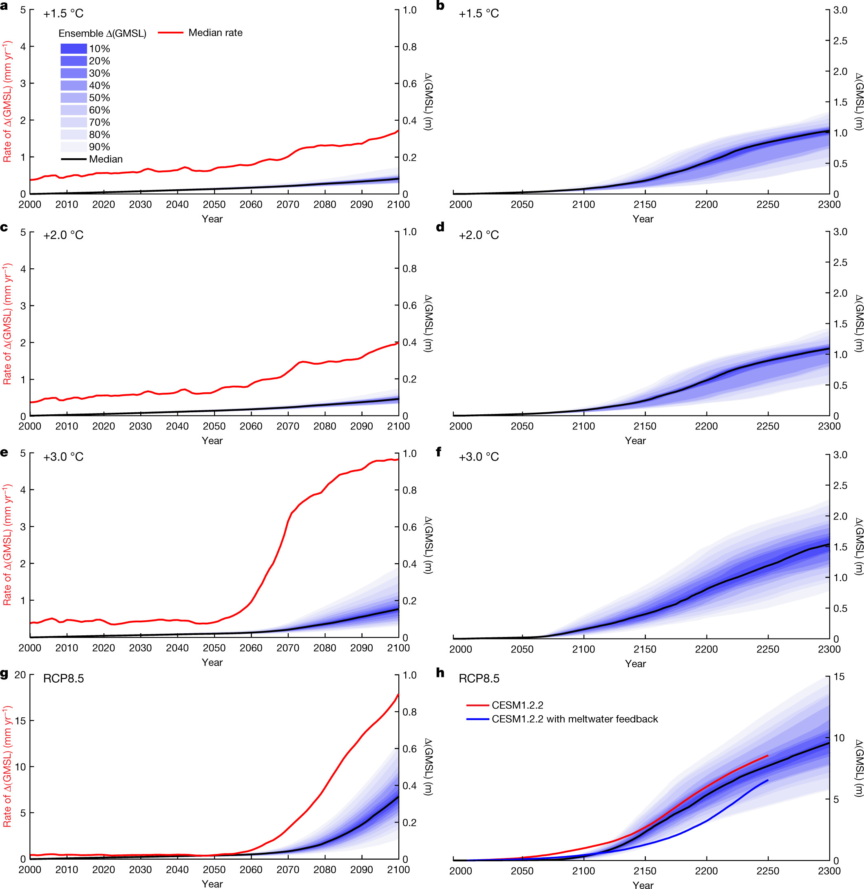

=====================
DeConto et al. (2021)
=====================

:Title: The Paris Climate Agreement and future sea-level rise from Antarctica
 
:Corresponding author: Robert M. DeConto

:Citation: DeConto, R. M., Pollard, D., Alley, R. B., Velicogna, I., Gasson, E., Gomez, N., et al. (2021). The Paris Climate Agreement and future sea-level rise from Antarctica. Nature, 593(7857), 83–89. doi: 10.1038/s41586-021-03427-0

:URL: https://www.nature.com/articles/s41586-021-03427-0

Abstract
--------

The Paris Agreement aims to limit global mean warming in the twenty-first century to less than 2 degrees Celsius above preindustrial levels, and to promote further efforts to limit warming to 1.5 degrees Celsius [1]. The amount of greenhouse gas emissions in coming decades will be consequential for global mean sea level (GMSL) on century and longer timescales through a combination of ocean thermal expansion and loss of land ice [2]. The Antarctic Ice Sheet (AIS) is Earth’s largest land ice reservoir (equivalent to 57.9 metres of GMSL) [3], and its ice loss is accelerating [4]. Extensive regions of the AIS are grounded below sea level and susceptible to dynamical instabilities [5,6,7,8] that are capable of producing very rapid retreat [8]. Yet the potential for the implementation of the Paris Agreement temperature targets to slow or stop the onset of these instabilities has not been directly tested with physics-based models. Here we use an observationally calibrated ice sheet–shelf model to show that with global warming limited to 2 degrees Celsius or less, Antarctic ice loss will continue at a pace similar to today’s throughout the twenty-first century. However, scenarios more consistent with current policies (allowing 3 degrees Celsius of warming) give an abrupt jump in the pace of Antarctic ice loss after around 2060, contributing about 0.5 centimetres GMSL rise per year by 2100—an order of magnitude faster than today [4]. More fossil-fuel-intensive scenarios [9] result in even greater acceleration. Ice-sheet retreat initiated by the thinning and loss of buttressing ice shelves continues for centuries, regardless of bedrock and sea-level feedback mechanisms [10,11,12] or geoengineered carbon dioxide reduction. These results demonstrate the possibility that rapid and unstoppable sea-level rise from Antarctica will be triggered if Paris Agreement targets are exceeded.

Introduction
------------

Most of the AIS terminates in the ocean, with massive ice shelves (floating extensions of glacial ice) providing resistance (buttressing) to the seaward flow of the grounded ice upstream [13]. About a third of the AIS rests on bedrock hundreds to thousands of metres below sea level [3], and in places where subglacial bedrock slopes downwards away from the ocean (reverse-sloped), the ice margin is susceptible to a marine ice-sheet instability (MISI) [5,6] and possibly a marine ice-cliff instability (MICI) [7,8]. The West Antarctic Ice Sheet (WAIS), which has the potential to cause about 5 m of GMSL rise, is particularly vulnerable. The WAIS is losing ice faster than other Antarctic sectors [4] and it sits in a deep basin >2.5 km below sea level in places [3].

Marine ice instabilities
------------------------

MISI and MICI can be triggered by the thinning or loss of buttressing ice shelves in response to a warming ocean, atmosphere or both [14]. MISI is related to a self-sustaining positive feedback between seaward ice flux across the grounding line (the boundary between grounded and floating ice) and ice thickness [5,6]. If buttressing is lost and retreat is initiated on a reverse-sloped bed, the retreating grounding line will encounter thicker ice, strongly increasing ice flow. Retreat will continue until the grounding line reaches forward-sloping bedrock, or sufficient resistive stress is restored by the regrowth of a buttressing ice shelf that is confined within coastal embayments or is thick enough to ‘pin’ on shallow bedrock features. Grounding lines on reverse-sloped bedrock are conditionally unstable15 and retreat at a rate determined by the complex interplay between ice flow and stress fields, bedrock conditions, surface mass balance and other factors that make model-ling these dynamics difficult.

MICI is also theorized to be triggered where buttressing ice shelves disappear or become too small to provide substantial back stress [7,8]. At unsupported grounding lines where ice thickness exceeds a critical value, the weight of ice above sea level can produce deviatoric stresses that exceed the material yield strength of the ice. This causes structural failure [16,17], possibly manifest as repeated slumping and calving events17. Once initiated, failure can continue until the collapsing ice front backs into shallow water, where subaerial cliff heights and the associated stresses drop below their critical values, viscous deformation lowers the cliff, or sufficient buttressing is restored by an ice shelf.

In undamaged ice, with small grain sizes and without large bubbles or pre-existing weaknesses, slowly emerging subaerial ice cliffs could exceed 500 m in height before failing [18]. However, natural glacial ice is typically damaged, especially near crevassed calving fronts and in fast-flowing ice upstream [19]. Assuming ice properties representative of glaciers, stress-balance calculations [16] point to maximum sustainable cliff heights of around 200 m. This value is reduced to about 100 m or less [8,16] where deep surface and basal crevasses effectively thin the supportive ice column (increasing the stress), possibly explaining why the tallest ice cliffs observed today are about 100 m tall. Recent modelling [18] using values of fracture toughness and pre-existing flaw size appropriate for damaged ice fronts [17] and consistent with field observations [19] indicates that tensile fracturing can occur at cliffs as low as 60 m. This reinforces the argument for including ice-cliff calving in ice-sheet models [20], despite current uncertainties in ice properties and the lack of observations which make ice-cliff calving laws difficult to formulate.

Thick, marine-terminating glaciers such as Jakobshavn Isbræ in Greenland demonstrate how efficient calving can deliver ice to the ocean. The terminus of Jakobshavn is about 10 km wide, 1,000 m thick and flows seawards at about 12 km yr−1 (ref. 21). Since the glacier lost its ice shelf in the late 1990s, the ice front (with an intermittent ~100-m ice cliff) has retreated >12 km into the thicker ice upstream, albeit with a recent re-advance coincident with regional ocean cooling [22]. The average effective calving rate (flow speed + retreat) between 2002 and 2015 is estimated at 13.2 ± 0.9 km yr−1 (1σ; ref. 21).

Calving in narrow fjord settings such as Jakobshavn is controlled by a complex combination of ductile and brittle processes, as well as buoyancy. After calving, subsequent fracture-driven failure is delayed until accelerated flow thins the terminus to near-flotation, allowing tidal flexure, basal crevassing, slumping or other processes to initiate the next event17,23. Resistive stresses from lateral shear along fjord walls, as well as thick mélange strengthened by sea ice, slow calving in winter, but annual ice loss remains high.

Jakobshavn-style calving is not widespread in Antarctica today, because most marine-terminating grounding lines with comparable ice thickness are supported by the resistive back stress of ice shelves. Crane Glacier, previously buttressed by the Larsen B ice shelf on the Antarctic Peninsula, is an exception. When the ice shelf suddenly collapsed in 2002 after becoming covered in meltwater, the glacier sped up by a factor of three24. A persistent 100-m ice cliff formed at the terminus25 and the calving front retreated into its narrow fjord. The drainage of Crane Glacier was too small to contribute substantially to sea level, but similar events could become widespread in Antarctica if temperatures continue to rise.

Importantly, some Antarctic glaciers are vastly larger than their Greenland counterparts. For example, Thwaites Glacier in West Antarctica terminates in the open Amundsen Sea rather than in a narrow fjord. The main trunk of Thwaites Glacier is about 120 km wide, widening upstream into the heart of the WAIS. Today, the heavily crevassed grounding zone of Thwaites Glacier is minimally buttressed and retreating on reverse-sloped bedrock at >1 km yr−1 in places26, possibly owing to MISI. The terminus currently sits in water too shallow (about 600 m deep) to produce an unstable cliff face, but if retreat continues into deeper bedrock and thicker ice, a calving face taller than that of Jakobshavn could appear, with stresses and strain rates exceeding thresholds for brittle failure16,17,18. Similar vulnerabilities exist at other Antarctic glaciers, particularly where buttressing ice shelves are already thinning from contact with warm sub-surface waters14.

Because of the very strong dependency of crack growth with increasing stress17,27, a previously unseen style of calving and ice failure might emerge at unbuttressed Antarctic ice fronts with higher freeboard than glaciers on Greenland7,8. The potential pace of fracturing in such settings remains uncertain20, but once a calving front backs into thicker ice upstream, brittle failure could outpace viscous flow, inhibiting the growth of a new shelf. Complete, sustained loss of an ice shelf is not required for structural failure16. If a small floating shelf survives or reforms without providing substantial buttressing, the grounding zone would remain under sufficient stress for collapse. Re-emerging ice shelves would remain vulnerable to warm ocean waters and surface meltwater, as evidenced at Jakobshavn and Crane glaciers; despite fast flow and mélange buttressing, persistent ice tongues have not reformed and calving continues.

Extensive loss of buttressing ice shelves (prerequisite for both MISI and MICI) represents a possible tipping point in Antarctica’s future. This is concerning, because ice shelves are vulnerable to both oceanic melt from below14 and surface warming above28. Rain and meltwater can deepen crevasses28 and cause flexural stresses29, leading to hydrofracturing and ice-shelf collapse. Vulnerability to surface meltwater is enhanced where firn (the transitional layer between surface snow and underlying ice) becomes saturated and where ocean-driven thinning is already underway28. Air temperatures above Antarctica’s largest ice shelves remain too cold to produce sustained meltwater rates associated with collapse30,31; however, given sufficient future warming, this could change.
   
Modelling the AIS response to warming
-------------------------------------

We build on previous work [8] by improving a hybrid ice sheet–shelf model that includes viscous ice processes related to MISI and brittle processes related to MICI. The model allows conditionally unstable grounding lines (MISI) on reverse-sloped bedrock in response to flow and stress fields, bed conditions and surface mass balance. The model accounts for oceanic sub-ice melt and meltwater-driven hydrofracturing of ice shelves, leading to ice-cliff calving at thick, marine-terminating ice fronts where stresses exceed ice strength (MICI). Model improvements and extensions described in Methods and Supplementary Information include new formulations of ice-shelf buttressing, hydrofracturing and coupling with a comprehensive Earth–sea-level model, as well as ice–climate (meltwater) feedback mechanisms using the NCAR Community Earth System Model. Parametric uncertainty is assessed using modern and geological observations and statistical emulation. Regional climate model (RCM) forcing used in future ice-sheet ensembles is substantially improved relative to ref. 8, with the trajectory of warming being comparable to that of other studies30 (Supplementary Information).

We test the future response of the AIS to scenarios representing +1.5 °C and +2 °C global warming limits, a +3 °C scenario representing current policies [32] and extended RCP emissions scenarios9. We consider recently proposed negative feedback mechanisms that could slow the pace of future ice loss, and emissions scenarios allowing a temporary overshoot of Paris Agreement temperature targets followed by rapid carbon dioxide reduction (CDR), assuming that such geoengineering is possible. The results identify emissions-forced climatic thresholds capable of triggering rapid retreat of the AIS.

Calibrated model ensembles
--------------------------

To account for the current uncertainty in key parameters controlling (1) the sensitivity of crevasse penetration to surface melt and rainwater (hydrofracturing) and (2) the ice-cliff calving rate, we run 196 ice-sheet simulations for each climate scenario described below. Each ensemble member uses a unique combination of parameter values (Extended Data Table 1), scored using a binary history-matching approach [8,33]. Scoring is based on the model’s ability to simulate the observed ice loss, d𝑀¯/d𝑡, between 1992 and 2017 (IMBIE) [4], and Antarctica’s contribution to sea level in the last interglacial period (LIG) [34] and the mid-Pliocene epoch [35,36] (Methods). Ensemble members falling outside the likely range of observations are discarded, and only parameter combinations within the bounds of all three constraints are included in future projections. Both modern and geological constraints contain considerable uncertainty with poorly known sample distributions, so weighting of individual model outcomes is avoided. In Supplementary Information we compare our ensemble scoring to a more rigorous Gaussian process emulation approach [33,37] to verify that the central estimates of our calibrated ensembles are robust.

Comparing simulated and IMBIE estimates of d𝑀¯/d𝑡 (Extended Data Fig. 1a) eliminates 33 ensemble members (n = 163). The effect of replacing IMBIE with alternative (narrower) ranges of d𝑀¯/d𝑡 on the basis of solely GRACE data from 2002–2017 [38] (Methods) is shown in Extended Data Fig. 2. The model performs well over the IMBIE interval with and without hydrofracturing and ice-cliff calving enabled. Although IMBIE provides guidance on processes that cause contemporary mass change (surface mass balance, oceanic-shelf thinning and grounding-line dynamics), it does not sufficiently test the brittle-ice processes theorized to become important in a warmer climate [7,8]. Furthermore, the 25-year IMBIE record is very short relative to the dynamical response time of an ice sheet, and interdecadal and longer variability is not captured. Collectively, these issues motivate our use of geological records from past warm periods as additional training constraints.

Adding the LIG constraint (3.1–6.1 m; 129–128 kyr ago) to IMBIE eliminates 44 additional parameter combinations (n = 119), but only at the lower bound of the parameter range. Without MICI, the model is incapable of simulating realistic LIG ice loss. Even at the top of the parameter range, simulated rates of GMSL rise remain below 1 cm yr−1, slower than indicated by some LIG proxy records39 (Extended Data Fig. 1b, c). Adding a warm mid-Pliocene test (11–21 m; 3.26–3.03 Ma) further reduces the ensemble to n = 109 by eliminating some of the highest-valued parameter combinations. Similar to the LIG, hydrofracturing and ice-cliff calving must be included to satisfy Pliocene geological observations, including regional retreat into East Antarctic basins40 (Extended Data Figs. 1d, 3). The model’s ability to simulate current rates of ice loss without ice-cliff calving, while failing to simulate past retreat under warmer climate conditions (Extended Data Figs. 1, 3), is at odds with the findings of ref. 33, which assumed a lower range of Pliocene sea-level constraints than the more recent data35,36 used here.

Processes other than ice-cliff calving could be invoked to improve geological model–data comparisons. For example, Pliocene retreat in East Antarctica has been simulated in a model without MICI, using a sub-ice melt scheme allowing the presence of melt beneath grounded ice upstream of the grounding line41. Tidally driven seawater intrusion and non-zero melt beneath discontinuous sectors of grounding zones has been observed26; however, model treatments used so far41 have been questioned on physical grounds42. Alternative (Coulomb) sub-glacial sliding laws have been proposed43 that can substantially increase the rate of ice loss in models with ice shelves removed44, but they have not been tested with realistic palaeoclimate forcing. We stress that hydrofracturing and ice-cliff calving processes incorporated here are observed phenomena, tested under both modern and geological settings.

Ice loss in both LIG and Pliocene ensembles saturates at the upper range of parameter values (Extended Data Fig. 1). The LIG is sufficiently warm to cause complete WAIS retreat, but not warm enough to trigger retreat into East Antarctic basins, even if our nominal ice-cliff calving limit (13,000 m yr−1) is doubled. Similarly, maximum ice loss in the Pliocene ensemble reflects the loss of most marine-based ice, as supported by observations35, but not more. As such, the geological constraints do not rule out the possibility of faster Antarctic ice-cliff calving rates than those observed on Greenland today, which would substantially increase our future projections while remaining consistent with geological observations.

Implications of the Paris Agreement
-----------------------------------

We run ensembles of the transient response of the AIS to future greenhouse gas emissions scenarios (Methods) representing global mean warming limits of +1.5 °C, +2 °C and +3 °C (similar to current policies and Nationally Determined Contributions, NDCs32), as well as RCP2.6, RCP4.5 and RCP8.59. Only simulations with validated parameter combinations (Extended Data Fig. 4d) are included in the analysis. The +1.5 °C, +2 °C and +3 °C scenarios assume that there is no overshoot in temperature; once these global mean temperatures are reached in 2040, 2060 and 2070, respectively, atmosphere and ocean forcings are held constant.

In the +1.5 °C and +2 °C ensembles, Antarctic ice loss continues at a pace similar to today’s throughout the 21st century (Fig. 1, Table 1). The median contribution to sea level in 2100 is 8 cm with +1.5 °C warming and 9 cm with +2 °C. By contrast, about 10% of the ensemble members in the +3 °C scenario produce onset of major WAIS retreat before 2100. This skews the upper bound of the +3 °C distribution (33 cm at the 90th percentile), substantially increasing the ensemble median (15 cm in 2100) relative to the +1.5 °C and +2 °C scenarios. The jump in late 21st century ice loss at +3 °C is mainly caused by retreat of Thwaites Glacier (Fig. 2; Extended Data Fig. 5), which destabilizes the entire WAIS in some ensemble members.

   Figure 1: Antarctic contribution to future GMSL rise. a–h, The fan charts show the time-evolving uncertainty and range around the median ensemble value (black line) in 10% increments. a, c, e, g, Ensemble results from 2000–2100, including median rates of GMSL rise (red line). b, d, f, h The same as a, c, e, g, extended to 2300. a, b, Emissions consistent with a +1.5.°C global mean warming scenario. c, d, Emissions consistent with +2.0.°C. e, f, Emissions consistent with +3.0.°C. g, h, RCP8.5. In h, two additional RCP8.5 simulations are shown with average calibrated parameter values (Methods) but with atmosphere and ocean forcing provided by the NCAR CESM1.2.2 GCM with (blue line) and without (red line) Antarctic meltwater feedback46. Note the expanded vertical axes in g and h. 

Table 1: Antarctic sea-level contributions. Ensemble medians (top six rows) using IMBIE, LIG and Pliocene observational constraints, reported in metres, relative to 2000. Values in parentheses are the 17th–83rd percentiles (likely range). Scenarios refer to the maximum global mean temperature reached relative to pre-industrial (1850) or following RCPs. Alternative ensemble outcomes using more restrictive ranges of ice-cliff calving parameters are provided in Extended Data Table 2. Model simulations corresponding to Fig. 3 (bottom 12 rows) use average calibrated parameter values (Extended Data Table 1). NDC simulations follow the standard +3 °C emissions scenario or consider CDR beginning in 2200, 2150, 2100, 2090, 2080, 2070, 2060, 2050, 2040 or 2030. An alternative scenario maintains the atmosphere and ocean climate forcing at 2020 (with no additional future warming). Note that the +3.0 °C ensemble median (third row) differs from the corresponding +3.0 °C (NDCs) simulation using average model parameter values (seventh row) owing to the skewness of the ensembles (Fig. 1).

Figure 2: Ice-sheet evolution following the +3 °C global warming emissions trajectory. A single +3 °C ensemble member with average hydrofracturing and ice-cliff calving parameters. Transient atmosphere and ocean forcing follows the +3 °C scenario, roughly consistent with current policies (NDCs). Floating and grounded ice thickness is shown in blue. The grounding line position is shown with a black line. The red square over the Thwaites Glacier (TG) and Pine Island Glacier (PIG) sector of West Antarctica corresponds to the high-resolution (1,000 m) nested model domain in Extended Data Fig. 5. a, Initial ice-sheet conditions. b, Model ice sheet in 2100, showing the onset of major retreat of Thwaites Glacier. c, Change in ice thickness in 2100. d, The ice sheet in 2300, with Thwaites Glacier retreat leading to the loss of the WAIS. e, Change in ice thickness in 2300.

With more extreme RCP8.5 warming, thinning and hydrofracturing of buttressing ice shelves becomes widespread, triggering marine ice instabilities in both West and East Antarctica. The RCP8.5 median contribution to GMSL is 34 cm by 2100. This is substantially less than reported by ref. 8 (64–105 cm), owing to a combination of improved model physics and revised atmospheric forcing (Methods) that delays the onset of surface melt by about 25 years. Nonetheless, the median contribution to GMSL reaches 1 m by 2125 and rates exceed 6 cm yr−1 by 2150 (Extended Data Figs. 6, 7). By 2300, Antarctica contributes 9.6 m of GMSL rise under RCP8.5, almost 10 times more than simulations limiting warming to +1.5 °C.

In alternative ensembles, the upper bound of the maximum calving rate (VCLIFF) is reduced from 13 km yr−1 to 11 km yr−1 or 8 km yr−1 to reflect Jakobshavn’s recent slowdown22, but the effect on the calibrated ensemble medians is small (Extended Data Table 2). The main ensembles (Fig. 1, Table 1) use 13 km yr−1 as the upper bound because LIG and Pliocene responses saturate above these values and observations at Jakobshavn demonstrate that such rates are indeed possible. Future simulations excluding hydrofracturing and ice-cliff calving produce less GMSL rise than our ensemble medians (Extended Data Fig. 6). Similar to other models without ice-cliff calving45, enhanced precipitation in East Antarctica partially compensates for MISI-driven retreat in West Antarctica, but these simulations are excluded from the future projections because they fail to reproduce the LIG and Pliocene.

Negative feedback mechanisms slowing ice loss
---------------------------------------------

Because our model includes hydrofracturing, the onset of major retreat is sensitive to the pace of future atmospheric warming. We compare our RCM/CCSM4-driven RCP8.5 ensemble to two alternative simulations, with atmosphere and ocean forcing supplied by the NCAR CESM1.2.2 GCM. Both CESM-forced simulations follow RCP8.5, but one includes Antarctic meltwater feedback (Methods) by adding time-evolving liquid-water and solid-ice discharge at the appropriate ocean grid cells in the GCM46.

Including meltwater discharge in CESM expands Southern Ocean sea ice, stratifies the upper ocean, and warms the subsurface (400 m water depth) by 2–4 °C around most of the Antarctic margin in the early 22nd century46. Conversely, expanded sea ice suppresses surface atmospheric warming by more than 5 °C, slowing the onset of surface melt and hydrofracturing in the ice-sheet model. The net result of competing sub-surface ocean warming (enhanced sub-shelf melt) and atmospheric cooling (reduced surface melt) produces a substantial negative feedback on the pace of ice-sheet retreat (Fig. 1h). This contrasts ref. 41, which found a net positive (ocean-driven) meltwater feedback using an ice-sheet model without hydrofracturing. The CESM-driven simulations bracket our RCM/CCSM4-driven ensembles, supporting the timing of retreat in our main ensembles. Our RCM and CESM1.2.2 climate forcings are evaluated relative to independent CMIP5 and CMIP6 GCMs in Supplementary Information.

We test two additional negative-feedback mechanisms proposed to provide a stabilizing influence on marine ice-sheet retreat. First, the potential for channelized supraglacial runoff to delay or stop ice-shelf hydrofracturing47 is examined by reducing meltwater-enhanced surface crevassing in regions of compressional ice-shelf flow (Supplementary Information). Despite a reduced influence of meltwater, we find that hydrofracturing in a warming climate still occurs near ice-shelf calving fronts, where the ice is thinnest, convergence and buttressing are minimal13 and air temperatures (melt rates) are highest. Once initiated, meltwater-enhanced calving near the shelf edge reduces compressional flow in ice upstream and calving propagates. As a result, reduced wet crevassing in compressional flow does little to protect buttressing ice shelves48 and the impact on our simulations is minimal (Supplementary Fig. 3).

Second, we examine the potential for rapid bedrock uplift and ice–ocean gravitational effects to lower relative sea level and reduce ice loss at retreating grounding lines12. Exceptionally fast uplift rates due to low mantle viscosities in the Amundsen Sea sector of West Antarctica have been invoked to slow future retreat of the WAIS10. This is tested by replacing the model’s standard Elastic Lithosphere/Relaxed Asthenosphere representation of deforming bedrock with a more complete viscoelastic (Maxwell) Earth model combining a radially varying, depth-dependent lithosphere and viscosity structure with gravitationally self-consistent sea-level calculations (Methods)12. Simulations assuming the lowest upper mantle viscosity10 with rapid bedrock uplift under all of West Antarctica show limited potential for ice–Earth feedback mechanisms to slow retreat over the next approximately two centuries (Extended Data Fig. 8). This finding is consistent with other recent studies11,12,49, although future work should explore these effects at higher resolution and with a three-dimensional Earth structure50 including lateral heterogeneity of viscoelastic properties under West and East Antarctica.

Implications of delayed mitigation
----------------------------------

An additional set of simulations was run using a single combination of ice-model parameters representing calibrated ensemble averages (Extended Data Table 1). The simulations either maintain current (2020) atmosphere and ocean conditions without any future warming, or begin to follow the +3 °C emissions pathway, except assuming that CDR mitigation is initiated at different times in the future, beginning in 2030, 2040, 2050, 2060, 2070, 2080, 2090, 2100, 2150 or 2200. We optimistically assume that CDR technologies will be capable of reducing CO2 atmospheric mixing ratios with an e-folding time of one century (Fig. 3a).

Figure 3: AIS thresholds and commitments to GMSL rise with delayed mitigation. a, Greenhouse gas (GHG) emissions scenarios that initially follow the +3 °C (NDCs) scenario, followed by CDR (carbon dioxide reduction/negative emissions), assuming relaxation towards preindustrial levels with an e-folding time of 100 years. The timing when CDR commences is shown in b. The solid black line is the same +3 °C simulation shown in Fig. 2 and Extended Data Fig. 5. The dashed black line assumes there is no additional GHG increase or warming after 2020. GHG concentrations are shown in CO2 equivalent, in units of preindustrial atmospheric level (PAL; 280 ppm). b, GMSL contributions from Antarctica, corresponding to the scenarios in a, over the 21st century. All simulations use identical model physics and average hydrofracturing and ice-cliff calving parameters. Note the sharp increase in late-21st-century ice loss when CDR is delayed until 2070. c, The same as b, but extended to 2500 (see Table 1). Note the long-term dependence of GMSL rise on the timing when mitigation begins. All scenarios exceed 1 m by 2500, and no scenario shows recovery of the ice sheet, including those returning to near-preindustrial levels of GHGs by about 2300.

We find that without future warming beyond 2020, Antarctica continues to contribute to 21st-century sea-level rise at a rate roughly comparable to today’s, producing 5 cm of GMSL rise by 2100 and 1.34 m by 2500 (Fig. 3, Table 1). Simulations initially following the +3 °C pathway, but with subsequent CDR delayed until after 2060, show a sharp jump in the pace of 21st-century sea-level rise (Fig. 3b). Every decade that CDR mitigation is delayed has a substantial long-term consequence on sea level, despite the fast decline in CO2 and return to cooler temperatures (Fig. 3c). Once initiated, marine-based ice loss is found to be unstoppable on these timescales in all mitigation scenarios (Fig. 3). The commitment to sustained ice loss is caused mainly by the onset of marine ice instabilities triggered by the loss of ice shelves that cannot recover in a warmer ocean with long thermal memory (Fig. 3c).

In summary, these results demonstrate that current policies allowing +3 °C or more of future warming could exceed a threshold, triggering extensive thinning and loss of vulnerable Antarctic ice shelves and ensuing marine ice instabilities starting within this century. Resulting ice loss would be irreversible on multi-century timescales, even if atmospheric temperatures return to preindustrial-like values (Fig. 3). Relative to the +3 °C scenario, sea-level rise resulting from the +1.5 °C and +2 °C aspirations of the Paris Agreement (Fig. 1) would have much less impact on low-lying coastlines, islands and population centres, pointing to the importance of ambitious mitigation.

Strong circum-Antarctic atmospheric cooling feedback caused by meltwater discharge [46] slows the pace of retreat under RCP8.5 (Fig. 1h). However, other proposed negative feedback mechanisms associated with ice–Earth–sea level interactions and reduced hydrofracturing through surface runoff do little to slow ice loss on 21st- to 22nd-century timescales.

Although we attempt to constrain parametric uncertainty, this study uses a single ice-sheet model, and structural uncertainty is accounted for only in the model improvements described herein. Similarly, our main ensembles use a single method of climate forcing, although with future warming comparable to other state-of-the-art climate models (Supplementary Figs. 1, 2), and alternative simulations driven by CESM1.2.2 produce similar results (Fig. 1). More work is clearly needed to further explore this uncertainty, using multiple ice-sheet models accounting for processes associated with MISI and MICI, and with future climate forcing that includes interactive climate–ice sheet coupling.

Ice-cliff calving remains a key wild card. Although founded on basic physical principles and observations, its potential to produce even faster rates of ice loss than those simulated here remains largely untested with process-based models of mechanical ice failure. Here we find that limiting rates of ice-cliff calving to those observed on Greenland can still drive multi-metre-per-century rates of sea-level rise from Antarctica (Extended Data Fig. 7). Given the bedrock geography of the much larger and thicker AIS, the possibility of even faster mechanical ice loss should be a top priority for further investigation.

Methods
-------

Ice-sheet modelling framework
~~~~~~~~~~~~~~~~~~~~~~~~~~~~~

The ice sheet–shelf model uses hybrid ice dynamics [51] with an internal boundary condition on ice velocity at the grounding line [6]. Grounding lines can migrate freely, and the model accounts for the buttressing effects of ice shelves with pinning points and side shear (see Supplementary Information). In our solution of the dynamical shallow shelf (SSA) equations, ice velocities across grounding lines are imposed as a function of local sub-grid ice thickness, with the sub-grid interpolation accurate to the limit of the resolved bathymetry. This is also true for diagnosed stresses and ice-cliff failure rates, which makes the model largely independent of grid resolution (Extended Data Fig. 5). A resolution of 10 km is used for continental simulations used in our main ensembles (Figs. 1–3). A nested 1-km grid is used for a select simulation over West Antarctica (Extended Data Fig. 5). The model uses a standard Weertman-type basal sliding law51, with basal sliding coefficients determined by an inverse method that iteratively matches model ice-surface elevations to observations under modern climate conditions52. We use Bedmap253 bathymetric boundary conditions. Using alternative BedMachine3 bathymetry is found to have only a small effect on continental-scale sea-level projections (<1.5% difference under RCP8.5 in 2300). Several advances relative to previous versions of the model7,8,51 are described below and in Supplementary Information.

Sub-ice melt rates
~~~~~~~~~~~~~~~~~~

The model used here includes an updated treatment of sub-ice oceanic melting. Oceanic melt rates are calculated at each floating ice grid cell as a quadratic function of the difference between nearest sub-surface ocean temperatures at 400-m water depth and the pressure melting point of ice51,54. The model accounts for evolving connectivity between a given ice model grid cell and the open ocean, and elevated plume melt on subsurface vertical ice faces51. All melt calculations are performed with spatially uniform physics, including a single, uniform coefficient in the ocean melt relation based on a 625-member ensemble of simulations of WAIS retreat through the last deglaciation55. Although it would be possible to perform inverse calculations for a distribution of coefficients within each basin based on modern ice-shelf melt observations41, their patterns are likely to change substantially within the timescales of our simulations as ocean circulation, grounding-line extents and cavity geometries evolve. A 1.5 °C sub-surface ocean temperature adjustment is used in the Amundsen Sea sector to bring ocean melt rates closer to observations56 when using CCSM4 ocean model temperatures that underestimate observed shelf-bottom water temperatures57. This is a substantial improvement relative to the 3 °C temperature adjustment required previously8.

Ice-shelf hydrofracturing
~~~~~~~~~~~~~~~~~~~~~~~~~

In the model, surface crevasses deepen as a function of the stress field and local meltwater and rainfall availability [7,8,58], leading to hydrofracturing when surface and basal crevasses penetrate 75% or more of the total ice thickness. With greatly increased surface melt, model ice shelves can be completely lost. In the standard wet crevassing scheme, we assume a quadratic relationship between surface crevasse penetration depth dw (in metres) and total meltwater production R (rain plus surface melt minus refreezing; in m yr−1). A tunable prefactor, CALVLIQ, is varied between zero (no meltwater influence on crevassing) and 195 m−1 yr2 in the ensembles presented in the main text.

dw = CALVLIQ  R^2.

Calving occurs in places where the sum of the surface and basal crevasse penetration caused by extensional stresses, accumulated strain (damage), thinning and meltwater (dw), exceeds the critical fraction (0.75) of total ice thickness (see appendix B of ref. 7).

The crevassing scheme is modified here relative to previous model versions7,8,51, by reducing wet crevassing in areas of low-to-moderate meltwater production (<1,500 mm yr−1), ramping linearly from zero, where no meltwater is present, to dw, where R = 1,500 mm yr−1. This small modification improves performance by maintaining more realistic ice-shelf calving fronts under present climate conditions, although it conservatively precludes the loss of ice shelves with thicknesses comparable to the Larsen B until R approaches ~1,400 mm yr−1, which is more than that observed before the actual collapse (~750 mm yr−1)30. Whereas liquid water embedded in firn and partial refreezing of meltwater are accounted for8,59, the detailed evolution of firn density and development of internal ice lenses are not, which could affect the timing at which hydrodrofacturing is simulated to begin. A modification to hydrofracturing described in Supplementary Information tests the possible influence of channelized meltwater flow and supraglacial runoff in compressional ice-shelf regimes.

Calving and ice-cliff failure
~~~~~~~~~~~~~~~~~~~~~~~~~~~~~

Two modes of brittle fracturing causing ice loss are represented in the model: (1) ‘standard’ calving of ice bergs from floating ice, and (2) structural failure of tall ice cliffs at the grounding line. Similar to other models, standard calving depends mainly on the grid-scale divergence of ice flow, producing crevasses to depths at which the extensional stress is equal to the hydrostatic imbalance58. Crevasse penetration is further increased as a function of surface meltwater and rain availability (see above).

Unlike most continental-scale models, we also account for ice-cliff calving at thick, marine-terminating grounding lines. Such calving is a complex product of forces related to glacier speed, thickness, longitudinal stress gradients, bed conditions, side shear, pre-existing crevasses, mélange and other factors60. Determining the precise mode and rate of failure is the focus of ongoing work17,18,20,61; at present, a suitable physically based calving model has yet to be developed. In our model7,8, ice-cliff calving occurs where static stresses at the calving front (assumed to be exactly at floatation) begin to exceed the depth-averaged yield strength of glacial ice, assumed here to be 0.5 MPa (ref. 16). We account for crevassing near the cliff face (influenced by the stress regime and the presence of meltwater7), which thins the supportive ice column and increases the stress at the ice front. Where the critical stress threshold is exceeded, ice-cliff calving is applied as a horizontal wastage rate, ramping linearly from zero up to a maximum rate as effective cliff heights (adjusted for buttressing and crevassing) increase from ~80 to 100 m and above. This maximum calving rate is treated as a tunable model parameter (VCLIFF), replacing the arbitrary default value of 3 km yr−1 in equation A.4 of ref. 7. In this formulation, ice-cliff calving rates in places diagnosed to be undergoing structural failure are generally much smaller than VCLIFF (Extended Data Fig. 5). We note that the linear cliff height–calving relationship with an imposed calving limit (VCLIFF) used here is conservative relative to another proposed calving law20 that assumes a power-law dependence on cliff height and no upper bound on the calving rate. Furthermore, our model numerics preclude regular calving in places undergoing ice-cliff failure, so the computed ice-cliff calving rate can be considered as the sum of all calving processes at thick marine-terminating ice fronts. This allows direct comparison of model calving (Extended Data Fig. 5) with observations. Mélange can slow calving by providing some back stress at confined calving fronts [62,63], but it has limited effect on the large unconfined widths of Antarctic outlets [64], so it is ignored here.

Ensemble parameters
~~~~~~~~~~~~~~~~~~~

Our primary perturbed physics ensembles use a 14 × 14 matrix (n = 196) of CREVLIQ and VCLIFF in the hydrofracturing and ice-cliff calving parameterizations described above (Extended Data Table 1). The 14 values of CREVLIQ vary between 0 and 195 m−1 yr2 in evenly spaced increments. VCLIFF varies between 0 and 13 km yr−1. Previous studies7,8 considered a smaller, arbitrary range of VCLIFF values of up to 5 km yr−1; however, observed rates of horizontal ice loss through ice-cliff calving can reach 13 km yr−1 at the terminus of Jakobshavn Isbræ in West Greenland21, so we limit the top of our parameter range in our main ensembles to this observationally justifiable value. As discussed in the main text, this upper bound might be too small for Antarctic settings with thicker ice margins, taller unconfined ice fronts and higher deviatoric stresses at unbuttressed grounding lines. Select simulations extending the upper bounds of CALVLIQ and VCLIFF above 195 m−1 yr2 and 13 km yr−1, respectively, are shown in Extended Data Fig. 1. Setting these parameter values to zero (Extended Data Figs. 1, 6) effectively eliminates hydrofracturing and ice-cliff calving, limiting rates of ice loss to processes associated with standard calving, surface mass balance, sub-ice melt and MISI, as in most other continental-scale ice-sheet models.

Ensemble scoring based on recent observations
~~~~~~~~~~~~~~~~~~~~~~~~~~~~~~~~~~~~~~~~~~~~~

Future ice-sheet simulations begin in 1950 to allow comparisons with observations over the satellite era. For consistency, initial ice-sheet conditions (ice thickness, bed elevation, velocity, basal sliding coefficients and internal ice and bed temperatures) follow the same procedure as in ref. 8 and are identical in all simulations. Initialization involves a 100,000-kyr spin-up using observed mean annual ocean climatology65 and standard SeaRISE66 atmospheric temperature and precipitation fields [67].

We consider three different estimates of recent changes in Antarctic ice mass to test the performance of each ensemble member with a unique combination of model physical parameters (Extended Data Table 1). We use the average annual mass change d𝑀¯/d𝑡 from 1992–2017 (equivalent to a GMSL change of 0.15–0.46 mm yr−1) provided by the IMBIE assessment4, which is based on a combination of satellite altimetry, gravimetry and surface mass balance estimates. We use the 25-year average to minimize the influence of simulated and observed interannual variability (Extended Data Fig. 1a) on ensemble scoring, although decadal and longer variability68 are not fully captured. Alternative target ranges use mass change calculations based solely on the Gravity Recovery and Climate Experiment (GRACE), following the methodology described in ref. 38 and updated from April 2002 to June 2017. The glacial isostatic adjustment (GIA) component of the GRACE estimates represents the largest source of uncertainty. We use three GIA models69,70,71. For each model we use a range of GIA corrections generated by the authors of69,70,71, assuming a range of viscosities and lithospheric thicknesses69,70,71. The lower bound of our mass change estimates is calculated using the minimum GIA correction from the three models69,70,71 and the upper bound is calculated using the maximum GIA correction. This yields a 2002–2017 average estimate of 0.2–0.54 mm yr−1, close to the central estimate from IMBIE over the same interval. Alternatively, we consider viscosity profiles from each of these studies that have been reported to provide the best fit to observations69,70,71. This substantially narrows and shifts the 2002–2017 range towards higher values (0.39 to 0.53 mm yr−1), which is impactful on our ensemble scoring and future projections, highlighting the need for more precise modern observations. Although the uncertainty range of estimates based solely on GRACE is smaller, the longer IMBIE record is used as our default training constraint over the modern era.

LIG ensemble
~~~~~~~~~~~~

LIG simulations use model physics, parameter values and initial conditions identical to those used in our Pliocene and future simulations. The ice-driving atmospheric and oceanic climatology representing conditions between 130 and 125 kyr ago is the same as that used in ref. 8, and is based on a combination of regional atmospheric modelling and proxy-based reconstructions of air and ocean temperatures72. Differences in the timing and magnitude of our modelled Antarctic ice-sheet retreat relative to independent LIG simulations73 reflect the different approaches to LIG climate forcing and structural differences in our ice-sheet models, including the inclusion of hydrofracturing and ice-cliff calving in this study.

Our ensemble scoring uses a LIG target range of Antarctic ice loss equivalent to 3.1–6.1 m, which is assumed to have occurred early in the interglacial between 129 and 128 kyr ago (Extended Data Fig. 1). The range used here is based on a prior estimate of GMSL of 5.9 ± 1.7 m by 128.6 ± 0.8 kyr ago35 (2σ uncertainty), rounded to the nearest half metre (4.5–7.5 m) to reflect the current uncertainty in the magnitude (due to GIA effects and dynamic topography) and timing of LIG sea-level estimates35,74. The Antarctic component is deconvolved from the GMSL value by assuming that Greenland contributed no more than 1 m before 128 kyr ago75,76,77, with an additional 0.4 m contributed by thermosteric effects75. Contributions from mountain glaciers in the early LIG are not known and are not included in our simple accounting. We find that rounding the exact GMSL values from ref. 35 (5.9 ± 1.7 m or 2.8–6.2 m after accounting for Greenland and thermosteric components) has no appreciable effect on the outcome of the calibrated ensembles. The target range of 3.1–6.1 m used here is lower than the 3.6–7.4 m range used in ref. 8, but we emphasize that it is based on a coral record from a single location (Seychelles), and ongoing work may further refine this range. For example, a recent study73 attempting to simultaneously fit relative sea-level data at several locations was able to reproduce early LIG changes observed in the Seychelles without a substantial contribution from Antarctica, but it required a thin lithosphere in the Earth model used to correct for GIA. Conversely, another study78 indicated that a North American ice sheet may have persisted until ~126 kyr ago or later. If true, this would require a substantial Antarctic contribution to GMSL to offset remaining North American ice in the early LIG. These alternative scenarios remain speculative, but they highlight the ongoing uncertainty in the palaeo sea-level records. Our LIG and Pliocene ensemble data (Extended Data Figure 1) are provided as source data to allow others to test the impact of alternative palaeo sea-level interpretations on the future projections.

Pliocene ensemble
~~~~~~~~~~~~~~~~~

Mid-Pliocene simulations also use consistent ice model physics and the same RCM climate forcing described in ref. 8, assuming 400 ppm CO2, an extreme warm austral summer orbit and 2 °C of ocean warming to represent maximum mid-Pliocene warmth in Antarctica. The ice-sheet simulations are run for 5,000 model years, the approximate duration that the warm orbital parameters are valid (Extended Data Fig. 1). The Pliocene maximum GMSL target range of 11–21 m is based on two recent, independent estimates of warm mid-Pliocene (3.26–3.03 Myr ago) sea level36,37. In ref. 36, shallow marine sediments are used to estimate the glacial–interglacial range of GMSL variability over this interval. Assuming ±5 m of uncertainty in the sea-level reconstructions and up to 5 m of GMSL change contributed by Greenland, at times orbitally out of phase with the timing of Antarctic ice loss36, the central estimate of Antarctica’s contribution to GMSL is 17.8 ± 5 m. This value is adjusted downwards to 16 m, according to an independent estimate derived from Mediterranean cave deposits corrected for geodynamical processes37. Combining the lower central estimate of ref. 37 and the uncertainty range of ref. 36 provides an Antarctic GMSL target range of 11–21 m, close to the range of 10–20 m used in ref. 8, albeit with considerable uncertainty.

Future ensembles
~~~~~~~~~~~~~~~~

We improve on previous work8 with new atmospheric climatologies used to run future ice-sheet simulations using dynamically downscaled meteorological fields of temperature and precipitation provided by an RCM79 adapted to Antarctica. RCM snapshots are run at 1950 and with increasing levels of effective CO2 (2, 4 and 8 times the preindustrial level) while accounting for topographic changes in the underlying ice sheet as described in ref. 8. The resulting meteorological fields are then time-interpolated and log-weighted to match transient CO2 concentrations following the emissions scenarios simulated here. This technique is computationally efficient and flexible, allowing a number of multi-century emissions scenarios to be explored, including non-standard RCP scenarios (Fig. 1) and those including CDR mitigation (Fig. 3). Unlike in ref. 8, sea surface temperatures and sea ice boundary conditions in the nested RCM come from the same transient NCAR CCSM480 runs that provide the time-evolving sub-surface ocean temperatures used in our sub-ice melt rate calculations. This eliminates the need for an imposed lag between transient greenhouse gas concentrations and equilibrated RCM climates as done previously8. Our revised approach delays the future timing at which surface meltwater begins to appear on ice-shelf surfaces, and the resulting atmospheric temperatures compare favourably with independent CMIP5 and CMIP6 GCMs (Supplementary Figs. 1, 2) and NCAR CESM1.2.2 (Fig. 1h).

Monthly mean surface air temperatures and precipitation from the RCM are used to calculate the net annual surface mass balance on the ice sheet. These fields are bilinearly interpolated to the relatively fine ice-sheet grid, and temperatures are adjusted for the vertical difference between RCM and ice-sheet elevations using a simple lapse-rate correction. The lapse-rate correction is also applied to precipitation on the basis of a Clausius–Clapeyron-like relation. A two-step zero-dimensional box model using positive-degree days for snow and ice melt captures the basic physical processes of refreezing versus runoff in the snow–firn column8,59. The total surface melt available to influence surface crevassing (Supplementary Fig. 1) is the fraction of meltwater that is not refrozen near the surface, plus any rainwater.

A spatially dependent bias correction based on reanalysis (Supplementary Fig. 2) could be applied to the RCM forcing, but such corrections are unlikely to remain stationary. Instead, we apply a uniform 2.9 °C temperature correction, reflecting the austral summer cold bias in the RCM over ice surface elevations lower than 200 m, where surface melt is most likely to begin. The cold bias, caused by an underestimate of net long-wave radiation, is observed in other Antarctic RCMs and GCMs81,82. Correcting for the cold bias and accounting for rainwater increases the total available surface meltwater in our RCP8.5 simulations relative to other studies31 (see Supplementary Information).

The +1.5 °C simulations initially follow a RCP4.5 emission trajectory9, with time-evolving atmospheric fields provided by the RCM and matching sub-surface ocean temperatures from an RCP4.5 CCSM4 simulation80. The ice-driving climatology evolves freely until 2040, when decadal global mean surface air temperatures first reach +1.5 °C relative to 1850. Once the +1.5 °C temperature target is reached, the atmosphere and ocean forcings are fixed (maintained) at their 2040 levels for the duration of the simulations. The +2 °C scenario is also based on RCP4.5, but warming is allowed to evolve until 2060. 21st-century warming does not reach +3 °C under RCP4.5, so our +3 °C scenario (roughly representing the NDCs) is based on RCP8.5, with atmospheric and oceanic forcing fixed beyond 2070. Warming trajectories over major Antarctic ice shelves are shown in Supplementary Figs. 1, 2. Ice-sheet ensembles following extended RCP2.6, RCP4.5 and RCP8.5 scenarios9 are shown in Extended Data Fig. 6 for comparison with ref. 8.

Alternative future ensembles (Extended Data Table 2) truncate the upper bound of the VCLIFF calving parameter from 13 km yr−1 (Table 1) to either 11 km yr−1 or 8 km yr−1, to account for the possibility that 13 km yr−1 calving rates observed at Jakobshavn between 2002 and 201521 are not representative of the glacier’s long-term behaviour. This reduces the raw ensembles from n = 196 to n = 168 and n = 126, respectively. An upper bound of 8 km yr−1 is difficult to justify because higher values cannot be excluded by the modern, LIG and Pliocene history matching. Furthermore, 8 km yr−1 is very close to the validated average value of 7.7 km yr−1 in the main ensemble. Using an upper bound of 11 km yr−1 instead of 13 km yr−1 has only a small effect on future projections (Extended Data Table 2). We consider 13 km yr−1 to be a reasonable upper bound for our main ensembles (Fig. 1) because this rate has been observed in nature21 and because ensemble members using this value cannot be excluded on the basis of model performance (Extended Data Fig. 1).

Coupled ice–Earth–sea level model
~~~~~~~~~~~~~~~~~~~~~~~~~~~~~~~~~

Most simulations use a standard Elastic Lithosphere/Relaxed Asthenosphere (ELRA) representation of vertical bedrock motion [51]. The ELRA model accounts for time-evolving bedrock deformation under changing ice loads, assuming an elastic lithospheric plate above local isostatic relaxation. Alternative simulations (Extended Data Fig. 8) account for full Earth–ice coupling using a viscoelastic (Maxwell) Earth model, combining a radially varying, depth-dependent lithosphere and mantle structure and gravitationally self-consistent sea-level calculations following the methodology described in ref. 12.

Seismic [83,84] and geodetic [85,86] observations suggest substantial lateral variability in a viscoelastic Earth structure, with lower-than-average viscosities in parts of West Antarctica leading to faster uplift where ice mass is lost at the grounding line. Owing to the current uncertainties in Earth’s viscoelastic properties, we test a broad range of viscosity profiles. These include two end-member profiles described in refs. 12,49; one with a relatively high viscosity profile (HV) consistent with standard, globally tuned profiles; and one with a thinned lithosphere and a low-viscosity zone of 1,019 Pa s in the uppermost upper mantle (LVZ) that is broadly representative of West Antarctica. Here, we test a new profile (BLVZ) similar to LVZ, but assuming a vertical profile with the upper zone one order of magnitude less viscous than in LVZ, as recently proposed for the Amundsen Sea region10. The BLVZ model is consistent with the best-fitting radial Earth model in ref. 10, and uses a lithospheric thickness of 60 km, a shallow upper mantle from 60 km to 200 km depth with a viscosity of 3.98 × 1018 Pa s, a deep upper mantle from 200 km to 400 km with a viscosity of 1.59 × 1019 Pa s, a transition zone from 400 km to 670 km depth with a viscosity of 2.51 × 1019 Pa s, and a lower mantle viscosity of 1 × 1019 Pa s.

Two sets of coupled ice–Earth–sea level simulations are run for each viscosity profile, with and without hydrofracturing and ice-cliff calving enabled (Extended Data Fig. 8). Simulations with the brittle processes enabled use values of CALVLIQ (105 m−1 yr2) and VCLIFF (6 km yr−1) close to the ensemble averages. The simulations follow our standard RCP forcing to test the effect of ice–Earth–sea level feedback on future projections. We find that the effects on equivalent sea-level rise are quite small on timescales of a few centuries and similar to those using the ELRA bed model, confirming that the use of the latter in our main ensembles (Fig. 1) is adequate.

CESM ice-sheet simulations
~~~~~~~~~~~~~~~~~~~~~~~~~~

Two additional ice-sheet simulations are run using future atmospheric and oceanic forcing provided by two different RCP8.5 simulations described in ref. 46 and using the NCAR CESM 1.2.2 GCM with CAM5 atmospheric physics87. Ice-sheet model physics and parameter values are identical in both simulations. Hydrofracturing (CALVLIQ) and cliff calving (VCLIFF) parameters use calibrated ensemble averages of 107 m−1 yr2 and 7.7 km yr−1, consistent with the RCM-driven simulations shown in Figs. 2, 3. The standard RCP8.5 simulation ignores future Antarctic meltwater and dynamic discharge, whereas an alternative simulation accounts for time-evolving and spatially resolved liquid-water and solid-ice inputs around the Antarctic margin (peaking at >2 Sv in the early 22nd century), provided by an offline RCP8.5 ice-sheet simulation including hydrofracturing and ice-cliff calving46. The evolving temperature and precipitation fields from CESM are spatially interpolated and lapse-rate-adjusted to the ice-sheet model grid, using the same surface mass balance scheme used in our main RCM-forced ensembles. Similarly, sub-ice melt rates from CESM are calculated in exactly the same way as those provided by CCSM4 in our main ensembles. Although this discrete two-step coupling between CESM and the ice-sheet model does not account for time-continuous, fully coupled ice–ocean–climate feedback mechanisms, the two simulations (with and without ice-sheet discharge) span the envelope of possible outcomes when two-way meltwater feedback is fully accounted for. The two simulations using CESM with and without meltwater feedback are shown in Fig. 1h for comparison with our main RCM/CCSM4-forced ensembles.

Extended data figures and tables
--------------------------------
Extended Data Fig. 1 Ensemble observational targets. 196 simulations (grey lines), each using a unique combination of hydrofracturing and ice-cliff calving parameters (Extended Data Table 1) compared with observations (blue dashed boxes). Solid blue lines show simulations without hydrofracturing and ice-cliff calving. Red lines show simulations with maximum parameter values in our main ensemble. Additional simulations (black lines) allow ice-cliff calving rates of up to 26 km yr−1, twice the maximum value used in our main ensembles. The vertical heights of the blue boxes represent the likely range of observations. Changes in ice mass above floatation are shown in equivalent GMSL. a, Simulated annual contributions to GMSL in the RCP8.5 ensemble compared with the 1992–2017 IMBIE4 observational average (0.15–0.46 mm yr−1; dashed blue box). b, LIG ensemble simulations from 130 to 125 kyr ago. The height of the dashed blue box shows the LIG target range (3.1–6.1 m), the width represents ~1,000-yr age uncertainty34. c, The same LIG simulations as in b, showing the rate of GMSL change contributed by Antarctica, smoothed over a 25-yr window. The peak in the early LIG is mainly caused by marine-based ice loss in West Antarctica. d, The same as b, except for warmer mid-Pliocene conditions. Maximum ice loss is compared with observational estimates of 11–21 m (refs. 35,36; blue dashed lines). Note the saturation of the simulated GMSL values near the top of the LIG and Pliocene ensemble range, and the failure of the model to produce realistic LIG or Pliocene sea levels without hydrofracturing and ice-cliff calving enabled (blue lines).

Extended Data Fig. 2 RCP8.5 ensembles calibrated with alternative GRACE estimates. a, b, The fan charts show the time-evolving uncertainty and range around the median ensemble value (black line) in 10% increments. RCP8.5 ice-sheet model ensembles calibrated with GRACE estimates of annual mass change averaged from 2002–2017 using alternative GIA corrections (Methods). Use of GIA corrections produces estimates of mass loss between 2002 and 2017 of 0.2–0.54 mm yr−1 (a) and 0.39–0.53 mm yr−1 (b). The more restrictive and higher range of GRACE estimates in b skews the distribution and shifts the ensemble median values of GMSL upwards from 27 cm to 30 cm in 2100 and from 4.44 m to 4.94 m in 2200.

Extended Data Fig. 3 Last Interglacial and Pliocene ice-sheet simulations. a–e, Ice-sheet simulations with the updated model physics used in our future ensembles and driven with the same LIG and Pliocene climate forcing used in ref. 8. Simulations without hydrofracturing and ice-cliff calving (a, b, d) correspond to blue lines in Extended Data Fig. 1. Simulations using maximum hydrofracturing and ice-cliff calving parameters (c, e) correspond to red lines in Extended Data Fig. 1. a, Modern (1950) ice-sheet simulation. b, c, LIG simulations run from 130 to 125 kyr ago are shown at 125 kyr ago. Values at the top of each panel are the maximum GMSL contribution between 129 and 128 kyr ago. Values in parentheses are the GMSL contribution at 125 kyr ago. d, e, Warm Pliocene simulations. Values shown are the maximum GMSL achieved during the simulations. Smaller values in parentheses show GMSL contributions after 5,000 model years (Extended Data Fig. 2d). Ice mass gain after peak retreat is caused by post-retreat bedrock rebound and enhanced precipitation in the warm Pliocene atmosphere.

Extended Data Fig. 4 RCP8.5 ensembles calibrated with modern and palaeo observations. The fan charts show the time-evolving uncertainty and range around the median ensemble value (black line) in 10% increments. Mean and median ensemble values are shown at 2100. a, Raw ensemble with a range of plausible model parameters based on glaciological observations (Extended Data Table 1). b, The ensemble trimmed with IMBIE4 (1992–2017) estimates of ice mass change. c, The ensemble trimmed with IMBIE rates of ice mass change plus LIG sea-level constraints between 129 and 128 kyr ago34. d, The same as c, except with the addition of maximum mid-Pliocene sea-level constraints35,36 (Extended Data Fig. 1). Future ensembles in the main text (Fig. 1, Table 1) use the combined IMBIE + LIG + Pliocene history matching constraints as shown in d.

Extended Data Fig. 5 Future retreat of Thwaites Glacier (TG) and Pine Island Glacier (PIG) with +3 °C global warming. The Amundsen Sea sector of the ice sheet in a nested, high-resolution (1 km) simulation using average calibrated values of hydrofracturing and ice-cliff calving parameters (CALVLIQ = 107 m−1 yr2; VCLIF = 7.7 km yr−1), consistent with those used in CESM1.2.2-forced simulations (Fig. 1h) and CDR simulations (Fig. 3, Table 1). a–c, The ice sheet in 2050. d–f, The ice sheet in 2100. a, d, Ice-sheet geometry and annually averaged ice-cliff calving rates at thick, weakly buttressed grounding lines. The solid line in all panels is the grounding line and the dashed line is its initial position. Note that simulated ice-cliff calving rates are generally much slower than the maximum allowable value of 7.7 km yr−1. Ice shelves downstream of calving ice cliffs are the equivalent of weak mélange, incapable of stopping calving64. b, e, Ice surface speed showing streaming and fast flow just upstream of calving ice cliffs where driving stresses are greatest. c, f, Change in ice thickness relative to the initial state. g, GMSL contributions within the nested domain at model spatial resolutions spanning 1–10 km.

Extended Data Fig. 6 Antarctic contribution to sea level under standard RCP forcing. a–c, The fan charts show the time-evolving uncertainty and range around the median ensemble value (thick black line) in 10% increments. The RCP ensembles use the same IMBIE, LIG and Pliocene observational constraints applied to the simulations in Fig. 1. GMSL contributions in simulations without hydrofracturing or ice-cliff calving (excluded from the validated ensembles) are shown for East Antarctica (thin blue line), West Antarctica (thin red line) and the total Antarctic contribution (thin black line). a, RCP2.6; b, RCP4.5; and c, RCP8.5.

Extended Data Fig. 7 Long-term magnitudes and rates of GMSL rise contributed by Antarctica. a, Ensemble median (50th percentile) projections of GMSL rise contributed by Antarctica with emissions forcing consistent with the +1.5 °C and +2.0 °C Paris Agreement ambitions, versus a +3.0 °C scenario closer to current NDCs. b, Median (50th percentile) rates of GMSL rise in the same emissions scenarios as in a, illustrating a sharp jump in ice loss in the warmer +3.0 °C scenario after 2060 (also see Fig. 1), and reduced net ice loss before 2060 (black line) caused by increased snowfall. c, Ensemble median (50th percentile) projections of GMSL rise contributed by Antarctica with emissions forcing consistent with standard RCP scenarios, highlighting the potential for extreme GMSL rise under high (RCP8.5) emissions. d, Ensemble median (50th percentile) rates of GMSL rise in the same RCP scenarios as shown in c. Note the much larger vertical-axis scales in c and d relative to a and b.

Extended Data Fig. 8 Coupled ice–Earth–sea level model simulations. a–c, Simulations without hydrofracturing and ice-cliff calving processes. d–f, Simulations with hydrofracturing and ice-cliff calving enabled (Methods). GMSL contributions are from the WAIS only. Various Earth viscosity profiles (coloured lines) are compared with the ice-sheet model’s standard ELRA formulation (black line). The most extreme viscosity profile (blue line) assumes a thin lithosphere and very weak underlying mantle, like that observed in the Amundsen sea10, but extended continent-wide. a, RCP2.6 without hydrofracturing or ice-cliff calving. b, RCP2.6 with hydrofracturing and ice-cliff calving. c, RCP4.5 without hydrofracturing or ice-cliff calving. d, RCP4.5 with hydrofracturing and ice-cliff calving. e, RCP8.5 without hydrofracturing or ice-cliff calving. f, RCP8.5 with hydrofracturing and ice-cliff calving.

Extended Data Table 1 Model ensemble parameter values. Parameter values used in unique combinations to generate 196 model ensemble members. Blue and red values correspond to the simulations shown by blue and red lines in Extended Data Fig. 1. Thirteen additional combinations extending CALVLIQ to 390 m−1 yr2 and VCLIFF to 26 km yr−1 are shown in black in Extended Data Fig. 1. The average calibrated parameter values based on IMBIE, LIG and Pliocene history matching (Extended Data Fig. 1) are CALVLIQ = 107 m−1 yr2 and VCLIFF = 7.7 km yr−1. The corresponding median values are 105 m−1 yr2 and 7 km yr−1.

Extended Data Table 2 Antarctic sea-level contributions with alternative maximum ice-cliff calving rates. Ensemble median GMSL contributions using IMBIE, LIG and Pliocene observational constraints (in metres) relative to 2000. Values in parentheses are the 17th–83rd percentiles (likely range). Scenarios refer to the maximum global mean temperature reached relative to pre-industrial (1850) or following extended RCPs, and with the upper bound of the ice-cliff calving parameter (VCLIFF) set at the maximum observed value of 13 km yr−1 (n = 196; Table 1), or alternatively at 11 km yr−1 (n = 168) or 8 km yr−1 (n = 126). Reducing the upper bound of the ice-cliff calving parameter has a relatively small impact on ensemble medians, especially in the near term. The average calibrated value of VCLIFF constrained by observational constraints is 7.7 km yr−1, which severely truncates the upper tail of the distributions when using 8 km yr−1 as the sampling limit.

Supplementary Information
-------------------------

Uncertainty in surface melt rates and climate forcing
~~~~~~~~~~~~~~~~~~~~~~~~~~~~~~~~~~~~~~~~~~~~~~~~~~~~~

As discussed in the main text and Methods, our ice sheet model accounts for rain and meltwater- induced wet crevassing and hydrofracturing that can trigger the sudden loss of buttressing ice shelves, as mean summer temperatures approach and exceed -1oC. As a result, our future simulations (Fig. 1) are sensitive to the timing when substantial quantities of liquid water appear on vulnerable ice shelf surfaces. In our prior work1, RCP8.5 climate forcing used to run future ice sheet simulations produced substantially more melt than indicated by an independent study2, using different regional and global climate models. Here, we compare the updated climate forcing used in this study with those produced by the CMIP5 GCMs used in ref-2 and 22 state-of-the-art CMIP6 GCMs3.

Surface melt rates produced by the climate models used in this study (Supplementary Figure 1) are only ~25% as high as those in our previous modeling1, but they remain somewhat higher (especially around the East Antarctic Margin) than those calculated by the empirical temperature- melt relationship used ref.-2. These differences are mainly due to atmospheric temperatures in our model being corrected to account for a cold bias of ~2.9 oC in low elevations over ice surfaces relative to observations4. Similar cold biases of ~2.3 and ~2.4 oC, caused by a deficit of net longwave radiation, are found in the RACMO2 RCM forced by ERA-Interim reanalysis5 and the CESM GCM6. Given the exponential relationship between melt and summer mean (DJF) surface temperature2, our bias-corrected temperatures increase our future melt rates relative to those using uncorrected climate model temperatures, or those using RACMO2 as the bias-correction benchmark2.

Additional relatively minor departures from ref-2 are caused by different approaches used to calculate total surface melt from air temperatures. Here, melt rates are calculated by a box model7, using positive degree days for snow and ice melt with standard coefficients8, and accounting for partial refreezing of meltwater1. In our ice sheet model, total surface melt available to influence surface crevassing (Supplementary Figure 1) is the fraction of meltwater not refrozen in the near- surface, plus any rainwater. Under RCP8.5, rainwater in our calculations adds ~10% to total meltwater production in areas of high melt at the end of the 21st century.

Supplementary Figure 1: Comparison of surface melt and rainwater production rates. Surface water production rates (rain plus meltwater not refrozen in the near surface, m yr-1) in the last decade of the 21st century under RCP8.5 emissions calculated by the surface mass balance scheme in our ice sheet model. a-f, Melt rates from six global climate models (GCMs)9-13 used in a previous assessment2 are compared with the climate models used in this study (g-i). g-i, Surface melt and rainwater rates produced by the regional climate model (RCM) and GCM used in this study. Spatial patterns differ among the climate models. There is more melt water produced on the Ross and Filchner-Ronne ice shelves in the RCM relative to the other models, but the RCM shows less warming over the Amundsen Sea and most of the East Antarctic margin. The two CESM1.2.2 simulations either ignore (h) or include (i) meltwater (freshwater and iceberg discharge) feedbacks between the GCM and ice sheet model (Fig. 1f). As discussed in the main text, the smaller melt rates in i are the result of a strong negative atmospheric warming feedback caused by sea ice expansion when ice sheet discharge is accounted for in the GCM14. The blue to yellow transition in the color bar (750 mm yr-1) is the approximate meltwater production rate preceding the breakup of the Larsen B ice shelf in 20022. Melt and rainwater required to break up thick (>600 m) ice shelves in our hydrofracturing model is closer to 1,400 mm yr-1.

Here, we compare the timing of future summer warming over four regions of the Antarctic margin (Supplementary Figure 2) simulated by the RCM used to force our main ice sheet model ensembles under RCP8.5 (Fig. 1g,h) relative to ERA5 reanalysis15, five CMIP5 climate models following RCP8.5 used in a previous assessment of future surface melt trajectories2, and 22 CMIP6 GCMs3 following SSP5-8516. The regions include three major buttressing ice shelves (Larsen, Ross, Filcher-Ronne), and the Amundsen Sea, where weakly buttressed outlet glaciers, including Thwaites Glacier, are currently thinning and retreating17. The CMIP6 models sampled here include ACCESS-CM2, ACCESS-ESM1-5, BCC-CSM2-MR, CAMS-CSM1-0, CanESM5, CESM2, CESM2-WACCM, EC-Earth3, EC-Earth3-Veg, FGOALS-f3-L, FIO-ESM-2-0, GFDL-CM4, GFDL-ESM4, INM-CM4-8, INM-CM5-0, IPSL-CM6A-LR, MIROC6, MPI-ESM1-2-HR, MPI- ESM1-2-LR, MRI-ESM2-0, NESM3, NorESM2-LM. This comparison places the climate forcing used in our ice sheet simulations within the context of other state-of-the-art climate models, including a variant of CESM (CESM1.2.2-CAM5) used to test the importance of climate-ice sheet feedbacks in Figure 1h. We focus on the summer melt season, because of its connection to ice- shelf breakup.

The evolution of atmospheric warming in the RCM used in our main ensembles (using CCSM4 ocean boundary conditions) is comparable to the subset of CMIP5 GCMs2. When global mean temperatures reach +1.5 oC, +2.0 oC, and +3.0 oC, warming averaged over Antarctica is slightly lagged, reaching +1.48, oC, +1.50 oC, and +1.82 oC, respectively. Both the RCM and CESM1.2.2 used in our study are considerably colder than ERA5 and most CMIP6 GCMs over the main ice shelves. Summer temperatures over the sensitive Larsen and Amundsen Sea regions approach the threshold for producing extensive rain and surface meltwater faster in almost all of the CMIP6 GCMs than either the RCM or CESM1.2.2 (Supplementary Figure 2a-b).

Bias correcting the summer temperatures (TDJF) in the climate models relative to the 40-year average of summer temperatures in ERA5 (𝑇 (𝑡) = 𝑇 (𝑡) − 𝑇 + 𝑇 ), substantially reduces the range of simulated temperatures among the climate models, especially in the late 20th and early 21st centuries (Supplementary Figure 2e-h). However, we note that the range of bias-corrected temperatures among the models still expands markedly toward the end of the 21st century. Because of the strong cold bias around the periphery of Antarctica in CESM relative to both observations6 and ERA5 (red vs. orange lines in Supplementary Figure 2), corrected temperatures in CESM (Supplementary Figure 2e-h) show more warming in 2100 than the median of the bias-corrected CMIP6 GCMs.

Clearly the wide range of warming rates simulated by these climate models, particularly among CMIP6 GCMs, represents considerable uncertainty in the timing when surface meltwater production and ice shelf loss might begin in the future. The quantified impact of this climatic uncertainty on our ice sheet projections should be explored in future work.

Supplementary Figure 2: Future atmospheric warming over Antarctic ice shelves. Summer (DJF) surface (2- meter) air temperature (oC) simulated by five CMIP5 and 22 CMIP6 global climate models (GCMs) over the period 1940-2100. CMIP5 models follow RCP8.5 emissions and CMIP6 models follow SSP5-85. GCM temperatures (averaged over 10-year intervals) are compared with ERA5 reanalysis (orange line), the RCM (RCP8.5) used in our main ensembles (blue crosses) and CESM1.2.2 (RCP8.5; red dashed line) used in ice sheet simulations shown in Figure 1h. The inset shows the model domains corresponding to the Larsen, Ross, and Filchner-Ronne ice shelves, and the Amundsen Sea sector of West Antarctica. a-d, Uncorrected, raw model temperatures averaged over the individual model domains. e-h, Bias corrected temperatures using ERA5. Blue crosses show the RCM temperatures at specific times (1950, 2000, and when effective atmospheric CO2 reaches 2 and 4 times preindustrial levels).

Ice shelf hydrofracturing in compressional flow regimes
~~~~~~~~~~~~~~~~~~~~~~~~~~~~~~~~~~~~~~~~~~~~~~~~~~~~~~~

It is conceivable that in regions of compressional ice-shelf flow, liquid water flowing on the surface might tend to reach the margins and run off, instead of penetrating into crevasses and causing hydrofracture. This potential influence of compressional ice flow on hydrofracturing is tested by modifying the model’s wet crevassing (hydrofracturing) scheme (see Methods). In this case, the total meltwater production rate R is reduced by ×0.1 as a function of the local ice convergence rate (yr-1) at convergences >0.01, ramping to ×1 where convergence is zero.

We find that reducing wet crevasse penetration in regions of convergent flow has little influence on our continental-scale results (Supplementary Figure 3). In climate scenarios with minimal surface melt (RCP2.6), Antarctic ice loss is dominated by WAIS retreat in response to ocean- driven thinning of ice shelves and the associated reduction in buttressing. In such instances, the influence of hydrofracturing is minimal and modifications to our wet crevassing scheme are inconsequential. Under more extreme future warming scenarios (RCP8.5), shelf loss is largely driven by massive meltwater production and the sudden onset of widespread meltwater-enhanced calving (hydrofracturing). In the model, this hydrofracturing begins near the calving fronts where the ice is thinnest, convergence and buttressing are minimal18, and air temperatures (melt rates) are highest. Once initiated, meltwater-induced calving reduces convergence and compressional flow in the ice upstream and the meltwater enhanced calving propagates, resulting in the complete loss of major ice shelves, despite the reduction of 𝑑4 in convergent flow regimes. Extending these results with a more sophisticated, physically based, time-dependent19 hydrofracturing scheme is the subject of ongoing work. However, these results combined with the relatively high melt rates required to trigger destruction of ice shelves like the Larsen B, add confidence that the model formulation used in our main ensembles is reasonable.

Supplementary Figure 3: Global mean sea level contributions from Antarctica with a modified hydrofracturing scheme. Simulations follow two future greenhouse gas emissions scenarios, using our nominal model formulation of hydrofracturing used throughout the main text (solid lines), compared with an alternative formulation reducing meltwater influence on crevasse penetration in convergent (compressive) flow regimes (dashed lines).

Reformulation of buttressing at grounding lines
~~~~~~~~~~~~~~~~~~~~~~~~~~~~~~~~~~~~~~~~~~~~~~~

The hybrid ice sheet model used here heuristically blends vertically integrated shallow ice/shallow shelf approximations (SIA/SSA)20, with the seaward ice flux at grounding lines imposed as a boundary condition according to an analytical expression relating ice flux to ice thickness21. This expression includes a term θ representing buttressing by ice shelves, i.e., the amount of back stress caused by pinning points or lateral forces on the ice shelf further downstream. The buttressing factor θ is defined as the ratio of vertically averaged horizontal deviatoric stress normal to the grounding line, relative to its value if the ice shelf was freely floating with no back stress.

The analysis for grounding-line flux and buttressing in ref.6 is limited to one-dimensional flowline geometry. In our standard model20, the expression is applied across individual one-grid-cell-wide segments separating pairs of grounded and floating grid cells, so that the orientation of each single- cell “grounding-line” segment is parallel to either the x or the y axis. Although this is consistent with the one-dimensional character of the formulation in ref.21, it neglects the actual orientation of the real, slightly wider-scale grounding line, and results in non-isotropic θ values for u and v staggered-grid velocities.

Alternatively, a more rigorous, isotropic, treatment of 𝜃 can been implemented, by applying the expression in ref.21 to normal flow across a more realistic grounding-line orientation not constrained to one or the other grid axes, following equations 2 and 6 in ref.22 The alternative model treatments of 𝜃 are represented schematically by insets in Supplementary Figure 4a,b. We find that the new treatment of 𝜃 substantially improves the model’s performance23 in the idealized, relatively narrow fjord-like setting of the Marine Ice Sheet Model Intercomparison Project+ (MISMIP+)24, with regards to the transient pace of grounding line retreat and re-advance when compared with models using higher order or full-stokes treatments of englacial stresses. Our new results fall well within the envelope of the multi-model range in the MISMIP+ intercomparison24 (Supplementary Figure 4a,b). In contrast, at the continental scale the new, more rigorous treatment of 𝜃 has a very small effect on the pace of retreat (Supplementary Figure 4c,d), presumably because the dynamics of wide, major Antarctic outlets are adequately represented with the 1-dimensional formulation. The new treatment and further results are described in detail in ref.23.

Supplementary Figure 4: Effect of reformulated buttressing. a, Time-evolving, mid-channel grounding line position in Experiment Ice1 of the MISMIP+ model intercomparison23, in an idealized, narrow fjord-like setting with reverse-sloped bedrock and channel width of 80 km (modified from Fig. 8b of ref.24). Blue and yellow colors show the response to oceanic basal melt rates applied at time 0, and red colors show the recovery after the basal melt rates are re-zeroed at year 100. Circles and squares show results of our standard model using the old θ method, with model resolution of 1 km and 10 km respectively. Shaded regions and solid lines show the envelope and mean of multiple other models in the MISMIP+ intercomparison (those using a similar Weertman-type basal sliding scheme). Our standard model retreats faster than other models in the intercomparison. b, Results with our model using the new, more rigorous θ method described above and 2-km model resolution. This substantially improves model performance relative to the other MISMIP+ models shown in a. Schematic diagrams representing the old versus new θ methods are shown at the bottom left of a and b, with the model grid represented by the thin black lines, arrows showing ice velocities across the grounding line, and the “actual” grounding line in the new method shown in grey. c and d, Continental-scale Antarctic simulations under RCP8.5 forcing, showing equivalent global mean sea level rise versus time corresponding to net Antarctic ice loss, without ice-cliff calving in c, and with ice-cliff calving in d. Unlike the idealized confined-fjord setting in a and b, these continental-scale Antarctic simulations show only small differences in net ice loss using the old vs. new θ methods. Without ice-cliff calving in c, the model using the new θ method (red curve) yields slightly faster ice loss after ~2300, but the differences are small and not important for the purposes of this paper. With ice-cliff calving in d, faster ice loss overwhelms any differences due to the θ method. The standard θ method (blue curves) is used in our main ensembles.

Statistical emulation of model ensembles
~~~~~~~~~~~~~~~~~~~~~~~~~~~~~~~~~~~~~~~~

Here, we demonstrate the statistical robustness of the sea level estimates made with the ensembles presented in the main text. While the parameter sampling used in the ensembles is more dense than in our previous work2, many parameter values intermediate to the training set (Table 1) have not been tested, and the sea level projections are not fully probabilistic (i.e. intermediate values are implicitly ascribed zero-probability). To address this, we develop and sample from an Antarctic Ice Sheet model emulator, which is continuous across the prior range of the training data and may be used to generate a much larger ensemble of simulations. We also evaluate the importance of observational (modern and paleo) constraints for limiting emulated probabilistic projections of future sea level rise from Antarctica.

Physically based and statistical emulation techniques have been used in several studies of sea level rise and climate change25,26 and specifically to calibrate complex models27,28. Our methodology has similarities to the recent methods of ref.29. We use Gaussian Process (GP) regression30 to construct a statistical emulator designed to mimic the behavior of the numerical ice-sheet model. GP regression is a non-parametric supervised machine learning technique which allows one to map model inputs (e.g., model parameters) to outputs (here, ice volume changes in global-mean sea level equivalent). In contrast to individual deterministic ice-sheet model simulations, GP regression is advantageous because the input parameter space and output prediction space are continuous, with emulation uncertainty inherently estimated for each output. For a set of untested inputs, the corresponding output and its uncertainty can be determined in a fraction of the time it takes to perform a single ice sheet model simulation. A full description and discussion of the emulator and its calibration are provided in a forthcoming manuscript31.

The emulator is trained separately on two of the 196-member ensembles described in the main text: the Last Interglacial ensemble and the RCP8.5 scenario. We model the Antarctic ice-sheet contributions to global mean sea level (𝑓) as the sum of two terms, each with a mean-zero Gaussian process prior:
𝑓(𝜃1,𝜃2,𝑡) = 𝑓1(𝜃1,𝜃2) + 𝑓2(𝜃1,𝜃2,𝑡) (S1)

The first term represents a parameter-specific intercept, the latter the temporal evolution of the contribution. The priors for each term are specified as:
𝑓 (𝜃 ,𝜃 )~𝒢𝒫(0,𝛼9𝐾 (𝜃 ,𝜃 ,𝜃@,𝜃@ ;l )) (S2)
𝑓 (𝜃 ,𝜃 ,𝑡)~𝒢𝒫(0,𝛼9𝐾 (𝜃 ,𝜃 ,𝜃@,𝜃@ ;l )𝐾 (𝑡,𝑡@ ;𝜏)) (S3)

and where 𝜃7is normalized VMAX, 𝜃9 is normalized CREVLIQ, 𝛼E are amplitudes, lE are characteristic length scales in normalized parameter spaces, τ is the time scale and 𝐾 is a specified correlation function. Because the LIG training data is evaluated at a single time point, there is no temporal term and f2 is excluded in the LIG emulator construction. Each 𝐾E is defined to be a Matérn covariance function with a specified smoothness parameter, 𝛾 = 5/2, which governs how responsive the covariance function is to sharp changes in the training data30.

Optimal hyperparameters (𝛼E , lE, and τ) of the GP model are found by maximizing the log- likelihood, given the training simulations (Supplementary Table 1). The optimized model can then be conditioned on the training data to predict LIG and RCP8.5 simulation results for parameter values intermediate to those run with the full ice sheet model.

Taking uniform priors over the input parameters that are consistent with those used by the numerical ice sheet model (i.e., CREVLIQ ~ 𝑈(0,195), VMAX ~ 𝑈(0,13) ) we then apply a Bayesian updating approach to estimate posterior probability distributions for these parameters, conditional upon observational constraints. To do this, we first take 20,000 Latin Hypercube samples from the prior distributions, then weight these based on two different constraints: a uniform LIG distribution, 𝑈(3.1 m, 6.1 m), and a uniform distribution of IMBIE32 trends, 𝑈(0.15 mm yrS7, 0.46 mm yrS7), over 1992-2017. As in the main text, the LIG constraint is based on the maximum Antarctic ice loss between 129 ka and 128 ka, equivalent to the ice loss at 128 ka. The results are posterior probabilities of CREVLIQ/VMAX pairs for each given constraint.

These posteriors of CREVLIQ/VMAX are then used to estimate the posterior distributions of AIS sea-level contributions over time. The 5th, 50th, and 95th percentiles of these posterior distributions (in 2100 under RCP8.5) with no constraints, IMBIE constraints only, LIG constraints only, and combined IMBIE and LIG constraints are presented in Supplementary Table 2. The probability distribution over time from 20,000 samples of the combined (IMBIE and LIG) constrained emulator is shown in Supplementary Figure 5b. In Supplementary Figure 6 we show the emulated probability distributions in 2100, subject to each constraint and compared to a histogram of the training set.

We note that the emulation results provided here are not directly comparable to the calibrated ensembles in the main text, because those ensembles add a third training constraint based on Pliocene sea level. Rather, these results are intended to complement the main paper by comparing projections that ignore the Pliocene constraints, and to demonstrate that statistically robust GP emulation compares favorably to the binary scoring approach used in Figure 1.

Emulated distributions closely resemble that of the 196-member training ensemble, with some notable but minor differences that are ascribable to sampling limitations in the original ensemble (e.g., the conditioned training ensemble has 10 simulations at or below its 5th percentile, whereas the constrained ensemble has 1000). As with the training ensemble, the emulated probability distribution without constraints is positively skewed, with a long upper tail that stretches to 63 cm in the 95th percentile by 2100.

We find that the prior distribution (Supplementary Figure 6) is qualitatively similar to the IMBIE- constrained distribution, and likewise the LIG-constrained distribution is similar to the IMBIE+LIG-constrained distribution. These results indicate that the IMBIE uniform distribution is not an adequately restrictive constraint on the emulator, although it does slightly reduce the upper bound of projections in 2100 by ~3 cm, shifting the distribution towards lower sea-level contributions. The IMBIE-constrained emulator is consistent with the conclusions of ref.33 that additional information from the satellite record is of limited utility (because simulated ice-mass losses by the end of the 21st century are only weakly correlated with loss trends at the beginning of the 21st century).

In contrast, the uniform LIG constraint is more informative for calibrating emulated future projections of Antarctic sea-level contributions. Samples from parameter sets with CREVLIQ<45 and VMAX<4 fall outside the uniform LIG constraint, and the associated likelihoods are near or actually zero (not shown). Conversely, the VMAX/CREVLIQ parameter pairs above these values have greater (non-zero) likelihoods and the associated samples (which typically have higher RCP8.5 emulated sea-level contributions) are accordingly given more weight in the posterior. The resulting posterior distribution shifts towards the high end of the projections, with median projections in 2100 of 34 cm for the LIG-only constraint and 32 cm for the combined constraint distribution. Furthermore, the LIG-constrained distribution posterior has a narrower range than the prior starting in ~2060 and through 2100 (Supplementary Figure 5), demonstrating that future projections are less uncertain when the LIG constraint is applied.

Importantly, we find the median of GP emulation results is within 1 cm of the projected GMSL contribution in 2100 when compared to the training ensemble (binary scoring) approach used in the main text (Supplementary Table 2, Extended Data Figure 4). The addition of a third training constraint (Pliocene sea level) in the main text slightly increases the central estimate of Antarctica’s GMSL contribution in 2100 from 32 cm (Supplementary Table 2) to 34 cm (Table 1), by further reducing the likelihood of both low and high VMAX/CREVLIQ parameter values.

Supplementary Table 1: Optimized hyperparameters of the GP emulator found by maximizing the log- likelihoods, given the training ensembles

Supplementary Table 2: The median and 5th / 95th percentiles of projected Antarctic ice-sheet contributions to GMSL in 2100 (m)

Supplementary Figure 5: Emulated global mean sea level contributions from Antarctica. Fan charts of the range around the median (black line) in 10% increments from 20,000 RCP8.5 scenario emulator samples, from a the prior and b the posterior calibrated with combined LIG and IMBIE trend constraints using a Bayesian updating approach.

Supplementary Figure 6: Probabilistic projections of global mean sea level contributions from Antarctica in 2100 under RCP8.5. Projections from 20,000 emulator samples (lines) weighted by different observational constraints. Shown are the prior distribution with no constraints (black), and distributions under the LIG uniform constraint (red), the IMBIE trend uniform constraint (cyan), and the combined LIG and IMBIE trend constraints (blue). Emulated distributions are shown using a kernel density estimation assumes a Silverman bandwidth divided by 2 (to prevent over-smoothing)34. The training ensemble from the main text is shown as a histogram (light blue) scaled for comparison to the emulated distributions.
