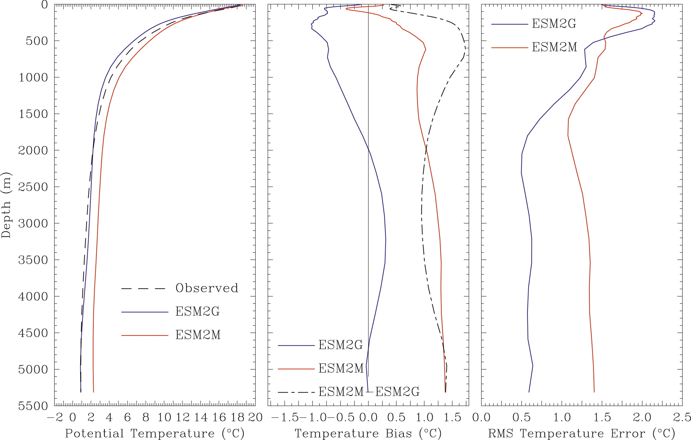
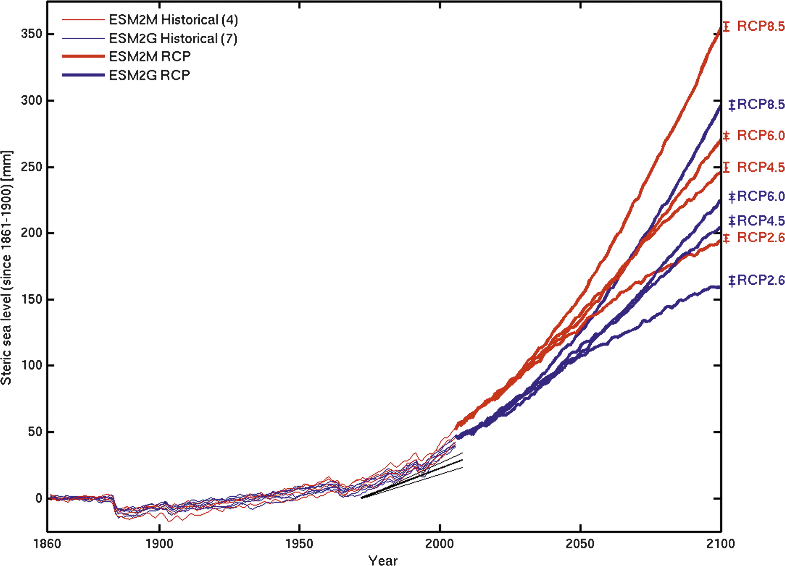

======================
Hallberg et al. (2013)
======================

:Title: Sensitivity of Twenty-First-Century Global-Mean Steric Sea Level Rise to Ocean Model Formulation
        
:Corresponding author: Robert Hallberg

:Keywords: Sea level, Climate change, Ocean models

:Citation: Hallberg, R., Adcroft, A., Dunne, J. P., Krasting, J. P., & Stouffer, R. J. (2013). Sensitivity of Twenty-First-Century Global-Mean Steric Sea Level Rise to Ocean Model Formulation. Journal of Climate, 26(9), 2947Ð2956. doi: 10.1175/jcli-d-12-00506.1

Abstract
--------

Two comprehensive Earth system models (ESMs), identical apart from their oceanic components, are used to estimate the uncertainty in projections of twenty-first-century sea level rise due to representational choices in ocean physical formulation. Most prominent among the formulation differences is that one (ESM2M) uses a traditional z-coordinate ocean model, while the other (ESM2G) uses an isopycnal-coordinate ocean. As evidence of model fidelity, differences in twentieth-century global-mean steric sea level rise are not statistically significant between either model and observed trends. However, differences between the two models' twenty-first-century projections are systematic and both statistically and climatically significant. By 2100, ESM2M exhibits 18% higher global steric sea level rise than ESM2G for all four radiative forcing scenarios (28-49 mm higher), despite having similar changes between the models in the near-surface ocean for several scenarios. These differences arise primarily from the vertical extent over which heat is taken up and the total heat uptake by the models (9% more in ESM2M than ESM2G). The fact that the spun-up control state of ESM2M is warmer than ESM2G also contributes by giving thermal expansion coefficient that are about 7% larger in ESM2M than ESM2G. The differences between these models provide a direct estimate of the sensitivity of twenty-first-century sea level rise to ocean model formulation, and, given the span of these models across the observed volume of the ventilated thermocline, may also approximate the sensitivities expected from uncertainties in the characterization of interior ocean physical processes.

Introduction
------------

Global-mean sea level has been rising throughout the twentieth century, with increased rates in recent decades (Church et al. 2011). The leading contributors have been documented as the melting of land ice (snow, mountain glaciers, and ice sheets) and the steric rise in sea level due to a warming and expanding ocean (Church et al. 2011), with smaller contributions from climatic and anthropogenic changes in land-water storage (Milly et al. 2003). Projecting twenty-first-century sea level rise (SLR) is of great societal importance but is subject to uncertainties in our understanding of the underlying physical processes. The dynamic response of marine-terminated ice sheets to warming oceans is poorly understood and has the potential to contribute to SLR at rates with a plausible order of magnitude of 10 mm yr^{-1} (Holland et al. 2008; Pfeffer et al. 2008). Because the response of clouds under changing climate is a leading order uncertainty in the earth's changing radiative budget, and because of the close connection between this budget, ocean heat uptake, and SLR, the cloud response is another substantial cause of uncertainty in SLR. Similarly, uncertainties in the radiative forcing due to aerosols and the overall sensitivity of the feedbacks in the coupled system generally can also contribute to un.certainty in projections of SLR.

The ocean contribution to SLR is closely related to its net uptake of heat, although the properties of the water taking up that heat are of leading order importance to SLR. Additionally, interior ocean mixing of heat and salinity generally cause seawater to contract because of nonlinearities of the equation of state, even though they do not alter the net heat content of the ocean (Griffies and Greatbatch 2012). Changes in ocean circulation play a leading order role in determining where the temperature will increase because of the ocean circulation response to climate change, and hence in detecting steric sea level rise (e.g., Gnanadesikan et al. 2007a; Winton et al. 2013). Interior ocean diapycnal mixing and ocean mixed layer processes play a major role in regulating the ocean's long-term uptake of heat (e.g., Dalan et al. 2005), but the explicit specification of diapycnal mixing in climate models remains largely empirical. Ocean models can also exhibit numerical artifacts, such as spurious diapycnal mixing (Griffies et al. 2000) or excessive entrainment in overflows (Legg et al. 2006), that can complicate their ability to project SLR for the real world. There is also evidence that representation of the rectified effects of ocean mesoscale eddies are an important source of uncertainty in the ocean circulation response to climate change (Hallberg and Gnanadesikan 2006; Farneti et al. 2010), and hence potentially for heat uptake and SLR. With such a broad range of processes contributing, it is worthwhile to estimate the overall magnitude of the contributions of oceanic uncertainties to uncertainties in projections of steric sea level rise.

This study examines global-mean steric sea level rise (GSSLR) from four climate change scenarios from two Earth system models (ESMs) that are identical apart from their ocean components. We utilize this framework to identify and quantify the uncertainties in GSSLR attributable to limitations in our understanding of the physics of the ocean and the numerical portrayal of the ocean's dynamics. This approach is thus different than the typical ensemble survey of coupled model inter-comparison for uncertainty estimation, as it allows us to roughly distinguish ocean-derived GSSLR differences from atmospherically forced GSSLR differences, be.cause it avoids convolving issues relating to drift in sea level and overweighting z-coordinate ocean models (with very similar lineages and algorithmic choices) in the ensemble. This study finds systematic 18% differences in GSSLR between the two models. While these differences are large enough to warrant a more thorough study, they do not fundamentally alter previous estimates of sea level rise that can be expected to occur in the twenty-fist century.

The earth system models
-----------------------

This study uses two comprehensive earth system models with identical atmospheric, land surface, sea ice, and ocean ecosystem components, differing only in their physical ocean components (Dunne et al. 2012). The ESM2M uses a 50-level z*-coordinate ocean model, built with the Modular Ocean Model, version 4.1 (MOM4p1) code (Griffies 2009). The ESM2G uses a 63-layer isopycnal-coordinate version of the Generalized Ocean Layer Dynamics (GOLD) ocean model (Hallberg and Adcroft 2009). Both use nominal horizontal resolutions of 1˚ with a tripolar fold over the Arctic. Both have comprehensive sets of physical parameterizations representative of the state-of-the-art z-coordinate and isopycnal-coordinate ocean climate models, as described in Dunne et al. (2012). Both ocean models conserve heat, salt, and mass to numerical round off, and both use proper freshwater mass flux surface boundary conditions, instead of artificially converting them into virtual salt fluxes. Neither model's atmosphere was changed or retuned from the Geophysical Fluid Dynamics Laboratory (GFDL) Climate Model, version 2.1 (CM2.1) (Anderson et al. 2004). The runs presented here use the temporally evolving concentrations of well-mixed radiatively active gases and aerosols (Lamarque et al. 2010) prescribed by phase 5 of the Coupled Model Intercomparison Project (CMIP5) for the historical period up to 2005, and the four standardized Representative Concentration Pathways (RCPs) (Moss et al. 2010; Taylor et al. 2012). The RCP scenarios are labeled with the approximate global-mean radiative forcing anomalies due to well-mixed gases at the end of the twenty-first century (e.g., RCP8.5 has about an 8.5 W m 22 radiative heating anomaly relative to the preindustrial control in 1850). The various RCP scenarios are based on plausible choices for anthropogenic emissions. The atmospheric concentrations of CO2 differ, particularly in the latter half of the twenty-first century. While the radiative forcing for RCP8.5 increases strongly throughout the twenty-first century, the radiative forcing in RCP2.6 peaks in midcentury before declining. RCP4.5 and RCP6.0 have radiative forcing in the twenty-first century between RCP8.5 and RCP2.6.

Both models have been spun up with 1860 radiative forcing for over 1000 years (2560 years for ESM2M and 1160 years for ESM2G), until their global-mean heat budgets were well balanced before starting their respective control runs. The ESM2M control runs exhibit a slight warming averaged over the volume of the ocean (dT/dt = -0.038˚C century^{-1} averaged over a 500-yr-long control run), while ESM2G has an even smaller cooling (dT/dt = -0.010˚C century^{-1}). The ocean heat (and steric sea level) budgets for the control runs of these models are thus much closer to balance than in most coupled climate models of this resolution (Sen Gupta et al. 2012). The 500-yr-long 1860 control run of ESM2G has an average steric sea level drop of 0.023 mm yr^{-1}, while ESM2M's has an average steric sea level rise of 0.074 mm yr^{-1}. In these runs, the standard deviation of the detrended annual-mean global-mean steric sea level anomaly is 2.3 mm for ESM2G and 1.8 mm for ESM2M, and they are used as uncertainty estimates in the figures presented later.

There are some pertinent differences in the spun-up ocean control states of the two models, both in the ocean interior and at the surface. As shown in Figure 1, the main thermocline extends too deeply in ESM2M and is too shallow in ESM2G relative to observations (see also Dunne et al. 2012). While the models use explicit diapycnal diffusivities of similar magnitudes in the main thermocline, ESM2M includes both parameterizations that indirectly enhance diapycnal mixing (e.g., Gnanadesikan et al. 2007b) and numerically induced diapycnal mixing (Ilicak et al. 2012; Griffies et al. 2000). The overly sharp thermocline in ESM2G may indicate that it is underrepresenting mixing processes in the thermocline. Below the thermocline, ESM2G uses an enhanced diapycnal diffusivity relative to ESM2M, following the prescription of Gargett (1984), while both models use similar abyssal tidal mixing parameterizations following Simmons et al. (2004). Under historical climate forcing, ESM2M is an average of 1˚C warmer relative to the observed climatology for 1980-2000, while ESM2G is 0.25˚C cooler than the climatology (Figure 1, middle). The root-mean-square (RMS) temperature errors relative to climatology for ESM2G are substantially smaller than for ESM2M below 500 m, while ESM2M has smaller RMS errors above 500 m, converging to similar RMS errors at the surface (Figure 1, right). Differences in the parameterizations of other processes, such as eddy mixing, could also contribute substantially to differences in both the oceans' mean states and to GSSLR. The annual-mean near-surface temperatures in 1980-2000 of the historical simulations average 0.4˚C colder in ESM2G than ESM2M, with smaller differences in midlatitudes and zonal-mean differences exceeding 1.5˚C between 50˚ and 75˚N. The northern sea ice is more extensive than observed, especially in ESM2G, and the southern sea ice is less extensive than observed, especially in ESM2M (Dunne et al. 2012). These differences between the spun-up mean states of the two models figure prominently in their differing projections of GSSLR.

   Figure 1: (left) Horizontal-mean potential temperatures from ESM2M (red) and ESM2G (blue) averaged over years 1981-2000 of the historical runs, along with the observed horizontal-mean temperature from the World Ocean Atlas, 2001 (WOA2001) (dashed) (Conkright et al. 2002). (middle) As in (left), but for horizontal-mean temperature bias from ESM2M and ESM2G relative to observed. (right) As in (left), but for horizontal RMS temperature errors for ESM2M and ESM2G. The WOA2001 dataset was chosen as a reference because most of the observations are from the 1980s and 1990s, giving a consistent comparison with this time average from the models.
   

Projected global steric sea level rise
--------------------------------------

The GSSLR for the historical and twenty-first-century projections under the four RCP scenarios are shown in Figure 2. This figure includes both thermosteric and halosteric contributions, although the focus here is on exploring the thermosteric differences, since the global-mean differences in the halosteric sea level rise are relatively small. The two models are statistically similar through.out the twentieth century, including responses of similar magnitudes to major volcanic eruptions such as Krakatoa (1883), Agung (1963), and Pinatubo (1991). The mean rate of GSSLR in the latter twentieth century in both models (1.16 mm yr^{-1} for ESM2M and 1.10 mm yr^{-1} for ESM2G) is slightly higher than observational estimates of sea level rise from thermal expansion of 0.8 ± 0.15 mm yr^{-1} for 1972Ð2008 (Church et al. 2011), while observed global-mean halosteric sea level rise is much smaller, just 0.04 ± 0.02 mm yr^{-1} averaged from 1955 to 2003 (Ishii et al. 2006), and not as well constrained observationally.

   Figure 2: Global-mean steric sea level from concentration-forced simulations with ESM2M (red) and ESM2G (blue), relative to the mean for 1861-1900, for ensembles of historical runs with four members for ESM2M and seven members for ESM2G (up to 2005) and for the four CMIP5 standardized RCPs (starting in 2005). The marks to the right of the plot are projected to 2100 from linear fits over the last 40 years, with errors estimated from the variance during that same period. Long-term mean steric sea level drifts from the control runs of +0.076 mm y^{-1} and -0.025 mm yr^{-1} have been subtracted from ESM2M and ESM2G, respectively. The three black lines show the observationally based estimate of thermosteric SLR from 1972 to 2008 of 0.80 ± 0.15 mm yr^{-1} Church et al. (2011); the vertical offset for these black lines is arbitrary.

In the twenty-first-century scenarios, there are systematic and statistically significant differences between the two models. By the middle of the twenty-first century, ESM2M exhibits a significantly larger GSSLR than ESM2G, and by the end of the twenty-first century (2081-2100), the 20-yr-averaged GSSLR relative to 1881-1900 is about 18% higher in ESM2M than in ESM2G for each of the four RCP scenarios (Fig. 2). Put differently, the values of GSSLR attained by ESM2G by the end of the twenty-first century are reached 28, 21, 16, and 11 years earlier by ESM2M for scenarios RCP2.6, RCP4.5, RCP6.0, and RCP8.5, respectively. Figure 2 also shows that the ocean formulation is responsible, both directly and indirectly via differences in the spun-up mean ocean state, for an uncertainty in projections of GSSLR that is of comparable magnitude to the differences between successive RCP forcing scenarios.

[...]
