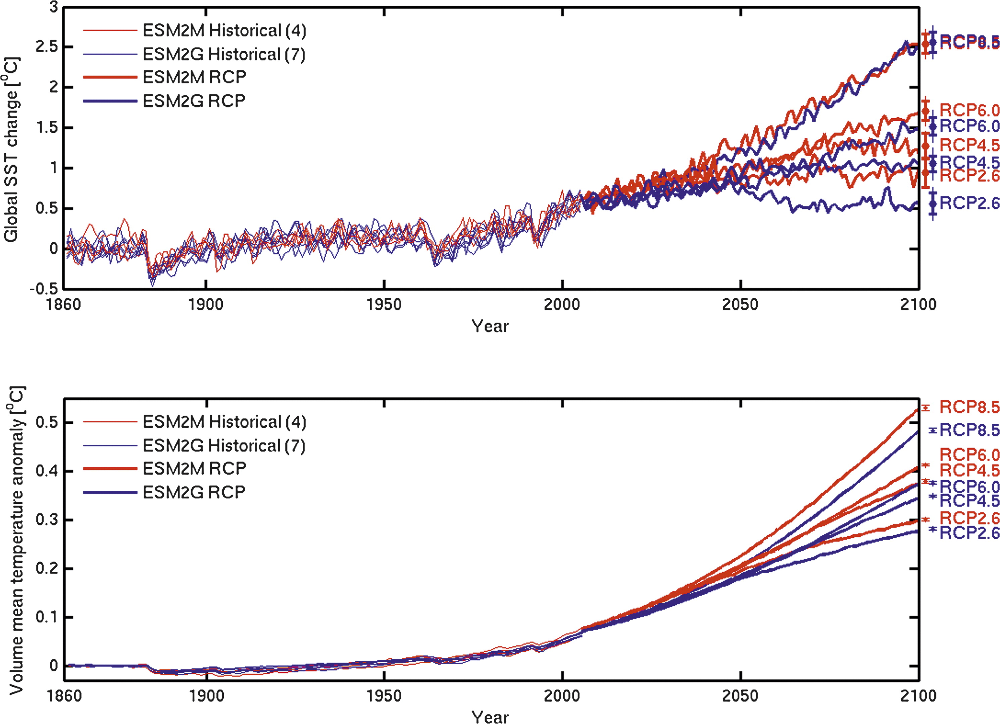
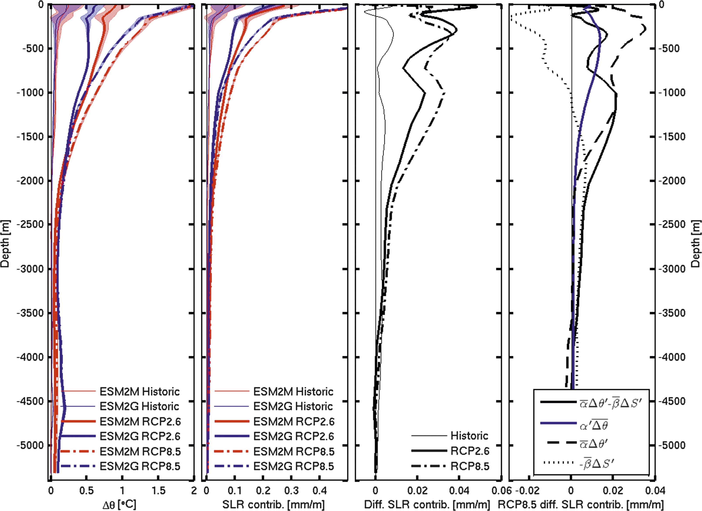
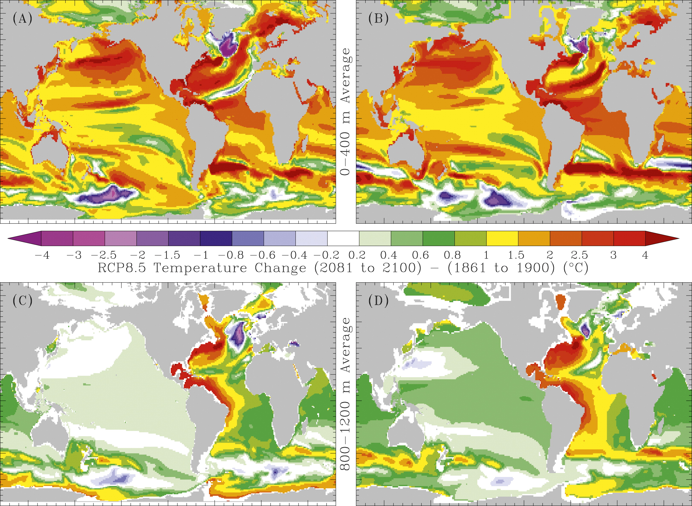

======================
Hallberg et al. (2013)
======================

:Title: Sensitivity of Twenty-First-Century Global-Mean Steric Sea Level Rise to Ocean Model Formulation
        
:Corresponding author: Robert Hallberg

:Keywords: Sea level, Climate change, Ocean models

:Citation: Hallberg, R., Adcroft, A., Dunne, J. P., Krasting, J. P., & Stouffer, R. J. (2013). Sensitivity of Twenty-First-Century Global-Mean Steric Sea Level Rise to Ocean Model Formulation. Journal of Climate, 26(9), 2947Ð2956. doi: 10.1175/jcli-d-12-00506.1

:URL: https://journals.ametsoc.org/view/journals/clim/26/9/jcli-d-12-00506.1.xml

Abstract
--------

Two comprehensive Earth system models (ESMs), identical apart from their oceanic components, are used to estimate the uncertainty in projections of twenty-first-century sea level rise due to representational choices in ocean physical formulation. Most prominent among the formulation differences is that one (ESM2M) uses a traditional z-coordinate ocean model, while the other (ESM2G) uses an isopycnal-coordinate ocean. As evidence of model fidelity, differences in twentieth-century global-mean steric sea level rise are not statistically significant between either model and observed trends. However, differences between the two models' twenty-first-century projections are systematic and both statistically and climatically significant. By 2100, ESM2M exhibits 18% higher global steric sea level rise than ESM2G for all four radiative forcing scenarios (28-49 mm higher), despite having similar changes between the models in the near-surface ocean for several scenarios. These differences arise primarily from the vertical extent over which heat is taken up and the total heat uptake by the models (9% more in ESM2M than ESM2G). The fact that the spun-up control state of ESM2M is warmer than ESM2G also contributes by giving thermal expansion coefficient that are about 7% larger in ESM2M than ESM2G. The differences between these models provide a direct estimate of the sensitivity of twenty-first-century sea level rise to ocean model formulation, and, given the span of these models across the observed volume of the ventilated thermocline, may also approximate the sensitivities expected from uncertainties in the characterization of interior ocean physical processes.

Introduction
------------

Global-mean sea level has been rising throughout the twentieth century, with increased rates in recent decades (Church et al. 2011). The leading contributors have been documented as the melting of land ice (snow, mountain glaciers, and ice sheets) and the steric rise in sea level due to a warming and expanding ocean (Church et al. 2011), with smaller contributions from climatic and anthropogenic changes in land-water storage (Milly et al. 2003). Projecting twenty-first-century sea level rise (SLR) is of great societal importance but is subject to uncertainties in our understanding of the underlying physical processes. The dynamic response of marine-terminated ice sheets to warming oceans is poorly understood and has the potential to contribute to SLR at rates with a plausible order of magnitude of 10 mm yr^{-1} (Holland et al. 2008; Pfeffer et al. 2008). Because the response of clouds under changing climate is a leading order uncertainty in the earth's changing radiative budget, and because of the close connection between this budget, ocean heat uptake, and SLR, the cloud response is another substantial cause of uncertainty in SLR. Similarly, uncertainties in the radiative forcing due to aerosols and the overall sensitivity of the feedbacks in the coupled system generally can also contribute to un.certainty in projections of SLR.

The ocean contribution to SLR is closely related to its net uptake of heat, although the properties of the water taking up that heat are of leading order importance to SLR. Additionally, interior ocean mixing of heat and salinity generally cause seawater to contract because of nonlinearities of the equation of state, even though they do not alter the net heat content of the ocean (Griffies and Greatbatch 2012). Changes in ocean circulation play a leading order role in determining where the temperature will increase because of the ocean circulation response to climate change, and hence in detecting steric sea level rise (e.g., Gnanadesikan et al. 2007a; Winton et al. 2013). Interior ocean diapycnal mixing and ocean mixed layer processes play a major role in regulating the ocean's long-term uptake of heat (e.g., Dalan et al. 2005), but the explicit specification of diapycnal mixing in climate models remains largely empirical. Ocean models can also exhibit numerical artifacts, such as spurious diapycnal mixing (Griffies et al. 2000) or excessive entrainment in overflows (Legg et al. 2006), that can complicate their ability to project SLR for the real world. There is also evidence that representation of the rectified effects of ocean mesoscale eddies are an important source of uncertainty in the ocean circulation response to climate change (Hallberg and Gnanadesikan 2006; Farneti et al. 2010), and hence potentially for heat uptake and SLR. With such a broad range of processes contributing, it is worthwhile to estimate the overall magnitude of the contributions of oceanic uncertainties to uncertainties in projections of steric sea level rise.

This study examines global-mean steric sea level rise (GSSLR) from four climate change scenarios from two Earth system models (ESMs) that are identical apart from their ocean components. We utilize this framework to identify and quantify the uncertainties in GSSLR attributable to limitations in our understanding of the physics of the ocean and the numerical portrayal of the ocean's dynamics. This approach is thus different than the typical ensemble survey of coupled model inter-comparison for uncertainty estimation, as it allows us to roughly distinguish ocean-derived GSSLR differences from atmospherically forced GSSLR differences, be.cause it avoids convolving issues relating to drift in sea level and overweighting z-coordinate ocean models (with very similar lineages and algorithmic choices) in the ensemble. This study finds systematic 18% differences in GSSLR between the two models. While these differences are large enough to warrant a more thorough study, they do not fundamentally alter previous estimates of sea level rise that can be expected to occur in the twenty-fist century.

The earth system models
-----------------------

This study uses two comprehensive earth system models with identical atmospheric, land surface, sea ice, and ocean ecosystem components, differing only in their physical ocean components (Dunne et al. 2012). The ESM2M uses a 50-level z*-coordinate ocean model, built with the Modular Ocean Model, version 4.1 (MOM4p1) code (Griffies 2009). The ESM2G uses a 63-layer isopycnal-coordinate version of the Generalized Ocean Layer Dynamics (GOLD) ocean model (Hallberg and Adcroft 2009). Both use nominal horizontal resolutions of 1˚ with a tripolar fold over the Arctic. Both have comprehensive sets of physical parameterizations representative of the state-of-the-art z-coordinate and isopycnal-coordinate ocean climate models, as described in Dunne et al. (2012). Both ocean models conserve heat, salt, and mass to numerical round off, and both use proper freshwater mass flux surface boundary conditions, instead of artificially converting them into virtual salt fluxes. Neither model's atmosphere was changed or retuned from the Geophysical Fluid Dynamics Laboratory (GFDL) Climate Model, version 2.1 (CM2.1) (Anderson et al. 2004). The runs presented here use the temporally evolving concentrations of well-mixed radiatively active gases and aerosols (Lamarque et al. 2010) prescribed by phase 5 of the Coupled Model Intercomparison Project (CMIP5) for the historical period up to 2005, and the four standardized Representative Concentration Pathways (RCPs) (Moss et al. 2010; Taylor et al. 2012). The RCP scenarios are labeled with the approximate global-mean radiative forcing anomalies due to well-mixed gases at the end of the twenty-first century (e.g., RCP8.5 has about an 8.5 W m 22 radiative heating anomaly relative to the preindustrial control in 1850). The various RCP scenarios are based on plausible choices for anthropogenic emissions. The atmospheric concentrations of CO2 differ, particularly in the latter half of the twenty-first century. While the radiative forcing for RCP8.5 increases strongly throughout the twenty-first century, the radiative forcing in RCP2.6 peaks in midcentury before declining. RCP4.5 and RCP6.0 have radiative forcing in the twenty-first century between RCP8.5 and RCP2.6.

Both models have been spun up with 1860 radiative forcing for over 1000 years (2560 years for ESM2M and 1160 years for ESM2G), until their global-mean heat budgets were well balanced before starting their respective control runs. The ESM2M control runs exhibit a slight warming averaged over the volume of the ocean (dT/dt = -0.038˚C century^{-1} averaged over a 500-yr-long control run), while ESM2G has an even smaller cooling (dT/dt = -0.010˚C century^{-1}). The ocean heat (and steric sea level) budgets for the control runs of these models are thus much closer to balance than in most coupled climate models of this resolution (Sen Gupta et al. 2012). The 500-yr-long 1860 control run of ESM2G has an average steric sea level drop of 0.023 mm yr^{-1}, while ESM2M's has an average steric sea level rise of 0.074 mm yr^{-1}. In these runs, the standard deviation of the detrended annual-mean global-mean steric sea level anomaly is 2.3 mm for ESM2G and 1.8 mm for ESM2M, and they are used as uncertainty estimates in the figures presented later.

There are some pertinent differences in the spun-up ocean control states of the two models, both in the ocean interior and at the surface. As shown in Figure 1, the main thermocline extends too deeply in ESM2M and is too shallow in ESM2G relative to observations (see also Dunne et al. 2012). While the models use explicit diapycnal diffusivities of similar magnitudes in the main thermocline, ESM2M includes both parameterizations that indirectly enhance diapycnal mixing (e.g., Gnanadesikan et al. 2007b) and numerically induced diapycnal mixing (Ilicak et al. 2012; Griffies et al. 2000). The overly sharp thermocline in ESM2G may indicate that it is underrepresenting mixing processes in the thermocline. Below the thermocline, ESM2G uses an enhanced diapycnal diffusivity relative to ESM2M, following the prescription of Gargett (1984), while both models use similar abyssal tidal mixing parameterizations following Simmons et al. (2004). Under historical climate forcing, ESM2M is an average of 1˚C warmer relative to the observed climatology for 1980-2000, while ESM2G is 0.25˚C cooler than the climatology (Figure 1, middle). The root-mean-square (RMS) temperature errors relative to climatology for ESM2G are substantially smaller than for ESM2M below 500 m, while ESM2M has smaller RMS errors above 500 m, converging to similar RMS errors at the surface (Figure 1, right). Differences in the parameterizations of other processes, such as eddy mixing, could also contribute substantially to differences in both the oceans' mean states and to GSSLR. The annual-mean near-surface temperatures in 1980-2000 of the historical simulations average 0.4˚C colder in ESM2G than ESM2M, with smaller differences in midlatitudes and zonal-mean differences exceeding 1.5˚C between 50˚ and 75˚N. The northern sea ice is more extensive than observed, especially in ESM2G, and the southern sea ice is less extensive than observed, especially in ESM2M (Dunne et al. 2012). These differences between the spun-up mean states of the two models figure prominently in their differing projections of GSSLR.

.. figure:: figures/hallberg13/fig01.jpg
   :align: center
   :width: 50%

   Figure 1: (left) Horizontal-mean potential temperatures from ESM2M (red) and ESM2G (blue) averaged over years 1981-2000 of the historical runs, along with the observed horizontal-mean temperature from the World Ocean Atlas, 2001 (WOA2001) (dashed) (Conkright et al. 2002). (middle) As in (left), but for horizontal-mean temperature bias from ESM2M and ESM2G relative to observed. (right) As in (left), but for horizontal RMS temperature errors for ESM2M and ESM2G. The WOA2001 dataset was chosen as a reference because most of the observations are from the 1980s and 1990s, giving a consistent comparison with this time average from the models.
   

Projected global steric sea level rise
--------------------------------------

The GSSLR for the historical and twenty-first-century projections under the four RCP scenarios are shown in Figure 2. This figure includes both thermosteric and halosteric contributions, although the focus here is on exploring the thermosteric differences, since the global-mean differences in the halosteric sea level rise are relatively small. The two models are statistically similar through.out the twentieth century, including responses of similar magnitudes to major volcanic eruptions such as Krakatoa (1883), Agung (1963), and Pinatubo (1991). The mean rate of GSSLR in the latter twentieth century in both models (1.16 mm yr^{-1} for ESM2M and 1.10 mm yr^{-1} for ESM2G) is slightly higher than observational estimates of sea level rise from thermal expansion of 0.8 ± 0.15 mm yr^{-1} for 1972Ð2008 (Church et al. 2011), while observed global-mean halosteric sea level rise is much smaller, just 0.04 ± 0.02 mm yr^{-1} averaged from 1955 to 2003 (Ishii et al. 2006), and not as well constrained observationally.

.. figure:: figures/hallberg13/fig02.jpg
   :align: center
   :width: 50%

   Figure 2: Global-mean steric sea level from concentration-forced simulations with ESM2M (red) and ESM2G (blue), relative to the mean for 1861-1900, for ensembles of historical runs with four members for ESM2M and seven members for ESM2G (up to 2005) and for the four CMIP5 standardized RCPs (starting in 2005). The marks to the right of the plot are projected to 2100 from linear fits over the last 40 years, with errors estimated from the variance during that same period. Long-term mean steric sea level drifts from the control runs of +0.076 mm y^{-1} and -0.025 mm yr^{-1} have been subtracted from ESM2M and ESM2G, respectively. The three black lines show the observationally based estimate of thermosteric SLR from 1972 to 2008 of 0.80 ± 0.15 mm yr^{-1} Church et al. (2011); the vertical offset for these black lines is arbitrary.

In the twenty-first-century scenarios, there are systematic and statistically significant differences between the two models. By the middle of the twenty-first century, ESM2M exhibits a significantly larger GSSLR than ESM2G, and by the end of the twenty-first century (2081-2100), the 20-yr-averaged GSSLR relative to 1881-1900 is about 18% higher in ESM2M than in ESM2G for each of the four RCP scenarios (Fig. 2). Put differently, the values of GSSLR attained by ESM2G by the end of the twenty-first century are reached 28, 21, 16, and 11 years earlier by ESM2M for scenarios RCP2.6, RCP4.5, RCP6.0, and RCP8.5, respectively. Figure 2 also shows that the ocean formulation is responsible, both directly and indirectly via differences in the spun-up mean ocean state, for an uncertainty in projections of GSSLR that is of comparable magnitude to the differences between successive RCP forcing scenarios.

The first reason for the higher GSSLR in ESM2M than in ESM2G is simply because it takes up more heat. This is readily evident in Fig. 3 (bottom), where ESM2M warms substantially more than comparable ESM2G simulations, with volume-mean temperature increasing about 9% more in ESM2M than in ESM2G. These differences in heat uptake are primarily found over the broad depth range from 200 to 2000 m (Fig. 4, left). The warming itself is much more strongly surface intensified in both models than are the differences between the models, and it is quite similar at the surface (apart from RCP2.6, where near-surface temperatures start diverging around 2050, as seen in Fig. 3); this point is discussed further below. To leading order, the heat is being taken up primarily in the thermocline of both models, but the main thermocline is deeper in ESM2M than in ESM2G, giving a greater volume of water to warm. As shown in Fig. 4 (middle left), the density changes contributing to the differences in GSSLR between the models are broadly distributed over the top 2500 m of the models, with roughly equal contributions coming from the depth ranges of 0–600 m, 600–1200 m, and 1200–2500 m. By contrast, well over half the total GSSLR comes from the topmost 600 m in all the cases. Differences in salinity changes compensate or augment the GSSLR differences because of differences in thermal changes at varying depths (Fig. 4, right), but when vertically integrated, the differences in salinity changes between the models contribute less than 0.2 mm to the difference in GSSLR. The larger heat uptake in ESM2M than ESM2G accounts for about half the difference in GSSLR between the models.

   Figure 3: (top) Time series of global-mean SST, relative to the mean for 1880–1920, from ESM2M (red) and ESM2G (blue) for ensembles of historical runs and the four CMIP5 radiative scenarios. The values on the right are projections to 2100 from linear fits over the last 40 years, with error bars indicating the variance from these trends over the same 40-yr period. (bottom) Time series of globally integrated heat content anomalies, expressed as volume-mean ocean temperature anomalies in degrees Celsius.

   Figure 4: (left) Vertical profiles of the horizontal-mean temperature change for ESM2M (red) and ESM2G (blue) averaged over a 40-yr period relative to 1861–1900. The historical intervals are a century apart (1961–2000), while for RCP2.6 and RCP8.5, the intervals are two centuries apart (2061–2100). (middle left) Vertical profiles of the horizontal-mean contributions to GSSLR (spatially integrated density anomalies divided by the ocean’s surface area and a mean density) from the same runs. (middle right) Profiles of the difference in contribution to GSSLR, ESM2M minus ESM2G. (right) Vertical profiles of the dominant terms in the differences between ESM2M and ESM2G in GSSLR contributions for RCP8.5. The average of the models’ temperature changes acting on the difference between the models’ thermal expansion coefficient differences (blue) and the differences in water-mass property changes acting on the mean thermal expansion and haline contraction coefficients of the two models (solid black) explain almost the entire signal shown in the third panel. The dashed and dotted lines show the separate profiles of GSSLR contributions from the temperature and salinity change differences, respectively, acting on the mean of the models’ thermal expansion and haline contraction coefficients.

A second factor in the differing GSSLR between these two models is the difference in the thermal expansion coefficients where the heating occurs; the thermal expansion coefficient is a strongly increasing function of temperature and pressure, so the two models could be taking up similar amounts of heat, but in different locations, leading to differing amounts of GSSLR (see, e.g., Griffies and Greatbatch 2012). This effect is evident in Fig. 4 (left and middle-left panels), where the contributions to GSSLR are relatively concentrated in the warmer near-surface waters compared with the heat uptake, and it is explicitly diagnosed for RCP8.5 in Fig. 4 (right). ESM2G has a sharper thermocline than ESM2M, and is, on average, about 1.25°C colder than ESM2M at the same depths below the topmost few hundred meters (Fig. 1, middle), with differences in thermal expansion coefficients based on the horizontal-mean temperatures peaking at about 750-m depth, where it is 14% larger in the ESM2M historical run than in ESM2G (and 8% larger than for observed temperatures; in ESM2G it is 6% smaller than observed). The thermal expansion coefficients have smaller relative differences above 750 m because the water is warmer, on average, and they have smaller relative differences below 1000 m because of the effects of pressure. Averaged over the whole volume of the ocean, the simulated thermal expansion coefficient averaged from 1981 to 2000 is 1.1% smaller than observed in ESM2G and 6.6% larger than observed in ESM2M. For RCP8.5, between 1870 and 2090 the volume-mean thermal expansion coefficient increases by about 2.8% in both cases. When weighted by the models’ temperature changes, the mean thermal expansion coefficients are 4% smaller than observed for ESM2G and 3.1% larger than observed for ESM2M for 1981–2000 and increase in the simulations by 10.4% and 11.0% between 1870 and 2090 for RCP8.5. The fact that the warming of the top 2000 m occurs, on average, some 40 m deeper in ESM2M than ESM2G (Fig. 4) also tends to give larger GSSLR in ESM2M than ESM2G, but only by about 0.5%, and it is a minor contributor to the GSSLR differences between the models. The simple fact that the thermal expansion coefficient is a strong function of temperature, and that the control state of ESM2M is warmer than ESM2G, accounts for a roughly 7% larger GSSLR in ESM2M than ESM2G.

Nonoceanic factors that might affect GSSLR, such as atmospheric feedbacks and differences in sea ice that have confounded previous attribution efforts (see Bindoff et al. 2007), do not contribute directly in this study, since those components are identical. However, surface differences in the spun-up mean state of the coupled models can lead to different responses in the atmosphere or sea ice. For instance, the global-mean SSTs in the ESM2G RCP2.6 simulation cool substantially in the latter half of the twenty-first century (Fig. 3, top), tracking the decline in the radiative forcing of RCP2.6, as high-latitude haloclines form in both the Northern and Southern Hemispheres and the sea ice expands. These ice-covered haloclines locally limit the otherwise large ocean heat loss, and the ocean’s warming (Fig. 3, bottom) is not greatly slowed by this global-mean near-surface cooling, even as the lower-latitude surface cooling slows the uptake of heat by warmer waters and sea level rise slows (Fig. 2). Other scenarios exhibit somewhat similar behavior, although they figure less prominently in the differences between the two models’ projections of GSSLR than in RCP2.6.

The RCP8.5 simulations are particularly intriguing, in that the sea surface temperature anomalies exhibit strikingly similar histories throughout the twenty-first century (Fig. 3, top), and by the end of the twenty-first century, summertime sea ice is too limited to do much in either model, but there are still 9% differences in integrated heat uptake (Fig. 3) and 18% differences in GSSLR (Fig. 2). In the near-surface waters (an average from 0 to 400 m is shown in Figs. 5a,b), which dominate the GSSLR signals, both models exhibit temperature changes that are remarkably similar both in magnitude (ESM2M warms just 4% more than ESM2G) and in their spatial patterns. These near-surface temperature changes include both contributions that are directly forced by the uptake of heat from the atmosphere and internal redistributions of heat tied to circulation changes, such as the spinup of the Antarctic Circumpolar Current and the weakening of the Gulf Stream. Some of the heating differences between the models may reflect a deeper rapidly ventilated thermocline in ESM2M than in ESM2G. The volume of water between 50°N and 50°S that is ventilated within 50 years (as measured by a passive “ideal age” tracer) is roughly 20% larger in ESM2M than ESM2G (172-m versus 141-m average thicknesses in 1981–2000). If the surface warming signal is partly acting as a Dirichlet boundary condition for the ocean’s interior temperature, this greater volume of rapidly ventilated water would lead to a larger heat uptake and GSSLR. These relative differences in the volumes of ventilated water are similar to the differences in the volumes of water warmer that some temperatures appropriate to the thermocline (e.g., 12°C). Whether the differences in ventilation drive the differences in near-surface stratification (see Fig. 1) or whether it is the reverse is beyond the scope of this paper; certainly, there is a connection between them and with the amount of heat that the upper ocean can take up on time scales of decades. However, these near-surface heating differences are not the dominant driver of GSSLR differences in the RCP8.5 simulations.

   Figure 5: Temperature change for RCP8.5 averaged over the years 2081–2100, relative to 1861–1900 and corrected for long-term mean drifts, for (left) ESM2G and (right) ESM2M and averaged over the depth ranges of (a),(b) 0–400 m and (c),(d) 800–1200 m. The horizontal-mean temperature changes are 1.59°, 1.66°, 0.56°, and 0.73°C in (a)–(d), respectively. Between 0 and 400 m, the average warming is 4% larger in ESM2M than ESM2G, but between 800 and 1200 m, the average warming is 29% larger in ESM2M than ESM2G.

At a depth of 800–1200 m in the RCP8.5 scenario (Figs. 5c,d), the heat uptake is of profoundly different magnitude between the models (the temperature increase is 29% larger in ESM2M than ESM2G), but still with very similar patterns. This depth is chosen for greater scrutiny because there is a peak in the difference in SLR contributions from water-mass changes between the models at about 1000 m (Fig. 4, right). Both exhibit warming (and an increase in salinity) in the western Atlantic because of a slowdown of the Atlantic meridional overturning circulation with a somewhat stronger warming signal in ESM2M than ESM2G. The Pacific is comparable to the Atlantic in the integrated heat change difference between the models in the 800–1200-m depth range and actually dominates the horizontally averaged steric sea level rise difference because there is no compensating salinity signal. The North Pacific signal is too deep for any of the water involved to have been directly influenced by the surface heat flux anomalies; instead, it is due to circulation changes. The broad warming of the eastern Pacific in both models is consistent with a broad downward displacement of the isopycnals of approximately 100 m in both models. The cooling signals on the western side of the Pacific basin are consistent with a vertical contraction of the subtropical gyres as the overlying waters become more strongly stratified. The temperature signal at about 1000 m in the Pacific is much larger in ESM2M than ESM2G, primarily because the vertical temperature gradients at this depth are much larger in ESM2M than ESM2G (Fig. 1). These deep temperature signals, which make up a large portion of the overall GSSLR difference, illustrate the importance of the ocean’s initial state in determining the details of its forced GSSLR signal.

Discussion and summary
----------------------

This study examines the differences between the GSSLR projected by two earth system models, which differ only in their ocean components, in order to estimate the uncertainties in twenty-first-century GSSLR projections arising solely from uncertainties in the numerical representation of ocean dynamics and parameterizations of physical processes in the ocean. The interior ocean–mean states of these two models have water-mass biases that broadly straddle the observed properties of the ocean, and their ocean components might be considered cutting-edge geopotential- and isopycnal-coordinate ocean climate models. ESM2G exhibits twenty-first-century GSSLR that is consistently 18% smaller than in ESM2M for all four radiative forcing scenarios. Differences in the amount of heat taken up by the two models would account for a 9% difference in GSSLR, while differences in the thermal expansion coefficient due to different control states would account for a 7% difference. While these differences are highly statistically significant, they are also small enough to suggest that uncertainties in the ocean do not qualitatively alter the expected magnitude of twenty-first-century GSSLR.

There are two significant caveats to the findings reported here. The first is that since neither of these models explicitly resolves ocean eddies, the role of ocean eddies in rectifying distributions of ocean heat uptake (e.g., Böning et al. 2008), and thus modulating GSSLR, is a source of uncertainty that cannot be addressed here. The second caveat is that these results only apply to the time scales out to 2100. For longer-term projections, the abyssal and deep-ocean responses are much more important. Given the very large differences in the abyssal circulation between the models, which can be detected in the models’ very different ideal age distributions (see Fig. 13 of Dunne et al. 2012) and lead to the models’ dramatically different abyssal temperatures (Fig. 1, left), the two models studied here can be expected to have quite different magnitudes of GSSLR for time scales of multiple centuries to millennia. For instance, the differences in the spun-up temperature profiles between the models (Fig. 1), which accumulated over the course of spin-up runs of over a thousand years, would cause steric sea level differences between the models of approximately 0.6 m, relative to the models’ identical pre-spin-up initial conditions.

The regions where the GSSLR differences appear are also regions where models have profoundly different interior ocean biases. This observation suggests that accurately capturing the ocean’s mean state, especially the stratification (which regulates how circulation changes translate into density changes), the thermocline depth (which appears to partially control the volume of water over which heat is taken up in the twenty-first century), and the mean temperatures (which substantially impact the thermal expansion coefficient) are useful steps toward reducing uncertainties in projections of twenty-first-century sea level rise. To the extent that the uncertainties in projected rise and biases in the spun-up state of the ocean have striking similarities and may have similar causes, or that the biases in the spun-up state directly affect projections of GSSLR, the utility of coupled climate models to accurately predict GSSLR might be appraised by evaluating simulated interior ocean temperature and stratification biases.

The fact that it is the lower thermocline that dominates the GSSLR differences between the models, and not the upper main thermocline that dominates GSSLR itself, suggests that differences in the processes that set and alter the interior ocean water-mass properties in these density ranges may largely explain the differences between these two models. Formation of mode waters and intermediate waters are problematic for many of the coupled models that are included in CMIP5 (e.g., Downes et al. 2011) and are a focus of ongoing development. The two models also represent very differently the overflows (e.g., Legg et al. 2006) that are an integral part of the ocean’s overturning circulation and the formation of water masses that are found at this depth. Increasing diapycnal diffusion is well known to broaden the lower thermocline. Ilicak et al. (2012) diagnose that ESM2M has spurious (numerically induced) diapycnal mixing that is about a third of the size of the explicitly parameterized intended mixing, while that in ESM2G is only about an eighth as large. While this global diagnostic cannot say where this spurious mixing is occurring, it could help explain both the greater breadth of the main thermocline and the deeper penetration of heat in ESM2M compared to ESM2G. Greater scrutiny of the models’ representation of the processes that control the water-mass structure and location of the lower main thermocline might be of particular value for further reducing the oceanic uncertainty in projections of GSSLR.

The biggest uncertainties in projecting twenty-first-century sea level rise are in how much mass the Antarctic and Greenland ice sheets will lose dynamically. Twenty-first-century SLR due to ice sheet dynamics is unknown to within about 1 m of sea level rise (e.g., Pfeffer et al. 2008); while recent rates of observed ice sheet mass loss would only contribute approximately 130 ± 40 mm in the twenty-first century, this increases to between 450 and 700 mm if observed accelerations in ice sheet mass loss continue (Rignot et al. 2011). A second major source of uncertainty is what radiative forcing scenario humans will collectively choose for our planet, here differing between the highest and lowest CMIP5 scenarios by about 125 mm of GSSLR by 2100. Uncetainties in the representation of the dynamics of the ocean and atmosphere and of key physical processes, such as clouds or small-scale ocean mixing, also map significantly onto uncertainties in projected GSSLR. The various coupled climate models used in the Intergovernmental Panel on Climate Change (IPCC) Fourth Assessment Report give 5% and 95% estimates of twenty-first-century GSSLR that differ by ±42% from the mean for a given forcing scenario (Meehl et al. 2007), or a range of about 190 mm. Since these IPCC models are largely independent, this value is likely to be dominated by atmospheric differences, especially in changing cloud distributions, although ocean differences will also contribute. The comparison presented here suggests that the uncertainty in twenty-first-century steric sea level rise due only to the ocean model formulation and physical processes in the ocean is approximately 28–49 mm (depending on the forcing scenario).

To put these results into the long-term perspective, it is important to recognize that the uncertainties in twenty-first-century GSSLR arising from the ocean (of order 0.05 m) are small compared with the potential sea level rise stemming from interactions between the oceans and ice sheets (of order 1 m). While additional work to improve our ability to capture the physics and dynamics of the ocean in numerical models will be useful, and the role of ocean eddies in modulating GSSLR is largely unexplored, by far the most prominent open questions regarding the ocean’s role in sea level rise center on the interactions between the oceans and ice sheets and how they will evolve in coming centuries.
