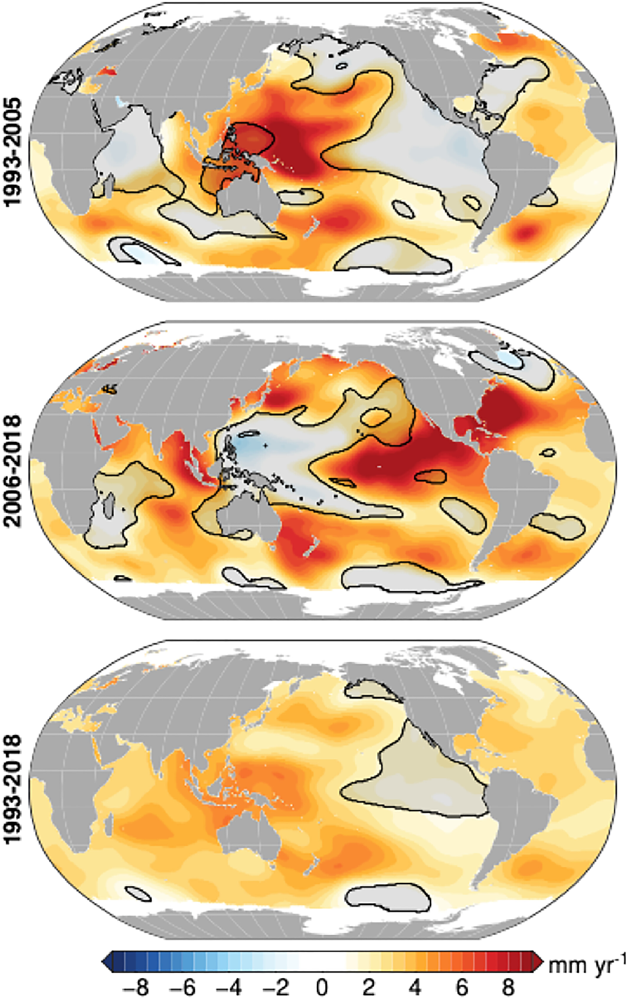
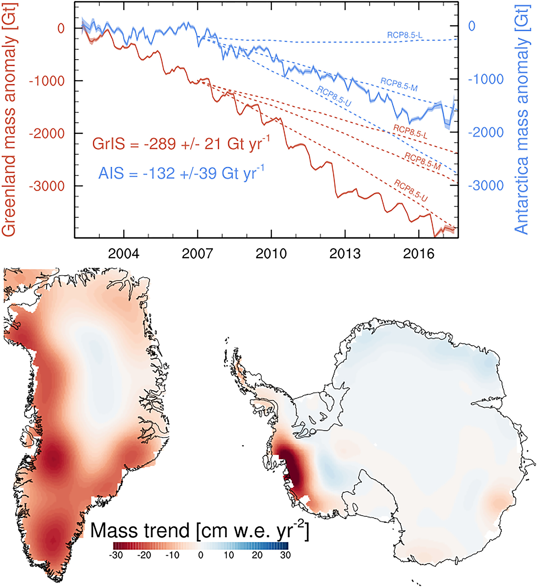
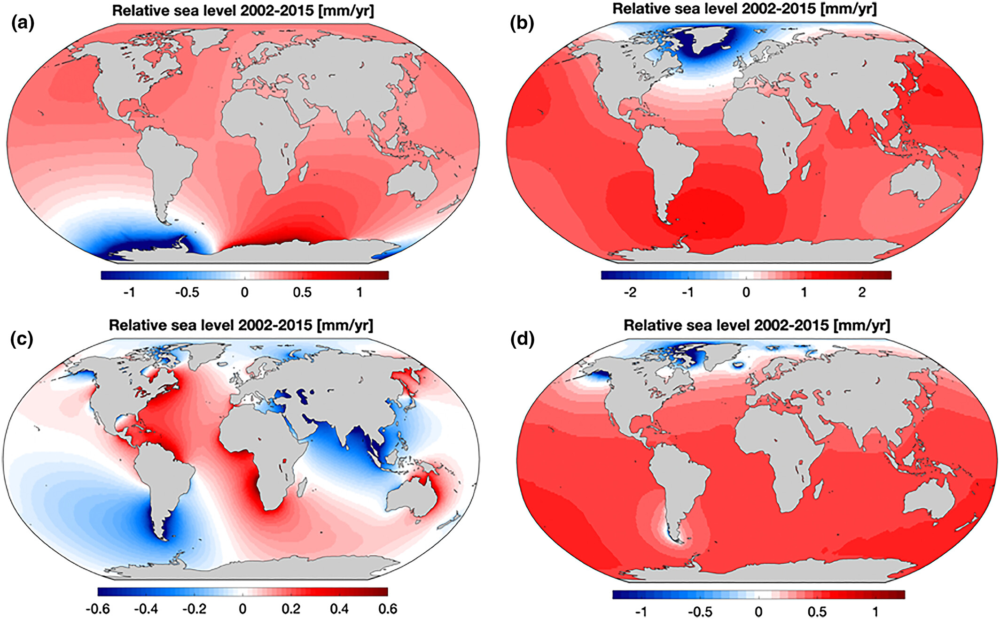
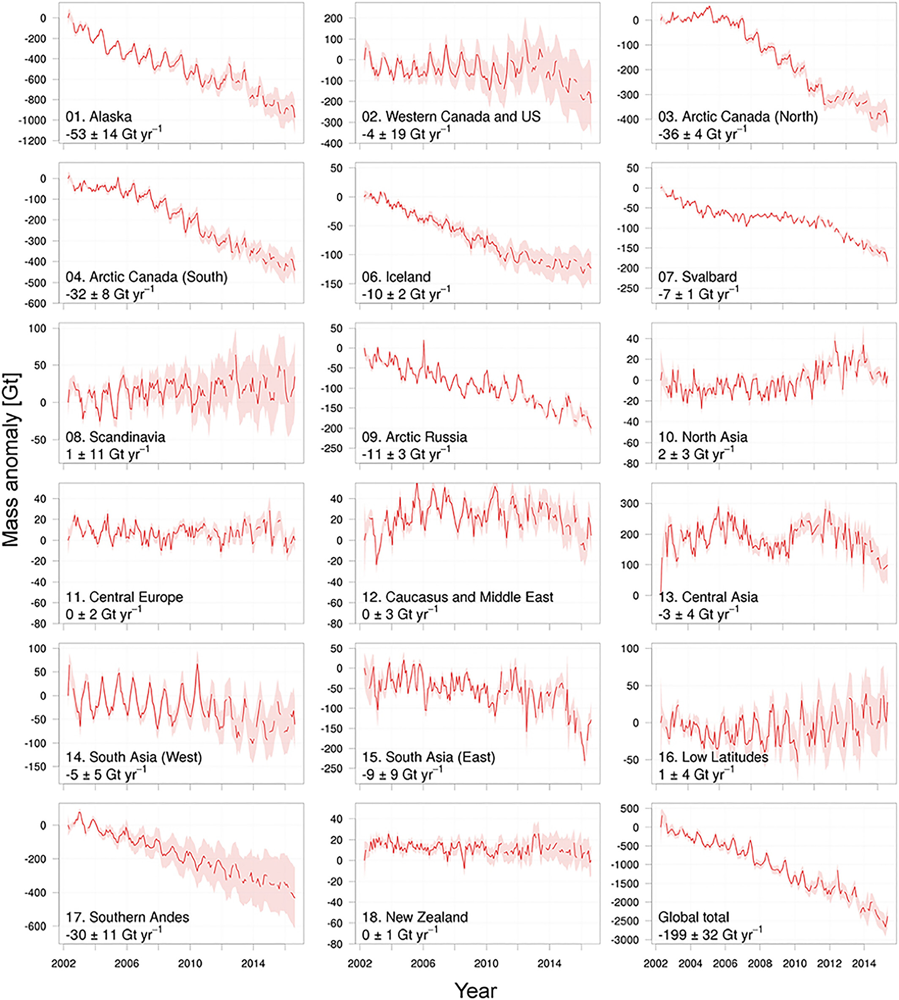

=============================
Hamlington et al. (JGR, 2020)
=============================

:Title: Understanding of contemporary regional sea-level change and the implications for the future
:Key Points:
    - An overview of the current state of understanding of the processes that cause regional sea-level change is provided
    - Areas where the lack of understanding or gaps in knowledge inhibit the ability to assess future sea-level change are discussed
    - The role of the expanded sea-level observation network in improving our understanding of sea-level change is highlighted

:Corresponding author: C. M. Little

:Citation: Hamlington, B. D., Gardner, A. S., Ivins, E., Lenaerts, J. T. M., Reager, J. T., Trossman, D. S., et al. (2020). Understanding of contemporary regional sea-level change and the implications for the future. Reviews of Geophysics, 58, e2019RG000672. https://doi.org/10.1029/2019RG000672

Abstract
--------

Global sea level provides an important indicator of the state of the warming climate, but changes in regional sea level are most relevant for coastal communities around the world. With improvements to the sea-level observing system, the knowledge of regional sea-level change has advanced dramatically in recent years. Satellite measurements coupled with in situ observations have allowed for comprehensive study and improved understanding of the diverse set of drivers that lead to variations in sea level in space and time. Despite the advances, gaps in the understanding of contemporary sea-level change remain and inhibit the ability to predict how the relevant processes may lead to future change. These gaps arise in part due to the complexity of the linkages between the drivers of sea-level change. Here we review the individual processes which lead to sea-level change and then describe how they combine and vary regionally. The intent of the paper is to provide an overview of the current state of understanding of the processes that cause regional sea-level change and to identify and discuss limitations and uncertainty in our understanding of these processes. Areas where the lack of understanding or gaps in knowledge inhibit the ability to provide the needed information for comprehensive planning efforts are of particular focus. Finally, a goal of this paper is to highlight the role of the expanded sea-level observation network - particularly as related to satellite observations - in the improved scientific understanding of the contributors to regional sea-level change.

Plain Language Summary
----------------------

This review paper addresses three important questions: (1) What do we currently know about the processes contributing to sea level change? (2) What observations do we use to gain this knowledge? and (3) Where are these gaps in our knowledge and the need for further improvement in our understanding of the drivers of regional sea level? By answering these specific questions in a focused manner, this paper should be a useful resource for other scientists, sea-level stakeholders, and a broader audience of those interested in sea level and our changing climate.

Introduction
------------

Global mean sea level (GMSL) is an important indicator of a warming climate (Church & White, 2011; Milne et al., 2009; Stammer et al., 2013), but changes in regional sea level are most relevant to coastal communities around the world (Kopp et al., 2015; Nicholls, 2011; Woodworth et al., 2019). The regional variability of the processes driving sea-level change (SLC), along with their uncertainties and relative importance over different time scales, pose challenges to planning efforts. Available observations of sea level show clear spatial and temporal inhomogeneity. From satellite altimeter observations covering the time period from 1993 to present, regional rates of rise can be more than double the global average in some locations while near zero at other locations (Cazenave & Llovel, 2010). Furthermore, as a result of internal variability, the pattern of linear trends in regional sea level has shifted or reversed in many regions from the first half of the altimeter record to the second (e.g., Han et al., 2017; Peyser et al., 2016; Figure 1). Over longer time periods (i.e., hundreds of years), tide gauge records also show regional differences in the rates of SLC, owing in part to the vertical motion of the land upon which the gauges sit (e.g., Church et al., 2004; Church & White, 2006; Hay et al., 2015; Kleinherenbrink et al., 2018; Santamaroa-Gomez et al., 2014, 2017; Thompson et al., 2016). Understanding and accounting for these regional differences are critical first steps in providing information that is useful for planning efforts at the coast.

   Figure 1: Satellite altimeter-measured regional sea-level trend patterns from (top) 1993–2005, (middle) 2006–2018, and (bottom) 1993–2018. Black contours and gray shading denote areas where the estimated trend is not significant at the 95% confidence level.

Due in large part to improvements in the sea.level observing system, the processes contributing to recent SLC are now well known. The uncertainty in the budget of GMSL rise over the last decade has been reduced (Cazenave et al., 2018), allowing for an assessment of the relative contributions of different processes that are important on global scales. While more challenging on regional levels, satellite observations, along with in situ measurements, have also led to a dramatically improved understanding of the processes causing regional differences in SLC. Fundamentally, the drivers that dominantly impact GMSL have a regional signature, and no process will result in a change that is uniform across the ocean (Milne et al., 2009; Stammer et al., 2013). Similarly, no contributor to SLC is constant in time, and the time scales upon which the processes vary can differ dramatically. Separating the contributors temporally and geographically can be useful when considering a particular planning horizon, although the range of variability inherent to the individual contributors can make this difficult. Additionally, it is the combined impact of several factors operating on these different scales that is of direct importance.

The causes of global and regional SLC have been the focus of recent review papers, with regional change most comprehensively discussed and summarized in Stammer et al. (2013), Kopp et al. (2015), and Slangen et al. (2017). The understanding of these processes has progressed in recent years, and the outstanding gaps in knowledge and remaining uncertainties have shifted accordingly. The intent of the present paper is to provide an overview and update of the current state of understanding of the processes that cause regional SLC and to identify and discuss limitations and uncertainty in our understanding of these processes. Although the focus is on contemporary SLC, we do include discussion of projections of future SLC. In particular, we are concerned with areas where lack of understanding or gaps in knowledge inhibit comprehensive planning efforts at the regional level. While we do not make explicit connections to planning efforts, we expect that a detailed discussion of uncertainties could be useful to those translating science into actionable plans (e.g., Horton et al., 2018). This paper is a resource for those interested in particular aspects of regional SLC by giving a detailed presentation of the most recent estimates of their contributions and a discussion of where improvement may be made in the coming years. Finally, a goal of this paper is to highlight the potential role of the expanded sea-level observation network - particularly as related to satellites - to understanding the contributors to regional SLC.

This paper is organized according to the individual processes of regional relative SLC, with each process covered in a section. In section 2, we provide a brief summary of how the contributors to regional sea level are separated and we present definitions for the terminology adopted in the remainder of the paper. Sections 3 through 8 discuss the individual processes contributing to regional SLC, with each section broken into two components: (1) a summary of the current state of knowledge, and (2) an overview of current limitations or areas of uncertainty and a discussion of where progress will likely be made in the coming years. In section 9, we summarize advances toward overcoming these limitations or reducing uncertainties that may be expected through recent and future additions to the sea-level observational network, with particular emphasis on satellite-based observations.

Processes Contributing to Regional SLC
--------------------------------------

As we discuss in the sections to follow, changes in sea level arise from a diverse set of physical processes. As a result, scientists from a range of disciplines are working on different questions related to sea level. The need to address the impacts of ongoing and future SLC, along with associated policy considerations, further increases the breadth of those studying or interested in SLC. This diversity and broad interest have led to inconsistency in sea-level terminology that can hinder progress in research, communication, and policy. To address this issue, Gregory et al. (2019) have provided guidelines and clearly defined terminology for discussing SLC. In Gregory et al. (2019), SLC refers to the geocentric SLC, specifically  the change in the height of sea level with respect to the terrestrial reference frame. When including the movement of the land at the coast, the phrase relative SLC is used, which is the change in the height of the mean sea surface relative to the solid surface, and thus includes the effects of vertical land motion (VLM). Given that relative SLC encompasses both geocentric SLC and VLM, and to simplify the discussion in this paper, we have chosen to use SLC to refer to changes in relative sea level for the remainder of this paper. The definition of spatial scales is separated by regional and global. The term "regional" is used to refer to processes that are considered properties of regions, with spatial of hundreds of kilometers and less. Unless specified, this includes local changes that occur at a specific geographic location. Processes are said to be of "global" scale if they contribute to variability in GMSL. The global mean refers specifically to the area-weighted mean of SLC for the entire connected surface of the ocean.

There are several ways to separate and distinguish between the different processes contributing to regional SLC. Here, we separate the contributors into six different sections. Regional and global SLC associated with ice mass changes is divided into contributions from ice sheets (section 3) and contributions from glaciers (section 4), recognizing that the observational and measurement considerations can differ between the two. Further changes arising from variability in land water storage are presented in a separate section (section 5). Each of these three contributors are discussed first in terms of their impact on GMSL, and then in terms of their regional signature through changes in Earth Gravitation, Rotation, and Deformation (GRD), caused by redistributions of land ice and water (discussed in more detail below). The primary intent of this paper is to discuss regional SLC, but the magnitude of the regional contributions of these factors is related to the size of their GMSL contribution. These three contributors are also intentionally covered first due to the similarity of the mechanism that impacts regional SLC. Regional SLC associated with steric variability and ocean dynamics (also referred to as sterodynamic SLC) is combined into a single discussion (section 6), which includes both natural and anthropogenic contributions. This section also covers dynamic SLC that may occur as a result of freshwater input into the ocean associated with the contributors in sections 3 through 5. Given its large contribution to the SLC at the coast, a section is included on VLM, covering a range of temporal and spatial scales (section 7). Finally, as the goal here is to cover a wide range of time scales that impact regional and local SLC, a section on higher-frequency variability is provided that includes variations in sea level associated with astronomic tides, storm surges, ocean swell, wave setup, and wave run-up (section 8).

We use the term sea level in this paper to refer to both the lower-frequency variations described in sections 3 through 6, and the higher-frequency variations in section 8. Pugh and Woodworth (2014) define sea level as the sum of four main components: mean sea level, astronomical tides, a meteorological component, and waves. Using this description, sections 3 through 6 largely discuss changes in mean sea level, while section 8 covers the other higher-frequency components. As a summary of the contributing factors covered in this paper, Table 1 provides an overview of the relevant time scales of each process in addition to the magnitude of its associated contribution on a yearly basis. One of the main takeaways from this breakdown is the wide range of time scales and subcomponents associated with each factor, and the degree to which each needs to be accounted for within any particular time frame of interest.

Table 1: Components of Regional Sea-Level Rise Covered in This Paper, Along With Their Relevant Time Scales and Potential Magnitude

+--------------------------------------+----------------------+-------------------------+
| Component                            | Dominant temporal    | Potential magnitude     |
|                                      | scales               | (yearly)                |
+======================================+======================+=========================+
| Ice sheets                           | years to centuries   | millimeters to          |
|                                      |                      | centimeters             |
+--------------------------------------+----------------------+-------------------------+
| Glaciers (outside of ice sheets)     | months to centuries  | millimeters to          |
|                                      |                      | centimeters             |
+--------------------------------------+----------------------+-------------------------+
| Steric and dynamic sea-level change  | months to decades    | millimeters to          |
|                                      |                      | meters                  |
+--------------------------------------+----------------------+-------------------------+
| Land water storage                   | months to decades    | millimeters to          |
|                                      |                      | centimeters             |
+--------------------------------------+----------------------+-------------------------+
| High-frequency water level           | minutes to years     | centimeters to          |
| variability                          |                      | meters                  |
+--------------------------------------+----------------------+-------------------------+
| Solid earth deformation/vertical     | years to centuries   | millimeters to          |
| land motion                          |                      | meters                  |
+--------------------------------------+----------------------+-------------------------+

Contributions From Ice Sheets
-----------------------------

Current State of Knowledge
~~~~~~~~~~~~~~~~~~~~~~~~~~

Using measurements from the joint NASA (US) /DLR (Germany) Gravity Recovery and Climate Experiment (GRACE) twin satellite mission, the Greenland and Antarctic Ice Sheets lost mass and collectively contributed around 1.17 ± 0.17 mm yr^{-1} to GMSL (Figure 2) from 2002 to 2017, about one third of the total GMSL rise (Dieng et al., 2017). This rate has been steadily increasing since the 1990s (Bamber et al., 2018). The Greenland Ice Sheet holds enough water to raise GMSL by 7.4 m, while the Antarctic Ice Sheet has the potential to increase GMSL by 58 m (Fretwell et al., 2013; Morlighem et al., 2017). Although both ice sheets are currently losing mass, they do so at different rates via different mechanisms. The Antarctic Ice Sheet mass loss has increased threefold from 2002-2007 (0.2 ± 0.1 mm yr^{-1} sea-level equivalent) to 2012-2017 (0.6 ± 0.1 mm yr^{-1}) (Shepherd et al., 2018) and is mostly attributed to an increase in ice sheet discharge from glacier acceleration in West Antarctica (Gardner et al., 2018; Mouginot et al., 2014; Rignot et al., 2011). This increase is driven by a combination of an intrinsic geometric instability associated with marine-based ice sheets grounded on bedrock that deepens toward the center of the ice sheet and changes in the availability of warm, circumpolar deep water under floating ice shelves due to decadal atmospheric variability (Jenkins et al., 2016). Warm ocean water acts in tandem with atmospheric warming to thin and break up foating ice shelves (Khazendar et al., 2016; Liu et al., 2015; Paolo et al., 2015), leading to acceleration and retreat of the glaciers they buttress (Shepherd et al., 2018; Wouters et al., 2015). In contrast, the Greenland Ice Sheet mass loss is dominated by changes in surface mass balance (SMB, precipitation minus sublimation and meltwater runoff), with a smaller contribution caused by increased discharge from marine terminating outlet glaciers (Enderlin et al., 2014; Shepherd et al., 2018). Increase in runoff along the entire Greenland Ice Sheet margin is predominantly caused by atmospheric warming which promotes the intensification of ice sheet surface melt (Van den Broeke et al., 2016) and in turn rates of frontal (ocean) melting (Carroll et al., 2016).

   Figure 2: Time series and spatial patterns of ice sheet mass changes as measured by GRACE (2002-2017, Wise et al., 2018). In the upper plot, the solid lines show the GRACE mass balance from Antarctica (blue) and Greenland (red), with uncertainties contoured in the same color, and the three dotted lines show the lower, middle, and upper estimates of ice sheet mass loss in the business-as-usual, high-emissions RCP8.5 future scenario (IPCC, 2013). The numbers in the upper plot give the best linear Þt for each ice sheet. The lower plots show the linear trend in units of cm water equivalent per year squared over the 2002-2017 period.

Three independent observational methods are used to calculate current ice sheet mass loss rates: gravimetry, altimetry, and the inputÐoutput method (Shepherd et al., 2018). Each method has various strengths and weaknesses, with differing sensitivities to necessary corrections. Mass loss estimates from gravimetry (Velicogna & Wahr, 2006) provide the only direct measure of mass change of the ice sheets, but require a correction due to glacial isostatic adjustment (GIA) processes, which dominates the uncertainty in derived mass-loss rates. GIA uncertainties are largest for Antarctic Ice Sheet, and while estimates vary among studies, a recent study (Caron et al., 2018) estimates Antarctic Ice Sheet GIA uncertainty to be ~40 Gt (Gigaton = 10^{12} kg) per year, which is approximately 30% of the mass trend. Greenland, on the other hand, has a GIA uncertainty of ~13 Gt/yr, which is less than 5% of the Greenland Ice Sheet mass loss trend. Repeated satellite and airborne laser and radar altimetry provide detailed surface height change observations over ice sheets, but conversion from surface height to mass loss requires knowledge of spatial and temporal variability in firn density, a parameter that is poorly constrained due to sparse observations within the ice sheet interior (Pritchard et al., 2009). The input-output method (Gardner et al., 2018; Rignot et al., 2011, 2019; Shirzaei & Bgmann, 2012, 2018) - the only method that gives a longer time series of ice sheet mass balance (Kjeldsen et al., 2015; Rignot et al., 2019; Mouginot et al., 2019) - combines observations of ice flux across the grounding line from satellite remote sensing with modeled SMB estimates. In general, most observational time series are less than 20 years old, making the detection of mass loss acceleration in the presence of large natural variability challenging, especially in ice sheet SMB (Wouters et al., 2013). Radar altimetry from CryoSat-2 (launched in 2010), as well as new gravimetry (GRACE Follow-On, GRACE-FO) and laser altimeter (ICESat-2) missions launched in 2018, will extend the time series and provide continuous monitoring of ice sheet changes in the coming years.

We depend on a suite of numerical models to project future ice sheet changes, and these models also contribute to constraining past and present behavior. These models are traditionally used in a stand-alone framework but are increasingly "coupled" to represent the full spectrum of ice sheet-climate interactions. Atmospheric (surface climate and SMB) and oceanic (e.g., temperature, salinity, circulation, sea ice) forcings to the ice sheet are supplied by a variety of climate models, which are either produced for the full globe (global circulation models and climate reanalysis) or spatially limited to one particular ice sheet and surroundings (regional climate models). While circulation models historically focused on coupled ocean-land-atmosphere processes, modern earth system models also include the carbon cycle through dynamic atmospheric chemistry, as well as forcing of the ocean and atmosphere by the ice sheets. Regional climate models have become a preferred tool in representing ice sheet surface climate and SMB because they incorporate surface energy and snow hydrology processes and have the spatial resolutions (~5 km) necessary to accurately model the Greenland Ice Sheet and individual Antarctic Ice Sheet basins (Agosta et al., 2019; Lenaerts et al., 2017; Noel et al., 2018; Van Wessem et al., 2018), often with steep topographic slopes around ice sheet margins. However, the accuracy of any regional climate model depends on the quality of the atmospheric forcing at the model domain boundaries, and observations necessary to evaluate climate and SMB over extensive areas of northern Greenland and Antarctica are lacking.

The relation between ice sheets and climate is defined by a two-way connection: While ice sheets respond to atmospheric and oceanic conditions, they also influence the surrounding climate, for example, via the discharge of freshwater into oceans (Bronselaer et al., 2018; Schloesser et al., 2019) and changes in topographic geometries (e.g., Fyke et al., 2018). To this end, the ice sheet modeling community has increasingly focused on simulations that are fully coupled to climate models. The ongoing intercomparison of climate models (Sixth Coupled Model Intercomparison Project; CMIP6) includes several models that couple to dynamical ice sheet models for the first time (Nowicki et al., 2016). The initial development has been associated with atmosphere/ice sheet coupling over the Greenland Ice Sheet (e.g., Lipscomb et al., 2013). Major, ongoing challenges of such models include matching the temporal and spatial scales of the ice sheet model with the global models, providing accurate initial conditions for the ice sheet model, and allowing for the variable extent of the ice-covered surface. Initial improvements have been made in the representation of SMB in earth system models guided by lessons from regional climate models (e.g., Vizcaino et al., 2013). Advances in the coupling of ocean and ice sheet models (e.g., Goldberg et al., 2018) will continue to improve our ability to model the Antarctic Ice Sheet, particularly in West Antarctica, where oceanic forcings are likely to play a pivotal role in future ice sheet mass loss. Recent studies have demonstrated the impact of ice-ocean coupling on such sub-ice-shelf melt rates and grounding line migration (Golledge et al., 2019; Jordan et al., 2017; Seroussi et al., 2017).

The ice-sheet mass loss to the ocean strongly influences regional sea level, as associated changes in Earth's GRD responses dictate the spatial distribution of water across the global ocean (Farrell & Clark, 1976; Milne & Mitrovica, 1998; Mitrovica et al., 2001). These so-called "sea-level fingerprints" are crucial to determining regional SLC (Figures 3a and 3b). In general, mass loss causes a sea level fall in the near field, a reduced sea-level rise at intermediate distances, and a greater-than-global-mean sea-level rise at larger distances. Sea-level fingerprints can be computed for specific portions of ice sheets, enabling accurately quantified sensitivities of basin-scale ice mass loss to local sea-level rise at any coastal cities. The collapse of Petermann Glacier in Greenland, for example, would lead to 38% lower sea-level rise at New York and 20% higher sea-level rise at Tokyo relative to the global mean (Larour et al., 2017; Mitrovica et al., 2018). Estimating the current and projecting future contributions from the two ice sheets - including spatial variability in the contribution across each ice sheet - is thus critical to understanding regional SLC. Updated assessments of the regional impact on coastal cities will continue to be made as our understanding of mass loss from ice sheets advances and projections are improved.

Uncertainties and Future Outlook
~~~~~~~~~~~~~~~~~~~~~~~~~~~~~~~~

While significant progress has been made in recent years as described above, estimating future ice sheet contributions to sea level relies on models, which contain large uncertainties. These uncertainties exist in every stage of modeling ice sheets in future climates, from fundamental understanding of ice sheet physical processes (e.g., DeConto & Pollard, 2016), initialization (Goelzer et al., 2018), parameter, and boundary condition choices (e.g., Larour et al., 2012; Nias et al., 2016; Schlegel et al., 2015), to the quality of atmospheric and ocean forcings, which in turn rely on climate models with all their associated uncertainties (Nowicki & Seroussi, 2018; Robel et al., 2019); all of these uncertainties can limit the quality of model projections. For example, climate model-driven projections reported in the Fifth Assessment Report of the Intergovernmental Panel on Climate Change (IPCC) underestimated mass loss from 2006 to present, especially in the case of the Greenland Ice Sheet, including in the strongest warming (business-as-usual) RCP8.5 scenarios (Figure 2). This example highlights the need for extensive evaluation of present-day model performance, careful selection of model forcing, and, on the longer term, a focus on earth system model development to improve high-latitude atmospheric (e.g., clouds, radiation, precipitation) and oceanic processes, horizontal resolution and/or statistical downscaling (Lenaerts et al., 2019). Multimodel ensembles and intercomparisons (e.g., the Ice Sheet Model Intercomparison Project, ISMIP6; Nowicki et al., 2016) will also provide critical contributions to uncertainty quantifications.

   Figure 3: Contribution to relative sea.level rise (mm/year) from 2002 to 2015 from (a) Antarctica Ice Sheet mass loss, (b) Greenland Ice Sheet mass loss, (c) terrestrial water storage variability, and (d) glacier mass loss. Adapted from Adhikari and Ivins (2016).

Ice sheet contributions are especially important when planning for future SLC (e.g., Garner & Keller, 2018; Oppenheimer & Alley, 2016; Sriver et al., 2018; Sweet et al., 2017). The research community is increasingly employing probabilistic approaches when making projections of future sea-level contributions from ice sheets (Edwards et al., 2019; Little et al., 2013; Ritz et al., 2015; Schlegel et al., 2018), which are necessary for holistic probabilistic projections of sea-level rise (e.g., Kopp et al., 2014, 2017; Perrette et al., 2013, Slangen et al., 2014). Probabilistic projections, however, are subject to the same limitations as the models or structured expert judgements (e.g., Bamber & Aspinall, 2013; Bamber et al., 2019) used to construct them. There is some utility in turning to past analogs of high sea-level contributions from ice sheets (e.g., the last interglacial or Pliocene) to calibrate ice sheet models and improve probabilistic projections (e.g., Edwards et al., 2019), but these too are impacted by prior model uncertainties, as well as by the uncertainties in paleo-reconstructions. Furthermore, the efficacy of using modern ice sheet trends for constraining future contributions remains an active area of research (Kopp et al., 2017). As these deep uncertainties in ice sheet contributions are elucidated and probabilistic projections continue to improve, they will inform policy decisions that are based on projected probabilities that regional- and global-scale sea levels will exceed critical levels (e.g., Bakker et al., 2017; Buchanan et al., 2016; Rasmussen et al., 2018; Sweet et al., 2017).

As ice sheet models improve in their resolution, initialization procedures, and process implementation, they become increasingly reliant on observations to both force their behavior and validate their performance. Accurate reproduction of ice sheet dynamics, especially near grounding lines, requires high-resolution surface and bed topography (Aschwanden et al., 2016, 2019; Morlighem et al., 2014; Nias et al., 2018), estimates of basal shear stress (Parizek et al., 2013), and sub-ice shelf bathymetry (Schodlok et al., 2012). Geometric constraints on outlet glacier dynamics have improved dramatically in recent years (e.g., Greenbaum et al., 2015; Morlighem et al., 2017; Vaughan et al., 2012), but technological advancements (e.g., radar tomo.graphy; Al-Ibadi et al., 2018) and geophysical methods development (toward observational validation of sub-surface model parameters such as basal shear stress (Brisbourne et al., 2017), temperature (MacGregor et al., 2015; Schroeder et al., 2016), and englacial velocity (Holschuh et al., 2017, 2019; Leysinger Vieli et al., 2007) could drive significant improvement in model projections. Importantly, new aerogeophysical campaigns and satellite missions will be required to collect data optimized for these new techniques, as well as to fill gaps in existing subsurface observations. Ice sheet model development should focus on including geophysical observations directly, and extending the data assimilation capabilities from the inclusion of snapshot surface observations to the inclusion of time series data (Goldberg & Heimbach, 2013; Larour et al., 2014) to take full advantage of the abundance of remote sensing observations now available.

Contributions From Glaciers
---------------------------

Current State of Knowledge
~~~~~~~~~~~~~~~~~~~~~~~~~~

[...]

   Figure 4: Time series of cumulative mass anomalies from GRACE for all primary glacier regions of the Randolph Glacier Inventory, except the Greenland and Antarctic periphery, covering the time period from 2002 to 2017. From Wouters et al. (2019).
   
   
[...]

Uncertainties and Future Outlook
~~~~~~~~~~~~~~~~~~~~~~~~~~~~~~~~

[...]

Contributions From Changes in Land Water Storage
------------------------------------------------

Current State of Knowledge
~~~~~~~~~~~~~~~~~~~~~~~~~~

[...]

Uncertainties and Future Outlook
~~~~~~~~~~~~~~~~~~~~~~~~~~~~~~~~

[...]

Steric Sea-Level and Ocean Dynamics
-----------------------------------

Current State of Knowledge
~~~~~~~~~~~~~~~~~~~~~~~~~~

[...]

Uncertainties and Future Outlook
~~~~~~~~~~~~~~~~~~~~~~~~~~~~~~~~

[...]

VLM/Solid Earth Deformation
---------------------------

Current State of Knowledge
~~~~~~~~~~~~~~~~~~~~~~~~~~

[...]

Uncertainties and Future Outlook
~~~~~~~~~~~~~~~~~~~~~~~~~~~~~~~~

[...]

Contributions From High-Frequency Water Level Variability
---------------------------------------------------------

Current State of Knowledge
~~~~~~~~~~~~~~~~~~~~~~~~~~

[...]

Uncertainties and Future Outlook
~~~~~~~~~~~~~~~~~~~~~~~~~~~~~~~~

[...]

Near-Term Outlook of Regional Relative Sea-Level Understanding
--------------------------------------------------------------

[...]

Summary
-------

Changes in GMSL provide an integrative measure of the state of the climate system, encompassing both the ocean and cryosphere and may be viewed as an important indicator of what is currently happening to the climate in the present and what may happen in the future. While an increase in GMSL portends an increase in sea level of some magnitude along the world's coastlines, the response on regional levels is not uniform. Water that is added to the ocean from land will not be distributed evenly everywhere (sections 3-5) and changes in ocean dynamics add to the regional variability in sea-level rise (section 6). Using observations from tide gauges and satellite altimetry, the extent of the spatial variability in the rate of sea-level rise can be understood. With the recent improved understanding of GRD effects on sea level, and the suite of VLM effects outlined here, it has become clear that the use of a single global rate to describe sea level around the globe is problematic, and improved assessment of sea-level rise on regional levels is required from a planning perspective.

Over the past century, coastal sea levels have risen over the majority of the globe. The effect of increasing sea level relative to land is a significant reduction in the elevation gap between typical high tides and a threshold elevation at which flooding begins (Sweet et al., 2018). Coastal communities were established with this gap in mind, recognizing flooding might occur under the most extreme of conditions. Recent reports (e.g., Sweet et al., 2017, 2018) have detailed the rapidly declining gap along the coastlines of the world, and the accelerated effect this has had on flood frequencies in many coastal locations. One important implication of these analyses is that the narrowed gap between high tide and flooding conditions can now be overcome by sea-level variability on a range of time scales. Subsequently, from a decision-making perspective, improved projections of future regional SLC are needed over a variety of time horizons, not simply the longest.

As discussed here, sea level varies on time scales from short-term (section 8), to seasonal-to-decadal (sections 5 and 6) or longer (sections 3-5). When considered in tandem with the movement of land relative to the ocean (section 7), contributions to sea level at each of these time scales can combine constructively, increasing sea levels and high-tide flood frequencies over both the short and long terms. The gap described above is known in many locations, and time horizons can be generated over which high-tide flood frequency will begin to increase rapidly. When considering only the long-term trend, this time horizon is usually found to be on the order of decades. However, when combined with the other contributors to sea-level variability, it is highly likely that in the short term (on the order of years) the cumulative effect of high-tide flooding will extend beyond "nuisance" levels and becomes too frequent for business as usual in coastal areas. As such, there is a strong need for improved information regarding future sea-level rise across a range of time scales.

While understanding the long-term contributions from melting glaciers and ice-sheets is essential, so too is understanding, quantifying, and possibly predicting the variability that will occur on seasonal to decadal time scales. Recent studies suggest that these contributors are becoming distinguishable with the records available (e.g., Fasullo & Nerem, 2018; Nerem et al., 2018). With the observations that are available - or will become available soon - coupled with improved data analysis and modeling efforts, our understanding of future regional SLC will continue to advance in the coming years. Knowing that planning efforts are underway and that sea-level rise is already impacting many parts of the world's coastlines, it is worth taking inventory of the current state of understanding and clearly identifying areas of uncertainty that are impacting our ability to provide complete, accurate, and actionable information at the coast. Such assessments should be undertaken frequently to update relevant information in light of new science results, and to assist those tasked with translating current scientific understanding into plans that can be put into action at the coast.
