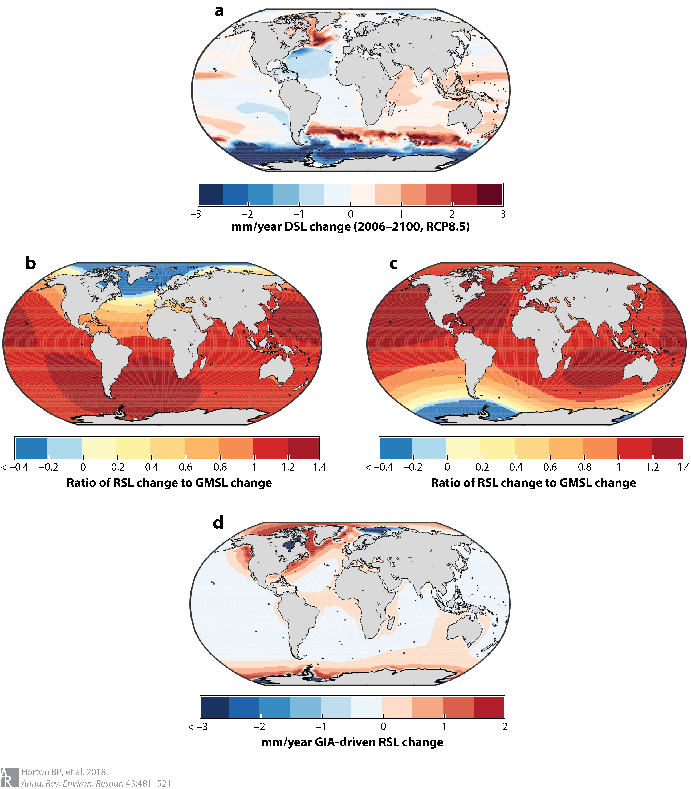
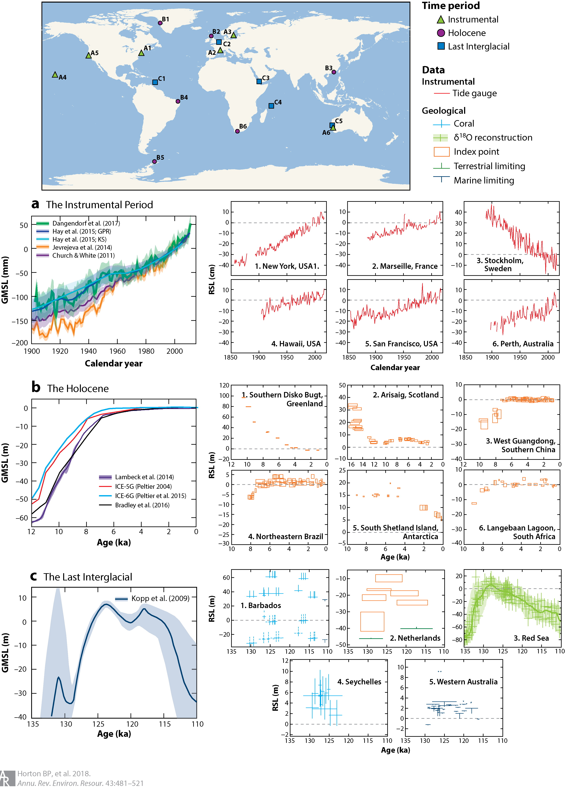
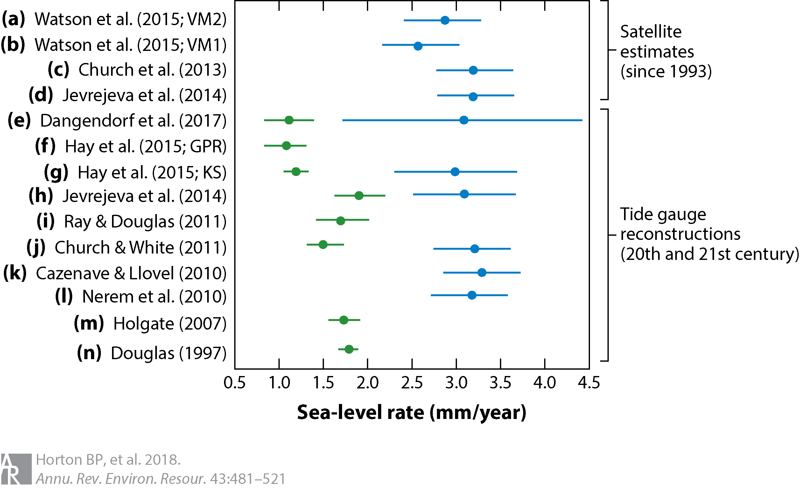
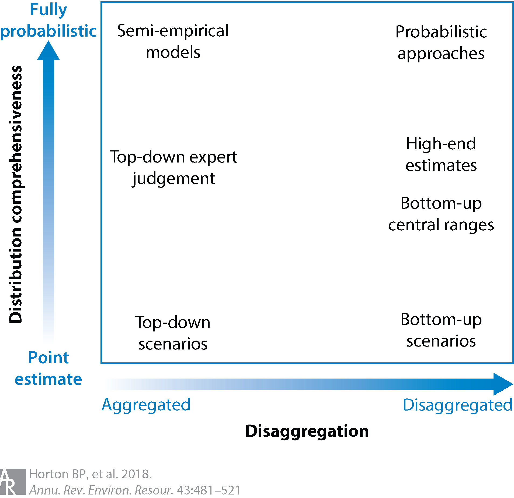
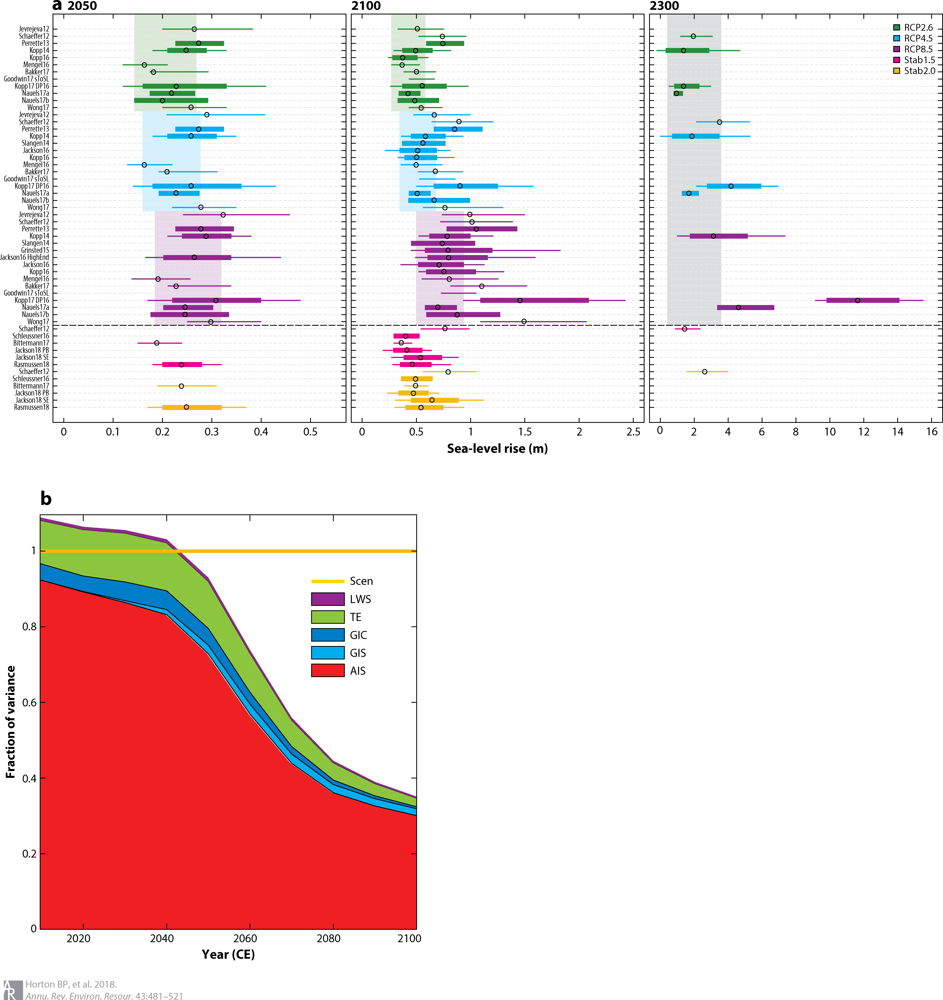
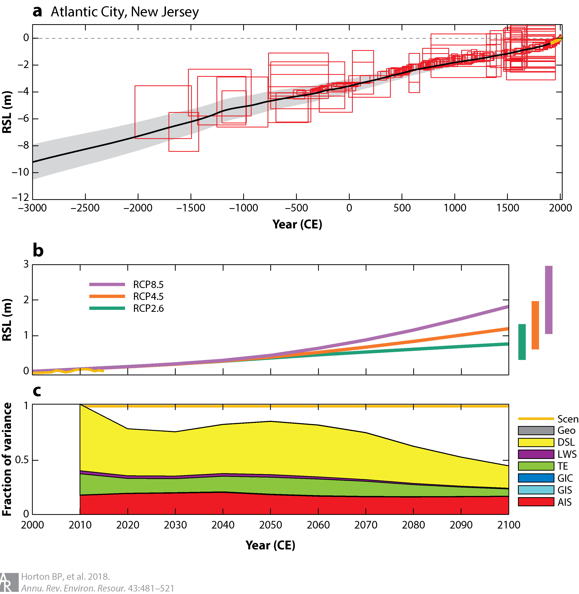
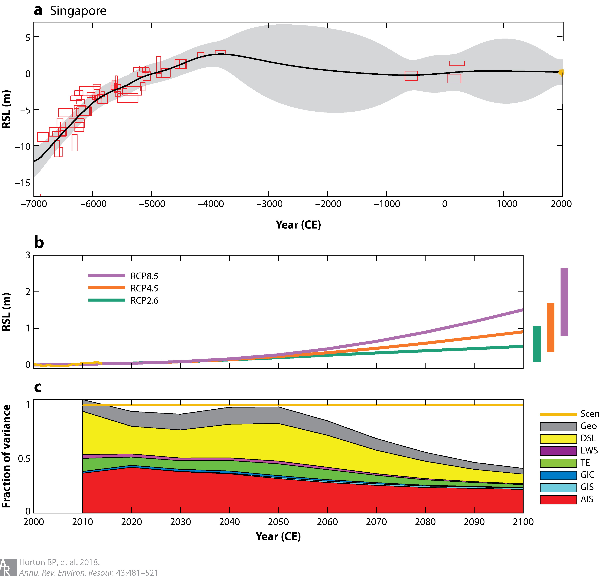

====================
Horton et al. (2018)
====================

:Title: Mapping Sea-Level Change in Time, Space, and Probability
      
:Keywords: sea level, climate change, Holocene, Last Interglacial, Mid-Pliocene Warm Period, sea-level rise projections

:Corresponding author: B. P. Horton

:Citation: Horton, B. P., Kopp, R. E., Garner, A. J., Hay, C. C., Khan, N. S., Roy, K., & Shaw, T. A. (2018). Mapping Sea-Level Change in Time, Space, and Probability. Annual Review of Environment and Resources, 43(1), 481–521. doi:10.1146/annurev-environ-102017-025826
           

Abstract
--------

Future sea-level rise generates hazards for coastal populations, economies, infrastructure, and ecosystems around the world. The projection of future sea-level rise relies on an accurate understanding of the mechanisms driving its complex spatio-temporal evolution, which must be founded on an understanding of its history. We review the current methodologies and data sources used to reconstruct the history of sea-level change over geological (Pliocene, Last Interglacial, and Holocene) and instrumental (tide-gauge and satellite altimetry) eras, and the tools used to project the future spatial and temporal evolution of sea level. We summarize the understanding of the future evolution of sea level over the near (through 2050), medium (2100), and long (post-2100) terms. Using case studies from Singapore and New Jersey, we illustrate the ways in which current methodologies and data sources can constrain future projections, and how accurate projections can motivate the development of new sea-level research questions across relevant timescales.

Introduction
------------

As recorded instrumentally and reconstructed from geological proxies, sea levels have risen and fallen throughout Earth's history, on timescales ranging from minutes to millions of years. Sea-level projections depend on establishing a robust relationship between sea level and climate forcing, but the vast majority of instrumental records contain less than 60 years of data, which are from the late twentieth and early twenty-first centuries (1-3). This brief instrumental period captures only a single climate mode of rising temperatures and sea level within a baseline state that is climatically mild by geological standards. Complementing the instrumental records, geological proxies provide valuable archives of the sea-level response to past climate variability, including periods of more extreme global mean surface temperature (e.g., 4-7). Ultimately, information from the geological record can help assess the relationship between sea level and climate change, providing a firmer basis for projecting the future (8), but current ties between past changes and future projections are often vague and heuristic. Greater interconnections between the two sub-disciplines are key to major progress.

The linked problems of characterizing past sea-level changes and projecting future sea-level rise face two fundamental challenges. First, regional and local sea-level changes vary substantially from the global mean (9). Understanding regional variability is critical to both interpreting records of past changes and generating local projections for effective coastal risk management (e.g., 9, 10). Second, uncertainty is pervasive in both records of past changes and in the physical and statistical modeling approaches used to project future changes (e.g., 11), and it requires careful quantification and statistical analysis (12). Quantification of uncertainty becomes particularly important for decision analysis related to future projections (e.g., 13).

Here, we review the mechanisms that drive spatial variability, as well as their contributions to the uncertainty in mapping sea level on different timescales. We describe methodologies and data sources for piecing together lines of evidence related to past and future sea level to map changes in space, time, and probability. We review the sources and statistical methods applied to proxy [Pliocene, Last Interglacial (LIG) and Holocene] and instrumental (tide gauges and satellites) data, and the statistical and physical modeling approaches used to project future sea-level changes. Finally, we highlight two case study regions - Singapore and New Jersey - to illustrate the way in which proxy and instrumental data can improve future projections, and conversely how future projections can guide the development of new sea-level research questions to further constrain projections.

Mechanisms for global, regional, and local relative sea-level changes
---------------------------------------------------------------------

Relative sea level (RSL) is defined as the difference in elevation between the sea surface and the land. Global mean sea level (GMSL) is defined as the areal mean of either RSL or sea-surface height over the global ocean. It is often approximated by taking various forms of weighted means of individual RSL records, sometimes with corrections for specific local processes. Over the twentieth century, GMSL trends (14) were dominated by increases in ocean mass due to melting of land-based glaciers (e.g., 15) and ice sheets (e.g., 16), and by thermal expansion of warming ocean water. Changes in land water storage due to dam construction and groundwater withdrawal also made a small contribution (e.g., 17). Over a variety of timescales, RSL differs from GMSL, because of key driving processes such as atmosphere/ocean dynamics, the static-equilibrium effects of ocean/cryosphere/hydrosphere mass redistribution on the height of the geoid and the EarthÕs surface, glacio-isostatic adjustment (GIA), sediment compaction, tectonics, and mantle dynamic topography (MDT). The driving processes are spatially variable and cause RSL change to vary in rate and magnitude among regions (Figure 1).

.. figure:: figures/horton18/fig01.jpeg
   :align: center
   :width: 50%

   Figure 1: Mapping uncertainty of sea-level drivers on different timescales based on available estimates. The length of colored bars along the x-axis represents the characteristic timescale over which a process may occur, rather than the total time duration over which the process has been active. The color scale represents the range in magnitude of relative sea-level change driven by a process over an event or observed/predicted timescale. It does not imply a specific relationship of the change in amplitude with timescale, given the nonlinear nature of many of these processes. The color scheme for glacial eustasy is also scaled to encompass predicted changes in global mean sea level of decimeters in the next several decades to meters over the next several centuries. (b) The uncertainty of instrumental and proxy recorders of sea level. The x (age) axis represents the time span over which the proxy may be used (given the temporal range of the dating method used to determine its age), rather than the proxy's temporal uncertainty. To estimate the contribution of a given process, the vertical and temporal resolution of a chosen instrument or proxy cannot exceed the magnitude and rate of sea-level change driven by that process.

Atmosphere/ocean dynamics are the dominant driver of spatial heterogeneity in RSL on annual and multidecadal timescales (18-21), as well as a significant driver on longer timescales during periods with limited land-ice changes, such as the Common Era (22-25). The highest rates of RSL rise over the past two decades (greater than 15 mm/year) have occurred in the western tropical PaciÞc (18, 26), although the pattern appears to have reversed since 2011 (27). Observations and numerical model simulations (18, 28) conÞrm that the intensification of trade winds, which occurs when the PaciÞc Decadal Oscillation (PDO) exhibits a negative trend, accounts for the amplitude and spatial pattern of RSL rise in the western tropical PaciÞc. In the western North Atlantic Ocean, changes in the strength and/or position of the Gulf Stream impact RSL trends differently north and south of North Carolina, where the Gulf Stream separates from the US Atlantic coast and turns toward northern Europe (19, 22, 23, 29). In fact, there is a .30-cm difference in sea-surface height between New Jersey and North Carolina (29). Climate models project that by the late twenty-Þrst century, associated with a decline in the Atlantic Meridional Overturning Circulation (AMOC), ocean dynamic sea-level rise of up to 0.2 to 0.3 m could occur along the western boundary of the North Atlantic (30). However, coastal ocean dynamic variability in the western North Atlantic has been largely driven over the past few decades by local winds, with limited evidence for coupling to AMOC strength (21, 31).

Gravitational, rotational, and elastic deformational effects - also called static-equilibrium effects - reshape sea level nearly instantaneously in response to the redistribution of mass be.tween the cryosphere, the ocean, and the terrestrial hydrosphere (32-35). These effects are linked to the change in self-gravitation of the ice sheets and liquid water, the response of the Earth's rotational vector to the redistribution of mass at the Earth's surface, and the elastic response of the solid Earth surface to changing surface loads (Figure 2b,c). Unique RSL change geometries, sometimes called "fingerprints," can be associated with the melting of different ice sheets and glaciers, and this response scales linearly with the magnitude of a marginal ice-mass change (32, 34). The dominant self-gravitation signal will result in a RSL fall near a shrinking land ice mass, which will be compensated by a RSL rise in the far Þeld that will be greater than the GMSL signal expected from the water mass inßux. The exact spatial pattern of RSL change depends on the geometry of the melting undergone by the ice reservoir. Recent studies (36, 37) have examined how mass loss centered in different portions of an ice sheet or glacial region will affect RSL differently. For example, New Jersey experiences a RSL fall in response to mass loss in southern.most Greenland, even though it experiences a modest (approximately 50% of the global mean) RSL rise in response to uniform melting across Greenland (Figure 2b).

   Figure 2: (a) Dynamic sea-level contribution to sea surface height (millimeter/year) from 2006-2100 under the RCP8.5 experiment of the Community Earth System Model, as archived by Coupled Model Intercomparison Project Phase 5 (30). Elastic fingerprints of projections of (b) Greenland ice-sheet mass loss and (c) West Antarctic ice-sheet mass loss, presented as ratios of RSL change to GMSL change (140). (d) Contribution of glacio-isostatic adjustment (GIA) to present-day relative sea level (RSL) change (millimeter/year), calculated using the ICE-5G ice loading history (52), combined with a maximum-likelihood solid-Earth model identified through a Kalman smoother tide-gauge analysis (119). ModiÞed from Kopp et al. (24).
  
:Pliocene: epoch in the geologic timescale that extends from 5.3 million to 1.8 million years ago, during which the Earth experienced a transition from relatively warm climates to the prevailing cooler climates of the Pleistocene; includes the Mid-Pliocene Warm Period (.3.2 to 3.0 million years ago), which is the most recent period in geologic time with temperatures comparable to those projected for the twenty-first century.

:Last Interglacial: the interglacial stage prior to the current Holocene interglacial (an interglacial is a geological interval of warmer global average temperature, characterized by the absence of large ice sheets in North America and Europe); the Last Interglacial extends from approximately 129,000 to 116,000 years ago, corresponds to Marine Isotope Stage5e and is also known as the Eemian.

:Holocene: current geological epoch, beginning approximately 11,650 years ago, after the last glacial period; the start of the Holocene is formally defined by chemical (\delta^{18}O) shifts in an ice core from northern Greenland that reflect climate warming.

:Relative sea level (RSL): height of the sea surface at a specific location, measured with respect to the height of the surface of the solid Earth.

:Dynamic sea level: sea-surface height variations produced by oceanic and atmospheric circulation and by temperature and salinity distributions.

:Global mean sea level (GMSL): areal average height of relative sea level (or, in some uses, sea-surface height) over the Earth's oceans combined; influenced primarily by the volume of seawater and the size and shape of the ocean basins; in the geological literature, GMSL is classically referred to as "eustatic sea level".

:Static-equilibrium effects: gravitational, elastic, and rotational effects of mass redistribution at the Earth surface, which lead to changes in both sea-surface height and the height of the solid Earth; these combined effects give rise to what are known as "sea-level fingerprints," or the geographic pattern of sea-level change following the rapid melting of ice sheets and glaciers.

Over longer timescales, GIA arises as the viscoelastic mantle responds to the transfer of mass between land-based ice sheets and the global ocean during a glacial cycle. GIA induces deformation of the solid Earth, as well as changes in the EarthÕs gravitational Þeld and its rotational state (38-43). After a change in surface load, the elastic component of the deformation is recovered nearly instantaneously, but the viscoelastic properties of the underlying mantle determine the characteristics of the recovery over longer timescales. In general, this recovery takes place over thousands of years, although in localized regions underlain by low-viscosity mantle, it can take place over decades to centuries (e.g., 44). On a global scale, at least in the Quaternary period, the system does not reach isostatic equilibrium, because it is interrupted by the initiation of another glacial cycle. The deformation that is observed today is the overprint of a series of glacial cycles that extend from the Pliocene through the Pleistocene glacial cycles and into the Holocene (7, 45, 46).

GIA models simulate the evolution of the solid Earth as a function of the rheological structure and ice-sheet history (42, 47, 48). During the glacial phase of a glaciation-deglaciation cycle, the depression of land beneath ice sheets causes a migration of mantle material away from ice-load centers. This migration results in the formation of a forebulge in regions adjacent to ice sheets (e.g., the mid-Atlantic coast of the United States). Following the ice-sheet retreat, mantle material flows toward the former load centers. These centers experience postglacial rebound, while the forebulge retreats and collapses. In regions located beneath the centers of Last Glacial Maximum ice sheets (e.g., Northern Canada and Fennoscandia), postglacial uplift has resulted in RSL records characterized by a continuous fall; rates of present-day uplift greater than 10 mm/year occur in these near-Þeld locations (42). In the former forebulges, land is subsiding at a rate that varies with distance from the former ice centers. Along the US Atlantic coast, rates of present-day subsidence reach a maximum amplitude of close to 2 mm/year (49). In regions distal from the former ice sheet, the GIA signal is much smaller (50). These regions are characterized by present-day GIA-induced rates of RSL change that are near constant or show a slight fall (<0.3 mm/year), due to hydro-isostatic loading (continental levering) and to a global fall in the ocean surface linked to the hydro-and glacio-isostatic loading of the bottom of the Earth's ocean basins (equatorial ocean syphoning) (Figure 2d, 51).

Global models of the GIA process have contributed to our knowledge of solid Earth geodynamics through the constraints they provide on the effective viscosity of the mantle. They also provide a means to constrain the evolution of land-based ice sheets and ocean bathymetry over a glacial cycle (e.g., 42, 52), which can in turn be used to provide boundary conditions for tests of global climate models under paleoclimate conditions (e.g., 53). Global GIA models have traditionally relied on a simple Maxwell representation of the EarthÕs rheology and on spherically symmetric models of the EarthÕs mantle viscosity. Research is currently underway to include complex rheologies and lateral heterogeneity in mantle viscosity in GIA models, features that may be of substantial importance in regions with a complex geological structure, such as West Antarctica (e.g., 44).

Locally, RSL can also change in response to sediment compaction driven by natural processes and by anthropogenic groundwater and hydrocarbon withdrawal (e.g., 54, 55). Many coastlines are located on plains composed of unconsolidated or loosely consolidated sediments, which com.pact under their own weight as the pressure of overlying sediments leads to a reduction in pore space (54, 56). Sediment compaction can occur over a range of depths and timescales. In the Mississippi Delta, Late Holocene subsidence due to shallow compaction has been estimated to be as high as 5 mm/year (57). Anthropogenic groundwater or hydrocarbon withdrawal can accelerate sediment compaction. For example, from 1958-2006 CE, subsidence in the Mississippi Delta was 7.6 ± 0.2 mm/year, with a peak rate of 9.8 ± 0.3 mm/year prior to 1991 that corresponded to the period of maximum oil extraction (58). Many other deltaic regions, including the Ganges, Chao Phraya, and Pasig Deltas, experience high rates of subsidence, linked to a combination of natural and anthropogenic sediment compaction, and they exhibit some of the highest rates of present-day RSL rise (59). Deeper, often poorly understood, processes also contribute to coastal subsidence, including thermal subsidence and fault motion (60).

On some coastlines, deformation caused by tectonics can be an important driver of RSL change. Indeed, reconstructions of RSL can be used to estimate the presence and rate of vertical land motion caused by coastal tectonics at regional spatial scales (e.g., 61). Coastlines may have near-instantaneous or gradual rates of uplift or subsidence due to coseismic movement associated with earthquakes or longer-term post-or interseismic deformation. Geodetic measurements of the 2011 Tohoku-oki and the 2004 Indian Ocean megathrust earthquakes revealed several meters of near-instantaneous coseismic vertical land motion (e.g., 62), which were followed by postseismic recovery that quickly exceeded the amount of coseismic change (63, 64). Based on a collection of bedrock thermochronometry measurements (65), gradual rates of vertical land motion from tectonics vary from <0.01 mm/year to 10 mm/year. Stable, cratonic regions (e.g., central and western Australia, central North America, and eastern Scandinavia) exhibit negligible vertical land motion rates of <0.01 mm/year. Rates are higher (0.01-0.1 mm/year) along passive margins (e.g., southeastern Australia, Brazil, and the US Atlantic coast) and the highest vertical land motion rates (1- 10 mm/year) are found in several tectonically active mountainous areas (e.g., the Coastal Mountains of British Columbia, Papua New Guinea, and the Himalayas). Most of these rate estimates are integrated over several millions to tens of millions of years [and may include influence from other low-frequency signals such as MDT or karstification (66)], and therefore have insufficient resolution to reveal temporal variations on shorter timescales (65).

A common approach to calculate long-term tectonic vertical land motion uses LIG shore.lines, often inappropriately assuming that, once tectonically corrected, the elevation of GMSL at the LIG was .5 m above present. However, when calculating long-term tectonics from LIG shorelines, uncertainty in LIG GMSL and departures from GMSL due to GIA in response to glacial-interglacial cycles and excess polar ice-sheet melt relative to present-day values must be considered (67, 68). Instrumental observations (e.g., global positioning system, interferometric synthetic-aperture radar) of vertical land motion can provide the resolution to decipher temporal variations in rates, although the observation period is too short to capture the full period over which these processes operate.

MDT refers to the surface undulations induced by mantle ßow (69, 70). One of the most important consequences of MDT studies is their influence on estimates of long-term GMSL and RSL change (69). Several geophysical approaches have been developed to model global and regional MDT. Husson & Conrad (71) proposed that the dynamic effect of longer-term (~10^8 years) change in tectonic velocities on GMSL could be up to ~80 m from a model based on boundary layer theory. Conrad & Husson (72) used a forward model of mantle flow based on the present-day mantle structure and plate motions to estimate that the current rate of GMSL rise induced by MDT is <1 m/million years. An increasing body of evidence suggests that MDT can contribute to regional RSL change at rates of >1 m/100 kyr (e.g., 73, 74). The uncertainties due to MDT in RSL reconstructions become increasingly large further back in time (73, 75). Observationally, MDT is essentially indistinguishable from long-term tectonic change.

:Glacial isostatic adjustment (GIA): response of the solid Earth to mass redistribution during a glacial cycle; isostasy refers to a concept whereby deformation takes place in an attempt to return the Earth to a state of equilibrium; GIA refers to isostatic deformation related to ice and water loading during a glacial cycle

:Sediment compaction: reduction in the volume of sediments caused by a decrease in pore space, which has the effect of lowering the height of the solid Earth surface; can occur naturally or due to the anthropogenic extraction of fluids (such as water and fossil fuels) from the pore space.

:Mantle dynamic topography (MDT): differences in the height of the surface of the solid Earth caused by density-driven flow within the Earth's mantle.

Past and current observations of sea-level change
-------------------------------------------------

Reconstructions of Relative Sea Levels from Proxy Data
~~~~~~~~~~~~~~~~~~~~~~~~~~~~~~~~~~~~~~~~~~~~~~~~~~~~~~

Geological reconstructions of RSL are derived from sea-level proxies, the formation of which was controlled by the past position of sea level (76). Sea-level proxies, which have a systematic and qunatifiable relationship with contemporary tides (77), include sedimentary, geomorphic, archeological, and fixed biological indicators, as well as coral reefs, coral microatolls, salt-marsh flora, and salt-marsh fauna (Figure 1b). The relationship of a proxy to sea level is deÞned by its "indicative meaning," which describes the central tendency (reference water level) and vertical range (indicative range) of its relationship with tidal level(s).

Under the uniformitarian assumption that the indicative meaning is constant in time, the indicative meaning can be determined empirically by direct measurement of modern analogs. The reconstruction begins with Þeld measurement of the elevation of a paleo sea-level proxy with respect to a common datum (e.g., mean tide level). The vertical uncertainty of a RSL reconstruction is primarily related to the indicative range of the sea-level proxy (Figure 1b). For proxies that form in intertidal settings, including most sedimentary, fixed biological, and geomorphic indicators, vertical uncertainties are proportional to the magnitude of local tidal range. In contrast, the vertical distribution of corals varies among species and is driven by light attenuation, along with a host of other factors (78). Although vertical RSL uncertainties are not systematically larger for older reconstructions, paleo-tidal range change (see, e.g., 79) or variations in the relationship of a proxy to sea level over time may introduce unquantifiable uncertainties.

Paleo sea-level proxies are dated to provide a chronology for past RSL changes. The method used to date a proxy dictates the age range over which it may be used (Figure 1b). Sea-level proxies can be dated directly using radiometric methods. Radiocarbon dating is used to obtain chronologies over decades to the last .50,000 years, whereas methods such as U-series or luminescence dating can be used over hundreds of thousands of years (80). Sea-level proxies may also be dated by correlation with marine oxygen isotope stages, magnetic reversals, or other chronologies using bio-or chemostratigraphy. The age uncertainties of RSL reconstructions increase over time (e.g., 8, 68).

Three geological intervals have been the particular focus of attention for sea-level reconstructions, because they provide analogues for future predicted changes: the Mid-Pliocene Warm Period (MPWP), the LIG stage, and the Holocene.

:Sea-level proxy: any physical, biological, or chemical feature with a systematic and quantifiable relationship to sea level at its time of formation.

Mid-Pliocene Warm Period (~3.2 to 3.0 million years ago)
********************************************************

The MPWP is the most recent period in geologic time with temperatures comparable to those projected for the twenty-first century (e.g., 81). The period is characterized by a series of 41-kyr, orbitally paced climate cycles marked by three abrupt shifts in the stacked oxygen isotope record (82, 83). During this time, atmospheric CO2 ranged between approximately 350 and 450 ppm, and the configuration of oceans and continents was similar to todayÕs, which permits feasible comparison of oceanic and atmospheric conditions in models of Pliocene and modern climate (84, 85). Global climate model simulations estimate peak global mean surface temperatures between 1.9-3.6 C above preindustrial (86).

Both modeling and field evidence suggest that polar ice sheets were smaller during the MPWP, but constraints on the magnitude of GMSL maxima are highly uncertain. Early reconstructions of Pliocene sea levels have been derived from estimates of global ice volume from the temperature-corrected oxygen isotope composition of foraminifera and ostracods (e.g., 87), although the analytical uncertainties (~±10 m) and the uncertainties associated with separating the ice volume, temperature, and diagenetic signals may be greater than the estimated magnitude of GMSL change from the present (8). Therefore, attention has focused on geomorphic proxy reconstructions from paleoshoreline deposits (e.g., 88, 89) or erosional features caused by sea-level fluctuations such as disconformities on atolls (e.g., 90). Estimating GMSL during the Pliocene is complicated by the amount of time elapsed since the formation of sea-level proxies, which allows processes operating over long timescales, such as tectonic uplift or MDT, to create differences between RSL and GMSL of up to tens of meters (e.g., 74). The uncertain contribution of RSL change from MDT makes reconstructions from this period highly challenging, although increasing the number and spatial distribution of RSL reconstructions from the Pliocene may help to derive a GMSL estimate consistent with model predictions of GIA and MDT that use a unique and internally consistent set of physical conditions (7).

Last Interglacial (~129,000-116,000 years ago)
**********************************************

During the LIG, global mean surface temperature was comparable to or slightly warmer than present, although the peak LIG CO2 concentration of .285 ppm (e.g., 91) was considerably less than that of the present (.400 ppm). Global mean sea-surface temperature was .0.5 ± 0.3.C above its late nineteenth-century level (92). Model simulations indicate little global mean surface temperature change during the Last Inter.glacial stage, whereas combined land and ocean proxy data imply .1.C of warming, but with possible spatio-temporal sampling biases (93). Due to higher orbital eccentricity during the LIG, polar warming was more extreme (94). Greenland surface temperatures peaked .5-8.C above preindustrial levels (95), and Antarctic temperatures were .3-5.C warmer (96), both comparable to late twenty-first-century projections under Representative Concentration Pathway (RCP) 8.5 (97).

LIG RSL reconstructions are much more abundant than those for the MPWP (e.g., 4, 6, 68, 78, 98; see also Figure 3c). Geomorphic (marine terraces, shore platforms, beachrock, beach deposits and ridges, abrasion and tidal notches, and cheniers), sedimentary (lagoonal deposits), coral reef, and geochemical sea-level proxies are used to reconstruct RSL changes during this period (e.g., 68). Compilations of RSL data combined with spatio-temporal statistical and GIA modeling indicate that peak GMSL was extremely likely >6 m but unlikely >9 m above present (6, 99). These estimates are in agreement with site-speciÞc, GIA-corrected coastal records in the Seychelles at 7.6 ± 1.7 m (4) and in Western Australia at 9 m (100) above present (Figure 3c).

GMSL during the LIG may have experienced multiple peaks, possibly associated with orbitally driven, asynchronous land-ice minima at the two poles (e.g., 8, 99). A significant fraction of the Greenland ice sheet remained intact throughout the LIG period, with recent alternative reconstructions limiting the peak Greenland GMSL contribution to .2 m (95) or 4-6 m (101) of the ice sheetÕs total 7-m sea-level equivalent mass. Thermal expansion and the melting of mountain glaciers together likely contributed .1 m (102, 103). This implies a significant contribution to LIG GMSL from Antarctic ice melt. However, there is little direct observational evidence of mass loss from the Antarctic region. Additional constraints from RSL reconstructions in mid-to high-latitude regions may help to partition contributions from Greenland and Antarctica (104).

Estimates of LIG GMSL have not yet incorporated the effects of MDT, which may contribute as much as 4 ± 7m(1.) to RSL change in some regions (e.g., Southwestern Australia) (73). In contrast to MPWP, the magnitudes of RSL change due to GIA and MDT are roughly the same order, although the spatial pattern associated with the two processes should be distinct (e.g., 4, 73). Whether a formal accounting for MDT would significantly alter the estimated height of the LIG highstand is unknown.

:Representative Concentration Pathway (RCP): one of a set of four standardized pathways, developed by the global climate modeling and integrated assessment modeling communities, describing possible future pathways of climate forcing over the twenty-first century; Extended Concentration Pathways extended the RCPs to the end of the twenty-third century

   Figure 3: Reconstructions of global mean sea level (GMSL) and relative sea level (RSL) (6, 25, 119) from (a) the instrumental period, (b)the Holocene, and (c) the Last Interglacial. (a) GMSL estimates during the Instrumental Period from Dangendorf et al. (2017) (118) (green), Hay et al. (2015; Gaussian process regression (GPR)) (119) (dark blue), Hay et al. (2015; Kalman smoothing (KS)) (119) (light blue), Jevrejeva et al. (2014) (117) (orange), and Church & White (2011) (116) (purple), as well as individual RSL records from tide gauges obtained from the Permanent Service for Mean Sea Level (PSMSL). (b) GMSL (and sea-level equivalent signal) derived from far-field data (purple: Lambeck et al. (2014) (46), with 2-sigma uncertainty range) and from GIA models [ICE-5G (Peltier 2004) (52) (red); ICE-6G (Peltier et al. 2015) (42) (blue); Bradley et al. 2016 (111) (black)]. RSL data from Southern Disko Bugt (175, 176); Arisaig, Scotland (177); West Guangdong, southern China (178); Northeastern Brazil (179); South Shetland Island, Antarctica (180); and Langebaan Lagoon, South Africa (181). (c) GMSL estimate from Kopp et al. (6) and RSL reconstructions from Barbados (182-192) interpreted using coral depth distributions presented in Hibbert et al. (78), the Netherlands (193) as interpreted by Kopp et al. (6), the Red Sea continuous delta-18O record (green crosses) with probabilistic model and 95% confidence interval shown (green shading) (194), the Seychelles (195), and Western Australia (100, 196-206) where coral data are interpreted as a lower limit on RSL. Unless otherwise indicated, model uncertainties are 1-sigma, whereas data uncertainties are 2-sigma. Error bars cross at the median of the vertical probability distribution and midpoint of the age distribution of each data point. U-series data are screened following guidelines presented in Hibbert et al. (2016) (78) or Dutton et al. (2015) (195). With the exception of the Red Sea dataset, RSL reconstructions have not been corrected for tectonic motion. To demonstrate the potential inßuence of tectonics on RSL reconstructions, we plot data from Barbados (C1) using uncorrected elevations (solid lines) and elevations corrected for tectonic uplift (dashed lines).

The Holocene (11,700 years ago to present)
******************************************

A global temperature reconstruction for the early to middle Holocene (from ~9.5-5.5 ka), derived from both marine and terrestrial proxies, suggests a global mean surface temperature ~0.8C higher than preindustrial temperatures (105). This estimate, however, conflicts with climate models that simulate a warming trend through the Holocene. The discrepancy may be due to uncertainties in both the seasonality of proxy reconstructions and the sensitivity of climate models to orbital forcing (106). Recent evidence suggests that estimates of global temperatures may be biased by sub-seasonal sensitivity of marine and coastal temperature estimates from the North Atlantic, with pollen records from North America and Europe instead suggesting a later period of peak warmth from .5.5-3.5 ka and temperatures .0.6.C warmer than the late nineteenth century (107).

The Holocene has more abundant and highly resolved RSL reconstructions than previous interglacial periods (Figure 3b, 45). These reconstructions are sourced from sedimentary (wet.land, deltaic, estuarine, lagoonal facies), geomorphic (beachrock, tidal and abrasional notches), archaeological, coral reef, coral microatoll, and other biological sea-level proxies. The abundance of RSL data from this period, combined with the preservation of near-Þeld glacial deposits, has contributed to the development of a relatively well-constrained history of ice-sheet retreat, particularly in the Northern Hemisphere (108). However, questions remain about Antarctic and Greenland contributions to GMSL (e.g., 109, 110), the timing of when (prior to the twentieth century rise) land-ice contributions to GMSL ceased (e.g., 46, 111, 112), and the magnitude and timescale of internal variability in glaciers, ice sheets, and the ocean.

Given the resolution of Holocene data, detailed sea-level reconstructions from this period are important for constraining local to regional processes and providing estimates of rates of change. GIA is the dominant process driving spatial variability during the Holocene (45). Records from locations formerly covered by ice sheets (near-field regions such as Antarctica, Greenland, Canada, Sweden, and Scotland) reveal a complex pattern of RSL fall from a maximum marine limit due to the net effect of inputs from melting of land-based ice sheets and glacio-isostatic uplift. Rates of RSL fall in near-field regions during the early Holocene were up to -69 ± 9 m/ka (45). Regions near the periphery of ice sheets (intermediate-field locations such as the mid-Atlantic and Pacific coasts of the United States, and northwestern Europe and the Caribbean) display fast rates of RSL rise (up to 10 ± 1 m/ka) in the early Holocene in regions near the center of forebulge collapse. Regions far from ice sheets exhibit a mid-Holocene highstand, the timing (between 8 and 4 ka) and magnitude (between <1 and 6 m) of which vary among South American, African, Asian, and Oceania regions. With diminishing contributions from GIA and melting of land-based ice sheets during the past several millennia, lower amplitude local-to regional-scale processes, such as steric effects or ocean dynamics, are manifested in RSL records (22).

Although the past two millennia (the Common Era) may not be a direct analog for future changes, semi-empirical relationships between high-resolution RSL reconstruction can be paired with temperature reconstructions (e.g., 113) that show periods of both warming (e.g., Medieval Climate Anomaly) and cooling (e.g., Little Ice Age) to show climate forcing on timescales (multi.decadal to multicentennial) and magnitudes relevant to future climate and sea-level scenarios (e.g., 25). The more complete geologic record in the Common Era permits the reconstruction of continuous time series of decimeter-scale RSL change over this period using salt-marsh sequences and coral microatolls (5). The resolution of reconstructions is comparable to future sea-level changes over the next decades to centuries, which enables an examination of regional dynamic variability in sea level that is not possible for earlier periods (24). In addition, the GIA signal is approximately linear over the Common Era and, therefore, it is easier to quantify its contribution to RSL.

:Tide gauge: device for measuring the height of the sea surface with respect to a reference height fixed to the solid Earth.

Reconstructions of Relative Sea Level from Instrumental Data
~~~~~~~~~~~~~~~~~~~~~~~~~~~~~~~~~~~~~~~~~~~~~~~~~~~~~~~~~~~~

Tide-gauge measurements of RSL date back to at least the eighteenth century, with archived records available for Amsterdam beginning in 1700, Liverpool beginning in 1768, and Stockholm beginning in 1774 (114). Originally put in place to monitor tides for shipping purposes, most of the earliest records are located in northern Europe and along the coasts of North America, and many contain persistent data gaps through time. It was not until the mid-twentieth century that most of the current tide-gauge network, which includes tide gauges in the Southern Hemisphere and the Arctic Ocean, became operational (115). Contained in each tide-gauge record is the combined effect of local, regional, and global sea-level processes that take place over timescales ranging from minutes to centuries. The Permanent Service for Mean Sea Level compiles the worldÕs tide-gauge records into two databases: raw unprocessed time series are contained in the metric database; and the revised local reference database contains the time series referenced to a common datum (1).

Today, sea levels are on a long-term rising trend along a large majority of coastlines (Figure 3a; see also 26, 115, 116). Rates of RSL change derived from tide-gauge data varied both spatially and temporally during the twentieth century, and decadal rates of GMSL rise show large variations throughout this period (116). Dense tide-gauge records along the US Atlantic coast have resulted in numerous studies that show rates of RSL rise exceeding GMSL rise. This sea-level rise has been attributed to the combination of GIA, ocean dynamics, and land-based ice melt (20, 49). Tide-gauge records from Alaska, northern Canada, and Fennoscandia illustrate the impact of GIA on local and regional sea level (Figure 3b). These regions, which were covered by ice during the Last Glacial Maximum, are experiencing RSL changes that are dominated by ongoing postglacial rebound of the solid Earth. As the land uplifts at rates >10 mm/year, the result is a RSL fall (48).

Given the regional variability in sea level, and the spatio-temporal sparsity of the tide-gauge network, inferring GMSL over the nineteenth and twentieth centuries is a difficult task. The first attempts to compute GMSL involved regional averaging of small subsets of tide gauges (2). The tide gauges included in these subsets had to satisfy multiple criteria, including being located far from regions experiencing significant sea-level changes due to GIA and having at least 60 years of observations with minimal data gaps. Resulting subsets ranged from 9 to 22 sites and estimates of GMSL fall in the range of 1.7-1.8 mm/year. Extending the simple regional averaging technique, Jevrejeva et al. (115, 117) used a "virtual station" approach that sequentially averages pairs of tide gauges to produce a single virtual tide gauge in each region. This approach, with a GMSL estimate over the twentieth century of 1.9 ± 0.3 mm/year and 3.1 ± 0.6 mm/year over 1993-2009 (Figure 4), produces a more robust estimate of the uncertainty than the simple averaging technique by better addressing the spatial sparsity in the tide-gauge network. More recently, Dangendorf et al. (118) extended the virtual station approach. They simulated local geoid changes and observations of vertical land motion to correct the tide gauges for local sea level effects, resulting in a 1901-1990 GMSL estimate of 1.1 ± 0.3 mm/year and a 1993-2012 estimate of 3.1 ± 1.4 mm/year.

   Figure 4: Rates of sea-level rise, and the 1-\sigma uncertainty range, over the twentieth century (green dots) and over the satellite altimetry era (blue dots) derived from tide-gauge and satellite altimetry observations. The time windows for reach reconstruction are as follows: (a) 1993-2014 (VM2; 127); (b) 1993-2014 (VM1; 127);(c) 1993-2010 (125); (d) 1993-2009 (117); (e) 1901-1990, 1993-2012 (118); ( f ) 1901-1990 (GPR; 119); (g) 1901-1990, 1993-2010 (KS; 119); (h) 1900-1999, 1993-2009 (117); (i) 1900-2009 (121); ( j) 1901-1990, 1993-2009 (116); (k) 1992-2010 (120); (l) 1993-2010 (26); (m) 1904-2003 (3); (n) 1880-1990 (207).

Tackling the problem of spatio-temporal sparsity differently, Hay et al. (119) combined the tide-gauge records with process-based models of the underlying physics driving global and regional sea-level change using two techniques: a multi-model Kalman smoother and Gaussian process regression. These two methodologies estimate GMSL by first estimating, from the tide-gauge record, the magnitudes of the individual processes contributing to local and global sea level, then summing the individual contributors to produce GMSL estimates. During 1901-1990, the Kalman smoother and Gaussian process regression techniques produced GMSL rise estimates of 1.2 ± 0.2 mm/year and 1.1 ± 0.4 mm/year, respectively. During the altimetry era, from 1993-2010, the Kalman smoother technique estimates that GMSL rose at 3.0 ± 0.7 mm/year (Figure 4).

:Satellite altimetry: measurement of the height of the sea surface through satellite-based techniques such as radar altimetry.

Since 1993, the long but incomplete tide-gauge record has been supplemented with near-global satellite altimetry observations. Satellite altimeter missions have provided maps of absolute sea level every 10 days within approximately ± 66o, permitting changes in the sea surface to be determined for the majority of the world ocean (120). Unlike tide gauges, which are inherently only located along the worldÕs coastlines, satellite altimetry observations have provided new insight into previously unobserved ocean basins. The combination of tide gauge and altimetry observations has the potential to shed new insights on both GMSL and RSL; however, combining these two data sources is also not a simple task. For example, coastal processes and vertical land motion, which are not observed by satellite altimeters, can be the dominant processes captured in tide-gauge records.

Accurately characterizing and separating sea-level noise from sea-level signal is an ongoing challenge (116, 121). In empirical orthogonal function approaches, satellite altimetry observations are used to determine the dominant global patterns of sea surface height change over the past .25 years. The magnitudes of these patterns are then constrained over the twentieth century with the tide-gauge observations. GMSL estimates using this technique for 1901-1990 are approximately 1.5 ± 0.2 mm/year (116), whereas over the longer time period of 1900-2009, GMSL estimates increase to 1.7 ± 0.2 mm/year (Figure 4, 116, 121). It is a matter for debate as to whether the observed dominant short-term patterns of variability over the satellite era are the most appropriate ones to characterize patterns of long-term variability over the tide-gauge era (122).

As the satellite altimetry record length grows, so does the satellite-derived time series of (near) global mean sea surface height (123, 124). These estimates of 2.6-3.2 mm/year (125-127) are obtained by computing area weighted averages of the near global sea surface height fields. It is now possible to use the 25-year altimetry record to estimate the acceleration in GMSL since 1993. This acceleration of 0.084 ± 0.025 mm/year^2 (128) represents a starting point for putting recent GMSL estimates into historical context. Developing new statistically robust methodologies to combine the satellite altimetry data with the tide gauge observations is an important and daunting task, and it is necessary in order to quantify local and regional accelerations over the twentieth century.

Attribution of Twentieth-Century Global Mean Sea-Level Change
~~~~~~~~~~~~~~~~~~~~~~~~~~~~~~~~~~~~~~~~~~~~~~~~~~~~~~~~~~~~~

Attribution studies focus on the extent to which twentieth (and early twenty-first) century GMSL can be affirmatively tied to the effects of human-caused warming (129). These studiesÑrelying on a variety of both physical modeling and statistical techniquesÑgenerally agree that a large portion of the twentieth-century rise, including most GMSL rise over the past quarter of the twentieth century, is tied to anthropogenic warming (25, 130-132).

For example, Slangen et al. (132) used a suite of physical models of global climate and land-ice surface mass balance, together with correction terms for omitted factors, to compare GMSL with and without natural forcing. They found that natural forcing could account for approximately 50% of the modeled historical GMSL change from 1900-2005, and only approximately 10% of modeled historical GMSL change from 1970-2005. Kopp et al. (25) calibrated a statistical model to the relationship between temperature and rate of sea-level change over the past two millennia, and found thatÑhad the twentieth-century global mean surface temperature been the same as the average over 500-1800 CEÑtwentieth-century GMSL rise would have been approximately 35% (90% probable range: .13 to +59%) of its instrumental value.

Projections of future sea-level rise
------------------------------------

Our knowledge of past and present changes in sea level can help us understand and predict its future evolution. Methods used to project sea-level changes in the future can be categorized along two basic axes: (1) the degree to which they disaggregate the different drivers of sea-level change, and (2) the extent to which they attempt to characterize probabilities of future outcomes (Figure 5). The former axis separates projections that tabulate individual processes - including projections focused on central ranges, scenarios attempting to assess upper bounds of plausible sea-level rise, and probabilistic bottom-up projections - from semi-empirical approaches based on global climate and sea-level statistics, as well as some expert judgement-based approaches. The latter axis separates approaches focused on assessing either central or extreme outcomes from fully probabilistic approaches.

   Figure 5: Taxonomy of sea-level rise projections methods. The horizontal axis separates methods based on the degree to which they disaggregate the different drivers of sea-level change. The vertical axis separates methods based on the extent to which they attempt to characterize probabilities of future outcomes.

Sea-level rise projections published in the past several years have largely been conditional on different RCPs (133). The RCPs represent a range of possible future climate forcing path.ways, including a high-emission pathway with continued growth of CO2 emissions (RCP8.5), a moderate-emission pathway with stabilized emissions (RCP4.5), and a low-emission pathway consistent with the Paris AgreementÕs goal (134) of net-zero CO2 emissions in the second half of this century (RCP2.6). The use of the RCPs enables comparisons among projections from different studies and different methods (135-142).

Bottom-Up Approaches
~~~~~~~~~~~~~~~~~~~~

Most projections are based on a bottom-up accounting of contributions from different driving factors of global and regional sea-level change. Estimates of different contributing factors may be based on a quantitative or semi-quantitative literature meta-analysis. For example, climate models such as those included in the Coupled Model Intercomparison Projection Phase 5 are often used to inform projections of thermal expansion and dynamic sea-level change as well as to drive models of glacier surface mass balance. Alternatively, estimates of factors that contribute to sea-level rise may also be based on the output of a single model study of complex processes such as marine-ice sheet dynamics [e.g., the use of DeConto & Pollard (143) in Kopp et al. (144)] or on simpliÞed models that capture the core dynamics of a process such as ocean heat uptake in response to climate forcing (135, 142). Estimates of sea-level contributions may also be based on heuristic judgements, for example, of the plausible acceleration of ice ßow through outlet glaciers (145).

Central-range estimates
***********************

In the literature, many bottom-up estimates focus on characterizing central ranges for key contributing factors, deÞned by a median, a single low quantile, and a single high quantile (e.g., 146, 147), typically the 17th and 83rd or 5th and 95th percentile values.

High-end estimates
******************

High-end (sometimes referred to as "worst-case") bottom-up estimates complement central-range estimates. Pfeffer et al. (145) constructed a high-end (2.0 m GMSL rise by 2100) sea-level rise scenario based on plausible accelerations of Greenland ice discharge, determined partially by the fastest local, annual rates of ice-sheet discharge currently observed. This estimate has subsequently been debated, and additional contributions from thermal expansion [based on an Earth system model (148)], groundwater discharge, and Antarctica (e.g., 55) have been suggested, raising the high-end projection to .2.6 m. Furthermore, the highest among DeConto & PollardÕs (143) ensemble of Antarctic simulations exceeded 1.7 m of sea-level rise from Antarctica alone in 2100 under RCP8.5, suggesting that high-end outcomes well in excess of 3 m of GMSL rise by 2100 cannot be excluded under RCP8.5.

Probabilistic approaches
************************

Probabilistic approaches build on both the central range and high-end approaches, aiming to estimate a single, comprehensive probability distribution of sea-level rise from a bottom-up accounting of different components. The relationship between central range projections and probabilistic projections can be relatively straightforward. The central range projections are often presented with 1 or 2. putative standard errors (e.g., 147), which have a natural probabilistic interpretation if a particular distributional form is assumed. The relationship between high-end estimates and probabilistic projections is interpreted in a broader variety of ways. For example, Kopp et al. (140) highlighted the agreement between the 99.9th percentile of their RCP8.5 GMSL projection (2.5 m) and other high-end estimates, whereas Jevrejeva et al. (126) used the 95th percentile of an RCP8.5 projection (1.8 m) as an upper limit.

The first published probabilistic GMSL projections were developed by Titus & Narayanan (149) for the US Environmental Protection Agency, based on a suite of coupled simple physical models with parameters informed by structured expert elicitation. Probabilistic approaches experienced a resurgence in the past half-decade, in part because of concerns regarding the adequacy of communication about high-end uncertainty in IPCC AR5 sea-level projections (126, 137, 138, 140). Probabilistic studies have been largely constrained to use the climate scenarios run by large model intercomparison projects. However, some more recent probabilistic studies rely on simple coupled models of different components, allowing for more flexible simulations (135, 136, 141, 142, 150).

Top-Down Approaches
~~~~~~~~~~~~~~~~~~~

Top-down approaches for estimating GMSL focus on comprehensive metrics of change, rather than a bottom-up accounting of individual driving factors. Most top-down studies are semi-empirical in nature.

Semi-empirical approaches
*************************

Semi-empirical approaches rely on historical statistical relationships between GMSL change and driving factors such as temperature. One of the earliest GMSL projections (151) used such a relationship, fitting approximated GMSL as a lagged linear function of global mean surface temperature; their relationship (roughly 16 cm/ûC) would yield a likely twenty-first century GMSL rise of approximately 0.2-0.3 m under RCP2.6, and 0.4-0.8 m under RCP8.5. They noted, however, the potential for rapid loss of marine-based ice in Antarctica to raise their projections significantly. This particular study did not formally account for uncertainty in the relationship between temperature and sea level, and thus would fall at the lower end of our probabilistic axis. However, uncertainty analysis is straightforward with simple parametric approaches, and subsequent semi-empirical studies have generally been highly probabilistic.

The current generation of semi-empirical approaches began with Rahmstorf (152), who fitted the historical rate of GMSL change as a function of temperature disequilibrium. Combining a semi-empirical approach that includes uncertainty estimates on key parameters with probabilistic projections of the global mean surface temperature response to different forcing scenarios can yield formally complete probability distributions of future GMSL rise. Such projections are, however, sensitive to the choice of calibration data setÑan additional level of uncertainty not typically formally quantified within a single studyÑpreventing a formal probabilistic evaluation. These choices can have a significant impact. For example, Kopp et al. (144), using a calibration based on reconstructions of temperature and GMSL over the past two millennia, project a rise of 0.3-0.9 m (at the 90% confidence level) over the twenty-first century under RCP4.5, whereas Schaeffer et al. (153), using a calibration based on a single geological reconstruction from North Carolina (5), project 0.6-1.2 m.

Expert judgement
****************

In the course of scientific practice, experts integrate many streams of information to revise their assessments of the world and the way it behaves; Bayes' theorem, as used in formal statistical analyses, is a formalization of this process. On some level, all projections of future change are based on expert judgement, frequently expressed within the deliberative context of a scientific publication or assessment panel.

A variety of approaches - some relatively informal, others based on more rigorous social scientific practices - use this integration process executed by individuals as an object of study in its own right, and extract from it estimates of the likelihood of different future outcomes. In the sea-level realm, structured expert elicitationÑa formal method in which experts are guided in the interpretation of probabilities in a workshop setting before having their responses weighted based on their performance on calibration questionsÑhas been used to assess the probability distribution of future ice-sheet changes (154). Less structured, more informal expert surveys have also been used to assess the response of GMSL as a whole to different forcing scenarios (155).

Methods of Using Sea-Level Rise Projections
~~~~~~~~~~~~~~~~~~~~~~~~~~~~~~~~~~~~~~~~~~~

The approaches described above are "science-first" approaches Ñ focused on integrating a variety of lines of information to produce a scientific judgement about future global and/or regional sea-level changes. These approaches are not generally designed to produce projections that can be directly used in a decision process. Yet, in the absence of ongoing dialogue between scientists and decision makers, this distinction can give rise to confusion. For example, approaches focused exclusively on central ranges omit information about high-end outcomes that can be crucial for risk management, whereas approaches focused exclusively on high-end estimates could lead to excessively costly and overly cautious decisions. Bottom-up probabilistic approaches and semi-empirical approaches can provide self-consistent information about both central tendencies and high-end outcomes, but relying on results from a single estimated probability distribution can mask ambiguity and potentially provide a false sense of security about the (un)likelihood of extreme outcomes (156). Caveats expressed in primary scientific literature are frequently lost in the translation to assessment reports.

Scenario approaches
*******************

One approach to dealing with these challenges is to use the underlying scientific literature - drawing on multiple methodologies - to develop scenarios against which decisions can be tested. For example, the National Research Council defined a range of heuristically motivated "plausible variations in GMSL rise," spanning 50-150 cm between the 1980s and 2100, which they recommended be used for engineering sensitivity analyses (157). In some contexts, such scenario-based projections are categorized together with scientific projections. We argue that this is a categorization error: Discrete scenarios for decision analysis can be scientifically justified only when based on projections developed using the suite of scientific approaches discussed above.

Probabilistic approaches and deep uncertainty
*********************************************

One motivation for developing complete probability distributions for future sea-level rise is their direct utility in specific decision frameworks. For example, beneÞt-cost analyses employ probability distributions of future change as an input; probabilistic projections are thus crucial for assessing metrics such as the social cost of greenhouse gas emissions (e.g., 158). Similarly, probability distributions of future sea-level rise can be combined with probability distributions of future storm tides to estimate future flood prob.abilities (e.g., 159, 160). However, some decision makers have expressed confusion regarding the distinction between Bayesian probabilities of future changes and historical, frequentist probability distributions for variables such as storm tides in a stationary climate. Although the reality of climate change means that no probability distribution can be truly based on the assumption of stationarity, the familiarity of such assumptions can mask deep uncertainty and lead to overconfidence (156).

Sea-level rise projections, particularly for the second half of this century and beyond, exhibit ambiguity. Projections have no uniquely specifiable probability distribution, and different approaches yield distributions that differ considerably. The Þeld of decision making under un.certainty has developed several approaches to cope with ambiguity (e.g., 161). Some approaches rely on employing multiple probability distributions, which can reveal the robustness (or lack thereof ) of a probability-based judgement to the underlying uncertainty in scientific knowledge that may not be captured within a single probability distribution. Possibility theory (162) provides one approach for combining multiple lines of evidence to produce a "probability box" that bounds the upper and lower limits of different quantiles of a probability distribution, revealing areas of relatively low and relatively high ambiguity. We apply a simpler but related approach below, summarizing literature projections for different scenarios in "very likely" ranges that are constructed from the minima of 5th-percentile projections and maxima of 95th-percentile projections.

:Deep uncertainty: also known as ambiguity or Knightian uncertainty; describes uncertainties for which it is not possible to develop a single, well-characterized probability distribution

Sea-Level Rise Projections
~~~~~~~~~~~~~~~~~~~~~~~~~~

We summarize recent literature projections of GMSL rise for 2050, 2100, 2150, and 2300, as well as recent studies on multi-millennial sea-level rise commitments (Table 1, Figure 6a). Most of these studies are based on the RCPs, which allow the quantile projections produced by different studies to be directly compared to one another.

Sea-level rise projections conditional on different RCPs do not, however, align with the differ.ent temperature targets laid out in the 2015 Paris Agreement, which aims to hold "the increase in the global average temperature to well below 2 C above pre-industrial levels and [pursue] efforts to limit the temperature increase to 1.5.C above pre-industrial levels" (134, paragraph 2-1a). Among the RCPs, both the 2.0C and 1.5C Paris Agreement temperature targets are most consistent with RCP2.6, although some RCP4.5 projections are consistent with 2.0.C. Thus, there has also been a recent set of studies focused on different scenarios consistent with these goals, providing another point for cross-study comparison (163-166).

In order to compare values across different studies that use different temporal baselines, we have normalized sea-level projections:
SLR_{Adj} = SLR \left(\frac{t}{(Y-Y_0)} \right), (1)
where SLR_{Adj} is the normalized sea-level rise projection, SLR is the sea-level rise reported in the study, t is the time range in years (e.g., in the case of 2050 projections, t = 50), Y is the study end year, and Y_0 is the study baseline year. In cases where a range of years is used for either the study endpoint, or for the study baseline, we use the central year from the range for Equation 1 above.

Table 1: Global mean sea-level rise projections (median, 17th to 83rd percentile range, and 5th to 95th percentile range). Studies have been categorized as probabilistic (projections that sample uncertainty for different driving factors and present multiple quantiles in the original study), semi-empirical (projections made with a model that uses a statistical relationship between global mean temperature and GMSL, without computing individual factors), or central range (projections that are either not semi-empirical and also do not sample uncertainty for different driving factors, or that focus the original study exclusively on a central, low, and high quantile). Probabilistic models include Kopp14 (140), Grinsted15 (137), Jackson16 (138), Kopp17 (144), Nauels17a (142), Jackson18 (164), and Rasmussen18 (165). Semi-empirical models include Jevrejeva12 (139), Schaeffer12 (153), Kopp16 (25), Bittermann17 (163), and Jackson18 (164). Central range models include Perrette13 (208), Slangen14 (147), Mengel16 (141), Schleussner16 (166), Bakker17 (135), Goodwin17 (136), Nauels17b (209), and Wong17 (150).

+------+--------------+-----------+-----------+
| Year | Percentile range projections         |
+------+--------------+-----------+-----------+
|      | 50 (median)  | 17-83     | 5-95      |
+------+--------------+-----------+-----------+
|      | (1) Probabilistic projections        |
+------+--------------+-----------+-----------+
|      |               Kopp14                 |
|      |               RCP8.5                 |
+------+--------------+-----------+-----------+
| 2050 | 0.29         | 0.24-0.34 | 0.21-0.38 |
+------+--------------+-----------+-----------+
| 2100 | 0.79         | 0.62-1.00 | 0.52-1.21 |
+------+--------------+-----------+-----------+
| 2150 | 1.30         | 1.00-1.80 | 0.80-2.30 |
+------+--------------+-----------+-----------+
| 2300 | 3.18         | 1.75-5.16 | 0.98-7.37 |
+------+--------------+-----------+-----------+
|      |               RCP4.5                 |
+------+--------------+-----------+-----------+
| 2050 | 0.26         | 0.21-0.31 | 0.18-0.35 |
+------+--------------+-----------+-----------+
| 2100 | 0.59         | 0.45-0.77 | 0.36-0.93 |
+------+--------------+-----------+-----------+
| 2150 | 0.90         | 0.60-1.30 | 0.40-1.70 |
+------+--------------+-----------+-----------+
| 2300 | 1.92         | 0.70-3.49 | 0.00-5.31 |
+------+--------------+-----------+-----------+
|      |               RCP2.6                 |
+------+--------------+-----------+-----------+
| 2050 | 0.25         | 0.21-0.29 | 0.18-0.33 |
+------+--------------+-----------+-----------+
| 2100 | 0.50         | 0.37-0.65 | 0.29-0.82 |
+------+--------------+-----------+-----------+
| 2150 | 0.70         | 0.50-1.10 | 0.30-1.50 |
+------+--------------+-----------+-----------+
| 2300 | 1.42         | 0.32-2.88 | 0.22-4.70 |
+------+--------------+-----------+-----------+
|      | Grinsted15 - RCP8.5                  |
+------+--------------+-----------+-----------+
| 2100 | 0.80         | 0.58-1.20 | 0.45-1.83 |
+------+--------------+-----------+-----------+
|      | Jackson16 - RCP8.5 High-end          |
+------+--------------+-----------+-----------+
| 2050 | 0.27         | 0.20-0.34 | 0.17-0.44 |
+------+--------------+-----------+-----------+
| 2100 | 0.80         | 0.60-1.16 | 0.49-1.60 |
+------+--------------+-----------+-----------+
|      | Jackson16 - RCP8.5                   |
+------+--------------+-----------+-----------+
| 2100 | 0.72         | 0.52-0.94 | 0.35-1.13 |
+------+--------------+-----------+-----------+
|      | Jackson16 - RCP4.5                   |
+------+--------------+-----------+-----------+
| 2100 | 0.52         | 0.34-0.69 | 0.21-0.81 |
+------+--------------+-----------+-----------+
|      | Kopp17 - RCP8.5                      |
+------+--------------+-----------+-----------+
| 2050 | 0.31         | 0.22-0.40 | 0.17-0.48 |
+------+--------------+-----------+-----------+
| 2100 | 1.46         | 1.09-2.09 | 0.83-2.43 |
+------+--------------+-----------+-----------+
| 2150 | 4.09         | 3.17-5.47 | 2.92-5.98 |
+------+--------------+-----------+-----------+
| 2300 | 11.69        | 9.80-14.09| 9.13-15.52|
+------+--------------+-----------+-----------+
|      | Kopp17 - RCP4.5                      |
+------+--------------+-----------+-----------+
| 2050 | 0.26         | 0.18-0.36 | 0.14-0.43 |
+------+--------------+-----------+-----------+
| 2100 | 0.91         | 0.66-1.25 | 0.50-1.58 |
+------+--------------+-----------+-----------+
| 2150 | 1.72         | 1.21-2.72 | 0.90-3.22 |
+------+--------------+-----------+-----------+
| 2300 | 4.21         | 2.75-5.95 | 2.11-6.96 |
+------+--------------+-----------+-----------+

   Figure 6: (a) Near-term (2050; left), mid-term (2100; center), and long-term (2300; right) sea-level rise projections for RCP2.6, RCP4.5, and RCP8.5 scenarios, respectively, as well as for scenarios stabilizing global mean temperature at 1.5 C (Stab1.5) and 2.0.C (Stab2.0) above preindustrial levels. Shown are the 5th-95th percentile ranges (thin bars), 17th-83rd percentile ranges (thick bars), and median (circles) global mean sea-level (GMSL) rise projections (in meters). The AR5 "likely" ranges of 2050 and 2100 sea-level rise for each RCP scenario are shown by colored shading on the left and center panels, respectively. Gray shading on the right-most panel represents the range of IPCC AR5 2300 sea-level rise projections. (b) Decomposition of uncertainty in GMSL projections, following the DP16 projections of Kopp et al. (144). Red represents within-scenario variance due to the Antarctic ice sheet (AIS), cyan the variance due to the Greenland ice sheet (GIS), blue the variance due to glaciers and ice caps (GIC), green the variance due to thermal expansion (TE), and purple the variance due to land-water storage (LWS). The yellow line represents the total variance, pooling across RCP2.6, RCP4.5, and RCP8.5 (Scen). Until the 2040s, cross-scenario variance is negligible, leading to a total variance across RCPs that is slightly smaller than the variance within RCP4.5 (represented by the sum of all other contributions). In the second half of the twenty-first century, across-scenario variance grows to dominate uncertainty.

Projections for 2050
********************

Near-term projections (through 2050) exhibit minimal sensitivity to emission pathways and a relatively small spread among studies (135, 138-141, 144, 150, 163). Across various RCPs and temperature scenarios, median GMSL projections in these studies range from 0.2-0.3 m. A conservative interpretation of these different studies would place the very likely GMSL rise between 2000 and 2050, across possible forcing pathways, at 0.1-0.5 m, with the beneÞt of transitioning from rapid emission growth to rapid emission decline being <0.1 m (Table 1, Figure 6a).

Projections for 2100
********************

In the second half of the century and beyond, the spread in projections grows substantially due to both alternative methods and emissions uncertainty. Within a single forcing pathway, uncertainty in the response of the polar ice sheets to climate changes becomes increasingly dominant (Figure 6b), but uncertainty across scenarios becomes at least as large and often larger. Across RCPs and studies, median projections for total twenty-first-century GMSL rise range from as low as 0.4 m under RCP2.6 (25, 141) to as high as 1.5 m under RCP8.5 in simulations allowing for an aggressively unstable Antarctic ice sheet (150). Scenario choice exerts a great deal of influence, with median projections ranging from 0.4 to 0.8 m under RCP2.6, 0.5 to 0.9 m under RCP4.5, and 0.7 to 1.5 m under RCP8.5 (25, 135-142, 144, 147, 150). Assessing across studies yields a very likely GMSL rise of 0.2-1.0 m under RCP2.6, 0.2-1.6 m under RCP4.5, and 0.4-2.4 m under RCP8.5 (Table 1, Figure 6a).

Studies attempting to assess the difference in GMSL rise between 1.5C and 2.0C warmer worlds that are consistent with goals of the Paris Agreement largely occupy the space of RCP2.6 and the cooler fraction of RCP4.5 projections. Excluding one older semi-empirical study (153), normalized projections of median 2100 sea-level rise range from 0.4-0.6 m under a scenario in which global average temperatures stabilize at 1.5.C (163) and from 0.5-0.7 m under a scenario in which global average temperatures stabilize at 2.0.C (164). Across studies, very likely ranges are 0.2-1.0 m under 1.5.C stabilization and 0.2-1.1 m under 2.0.C stabilization (163-166).

Projections for 2150
********************

Across the past three and a half decades, the end of the twenty-first-century has remained the endpoint of most GMSL projections, even as that endpoint has crept closer. With the twenty-second century now within the lifetime of some infrastructure investments, a small number of studies have looked beyond (140, 142, 144). Across three studies, median estimates of GMSL rise between 2000 and 2150 range from 0.6-0.9 m under RCP2.6, 0.9-1.7 m under RCP4.5, and 1.3-4.1 m under RCP8.5. Across studies, very likely ranges are 0.3-1.5 m under RCP2.6, 0.4-3.2 m under RCP4.5, and 0.8-6.0 m under RCP8.5.

Among studies focused on the difference between 1.5C and 2.0C of warming, two (163, 165) have projected 2150 sea-level rise. Median projections extend from 0.5 m to 0.7 m for 1.5C of warming and from 0.7 m to 0.9 m for 2.0C of warming. Very likely ranges are 0.3-1.5 m for 1.5.C and 0.4-1.8 m for 2.0C.

Projections for 2300
********************

The same three studies providing 2150 RCP projections (140, 142, 144) also provide projections through 2300, the temporal endpoint of the extensions of the RCPs. [Kopp et al.'s (140) projections are extended to 2300 in Kopp et al. (144).]. One semi-empirical study (167) also provides projections on this timescale. Unsurprisingly, the difference among scenarios is extremely large by 2300 Ñ by which time, the extension of RCP2.6 is characterized by an atmospheric CO2 concentration lower than today, whereas the extension of RCP8.5 is characterized by a CO2 concentration of nearly 2,000 ppm. Median estimates of GMSL rise between 2000 and 2300 range from 1.0-2.0 m under RCP2.6, 1.7-4.2 m under RCP4.5, and 3.2-11.7 m under RCP8.5. Across studies, very likely ranges are .0.2 to 4.7 m under RCP2.6, 0.0 to 7.0 m under RCP4.5, and 1.0 to 15.5 m under RCP8.5 (Figure 6a).

Kopp et al. (144) provide two sets of projections, one (labeled K14), based on an extension of Kopp et al. (140) that, for ice sheets, is largely consistent with the IPCC AR5, and one (labeled DP16) incorporating results from the Antarctic ice-sheet model of DeConto & Pollard (143). The difference between these two projections highlights the importance of Antarctic ice-sheet behavior on this timescale. In K14, the 90% credible projections are -0.2 to 4.7 m under RCP2.6, 0.0 to 5.3 m under RCP4.5, and 1.0 to 7.4 m under RCP8.5. In DP16, the corresponding projections are 0.5-3.0 m under RCP2.6, 2.1-7.0 m under RCP4.5, and 9.1-15.6 m under RCP8.5. The incorporation of the results of a mechanistic model for the Antarctic ice sheet narrows the projection range under low emissions but shifts and fattens it under high emissions.

Multi-millennial projections
****************************

The effects of climate change on sea level are not felt instantaneously; rather, due to the slow response time of deep ocean heat uptake and the sluggish response of ice sheets, they play out over millennia. The long-term sea-level response to a given emission future is sometimes called a "sea-level commitment" (168). Levermann et al. (168) use a combination of physical models for ocean warming, glaciers, ice caps, and ice-sheet contributions to assess the sea-level change arising from two millennia of exposure to a constant temperature. Over 2,000 years, they find a sea-level commitment of approximately 2.3 m/C of warming. They note, however, that over longer time periods Greenland exhibits an abrupt threshold of ice loss between 0.8 and 2.2.C that ultimately adds approximately 6 m to GMSL. Incorporating this abrupt threshold yields a relationship, they conclude, that is consistent with paleo-sea-level constraints from the LIG, the MPWP, and Marine Isotope Stage 11 (approximately 411-401 thousand years ago). Over two millennia, they project a commitment of 1.4-5.2 m from 1.C of warming, 3.0- 7.7 m from 2.C of warming, and 6.0-12.1 m from 4.C of warming. Over ten millennia, these numbers increase to 1.5-10.9 m, 3.5-13.5 m, and 12.0-16.0 m. Clark et al. (169) use physical models to consider not only the translation between temperature and long-term sea-level change, but also the translation between emissions and temperature. For a scenario in which 1,280 Gt C are emitted after the year 2000 - roughly comparable to RCP4.5, and leading to a peak warming of approximately 2.5.C above preindustrial levels - they find a 10,000-year sea-level commitment in excess of 20 m. They estimate that historical CO2 emissions have already locked in 1.2-2.2 m of sea-level rise, and phasing emissions down to zero over the course of the next .90 years will lock in another ~9m.

A few additional studies have focused on individual drivers of sea-level rise and the possible long-term contributions to sea level from specific mechanisms. Numerous studies have used Earth system models of intermediate complexity to assess the long-term thermal expansion contribution to GMSL rise, which amounts to approximately 0.2-0.6 m/.C (11). Zickfeld et al. (170) found that the slow response time of the oceans is important even for their response to short-lived climate forcers. For example, if CH4 emissions cease, 75% of the CH4-induced thermal expansion persists for 100 years, and approximately 40% persists for 500 years.

In addition, other studies have used coupled ice-sheet/ice-shelf models to examine the long.term response of the Antarctic ice sheet to RCP forcings. Golledge et al. (171) found that RCP2.6 would lead to 0.1-0.2 m of GMSL rise from Antarctica by 2300 and 0.4-0.6 m by 5000 CE, whereas RCP4.5 would lead to 0.6-1.0 m by 2300 and 2.8-4.3 m by 5000 CE, and RCP8.5 would lead to 1.6-3.0 m by 2300 and 5.2-9.3 m by 5000 CE. DeConto & Pollard (143), using an ice-sheet model that accounts for marine ice-sheet instability, ice-shelf hydrofracturing, and ice-cliff collapse, found that RCP2.6 would lead to approximately .0.5 to +2.4 m of GMSL rise from Antarctica by 2500 CE, whereas RCP4.5 would lead to 2.0-7.1 m and RCP8.5 to 9.7-17.6 m.

:Marine Isotope Stages: warm and cool periods in Earth paleoclimate inferred from oxygen isotope data from deep sea core samples; timescale was developed by Cesare Emiliani in the 1950s as a standard to correlate Quaternary climate records.

Synthesis
---------

Bayesian and related probabilistic approaches are becoming increasingly widespread in reconstructing the spatio-temporal history of GMSL and RSL (e.g., 12, 25, 119). Bayesian reasoning represents a formal, probabilistic extension of the method of multiple working hypotheses, involving the identification of either a discrete or continuous set of alternative hypotheses or an assessment of the strength of prior evidence for each hypothesis. To date, however, probabilistic analyses of past and future changes have largely transpired in different domains. One of the ad.vantages of the rigor provided by formal approaches is that this need not be the case. Uncertainty quantification in future projections can guide the identification of useful research questions for paleo-sea level science, and the resulting improvements in understanding the past can lead to reÞned future projections.

Probabilistic projections allow the identification of the major drivers of variance and, thus, the areas where investigation has the potential to yield the greatest reduction in that variance. For example, the DP16 of Kopp et al. (144), RSL projections in New Jersey (Figure 7) and Singapore (Figure 8) both are highly sensitive to the fate of the Antarctic ice sheet. Physical uncertainty in the Antarctic response (distinct from scenario uncertainty) accounts for at least ~25% of projection variance at both sites throughout the twenty-first century. In Singapore, the second largest contributor to projection variance for much of the century is the geological background (e.g., land subsidence), and the third largest contributor is atmosphere/ocean dynamics. By contrast, in New Jersey, atmosphere/ocean dynamics are the dominant contributor to variance through most of the century, whereas uncertainty in the geological background is negligible. This analysis would, thus, guide research to improve RSL projections in both localities toward the Antarctic, but it also highlights the importance of the geological background in Singapore and of a better characterization of North Atlantic atmosphere/ocean dynamics (Figures 7 and 8).

   Figure 7: (a) Geological reconstruction of past relative sea level (RSL) in Atlantic City, New Jersey. Red boxes indicate sea-level index points. The yellow-orange curve indicates annual tide-gauge data. The gray curve is a prediction of past RSL at Atlantic City from a spatio-temporal empirical hierarchical model (25) Þt to a database of western North Atlantic sea-level proxies and tide-gauge data. (b) Projections of RSL change in Atlantic City, New Jersey, under the RCP2.6 (green), RCP4.5 (orange), and RCP8.5 (purple) emission scenarios, from the DP16 projections of Kopp et al. (144). Lines indicate median projections; boxes indicate 5th-95th percentile projections for 2100, relative to 2000 CE. (c) Drivers of the uncertainty in the RSL projections of b. Wedges indicate the fractional contributions of different processes to the total variance, pooled across the three RCPs and using RCP4.5 as a baseline [(red) AIS, Antarctic ice sheet; (cyan) GIS, Greenland ice sheet; (blue) GIC, glaciers and ice caps; (green) TE, global mean thermal expansion; (magenta) LWS, global mean land-water storage; (yellow) DSL, dynamic sea level; (grey) Geo, nonclimatic, geological background processes]. The Scen (yellow-orange) line represents the total variance pooled across all emission scenarios.

   Figure 8: (a) Geological reconstruction of past relative sea level (RSL) in Singapore. Red boxes indicate sea-level index points. The orange curve indicates annual tide-gauge data at Raffles Light House, and the gray curve is a prediction of past RSL from an empirical hierarchical model (25) Þt to the proxy and tide-gauge data. (b) Projections of future RSL change at Rafßes Light House, Singapore, under the RCP2.6 (green), RCP4.5 (orange), and RCP8.5 (purple) emission scenarios, from the DP16 projections of Kopp et al. (144). Lines indicate median projections; boxes indicate 5th-95th percentile projections for 2100, relative to 2000 CE. (c) Drivers of uncertainty in the RSL projections in panel b. Wedges indicate the fractional contribution of different processes to the total variance, pooled across the three RCPs and using RCP4.5 as a baseline [(red) AIS, Antarctic ice sheet; (cyan) GIS, Greenland ice sheet; (blue) GIC, glaciers and ice caps; (green) TE, global mean thermal expansion; (magenta) LWS, global mean land-water storage; (yellow) DSL, dynamic sea level; (grey) Geo, nonclimatic, geological background processes]. The Scen (yellow-orange) line represents the total variance pooled across all emission scenarios.

The deep uncertainty regarding the behavior of marine-based parts of the Antarctic ice sheet has been noted since the earliest days of modern GMSL rise projections (e.g., 151), based on geological considerations. The Antarctic response during past warm periods serves as an important diagnostic of the performance of models used to project ice-sheet behavior in future warm cli.mates. For example, DeConto & PollardÕs (143) estimates of the Antarctic contribution to GMSL during the LIG (3.6-7.4 m) and MPWP (5-15 m) serve as a filter on ensemble members viewed as having reasonable physical parameterizations. Under both high-and low-emissions scenarios, LIG behavior correlates with sea-level contributions in 2100 (r = 0.52 for RCP2.6 and r = 0.35 for RCP8.5), whereas Pliocene behavior correlates strongly (r = 0.67) with behavior under RCP8.5. The Pliocene correlation is even stronger (r = 0.83) for RCP8.5 in 2500, as is the LIG correlation for RCP2.6 (r = 0.61). These modeling results support the heuristic idea that the LIG provides information relevant to the long-term future in a low-emission world and that the Pliocene and other warmer past periods provide information relevant to a higher-emission world. Unfortunately, whereas significant progress may be possible over the next decade in understanding the LIG, knowledge about sea level during earlier periods may be problematic in light of the potentially major contributions from MDT (73).

The variance analysis also indicates the need to improve geological rate estimates in Singapore (Figure 8c). Under RCP4.5, the central 90% RSL projection for 2050 is 4-47 cm (144). The geological contribution to RSL in 2050 is estimated at -5 ± 8 cm. If the geological contribution were known precisely to be equal to its median estimate of .1.0 mm/year, the range shrinks to 7-44 cm (a 14% reduction in range width). A less literal interpretation of the particular values used in this projection would view the signiÞcant variance contribution as a flag for further investigation. The spread of geological background rates around the Singapore coast ranges from .2.4 ± 1.5 mm/year to 0.0 ± 2.0 mm/year, suggesting up to .6 mm/year of spread that could be reduced by using records longer than the tide-gauge era (140).

Another regionally important factor indicated by the variance decomposition is atmosphere/ ocean dynamics, estimated to contribute 1 ± 5 cm to RSL change between 2000 and 2050 for Singapore. As with the geological component, the precise quantitative value should be viewed with caution. The global climate models used to estimate RSL do not resolve the details of atmospheric and ocean circulation in the Java Sea and through the Singapore Strait. The potential importance of this contribution should motivate studies with regional ocean models. Indeed, geological reconstructions also suggest the potential significance of this term. Meltzner et al. (172) found coral microatoll evidence at Belitung, in the Java Sea, for mid-Holocene ±60-cm swings in RSL, with peak rates of change reaching 13 ± 4 mm/year for roughly half a century. Were such a swing to happen over the next half century, it would dwarf other drivers of RSL change. This finding emphasizes the value of understanding the relevant physical processes and ensuring the models used to project future RSL changes can reasonably reproduce them.

A similar example arises in New Jersey. In 2050 under RCP4.5, the central 90% projection for total RSL is 19-65 cm, to which atmosphere/ocean dynamics contribute -7 to 18 cm (Figure 7c). Eliminating atmosphere/ocean dynamics uncertainty would reduce the range to 26-60 cm (a 26% reduction in width). This broad range is driven primarily by the uncertain response of the Gulf Stream, the North Atlantic Oscillation, the AMOC, and possibly El Nino-Southern Oscillation to warming. On shorter timescales, dynamics involving these systems are likely responsible for the migrating "hot spots" of sea-level change observed along the US Atlantic Coast (e.g., 31). The uncertain atmosphere/ocean dynamics contribution motivates paleo-sea level studies focused on understanding multidecadal-scale and centennial-scale variability along the Atlantic coast of North America. Studies of RSL change over the past millennium suggest variability of more than a decimeter (173). The spatial pattern of this past variability along the coast suggests the same atmosphere/ocean dynamics factors that are involved in future projections (rather than, for example, land-ice changes) are the most likely drivers (22, 24). This variability thus provides a historical test case for the coupled climate models used to project future atmosphere/ocean dynamic RSL change.

Conclusion
----------

With 11% of the world population living in coastal areas less than 10 m above sea level (174), rising seas represent one of the main sources of future economic and ecological risk. Although records from the instrumental era provide useful information in constraining the future evolution of sea level, the geological record presents us with a history of climatic changes under a wide range of different boundary conditions (e.g., paleogeographic configurations) and climatic forcings (e.g., atmospheric CO2 levels and orbital regimes). To better constrain the response of the climate system to current and future anthropogenic greenhouse forcing, it is necessary to study these geological periods. Given the serious risks associated with sea-level rise, reconstructions of RSL are particularly important. However, claims of ties between past changes and future projections are not always formally established. It is only if both geological reconstructions and projections are made cognizant of uncertainty and spatial variability that a range of specific connections between past and future changes can be made and turned into useful information for planners and decision makers. Although projections of future sea level will always remain uncertain, greater interconnections between the two sub-disciplines could lead to significant progress in constraining their characteristics.

Summary Points
~~~~~~~~~~~~~~

1. Relative sea level (RSL) differs from global mean sea level (GMSL), because driving processesÑsuch as atmosphere/ocean dynamics, the static-equilibrium effects of ocean/cryosphere/hydrosphere mass redistribution on the height of the geoid and the EarthÕs surface, glacio-isostatic adjustment (GIA), sediment compaction, tectonics, and mantle dynamic topography (MDT)Ñare spatially variable and cause RSL change to vary in rate and magnitude among regions.
     
2. Geological reconstructions of RSL are derived from sea-level proxies, the formation of which were controlled by the past position of sea level. We summarize the response of sea level to past climatic changes during three geological intervals that provide analogues for future predicted changes: the Mid-Pliocene Warm Period, the Last Interglacial, and the Holocene.

3. Estimates of GMSL rise over the twentieth century (1.1-1.9 mm/year) are derived from the temporally and spatially sparse tide gauge network, whereas more recent estimates (2.6-3.2 mm/year) are also obtained using satellite altimetry observations of sea surface height.

4. A large portion of the twentieth-century rise, including most GMSL rise over the past quarter of the twentieth century, is tied to anthropogenic warming.

5. Methods used to project sea-level changes in the future vary both in the degree to which they disaggregate the different drivers of sea-level change and the extent to which they attempt to characterize probabilities of future outcomes.

6. A review of recent GMSL rise projections shows that, across methodologies and emission scenarios, median values of future sea-level range from 0.2-0.3 m (2050), 0.4-1.5 m (2100), 0.6-4.1 m (2150), and 1.0-11.69 m (2300), with 95th percentile projections for RCP8.5 (a high-emission scenario) reaching as high as 2.4 m in 2100, and 15.5 m in 2300.

Future Issues
~~~~~~~~~~~~~

1. Increasing the spatial and temporal distribution, improving the resolution, and incorporating geological sea-level reconstructions into uniÞed, freely accessible databases may improve insights into the relative contribution of climatic and geophysical processes into present and future sea-level change.

2. Recognition of the sizable contributions of MDT to RSL change over millions of years has complicated reconstruction of sea level during the Pliocene, the last time global mean temperatures were as high as projected for this century. Reducing uncertainty of MDT may allow more useful constraints on future sea level.

3. Characterize the impact of more complex mantle rheologies on models of the GIA process and incorporate this knowledge in regional and local reconstructions of past sea-level change.

4. More rigorous uncertainty quantification in geological sea-level reconstructions will facilitate more accurate use of geological sea level to constrain future sea-level projections; conversely, analyzing uncertainty in sea-level rise projections can help identify research priorities for both paleo sea-level reconstruction and process studies.

5. In order to obtain estimates of local sea-level accelerations over the last century, it will be necessary to combine the tide gauge and satellite altimetry observations in a statistically robust framework.

6. Sustained dialogue between scientists and decision-makers, not just "science-first" assessment, is necessary to ensure that scientific sea-level rise projections are used in a way that respects both scientific knowledge and its uncertainties.

References
----------

1. Holgate SJ, Matthews A, Woodworth PL, Rickards LJ, Tamisiea ME, et al. 2013. New data systems and products at the permanent service for mean sea level. J. Coast. Res. 29:493-504
2. Douglas BC. 1991. Global sea level rise. J. Geophys. Res. Oceans 96(C4):6981-92
3. Holgate SJ. 2007. On the decadal rates of sea level change during the twentieth century. Geophys. Res. Lett. 34(1):L01602
4. Dutton A, Webster JM, Zwartz D, Lambeck K, Wohlfarth B. 2015. Tropical tales of polar ice: evidence of Last Interglacial polar ice sheet retreat recorded by fossil reefs of the granitic Seychelles islands. Quat. Sci. Rev. 107:182-96
5. Kemp AC, Horton BP, Donnelly JP, Mann ME, Vermeer M, Rahmstorf S. 2011. Climate related sea-level variations over the past two millennia. PNAS 108(27):11017-22
6. Kopp RE, Simons FJ, Mitrovica JX, Maloof AC, Oppenheimer M. 2009. Probabilistic assessment of sea level during the Last Interglacial Stage. Nature 462(7275):863-67
7. Raymo ME, Mitrovica JX, OÕLeary MJ, DeConto RM, Hearty PJ. 2011. Departures from eustasy in Pliocene sea-level records. Nat. Geosci. 4(5):328-32
8. Dutton A, Carlson AE, Long AJ, Milne GA, Clark PU, et al. 2015. Sea-level rise due to polar ice-sheet mass loss during past warm periods. Science 349(6244):aaa4019
9. Milne GA, Gehrels WR, Hughes CW, Tamisiea ME. 2009. Identifying the causes of sea-level change. Nat. Geosci. 2(7):471-78
10. Sweet WV, Kopp RE, Weaver CP, Obeysekera J, Horton R, et al. 2017. Global and regional sea level rise scenarios for the United States. Tech. Rep. NOS CO-OPS 083, Nat. Oceanic Atmos. Admin., US Dep. Comm.
11. Church JA, Clark PU, Cazenave A, Gregory JM, Jevrejeva S, et al. 2013. Sea level change. In Climate Change 2013: The Physical Science Basis, ed. TF Stocker, D Qin, G-K Plattner, M Tignor, SK Allen, et al., pp. 1137-216. Cambridge, UK: Cambridge Univ. Press
12. Cahill N, Kemp AC, Horton BP, Parnell AC. 2015. Modeling sea-level change using errors-in-variables integrated Gaussian processes. Ann. Appl. Stat. 9(2):547-71
13. Hinkel J, Jaeger C, Nicholls RJ, Lowe J, Renn O, Peijun S. 2015. Sea-level rise scenarios and coastal risk management. Nat. Clim. Change 5(3):188-90
14. Slangen ABA, Meyssignac B, Agosta C, Champollion N, Church JA, et al. 2017. Evaluating model simulations of twentieth-century sea level rise. Part I: Global mean sea level change. J. Clim. 30(21):8539-63
15. Marzeion B, Jarosch AH, Hofer M. 2012. Past and future sea-level change from the surface mass balance of glaciers. Cryosphere 6(6):1295-1322
16. Shepherd A, Ivins ER, Geruo A, Barletta VR, Bentley MJ, et al. 2012. A reconciled estimate of ice-sheet mass balance. Science 338(6111):1183-89
17. Konikow LF. 2011. Contribution of global groundwater depletion since 1900 to sea-level rise. Geophys. Res. Lett. 38(17):L17401 
18. MerriÞeld MA, Thompson PR, Lander M. 2012. Multidecadal sea level anomalies and trends in the western tropical PaciÞc. Geophys. Res. Lett. 39(13):L13602
19. Ezer T, Atkinson LP, Corlett WB, Blanco JL. 2013. Gulf StreamÕs induced sea level rise and variability along the U.S. mid-Atlantic coast. J. Geophys. Res. Oceans 118(2):685-97
20. Kopp RE. 2013. Does the mid-Atlantic United States sea level acceleration hot spot reßect ocean dynamic variability? Geophys. Res. Lett. 40(15):3981-85
21. Little CM, Piecuch CG, Ponte RM. 2017. On the relationship between the meridional overturning circulation, alongshore wind stress, and United States East Coast sea level in the Community Earth System Model Large Ensemble. J. Geophys. Res. Oceans 122(6):4554-68
22. Kemp AC, Bernhardt CE, Horton BP, Kopp RE, Vane CH. 2014. Late Holocene sea-and land-level change on the U.S. southeastern Atlantic coast. Mar Geol. 357:90-100
23. Kemp AC, Hawkes AD, Donnelly JP, Vane CH, Horton BP. 2015. Relative sea-level change in Con.necticut (USA) during the last 2200 yrs. Earth Planet. Sci. Lett. 428:217-229
24. Kopp RE, Hay CC, Little CM, Mitrovica JX. 2015. Geographic variability of sea-level change. Curr. Clim. Change Rep. 1(3):192-204
25. Kopp RE, Kemp AC, Bittermann K, Horton BP, Donnelly JP. 2016. Temperature-driven global sea-level variability in the Common Era. PNAS 113(11):1434-41
26. Nerem RS, Chambers DP, Choe C, Mitchum GT. 2010. Estimating mean sea level change from the TOPEX and Jason Altimeter missions. Mar. Geod. 33(sup1):435-46
27. Hamlington BD, Cheon SH, Thompson PR, MerriÞeld MA, Nerem RS, et al. 2016. An ongoing shift in PaciÞc Ocean sea level. J. Geophys. Res. Oceans 121(7):5084-97
28. McGregor S, Gupta AS, England MH. 2012. Constraining wind stress products with sea surface height observations and implications for PaciÞc Ocean sea level trend attribution. J. Clim. 25(23):8164-76
29. Yin J, Goddard PB. 2013. Oceanic control of sea level rise patterns along the East Coast of the United States. Geophys. Res. Lett. 40(20):5514-20
30. Taylor KE, Stouffer RJ, Meehl GA. 2012. An overview of CMIP5 and the experiment design. Bull. Am. Meteorol. Soc. 93(4):485-98
31. Valle-Levinson A, Dutton A, Martin JB. 2017. Spatial and temporal variability of sea level rise hot spots over the eastern United States. Geophys. Res. Lett. 44(15):7876-82
32. Clark JA, Lingle CS. 1977. Future sea-level changes due to West Antarctic ice sheet fluctuations. Nature 269(5625):206-9
33. Mitrovica JX, Gomez N, Morrow E, Hay C, Latychev K, Tamisiea ME. 2011. On the robustness of predictions of sea level Þngerprints. Geophys. J. Int. 187(2):729-42
34. Mitrovica JX, Tamisiea ME, Davis JL, Milne GA. 2001. Recent mass balance of polar ice sheets inferred from patterns of global sea-level change. Nature 409(6823):1026-29
35. Hsu C-W, Velicogna I. 2017. Detection of sea level Þngerprints derived from GRACE gravity data. Geophys. Res. Lett. 44(17):8953-61
36. Mitrovica JX, Hay CC, Kopp RE, Harig C, Latychev K. 2018. Quantifying the sensitivity of sea level change in coastal localities to the geometry of polar ice mass ßux. J. Clim. 31:3702-9
37. Larour E, Ivins ER, Adhikari S. 2017. Should coastal planners have concern over where land ice is melting? Sci. Adv. 3(11):e1700537
38. Wu P, Peltier WR. 1984. Pleistocene deglaciation and the EarthÕs rotation: a new analysis. Geophys. J. R. Astron. Soc. 76(3):753-91
39. Farrell WE, Clark JA. 1976. On postglacial sea level. Geophys. J. R. Astron. Soc. 46(3):647-67
40. Clark JA, Farrell WE, Peltier WR. 1978. Global changes in postglacial sea level: a numerical calculation. Quat. Res. 9:265-87
41. Mitrovica JX, Milne GA. 2003. On post-glacial sea level: I. General theory. Geophys. J. Int. 154(2):253-67
42. Peltier WR, Argus DF, Drummond R. 2015. Space geodesy constrains ice age terminal deglaciation: the global ICE-6G_C (VM5a) model. J. Geophys. Res. Solid Earth 120(1):450-87
43. Kendall R, Mitrovica JX, Milne GA. 2005. On post-glacial sea level: II. Numerical formulation and comparative results on spherically symmetric models. Geophys. J. Int. 161:679-706
44. Hay CC, Lau HCP, Gomez N, Austermann J, Powell E, et al. 2017. Sea level Þngerprints in a region of complex Earth structure: the case of WAIS. J. Clim. 30(6):1881-92
45. Khan NS, Ashe E, Shaw TA, Vacchi M, Walker J. 2015. Holocene relative sea-level changes from near-, intermediate-, and far-Þeld locations. Curr. Clim. Change Rep. 1:247-62
46. Lambeck K, Rouby H, Purcell A, Sun Y, Sambridge M. 2014. Sea level and global ice volumes from the Last Glacial Maximum to the Holocene. PNAS 111(43):15296-303
47. Milne GA. 2015. Glacial isostatic adjustment. In Handbook of Sea-Level Research, ed. I Shennan, AJ Long, BP Horton, pp. 419-37. Chichester, UK: Wiley
48. Roy K, Peltier WR. 2017. Space-geodetic and water level gauge constraints on continental uplift and tilting over North America: regional convergence of the ICE-6G_C (VM5a/VM6) models. Geophys. J. Int. 210(2):1115-42
49. Engelhart SE, Horton BP, Douglas BC, Peltier WR, T¬ornqvist TE. 2009. Spatial variability of late Holocene and 20th century sea-level rise along the Atlantic coast of the United States. Geology 37(12):1115-18
50. Milne GA, Long AJ, Bassett SE. 2005. Modelling Holocene relative sea-level observations from the Caribbean and South America. Quat.Sci.Rev. 24(10):1183-1202
51. Mitrovica JX, Milne GA. 2002. On the origin of late Holocene sea-level highstands within equatorial ocean basins. Quat. Sci. Rev. 21(20):2179-90
52. Peltier WR. 2004. Global glacial isostasy and the surface of the ice-age Earth: the ICE-5G (VM2) model and GRACE. Annu. Rev. Earth Planet. Sci. 32(1):111-49
53. Abe-Ouchi A, Saito F, Kageyama M, Braconnot P, Harrison SP, et al. 2015. Ice-sheet conÞguration in the CMIP5/PMIP3 Last Glacial Maximum experiments. Geosci. Model. Dev. 8(11):3621-37
54. Horton BP, Shennan I. 2009. Compaction of Holocene strata and the implications for relative sealevel change on the east coast of England. Geology 37(12):1083-86
55. Miller KG, Kopp RE, Horton BP, Browning JV, Kemp AC. 2013. A geological perspective on sea-level rise and its impacts along the U.S. mid-Atlantic coast. Earths Future 1(1):3-18
56. Johnson CS, Miller KG, Browning JV, Kopp RE, Khan NS, et al. 2018. The role of sediment compaction and groundwater withdrawal in local sea-level rise, Sandy Hook, New Jersey, USA. Quat. Sci. Rev. 181:30- 42
57. Tornqvist TE, Wallace DJ, Storms JEA, Wallinga J, van Dam RL, et al. 2008. Mississippi Delta subsi.dence primarily caused by compaction of Holocene strata. Nat. Geosci. 1(3):173-76 
58. Kolker AS, Allison MA, Hameed S. 2011. An evaluation of subsidence rates and sea-level variability in the northern Gulf of Mexico. Geophys. Res. Lett. 38(21):L21404
59. Syvitski JPM, Kettner AJ, Overeem I, Hutton EWH, Hannon MT, et al. 2009. Sinking deltas due to human activities. Nat. Geosci. 2(10):681-86
60. Allison M, Yuill B, T¬ornqvist T, Amelung F, Dixon T, et al. 2016. Global risks and research priorities for coastal subsidence. Eos Trans. Am. Geophys. Union 97:22-27
61. van de Plassche O, Wright AJ, Horton BP, Engelhart SE, Kemp AC, et al. 2014. Estimating tectonic uplift of the Cape Fear Arch (southeast-Atlantic coast, USA) using reconstructions of Holocene relative sea level. J. Quat. Sci. 29(8):749-59
62. Meltzner AJ, Sieh K, Abrams M, Agnew DC, Hudnut KW, et al. 2006. Uplift and subsidence associated with the great Aceh-Andaman earthquake of 2004. J. Geophys. Res. Solid Earth 111:B02407
63. Feng L, Hill EM, Banerjee P, Hermawan I, Tsang LLH, et al. 2015. A uniÞed GPS-based earthquake catalog for the Sumatran plate boundary between 2002 and 2013. J. Geophys. Res. Solid Earth 120(5):3566- 98
64. Horton B, Milker Y, Dura T, Wang K, Bridgeland W, et al. 2017. Microfossil measures of rapid sea-level rise: timing of response of two microfossil groups to a sudden tidal-ßooding experiment in Cascadia. Geology 45(6):535-38
65. Herman F, Seward D, Valla PG, Carter A, Kohn B, et al. 2013. Worldwide acceleration of mountain erosion under a cooling climate. Nature 504(7480):423-26
66. Woo HB, Panning MP, Adams PN, Dutton A. 2017. Karst-driven ßexural isostasy in North-Central Florida. Geochem. Geophys. Geosyst. 18(9):3327-39
67. Creveling JR, Mitrovica JX, Hay CC, Austermann J, Kopp RE. 2015. Revisiting tectonic corrections applied to Pleistocene sea-level highstands. Quat.Sci.Rev. 111:72-80
68. Rovere A, Raymo ME, Vacchi M, Lorscheid T, Stocchi P, et al. 2016. The analysis of Last Interglacial (MIS 5e) relative sea-level indicators: reconstructing sea-level in a warmer world. Earth-Sci. Rev. 159:404-27
69. Flament N, Gurnis M, M ¬uller RD. 2013. A review of observations and models of dynamic topography. Lithosphere 5(2):189-210
70. Hoggard MJ, White N, Al-Attar D. 2016. Global dynamic topography observations reveal limited in.ßuence of large-scale mantle ßow. Nat. Geosci. 9(6):456-63
71. Husson L, Conrad CP. 2006. Tectonic velocities, dynamic topography, and relative sea level. Geophys. Res. Lett. 33(18):L18303
72. Conrad CP, Husson L. 2009. Inßuence of dynamic topography on sea level and its rate of change. Lithosphere 1(2):110-20
73. Austermann J, Mitrovica JX, Huybers P, Rovere A. 2017. Detection of a dynamic topography signal in last interglacial sea-level records. Sci. Adv. 3(7):e1700457
74. Rowley DB, Forte AM, Moucha R, Mitrovica JX, Simmons NA, Grand SP. 2013. Dynamic topography change of the Eastern United States since 3 million years ago. Science 340(6140):1560-63
75. Austermann J, Pollard D, Mitrovica JX, Moucha R, Forte AM, et al. 2015. The impact of dynamic topog.raphy change on Antarctic ice sheet stability during the mid-Pliocene warm period. Geology 43(10):927-30
76. Shennan I. 2015. Handbook of Sea-Level Research: framing research questions. In Handbook of Sea-Level Research, ed. I Shennan, AJ Long, BP Horton, pp. 3-25. Chichester, UK: Wiley
77. van de Plassche O, ed. 1986. Sea-Level Research: A Manual for the Collection and Evaluation of Data. Dordrecht, Neth.: Springer
78. Hibbert FD, Rohling EJ, Dutton A, Williams FH, Chutcharavan PM, et al. 2016. Coral indicators of past sea-level change: a global repository of U-series dated benchmarks. Quat. Sci. Rev. 145:1-56
79. Wilmes S-B, Green JAM, Gomez N, Rippeth TP, Lau H. 2017. Global tidal impacts of large-scale ice sheet collapses. J. Geophys. Res. Oceans 122(11):8354-70
80. Walker MJC. 2005. Quaternary Dating Methods. Chichester, UK: Wiley
81. Haywood AM, Chandler MA, Valdes PJ, Salzmann U, Lunt DJ, Dowsett HJ. 2009. Comparison of mid-Pliocene climate predictions produced by the HadAM3 and GCMAM3 General Circulation Models. Glob. Planet. Change 66(3):208-24
82. Kemp AC, Dutton A, Raymo ME. 2015. Paleo constraints on future sea-level rise. Curr. Clim. Change Rep. 1(3):205-15
83. Lisiecki LE, Raymo ME. 2005. A Pliocene-Pleistocene stack of 57 globally distributed benthic .18O records. Paleoceanography 20(1):PA1003
84. Dowsett H, Dolan A, Rowley D, Moucha R, Forte AM, et al. 2016. The PRISM4 (mid-Piacenzian) paleoenvironmental reconstruction. Clim. Past. 12(7):1519-38
85. Haywood AM, Dowsett HJ, Dolan AM, Rowley D, Abe-Ouchi A, et al. 2016. The Pliocene Model Intercomparison Project (PlioMIP) Phase 2: ScientiÞc objectives and experimental design. Clim. Past. 12(3):663-75
86. Haywood AM, Hill DJ, Dolan AM, Otto-Bliesner BL, Bragg F, et al. 2013. Large-scale features of Pliocene climate: results from the Pliocene Model Intercomparison Project. Clim. Past. 9(1):191-209
87. Kennett JP, Hodell DA. 1995. Stability or instability of Antarctic ice sheets during warm climates of the Pliocene. GSA Today 5(1):9-13
88. Dowsett HJ, Cronin T. 1990. High eustatic sea level during the middle Pliocene: evidence from the southeastern U.S. Atlantic Coastal Plain. Geology 18:435-38
89. Rovere A, Hearty PJ, Austermann J, Mitrovica JX, Gale J, et al. 2015. Mid-Pliocene shorelines of the US Atlantic Coastal PlainÑan improved elevation database with comparison to Earth model predictions. Earth-Sci. Rev. 145:117-31
90. Wardlaw BR, Quinn TM. 1991. The record of Pliocene sea-level change at Enewetak Atoll. Quat. Sci. Rev. 10(2):247-58
91. Petit J, Jouzel R, Raynaud D, Barkov NI, Barnola JA, et al. 1999. Climate and atmospheric history of the past 420,000 years from the Vostok ice core, Antarctica. Nature 1999(399):429-36
92. Hoffman JS, Clark PU, Parnell AC, He F. 2017. Regional and global sea-surface temperatures during the last interglaciation. Science 355(6322):276-79
93. Otto-Bliesner BL, Rosenbloom N, Stone EJ, McKay NP, Lunt DJ, et al. 2013. How warm was the last interglacial? New model-data comparisons. Philos. Trans. R. Soc. Math. Phys. Eng. Sci. 371:20130097
94. Otto-Bliesner BL, Marshall SJ, Overpeck JT, Miller GH, Hu A, CAPE Last Interglacial Project Mem.bers. 2006. Simulating arctic climate warmth and iceÞeld retreat in the Last Interglaciation. Science 311:1751-53
95. NEEM Community Members. 2013. Eemian interglacial reconstructed from a Greenland folded ice core. Nature 493:489-94
96. Jouzel J, Masson-Delmotte V, Cattani O, Dreyfus G, Falourd S. 2007. Orbital and Millennial Antarctic climate variability over the past 800,000 years. Science 317(5839):793-96
97. Christensen JH, Kanikicharla KK, Aldrian E, An S-I, Cavalcanti IFA, et al. 2013. Climate phenomena and their relevance for future regional climate change. In Climate Change 2013: The Physical Science Basis, ed. TF Stocker, D Qin, G-K Plattner, M Tignor, SK Allen, et al., pp. 1217-1308. Cambridge, UK: Cambridge Univ. Press
98. Pedoja K, Husson L, Johnson ME, Melnick D, Witt C, et al. 2014. Coastal staircase sequences reßecting sea-level oscillations and tectonic uplift during the Quaternary and Neogene. Earth-Sci. Rev. 132:13-38
99. Kopp RE, Simons FJ, Mitrovica JX, Maloof AC, Oppenheimer M. 2013. A probabilistic assessment of sea level variations within the last interglacial stage. Geophys. J. Int. 193(2):711-16
100. OÕLeary MJ, Hearty PJ, Thompson WG, Raymo ME, Mitrovica JX, Webster JM. 2013. Ice sheet collapse following a prolonged period of stable sea level during the last interglacial. Nat. Geosci. 6(9):796-800
101. Yau AM, Bender ML, Robinson A, Brook EJ. 2016. Reconstructing the last interglacial at Summit, Greenland: insights from GISP2. PNAS 113(35):9710-15
102. McKay NP, Overpeck JT, Otto-Bliesner BL. 2011. The role of ocean thermal expansion in Last Inter.glacial sea level rise. Geophys. Res. Lett. 38:14605
103. Radic V, Hock R. 2010. Regional and global volumes of glaciers derived from statistical upscaling of glacier inventory data. J. Geophys. Res. Earth Surf. 115:01010
104. Kemp AC, Dutton A, Raymo ME. 2015. Paleo constraints on future sea-level rise. Curr. Clim. Change Rep. 1(3):205-15
105. Marcott SA, Shakun JD, Clark PU, Mix AC. 2013. A reconstruction of regional and global temperature for the past 11,300 years. Science 339(6124):1198-201
106. Liu Z, Zhu J, Rosenthal Y, Zhang X, Otto-Bliesner BL. 2014. The Holocene temperature conundrum. PNAS 111(34):3501-5
107. Marsicek J, Shuman BN, Bartlein PJ, Shafer SL, Brewer S. 2018. Reconciling divergent trends and millennial variations in Holocene temperatures. Nature 554(7690):92-96
108. Carlson AE, Clark PU. 2012. Ice sheet sources of sea level rise and freshwater discharge during the last deglaciation. Rev. Geophys. 50(4):RG4007
109. Johnson JS, Bentley MJ, Smith JA, Finkel RC, Rood DH, et al. 2014. Rapid thinning of Pine Island Glacier in the Early Holocene. Science 343:999-1001
110. Lecavalier BS, Milne GA, Simpson MJR, Wake L, Huybrechts P, et al. 2014. A model of Greenland ice sheet deglaciation constrained by observations of relative sea level and ice extent. Quat.Sci.Rev. 102:54-84
111. Bradley SL, Milne GA, Horton BP, Zong Y. 2016. Modelling sea level data from China and Malay-Thailand to estimate Holocene ice-volume equivalent sea level change. Quat. Sci. Rev. 137:54-68
112. Roy K, Peltier WR. 2018. Relative sea level in the Western Mediterranean basin: a regional test of the ICE-7G_NA (VM7) model and a constraint on Late Holocene Antarctic deglaciation. Quat.Sci.Rev. 183:76-87
113. Mann ME, Zhang Z, Hughes MK, Bradley RS, Miller SK, et al. 2008. Proxy-based reconstructions of hemispheric and global surface temperature variations over the past two millennia. PNAS 105(36):13252-57
114. Ekman M. 1988. The worldÕs longest continuous series of sea level observations. Pure Appl. Geophys. 127:73-77
115. Jevrejeva S, Moore JC, Grinsted A, Woodworth PL. 2008. Recent global sea level acceleration started over 200 years ago? Geophys. Res. Lett. 35(8):L08715
116. Church JA, White NJ. 2011. Sea-level rise from the late 19th to the early 21st century. Surv. Geophys. 32(4-5):585-602
117. Jevrejeva S, Moore JC, Grinsted A, Matthews AP, Spada G. 2014. Trends and acceleration in global and regional sea levels since 1807. Glob. Planet. Change 113:11-22
118. Dangendorf S, Marcos M, W ¬oppelmann G, Conrad CP, Frederikse T, Riva R. 2017. Reassessment of 20th century global mean sea level rise. PNAS 114(23):5946-51
119. Hay CC, Morrow E, Kopp RE, Mitrovica JX. 2015. Probabilistic reanalysis of twentieth-century sea-level rise. Nature 517(7535):481-84
120. Cazenave A, Llovel W. 2010. Contemporary sea level rise. Annu. Rev. Mar. Sci. 2(1):145-73
121. Ray RD, Douglas BC. 2011. Experiments in reconstructing twentieth-century sea levels. Prog. Oceanogr. 91(4):496-515
122. Calafat FM, Chambers DP, Tsimplis MN. 2014. On the ability of global sea level reconstructions to determine trends and variability. J. Geophys. Res. Oceans 119(3):1572-92
123. Ablain M, Cazenave A, Larnicol G, Balmaseda M, Cipollini P, et al. 2015. Improved sea level record over the satellite altimetry era (1993-2010) from the Climate Change Initiative project. Ocean. Sci. 11(1):67-82
124. Legeais J-F, Ablain M, Zawadzki L, Zuo H, Johannessen JA, et al. 2017. An accurate and homogeneous altimeter sea level record from the ESA climate change initiative. Earth Syst. Sci. Data Discuss.10:281-301
125. Church JA, Monselesan D, Gregory JM, Marzeion B. 2013. Evaluating the ability of process based models to project sea-level change. Environ. Res. Lett. 8(1):014051
126. Jevrejeva S, Grinsted A, Moore JC. 2014. Upper limit for sea level projections by 2100. Environ. Res. Lett. 9(10):104008
127. Watson CS, White NJ, Church JA, King MA, Burgette RJ, Legresy B. 2015. Unabated global mean sea-level rise over the satellite altimeter era. Nat. Clim. Change 5(6):565-68
128. Nerem RS, Beckley BD, Fasullo JT, Hamlington BD, Masters D, Mitchum GT. 2018. Climate-change- driven accelerated sea-level rise. PNAS 1152022-25
129. Marcos M, Marzeion B, Dangendorf S, Slangen ABA, Palanisamy H, Fenoglio-Marc L. 2017. Internal variability versus anthropogenic forcing on sea level and its components. Surv. Geophys. 38(1):329-48
130. Dangendorf S, Marcos M, Muller A, Zorita E, Riva R, et al. 2015. Detecting anthropogenic footprints in sea level rise. Nat. Commun. 6:7849
131. Jevrejeva S, Grinsted A, Moore JC. 2009. Anthropogenic forcing dominates sea level rise since 1850. Geophys. Res. Lett. 36(20):L20706
132. Slangen ABA, Church JA, Agosta C, Fettweis X, Marzeion B, Richter K. 2016. Anthropogenic forcing dominates global mean sea-level rise since 1970. Nat. Clim. Change 6:701-5
133. Van Vuuren DP, Edmonds J, Kainuma M, Riahi K, Thomson A, et al. 2011. The Representative Con.centration Pathways: an overview. Clim. Change 109:5-31
134. UNFCCC. 2015. Paris Agreement.NewYork:U.N. https://unfccc.int/process-and-meetings/the.paris-agreement/the-paris-agreement
135. Bakker AMR, Wong TE, Ruckert KL, Keller K. 2017. Sea-level projections representing the deeply uncertain contribution of the West Antarctic ice sheet. Sci. Rep. 7(1):3880
136. Goodwin P, Haigh ID, Rohling EJ, Slangen A. 2017. A new approach to projecting 21st century sea-level changes and extremes. Earths Future 5(2):240-53
137. Grinsted A, Jevrejeva S, Riva REM, Dahl-Jensen D. 2015. Sea level rise projections for Northern Europe under RCP8.5. Clim. Res. 64:15-23
138. Jackson LP, Jevrejeva S. 2016. A probabilistic approach to 21st century regional sea-level projections using RCP and high-end scenarios. Glob. Planet. Change 146:179-89
139. Jevrejeva S, Moore JC, Grinsted A. 2012. Sea level projections to AD2500 with a new generation of climate change scenarios. Glob. Planet. Change 80-81:14-20
140. Kopp RE, Horton RM, Little CM, Mitrovica JX, Oppenheimer M, et al. 2014. Probabilistic 21st and 22nd century sea-level projections at a global network of tide gauge sites. Earths Future 2:383-406
141. Mengel M, Levermann A, Frieler K, Robinson A, Marzeion B, Winkelmann R. 2016. Future sea level rise constrained by observations and long-term commitment. PNAS 113(10):2597-602
142. Nauels A, Meinshausen M, Mengel M, Lorbacher K, Wigley TML. 2017. Synthesizing long-term sea level rise projectionsÑthe MAGICC sea level model v2.0. Geosci. Model. Dev. 10(6):2495-524
143. DeConto RM, Pollard D. 2016. Contribution of Antarctica to past and future sea-level rise. Nature 531(7596):591-97
144. Kopp RE, DeConto RM, Bader DA, Horton RM, Hay CC, et al. 2017. Evolving understanding of Antarctic ice-sheet physics and ambiguity in probabilistic sea-level projections. Earths Future 5:1217-33
145. Pfeffer WT, Harper JT, OÕNeel S. 2008. Kinematic constraints on glacier contributions to 21st-century sea-level rise. Science 321(5894):1340-43
146. Church JA, Clark PU, Cazenave A, Gregory JM, Jevrejeva S, et al. 2013. Sea-level rise by 2100. Science 342(6165):1445
147. Slangen ABA, Carson M, Katsman CA, van de Wal RSW, Kohl A, et al. 2014. Projecting twenty-Þrst century regional sea-level changes. Clim. Change 124:317-32
148. Sriver RL, Urban NM, Olson R, Keller K. 2012. Toward a physically plausible upper bound of sea-level rise projections. Clim. Change 115(3-4):893-902
149. Titus JG, Narayanan VK. 1995. The Probability of Sea Level Rise, Vol. 95. Wash., DC: Environ. Protect. Agency, Off. Policy, Plann., Eval., Clim. Change Div., Adapt. Branch
150. Wong TE, Bakker AMR, Keller K. 2017. Impacts of Antarctic fast dynamics on sea-level projections and coastal ßood defense. Clim. Change 144(2):347-64
151. Gornitz V, Lebedeff S, Hansen J. 1982. Global sea level trend in the past century. Science 215(4540):1611-14
152. Rahmstorf S. 2007. A semi-empirical approach to projecting future sea-level rise. Science 315(5810):368-70
153. Schaeffer M, Hare W, Rahmstorf S, Vermeer M. 2012. Long-term sea-level rise implied by 1.5.Cand 2.C warming levels. Nat. Clim. Change 2:867-70
154. Bamber JL, Aspinall WP. 2013. An expert judgement assessment of future sea level rise from the ice sheets. Nat. Clim. Change 3:424-27
155. Horton BP, Rahmstorf S, Engelhart SE, Kemp AC. 2014. Expert assessment of sea-level rise by AD 2100 and AD 2300. Quat. Sci. Rev. 84:1-6
156. Behar DH, Kopp RE, DeConto RM, Weaver CP, White KD, et al. 2017. Planning for sea level rise: an AGU talk in the form of a co-production experiment exploring recent science. Presented at Am. Geophys. Union, Fall Meeting, New Orleans. https://www.wucaonline.org/assets/pdf/pubs-agu-consensus.statement.pdf
157. National Research Council. 1987. Responding to Changes in Sea Level: Engineering Implications. Wash., DC: Nat. Acad. Press
158. National Academies of Sciences, Engineering, and Medicine. 2017. Valuing Climate Damages: Updating Estimation of the Social Cost of Carbon Dioxide. Wash., DC: Nat. Acad. Press
159. Buchanan MK, Oppenheimer M, Kopp RE. 2017. AmpliÞcation of ßood frequencies with local sea level rise and emerging ßood regimes. Environ. Res. Lett. 12:064009
160. Garner AJ, Mann ME, Emanuel KA, Kopp RE, Ling N, et al. 2017. Impact of climate change on New York CityÕs coastal ßood hazard: Increasing ßood heights from the preindustrial to 2300 CE. PNAS 114:11861-66
161. Heal G, Millner A. 2014. Uncertainty and decision making in climate change economics. Rev. Environ. Econ. Policy 8(1):120-37
162. Le Cozannet G, Nicholls RJ, Hinkel J, Sweet WV, McInnes KL, et al. 2017. Sea level change and coastal climate services: the way forward. J. Mar. Sci. Eng. 5(4):49
163. Bittermann K, Rahmstorf S, Kopp RE, Kemp AC. 2017. Global mean sea-level rise in a world agreed upon in Paris. Environ. Res. Lett. 12(12):124010
164. Jackson LP, Grinsted A, Jevrejeva S. 2018. 21st century sea-level rise in line with the Paris Accord. Earths Future 6:213-29
165. Rasmussen DJ, Bittermann K, Buchanan MK, Kulp S, Strauss BH, Kopp RE, Oppenheimer M. 2018. Extreme sea level implications of 1.5.C, 2.0.C, and 2.5.C temperature stabilization targets in the 21st and 22nd century. Environ. Res Lett. 13(3):034040
166. Schleussner C-F, Lissner TK, Fischer EM, Wohland J, Perrette M, et al. 2016. Differential climate impacts for policy-relevant limits to global warming: the case of 1.5.Cand 2.C. Earth Syst. Dynam. 7(2):327-51
167. Schaeffer M, Hare W, Rahmstorf S, Vermeer M. 2012. Long-term sea-level rise implied by 1.5.Cand 2.C warming levels. Nat. Clim. Change 2:867-70
168. Levermann A, Clark PU, Marzeion B, Milne GA, Pollard D, et al. 2013. The multimillennial sea-level commitment of global warming. PNAS 110(34):13745-50
169. Clark PU, Shakun JD, Marcott SA, Mix AC, Eby M. 2016. Consequences of twenty-Þrst-century policy for multi-millennial climate and sea-level change. Nat. Clim. Change 6:360-69
170. Zickfeld K, Solomon S, Gilford DM. 2017. Centuries of thermal sea-level rise due to anthropogenic emissions of short-lived greenhouse gases. PNAS 114(4):657-62
171. Golledge NR, Kowalewski DE, Naish TR, Levy RH, Fogwill CJ, Gasson EGW. 2015. The multi-millennial Antarctic commitment to future sea-level rise. Nature 526(7573):421-25
172. Meltzner AJ, Switzer AD, Horton BP, Ashe E, Qiu Q, et al. 2017. Half-metre sea-level ßuctuations on centennial timescales from mid-Holocene corals of Southeast Asia. Nat. Commun. 8:14387
173. Kopp RE, Horton BP, Kemp AC, Tebaldi C. 2015. Past and future sea-level rise along the coast of North Carolina, USA. Clim. Change 132(4):693-707
174. Neumann B, Vafeidis AT, Zimmermann J, Nicholls RJ. 2015. Future coastal population growth and exposure to sea-level rise and coastal ßoodingÑa global assessment. PLOS ONE 10(6):e0131375
175. Long AJ, Roberts DH, Rasch M. 2003. New observations on the relative sea level and deglacial history of Greenland from Innaarsuit, Disko Bugt. Quat. Res. 60(2):162-71
176. Long AJ, Roberts DH. 2003. Late Weichselian deglacial history of Disko Bugt, West Greenland, and the dynamics of the Jakobshavns Isbrae ice stream. Boreas 32(1):208-26
177. Shennan I, Lambeck K, Horton B, Innes J, Lloyd J, et al. 2000. Late Devensian and Holocene records of relative sea-level changes in northwest Scotland and their implications for glacio-hydro-isostatic modelling. Quat.Sci.Rev. 19(11):1103-35
178. Zong Y. 2004. Mid-Holocene sea-level highstand along the Southeast Coast of China. Quat. Int. 117(1):55-67
179. Boski T, Bezerra FHR, de F«atima Pereira L, Souza AM, Maia RP, Lima-Filho FP. 2015. Sea-level rise since 8.2 ka recorded in the sediments of the Potengi-Jundiai Estuary, NE Brasil. Mar. Geol. 365:1-13
180. Watcham EP, Bentley MJ, Hodgson DA, Roberts SJ, Fretwell PT, et al. 2011. A new Holocene relative sea level curve for the South Shetland Islands, Antarctica. Quat.Sci.Rev. 30(21):3152-70
181. Compton JS. 2001. Holocene sea-level ßuctuations inferred from the evolution of depositional environ.ments of the southern Langebaan Lagoon salt marsh, South Africa. Holocene 11(4):395-405
182. Gallup CD, Edwards RL, Johnson RG. 1994. The timing of high sea levels over the past 200,000 years. Science 263(5148):796-800
183. Gallup CD, Cheng H, Taylor FW, Edwards RL. 2002. Direct determination of the timing of sea level change during termination II. Science 295(5553):310-13
184. Speed RC, Cheng H. 2004. Evolution of marine terraces and sea level in the last interglacial, Cave Hill, Barbados. GSA Bull. 116(1-2):219-32
185. Cutler KB, Edwards RL, Taylor FW, Cheng H, Adkins J, et al. 2003. Rapid sea-level fall and deep-ocean temperature change since the last interglacial period. Earth Planet. Sci. Lett. 206(3):253-71
186. Thompson WG, Spiegelman MW, Goldstein SL, Speed RC. 2003. An open-system model for U-series age determinations of fossil corals. Earth Planet. Sci. Lett. 210(1):365-81
187. Bard E, Hamelin B, Fairbanks RG, Zindler A. 1990. Calibration of the 14C timescale over the past 30,000 years using mass spectrometric U-Th ages from Barbados corals. Nature 345(6274):405-10
188. Hamelin B, Bard E, Zindler A, Fairbanks RG. 1991. 234U/238U mass spectrometry of corals: How accurate is the UTh age of the last interglacial period? Earth Planet. Sci. Lett. 106(1):169-80
189. Edwards RL, Cheng H, Murrell MT, Goldstein SJ. 1997. Protactinium-231 dating of carbonates by ther.mal ionization mass spectrometry: implications for quaternary climate change. Science 276(5313):782-86
190. Edwards RL, Chen JH, Ku T-L, Wasserburg GJ. 1987. Precise timing of the last interglacial period from mass spectrometric determination of thorium-230 in corals. Science 236(4808):1547-53
191. Blanchon P, Eisenhauer A. 2000. Multi-stage reef development on Barbados during the Last Interglacia.tion. Quat. Sci. Rev. 20(10):1093-112
192. Potter E-K, Esat TM, Schellmann G, Radtke U, Lambeck K, McCulloch MT. 2004. Suborbital-period sea-level oscillations during marine isotope substages 5a and 5c. Earth Planet. Sci. Lett. 225(1):191-204
193. Zagwin WH. 1983. Sea-level changes in the Netherlands during the Eemian. Geol. Mijnb. 62:437-50
194. Grant KM, Rohling EJ, Bar-Matthews M, Ayalon A, Medina-Elizalde M, et al. 2012. Rapid coupling between ice volume and polar temperature over the past 150 kyr. Nature 491:744-47
195. Dutton A, Webster JM, Zwartz D, Lambeck K, Wohlfarth B. 2015. Tropical tales of polar ice: evidence of Last Interglacial polar ice sheet retreat recorded by fossil reefs of the granitic Seychelles islands. Quat. Sci. Rev. 107:182-96
196. Hearty PJ, Hollin JT, Neumann AC, OÕLeary MJ, McCulloch M. 2007. Global sea-level fluctuations during the Last Interglaciation (MIS 5e). Quat.Sci.Rev. 26(17):2090-112
197. Stirling CH, Esat TM, McCulloch MT, Lambeck K. 1995. High-precision U-series dating of corals from Western Australia and implications for the timing and duration of the Last Interglacial. Earth Planet.Sci.Lett. 135(1):115-30
198. Stirling CH, Esat TM, Lambeck K, McCulloch MT. 1998. Timing and duration of the Last Interglacial: evidence for a restricted interval of widespread coral reef growth. Earth Planet. Sci. Lett. 160(3):745-62
199. Stirling CH, Esat TM, Lambeck K, McCulloch MT, Blake SG, et al. 2001. Orbital forcing of the Marine Isotope Stage 9 Interglacial. Science 291(5502):290-93
200. McCulloch MT, Mortimer G. 2008. Applications of the 238U-230Th decay series to dating of fossil and modern corals using MC-ICPMS. Aust. J. Earth Sci. 55:955-65
201. Zhu ZR, Wyrwoll K-H, Collins LB, Chen JH, Wasserburg GJ, Eisenhauer A. 1993. High-precision U-series dating of Last Interglacial events by mass spectrometry: Houtman Abrolhos Islands, western Australia. Earth Planet. Sci. Lett. 118(1):281-93
202. Eisenhauer A, Zhu ZR, Collins LB, Wyrwoll KH, Eichst¬atter R. 1996. The Last Interglacial sea level change: new evidence from the Abrolhos islands, West Australia. Geol. Rundsch. 85(3):606-14
203. O'Leary MJ, Hearty PJ, McCulloch MT. 2008. U-series evidence for widespread reef development in Shark Bay during the last interglacial. Palaeogeogr. Palaeoclimatol. Palaeoecol. 259(4):424-35
204. O'Leary MJ, Hearty PJ, McCulloch MT. 2008. Geomorphic evidence of major sea-level ßuctuations during marine isotope substage-5e, Cape Cuvier, Western Australia. Geomorphology 102(3):595-602
205. Stirling CH, Esat TM, McCulloch MT, Lambeck K. 1995. High-precision U-series dating of corals from Western Australia: implications for Last Interglacial sea levels. Earth Planet. Sci. Lett. 135:115-30
206. Andersen MB, Stirling CH, Potter E-K, Halliday AN, Blake SG, et al. 2010. The timing of sea-level high-stands during Marine Isotope Stages 7.5 and 9: constraints from the uranium-series dating of fossil corals from Henderson Island. Geochim. Cosmochim. Acta 74(12):3598-620
207. Douglas BC. 1997. Global sea rise: a redetermination. Surv. Geophys. 18(2-3):279-92
208. Perrette M, Landerer F, Riva R, Frieler K, Meinshausen M. 2013. A scaling approach to project regional sea level rise and its uncertainties. Earth Syst. Dyn. 4:11-29
209. Nauels A, Rogelj J, Schleussner C-F, Meinshausen M, Mengel M. 2017. Linking sea level rise and socioeconomic indicators under the Shared Socioeconomic Pathways. Environ. Res Lett. 12(11):114002
