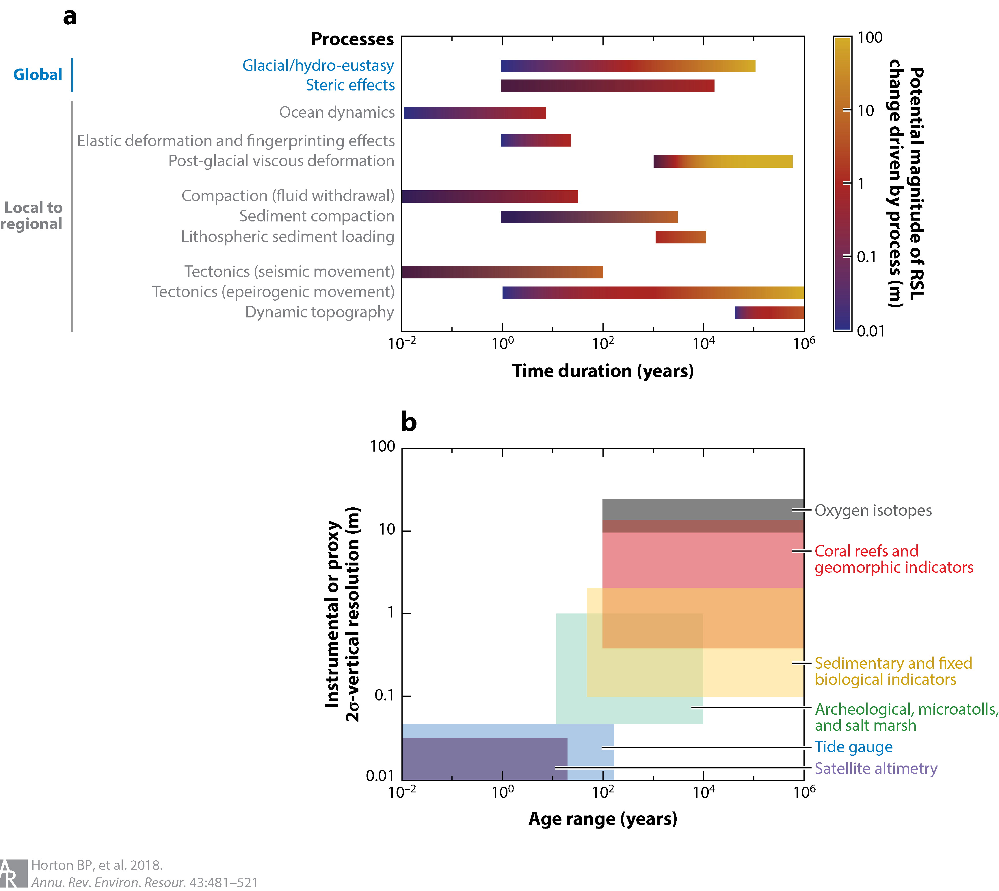

====================
Horton et al. (2018)
====================

:Title: Mapping Sea-Level Change in Time, Space, and Probability
      
:Keywords: sea level, climate change, Holocene, Last Interglacial, Mid-Pliocene Warm Period, sea-level rise projections

:Corresponding author: B. P. Horton

:Citation: Horton, B. P., Kopp, R. E., Garner, A. J., Hay, C. C., Khan, N. S., Roy, K., & Shaw, T. A. (2018). Mapping Sea-Level Change in Time, Space, and Probability. Annual Review of Environment and Resources, 43(1), 481–521. doi:10.1146/annurev-environ-102017-025826
           

Abstract
--------

Future sea-level rise generates hazards for coastal populations, economies, infrastructure, and ecosystems around the world. The projection of future sea-level rise relies on an accurate understanding of the mechanisms driving its complex spatio-temporal evolution, which must be founded on an understanding of its history. We review the current methodologies and data sources used to reconstruct the history of sea-level change over geological (Pliocene, Last Interglacial, and Holocene) and instrumental (tide-gauge and satellite altimetry) eras, and the tools used to project the future spatial and temporal evolution of sea level. We summarize the understanding of the future evolution of sea level over the near (through 2050), medium (2100), and long (post-2100) terms. Using case studies from Singapore and New Jersey, we illustrate the ways in which current methodologies and data sources can constrain future projections, and how accurate projections can motivate the development of new sea-level research questions across relevant timescales.

Introduction
------------

As recorded instrumentally and reconstructed from geological proxies, sea levels have risen and fallen throughout Earth's history, on timescales ranging from minutes to millions of years. Sea-level projections depend on establishing a robust relationship between sea level and climate forcing, but the vast majority of instrumental records contain less than 60 years of data, which are from the late twentieth and early twenty-first centuries (1-3). This brief instrumental period captures only a single climate mode of rising temperatures and sea level within a baseline state that is climatically mild by geological standards. Complementing the instrumental records, geological proxies provide valuable archives of the sea-level response to past climate variability, including periods of more extreme global mean surface temperature (e.g., 4-7). Ultimately, information from the geological record can help assess the relationship between sea level and climate change, providing a firmer basis for projecting the future (8), but current ties between past changes and future projections are often vague and heuristic. Greater interconnections between the two sub-disciplines are key to major progress.

The linked problems of characterizing past sea-level changes and projecting future sea-level rise face two fundamental challenges. First, regional and local sea-level changes vary substantially from the global mean (9). Understanding regional variability is critical to both interpreting records of past changes and generating local projections for effective coastal risk management (e.g., 9, 10). Second, uncertainty is pervasive in both records of past changes and in the physical and statistical modeling approaches used to project future changes (e.g., 11), and it requires careful quantification and statistical analysis (12). Quantification of uncertainty becomes particularly important for decision analysis related to future projections (e.g., 13).

Here, we review the mechanisms that drive spatial variability, as well as their contributions to the uncertainty in mapping sea level on different timescales. We describe methodologies and data sources for piecing together lines of evidence related to past and future sea level to map changes in space, time, and probability. We review the sources and statistical methods applied to proxy [Pliocene, Last Interglacial (LIG) and Holocene] and instrumental (tide gauges and satellites) data, and the statistical and physical modeling approaches used to project future sea-level changes. Finally, we highlight two case study regions - Singapore and New Jersey - to illustrate the way in which proxy and instrumental data can improve future projections, and conversely how future projections can guide the development of new sea-level research questions to further constrain projections.

Mechanisms for global, regional, and local relative sea-level changes
---------------------------------------------------------------------

Relative sea level (RSL) is defined as the difference in elevation between the sea surface and the land. Global mean sea level (GMSL) is defined as the areal mean of either RSL or sea-surface height over the global ocean. It is often approximated by taking various forms of weighted means of individual RSL records, sometimes with corrections for specific local processes. Over the twentieth century, GMSL trends (14) were dominated by increases in ocean mass due to melting of land-based glaciers (e.g., 15) and ice sheets (e.g., 16), and by thermal expansion of warming ocean water. Changes in land water storage due to dam construction and groundwater withdrawal also made a small contribution (e.g., 17). Over a variety of timescales, RSL differs from GMSL, because of key driving processes such as atmosphere/ocean dynamics, the static-equilibrium effects of ocean/cryosphere/hydrosphere mass redistribution on the height of the geoid and the EarthÕs surface, glacio-isostatic adjustment (GIA), sediment compaction, tectonics, and mantle dynamic topography (MDT). The driving processes are spatially variable and cause RSL change to vary in rate and magnitude among regions (Figure 1).

   Figure 1: Mapping uncertainty of sea-level drivers on different timescales based on available estimates. The length of colored bars along the x-axis represents the characteristic timescale over which a process may occur, rather than the total time duration over which the process has been active. The color scale represents the range in magnitude of relative sea-level change driven by a process over an event or observed/predicted timescale. It does not imply a specific relationship of the change in amplitude with timescale, given the nonlinear nature of many of these processes. The color scheme for glacial eustasy is also scaled to encompass predicted changes in global mean sea level of decimeters in the next several decades to meters over the next several centuries. (b) The uncertainty of instrumental and proxy recorders of sea level. The x (age) axis represents the time span over which the proxy may be used (given the temporal range of the dating method used to determine its age), rather than the proxyÕs temporal uncertainty. To estimate the contribution of a given process, the vertical and temporal resolution of a chosen instrument or proxy cannot exceed the magnitude and rate of sea-level change driven by that process.

Atmosphere/ocean dynamics are the dominant driver of spatial heterogeneity in RSL on annual and multidecadal timescales (18-21), as well as a significant driver on longer timescales during periods with limited land-ice changes, such as the Common Era (22-25). The highest rates of RSL rise over the past two decades (greater than 15 mm/year) have occurred in the western tropical PaciÞc (18, 26), although the pattern appears to have reversed since 2011 (27). Observations and numerical model simulations (18, 28) conÞrm that the intensification of trade winds, which occurs when the PaciÞc Decadal Oscillation (PDO) exhibits a negative trend, accounts for the amplitude and spatial pattern of RSL rise in the western tropical PaciÞc. In the western North Atlantic Ocean, changes in the strength and/or position of the Gulf Stream impact RSL trends differently north and south of North Carolina, where the Gulf Stream separates from the US Atlantic coast and turns toward northern Europe (19, 22, 23, 29). In fact, there is a .30-cm difference in sea-surface height between New Jersey and North Carolina (29). Climate models project that by the late twenty-Þrst century, associated with a decline in the Atlantic Meridional Overturning Circulation (AMOC), ocean dynamic sea-level rise of up to 0.2 to 0.3 m could occur along the western boundary of the North Atlantic (30). However, coastal ocean dynamic variability in the western North Atlantic has been largely driven over the past few decades by local winds, with limited evidence for coupling to AMOC strength (21, 31).

Gravitational, rotational, and elastic deformational effectsÑalso called static-equilibrium effectsÑreshape sea level nearly instantaneously in response to the redistribution of mass be.tween the cryosphere, the ocean, and the terrestrial hydrosphere (32-35). These effects are linked to the change in self-gravitation of the ice sheets and liquid water, the response of the EarthÕs rotational vector to the redistribution of mass at the EarthÕs surface, and the elastic response of the solid Earth surface to changing surface loads (Figure 2b,c). Unique RSL change geometries, sometimes called Òfingerprints,Ó can be associated with the melting of different ice sheets and glaciers, and this response scales linearly with the magnitude of a marginal ice-mass change (32, 34). The dominant self-gravitation signal will result in a RSL fall near a shrinking land ice mass, which will be compensated by a RSL rise in the far Þeld that will be greater than the GMSL signal expected from the water mass inßux. The exact spatial pattern of RSL change depends on the geometry of the melting undergone by the ice reservoir. Recent studies (36, 37) have examined how mass loss centered in different portions of an ice sheet or glacial region will affect RSL differently. For example, New Jersey experiences a RSL fall in response to mass loss in southern.most Greenland, even though it experiences a modest (approximately 50% of the global mean) RSL rise in response to uniform melting across Greenland (Figure 2b).

:Pliocene: epoch in the geologic timescale that extends from 5.3 million to 1.8 million years ago, during which the Earth experienced a transition from relatively warm climates to the prevailing cooler climates of the Pleistocene; includes the Mid-Pliocene Warm Period (.3.2 to 3.0 million years ago), which is the most recent period in geologic time with temperatures comparable to those projected for the twenty-first century.

[...]

Table 1: Global mean sea-level rise projections (median, 17th to 83rd percentile range, and 5th to 95th percentile range). Studies have been categorized as probabilistic (projections that sample uncertainty for different driving factors and present multiple quantiles in the original study), semi-empirical (projections made with a model that uses a statistical relationship between global mean temperature and GMSL, without computing individual factors), or central range (projections that are either not semi-empirical and also do not sample uncertainty for different driving factors, or that focus the original study exclusively on a central, low, and high quantile). Probabilistic models include Kopp14 (140), Grinsted15 (137), Jackson16 (138), Kopp17 (144), Nauels17a (142), Jackson18 (164), and Rasmussen18 (165). Semi-empirical models include Jevrejeva12 (139), Schaeffer12 (153), Kopp16 (25), Bittermann17 (163), and Jackson18 (164). Central range models include Perrette13 (208), Slangen14 (147), Mengel16 (141), Schleussner16 (166), Bakker17 (135), Goodwin17 (136), Nauels17b (209), and Wong17 (150).

+======+==============+===========+===========+
| Year | Percentile range projections         |
+======+==============+===========+===========+
|      | 50 (median)  | 17-83     | 5-95      |
+======+==============+===========+===========+
|      | (1) Probabilistic projections        |
+======+==============+===========+===========+
|      |               Kopp14                 |
|      |               RCP8.5                 |
+------+--------------+-----------+-----------+
| 2050 | 0.29         | 0.24-0.34 | 0.21-0.38 |
+------+--------------+-----------+-----------+
| 2100 | 0.79         | 0.62-1.00 | 0.52-1.21 |
+------+--------------+-----------+-----------+
| 2150 | 1.30         | 1.00-1.80 | 0.80-2.30 |
+------+--------------+-----------+-----------+
| 2300 | 3.18         | 1.75-5.16 | 0.98-7.37 |
+======+==============+===========+===========+
|      |               RCP4.5                 |
+------+--------------+-----------+-----------+
| 2050 | 0.26         | 0.21-0.31 | 0.18-0.35 |
+------+--------------+-----------+-----------+
| 2100 | 0.59         | 0.45-0.77 | 0.36-0.93 |
+------+--------------+-----------+-----------+
| 2150 | 0.90         | 0.60-1.30 | 0.40-1.70 |
+------+--------------+-----------+-----------+
| 2300 | 1.92         | 0.70-3.49 | 0.00-5.31 |
+======+==============+===========+===========+
|      |               RCP2.6                 |
+------+--------------+-----------+-----------+
| 2050 | 0.25         | 0.21-0.29 | 0.18-0.33 |
+------+--------------+-----------+-----------+
| 2100 | 0.50         | 0.37-0.65 | 0.29-0.82 |
+------+--------------+-----------+-----------+
| 2150 | 0.70         | 0.50-1.10 | 0.30-1.50 |
+------+--------------+-----------+-----------+
| 2300 | 1.42         | 0.32-2.88 | 0.22-4.70 |
+------+--------------+-----------+-----------+
|      | Grinsted15 - RCP8.5                  |
+------+--------------+-----------+-----------+
| 2100 | 0.80         | 0.58-1.20 | 0.45-1.83 |
+------+--------------+-----------+-----------+
|      | Jackson16 - RCP8.5 High-end          |
+------+--------------+-----------+-----------+
| 2050 | 0.27         | 0.20-0.34 | 0.17-0.44 |
+------+--------------+-----------+-----------+
| 2100 | 0.80         | 0.60-1.16 | 0.49-1.60 |
+------+--------------+-----------+-----------+
|      | Jackson16 - RCP8.5                   |
+------+--------------+-----------+-----------+
| 2100 | 0.72         | 0.52-0.94 | 0.35-1.13 |
+------+--------------+-----------+-----------+
|      | Jackson16 - RCP4.5                   |
+------+--------------+-----------+-----------+
| 2100 | 0.52         | 0.34-0.69 | 0.21-0.81 |
+------+--------------+-----------+-----------+
|      | Kopp17 - RCP8.5                      |
+------+--------------+-----------+-----------+
| 2050 | 0.31         | 0.22-0.40 | 0.17-0.48 |
+------+--------------+-----------+-----------+
| 2100 | 1.46         | 1.09-2.09 | 0.83-2.43 |
+------+--------------+-----------+-----------+
| 2150 | 4.09         | 3.17-5.47 | 2.92-5.98 |
+------+--------------+-----------+-----------+
| 2300 | 11.69        | 9.80-14.09| 9.13-15.52|
+------+--------------+-----------+-----------+
|      | Kopp17 - RCP4.5                      |
+------+--------------+-----------+-----------+
| 2050 | 0.26         | 0.18-0.36 | 0.14-0.43 |
+------+--------------+-----------+-----------+
| 2100 | 0.91         | 0.66-1.25 | 0.50-1.58 |
+------+--------------+-----------+-----------+
| 2150 | 1.72         | 1.21-2.72 | 0.90-3.22 |
+------+--------------+-----------+-----------+
| 2300 | 4.21         | 2.75-5.95 | 2.11-6.96 |
+------+--------------+-----------+-----------+

[...]

