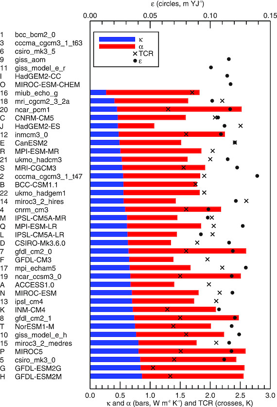

============================
Kuhlbrodt and Gregory (2012)
============================

:Title: Ocean heat uptake and its consequences for the magnitude of sea level rise and climate change

:Key Points:
    - The spread of the OHU efficiency explains half of the spread in total OHU
    - Most models are biased towards a too weak stratification and a too strong OHU
    - The Southern Ocean and its stratification dominate global OHU in the models
 
:Corresponding author: T. Kuhlbrodt

:Keywords: CMIP5 models, climate change, ocean heat uptake, sea level rise
                       
:Citation: Kuhlbrodt, T., and J. M. Gregory (2012), Ocean heat uptake and its consequences for the magnitude of sea level rise and climate change, Geophys. Res. Lett., 39, L18608, doi:10.1029/2012GL052952

:URL: https://agupubs.onlinelibrary.wiley.com/doi/full/10.1029/2012GL052952
 

Abstract
--------

Under increasing greenhouse gas concentrations, ocean heat uptake moderates the rate of climate change, and thermal expansion makes a substantial contribution to sea level rise. In this paper we quantify the differences in projections among atmosphere-ocean general circulation models of the Coupled Model Intercomparison Project in terms of transient climate response, ocean heat uptake efficiency and expansion efficiency of heat. The CMIP3 and CMIP5 ensembles have statistically indistinguishable distributions in these parameters. The ocean heat uptake efficiency varies by a factor of two across the models, explaining about 50% of the spread in ocean heat uptake in CMIP5 models with CO2 increasing at 1%/year. It correlates with the ocean global-mean vertical profiles both of temperature and of temperature change, and comparison with observations suggests the models may overestimate ocean heat uptake and underestimate surface warming, because their stratification is too weak. The models agree on the location of maxima of shallow ocean heat uptake (above 700 m) in the Southern Ocean and the North Atlantic, and on deep ocean heat uptake (below 2000 m) in areas of the Southern Ocean, in some places amounting to 40% of the top-to-bottom integral in the CMIP3 SRES A1B scenario. The Southern Ocean dominates global ocean heat uptake; consequently the eddy-induced thickness diffusivity parameter, which is particularly influential in the Southern Ocean, correlates with the ocean heat uptake efficiency. The thermal expansion produced by ocean heat uptake is 0.12 m YJ^{-1}, with an uncertainty of about 10% (1 YJ = 10^{24} J).

Introduction
------------

Ocean heat uptake moderates the rate of time-dependent climate change. Thermal expansion of sea-water is a consequence of ocean heat uptake and one of the major contributors to global-mean sea level rise [Church et al., 2011]. Our general aim in this paper is to quantify the differences in predictions of the magnitude and distribution of ocean heat uptake, and its consequences for global-mean surface air temperature change and thermal expansion, among atmosphereÐocean general circulation models (which we henceforth refer to simply as "models", for convenience) used for projections of anthropogenic climate change.

We analyse results from 22 models that participated in the Coupled Model Intercomparison Project Phase 3 (CMIP3), and from the 20 models in the CMIP5 project whose data were available at the time of writing this paper (Spring 2012). See Figure 1 and Table 1 in Text S1 in the auxiliary material, for a list.1 We mainly use the control experiments and experiments with atmospheric CO_2 concentration increasing at 1%/year (details in the auxiliary material).

Ocean Heat Uptake Efficiency and Transient Climate Response
-----------------------------------------------------------

Gregory and Forster [2008] showed that there is an approximately linear relationship between the global mean surface air temperature change ΔTa and the radiative forcing F (due to greenhouse gases etc.): ΔTa = F/ρ, with the climate resistance ρ in W m−2 K−1. This relationship holds well for observations and model simulations of recent decades, and for projections of climate change under a continuously increasing forcing, which is a characteristic of most scenarios considered for the 21st century. The basis of this relationship is that the difference between the radiative forcing and the radiative feedback yields the net heat flux N into the climate system: N = F − ΔTa, and N can be approximated by N ≃ κΔTa. The climate resistance ρ is thus the sum of α, the climate feedback parameter, and κ, which is identified as the ocean heat uptake efficiency because nearly all the added heat is stored in the ocean [e.g., Church et al., 2011].

Following Gregory and Forster [2008], the ocean heat uptake efficiency κ, the climate feedback parameter α and the climate resistance ρwere calculated for CMIP5 by ordinary least squares regression (OLS) of decadal-meanN, F-N and F respectively against ΔTa under the standard idealized scenario of CO2 increasing at 1% per year, giving a forcing F(t) = F2×t/70 which is linear with time t in years, where F2× is obtained from experiments in which CO2 is instantaneously increased and then held constant [Andrews et al., 2012] (Table 1 in Text S1). The transient climate response (TCR) was calculated, following its definition, as ΔTafor the time-mean of years 61–80 in this scenario (Figure 1 and Table 1 in Text S1). The coefficient of variation (ratio of ensemble standard deviation to ensemble mean) of TCR is about 20% in CMIP5.

   Figure 1: The ocean heat uptake efficiency κ (blue bars), the climate feedback parameter α (red bars), the transient climate response (crosses) and the expansion efficiency of heat ϵ (circles) for the CMIP3 (numbers) and the CMIP5 (letters) models. The total bar length is the climate resistance ρ = α + κ. The models are arranged in order of κ. See Table 1 in Text S1 in the auxiliary material for an alphabetical list of the models. It can be seen from this diagram that TCR and κ are anticorrelated (the crosses are further left towards the bottom), but there is no relationship between κ and α or ϵ (the red bars and the circles do not show any tendency from top to bottom). For several technical reasons, not all parameters could be calculated for every model.

We see that α obtained by this method agrees closely with α obtained from the CO2step-increase experiments [Andrews et al., 2012]. F2× is not correlated with α or κ. Whereas Gregory and Forster [2008] found α and κto be independent in CMIP3, they have a correlation of 0.56 in CMIP5, significant at the 5% level (one-tailed). This is due principally to the models GFDL-ESM2G and GFDL-ESM2M, which haveα and κ that are both larger than in any other model (except for \alpha of MIROC5). Without these models, the correlation is insignificant (0.32). Further investigation of these models is needed to establish whether there is a link between their large α and large κ.

The definition of ρ implies that TCR = F2×/ρ = F2×/(α + κ). Thus, a larger κ gives a smaller TCR (correlation of κand TCR is −0.76). Excluding GFDL-ESM2G and GFDL-ESM2M, so thatκ is uncorrelated with α, we can compute the fraction of the across-model variance of TCR explained byκ by comparing var(F2×/(α + κ)) with var(〈F2×〉/(〈α〉 + κ)), where the angle brackets denote the model mean (see the auxiliary material for further comment on the method). The fraction explained is about 10%.

Boé et al. [2009, 2010] present evidence from CMIP3 suggesting that ocean heat uptake has a much stronger influence than this on surface warming. Their strong relationship, however, depends particularly on a cluster of five models [Boé et al., 2009, Figure 3b]. In the high-latitude Southern Ocean region which was analysed for that figure, three of these models (csiro_mk3_0, giss_e_h and giss_e_r) have an extremely weak ocean temperature stratification. Another model (ncar_pcm1) has the lowest climate sensitivity of any CMIP3 model. We therefore suspect that the correlation could be strong by chance rather than from a common physical behaviour exhibited by these models.

The time-integrated heat uptake in the 1%/year CO2 scenario up to year 70 is H2× = ∫070N(t) dt ≃ 35F2×κ/(κ + α) (in W year m−2). Across the CMIP5 1%/year CO2 scenarios, it has a coefficient of variation of about 10%. Using the same CMIP5 models and method as for TCR (see also the auxiliary material), we find that H2× has a correlation of 0.92 with F2×κ/(κ + α), and the fraction of variance of H2× explained by κ is ∼50%. Thus κ influences heat uptake more than it influences surface warming because of its appearance in the numerator of H2×. (In the auxiliary material, we derive a formula for var(H2×) in terms of var(κ) and var(TCR).)

The distributions of κ, α, ρ and TCR are not significantly different for the CMIP3 and CMIP5 ensembles according to Kolmogorov–Smirnov tests. In both ensembles, κ varies by about a factor of 2. Investigating the reasons for this substantial spread motivates the next section.

Vertical Distribution of Temperature and Temperature Change
-----------------------------------------------------------

Ocean heat uptake efficiency depends on how fast the heat can be transported downwards. We put forward the hypothesis that a model with a weak vertical temperature gradient in the control state has a larger capacity for downward heat transport (e.g. because a large diapycnal mixing coefficient erodes the stratification) and therefore should have a larger κ.The hypothesis applies to net global-mean vertical heat transport, comprising diapycnal mixing and other processes.

Figure 2a shows the global-mean vertical temperature profile from the control runs of the CMIP3 and CMIP5 models (the average over the first 20 years that are parallel to the 1%/year CO2 runs) and from observations (WOA05 [Locarnini et al., 2006]), each profile being expressed as a difference from its surface temperature. This confirms that in the top 2000 m most models are less stratified than the real ocean. To elucidate the relationship between κ and the global temperature profiles, we use a simple measure of the vertical temperature gradient, namely the vertical temperature difference Tz between two layers, 0–100 m and 1500–2000 m (similar to Boé et al. [2009]). The relationship of κ to Tz is shown in Figure 3a and is negative, as expected (r = −0.35 with p= 0.07 [one-sided]). HadGEM2-ES (model J) has a very smallκ and is strongly stratified in the uppermost layers, being closer to the observed profile than most other models, particularly in the top 500 m. The κ-Tz relationship therefore suggests that κ tends to be too large in AOGCMs.

Figure 2: (a) Globally averaged temperature profiles for the control runs of the CMIP3 and CMIP5 models shown as difference from surface temperature, with observations for comparison (dash-dotted; WOA05 [Locarnini et al., 2006]). NorESM1-M is an outlier in that it is unusually weakly stratified in the top 200 m, giving a largeκ, but very strongly stratified in the 500 m or so below, giving a large Tz. Another outlier is giss_e_r with an extremely weak stratification. (b) Change of the temperature profiles in the 1%/year CO2 runs, divided by the vertical integral between 0 m and 2000 m. Units are dimensionless (“DL”). (c) Change of the temperature profiles in the CMIP3 models during the observational record [Levitus et al., 2012] (“Lev12”), scaled as in Figure 2b. Shown is the difference of a 20-year average (2000 to 2019) from the SRES A1B runs minus a 20-year average from 20C3M (1945–1964). Two models (red, orange) overestimate surface warming because of their too small total heat uptake. To some extent, a few models capture the surface intensification (“SFI” [light green]: bccr_bcm2_0, gfdl_cm2_0, gfdl_cm2_1, miub_echo_g, mri_cgcm2_3_2a) seen in the observations (dash-dotted). Also note the shallow subsurface maximum warming in observations, but not in models, for which we have no explanation.

Figure 3: The ocean heat uptake efficiency κ [W m−2 K−1] against (a) the globally averaged vertical temperature difference Tz in the control runs, (b) its change ΔTz in the 1%/year CO2runs, scaled with the total warming, and (c) the quasi-Stokes diffusivity parameterκGM for those CMIP3 models where it is a constant. The black lines are regression lines. The CMIP3 models have red numbers while the CMIP5 models have black letters (see Table 1 in Text S1 for key). Blue crosses on the horizontal axis denote the values of Tz from WOA05 and of ΔTz from Levitus et al. [2012].

The change of the global vertical temperature profile averaged over the years 61–80 of the 1%/year CO2 runs is shown in Figure 2b. The profiles were scaled with (i.e., divided by) their vertical integral between 0 m and 2000 m in order to compare their shapes rather than the total warming. The amount of warming in the top 100 m, as compared to the deeper layers, varies considerably across the models. As Figure 3b shows, the variation of κ across models is strongly related to ΔTz, defined as the change of (the scaled) Tz in the 1%/year CO2 runs. The correlation (r = −0.66) is significant at the 99% level (p < 0.01). If ΔTz is large, then the temperature increase at the surface is larger than at depth, indicating that most heat has been taken up at the surface. This goes along with a small κ. Conversely, models that distribute the additional heat further down have a smaller ΔTz and a larger κ.

The κ-Tz relationship suggests most models will probably transport heat too deeply. Consistent with this, Figure 2c shows that the observed warming over recent decades [Levitus et al., 2012] is more strongly surface-intensified than in the CMIP3 simulations of the same period.

Geographical Distribution of Ocean Heat Uptake
----------------------------------------------
The projected ocean heat uptake (OHU, i.e., the increase in ocean heat content) in model simulations with an increasing CO2 content has a distinct regional structure. We analyse this for the CMIP3 SRES A1B scenario, for which we have the largest number of models available. For comparison, the same analysis for the 1% CO2 runs of CMIP3 and CMIP5 can be found in the auxiliary material. They show generally less heat uptake because ∫F dt is smaller, but the geographical features are similar.

The ensemble-mean top-to-bottom integrated OHU is shown inFigure 4a. It was calculated as the difference between the 20-year averages 2080–2099 and 1980–1999. It is largest in the Southern Ocean, in a band around 40°S, with maxima in the Argentine Basin and south of Africa. This leads to a clear signal in steric sea level rise [cf.Pardaens et al., 2011, Figure 2], which is predominantly thermosteric in the Southern Ocean. The models agree on these features (R > 1, thin black contours), and they are also visible in the top 700 m alone (Figure 4b), which accounts for up to 50% of the heat uptake in the full depth.

Figure 4: Vertically integrated ocean heat uptake (colour shading; in GJ m−2) in the ensemble average of the SRES A1B scenario of 17 CMIP3 models for (a) the total water column, (b) the upper 700 m and (c) below 2000 m. Thick black line: zonal total in 1015 J m−1 (scale in the upper left corner), with ±1 standard deviation (dotted). Note the different scales in Figure 4c. Black contours show the ratio R of ensemble mean and ensemble standard deviation (solid: R > 1, thick solid: R = 1, dashed: R < 1). For Figures 4a and 4b, R> 1 in most areas indicating agreement across models. An exception are the deep-water formation regions in the Southern Ocean and the North Atlantic. In Figure 4c the models mainly show OHU in the Southern Ocean.

OHU below 2000 m is substantial in several large areas of the Southern Ocean (Figure 4c), including the Argentine basin and the area west of the Drake Passage, where there are maxima of top-to-bottom OHU. The pattern bears resemblance to observations [Purkey and Johnson, 2010]. In these areas, the deep OHU can amount to up to 40% of the total. In the deep-water formation areas in the Southern Ocean and in the North Atlantic the ensemble mean OHU displays minima above 700 m. The models show a large spread in these areas (R < 1).

The zonal total heat uptake (thick black line in the left hand side of the panel, dotted: one standard deviation) confirms that the global maximum of OHU per degree latitude is in the mid-latitude Southern Ocean [Stouffer et al., 2006]. Therefore, the stratification in that region could have a particularly large influence on κ.In the large majority of the models, the Southern Ocean stratification is strongly influenced by the parameterization of the eddy-induced tracer transports. Consistent with this, we find that the quasi-Stokes diffusivity parameterκGM(often called the eddy-induced thickness diffusivity) has a significant influence onκ (Figure 3c). When κGM is small, the isopycnal layers are steep, leading to a strong horizontal density gradient [Kuhlbrodt et al., 2012, Figure 1c] but a weak stratification and thus a large κ.

Expansion Efficiency of Heat
----------------------------

The expansion efficiency of heat [Russell et al., 2000], as a property of a model in m YJ^{−1} (1 YJ ≡ 1024 J), is defined as ϵ = hx/H, where hx is the global mean sea level rise due to thermal expansion and Hthe global-integral OHU. We calculateϵ by OLS regression of hx against H, using results from 1%/year CO2 and all available 21st-century scenarios.

In all models, there is an excellent scenario-independent linear relationship, butϵ varies across models (Figure 1 and Table 1 in Text S1) because the thermal expansivity of sea water (1/ρ) ∂ρ/∂T increases with pressure and temperature. Therefore, the magnitude of thermal expansion depends on the latitudes and depths at which the heat is actually stored; this pattern depends on the model, but not on the scenario for a given model.

The ranges of ϵ in the CMIP3 and CMIP5 ensembles are similar: 0.12 ± 0.01 m YJ−1 in CMIP3 and 0.11 ± 0.01 m YJ−1 in CMIP5. This is consistent with the observational estimates for 0 m to 2000 m, 1955–2010 [Levitus et al., 2012], from which we infer ϵ = 0.12 ± 0.01 m YJ−1. The observational estimates by Church et al. [2011] for 1972–2008 for the full ocean depth indicate ϵ = 0.15 ± 0.03 m YJ−1, which is slightly higher but not significantly different. We did not find any correlation of ϵ with κ, Tz or ΔTz, although such relationships would be plausible. It might well be that the stratification in the individual regions which are particularly important to OHU (section 4) influences ϵmore than global-mean properties do.

Concluding Remarks
------------------

Our analysis of CMIP3 and CMIP5 model results indicates that model spread in ocean vertical heat transport processes is responsible for a substantial part of the spread in predictions of global-mean ocean heat uptake (about 50% in the CMIP5 1%CO2/year experiments), and for some of the spread in predictions of surface warming. Since most AOGCMs have weaker global-mean stratification than observed, it is possible that they generally overestimate ocean heat uptake and underestimate surface warming [Forest et al., 2008]. The ocean heat uptake in CMIP5 1%CO2/year experiments has a spread of about 10%, and there is also a spread of about 10% in the expansion efficiency of heat ϵ, due to the different spatial distribution of the warming in the models. These factors contribute roughly equally to the spread of thermal expansion projection in response to CO2. Comparison, analysis and evaluation of model processes of ocean interior heat transport is essential to make progress in reducing uncertainties in projections of the magnitude and distribution of ocean heat uptake and the consequent sea-level rise.
