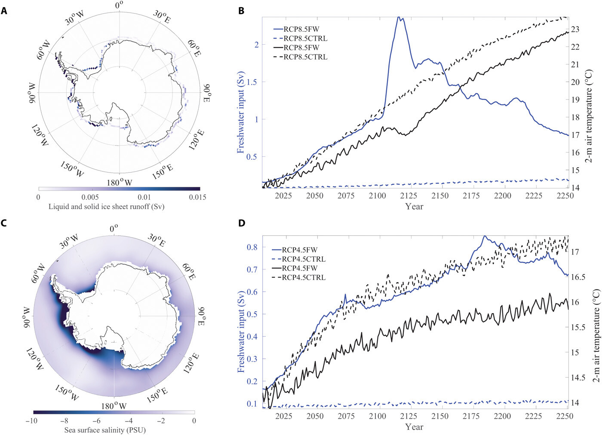

===================
Sadai et al. (2020)
===================

:Title: Future climate response to Antarctic Ice Sheet melt caused by anthropogenic warming   
      
:Corresponding author: Shaina Sadai

:Citation: Sadai, S., Condron, A., DeConto, R., & Pollard, D. (2020). Future climate response to Antarctic Ice Sheet melt caused by anthropogenic warming. Science Advances, 6(39), eaaz1169. doi:10.1126/sciadv.aaz1169

:URL: https://www.science.org/doi/10.1126/sciadv.aaz1169

Abstract
--------

Meltwater and ice discharge from a retreating Antarctic Ice Sheet could have important impacts on future global climate. Here, we report on multi-century (present-2250) climate simulations performed using a coupled numerical model integrated under future greenhouse-gas emission scenarios IPCC RCP4.5 and RCP8.5, with meltwater and ice discharge provided by a dynamic-thermodynamic ice sheet model. Accounting for Antarctic discharge raises subsurface ocean temperatures by >1˚C at the ice margin relative to simulations ignoring discharge. In contrast, expanded sea ice and 2˚C to 10˚C cooler surface air and surface ocean temperatures in the Southern Ocean delay the increase of projected global mean anthropogenic warming through 2250. In addition, the projected loss of Arctic winter sea ice and weakening of the Atlantic Meridional Overturning Circulation are delayed by several decades. Our results demonstrate a need to accurately account for meltwater input from ice sheets in order to make confident climate predictions.

Introduction
------------

Observational evidence indicates that the West Antarctic Ice Sheet (WAIS) is losing mass at an accelerating rate (1, 2). Recent advances in ice sheet modeling have improved our understanding of Antarctic Ice Sheet (AIS) evolution in response to anthropogenic greenhouse gas forcing and show that the AIS could contribute substantially to sea level rise by the end of this century (3-6). A more accurate understanding of the impacts that this evolution might have on atmospheric and oceanic dynamics is needed to constrain possible future changes in the climate system. However, ice sheet physics are not adequately represented in the current generation of global climate models (GCM) used in future projections (7, 8). The AIS is considered a tipping element within the climate system (9) with the potential to contribute several tens of centimeters of global mean sea level rise in the next two centuries, but the climate system response to such large-scale ice loss is not well constrained, especially beyond 2100.

Today, freshwater input to the ocean is increasing in response to climatic warming, largely from a combination of net precipitation and increasing riverine input resulting from an invigorated hydrologic cycle, and the loss of sea and land ice (10). Previous modeling work investigating the relative impacts of freshwater forcing in the North Atlantic versus the Southern Ocean (11, 12) has demonstrated that the location and magnitude of the additional freshwater are central to the modeled climate response. Methodology for modeling the climatic impact of freshwater perturbations has also varied widely in terms of strength, duration, and location of meltwater input: Historically, so-called "hosing" approaches added water uniformly within given latitude bands (11-14), while more recent work has applied freshwater forcing at specific locations around global coastlines or spread according to iceberg movements (6, 15-19). Despite differences in model resolution and representation of Earth system processes, several elements of the climate response to freshwater perturbations in the Southern Ocean have been broadly consistent, such as a decrease in surface air temperatures (SATs) over the Southern Ocean, a decrease in the strength of the Atlantic Meridional Overturning Circulation (AMOC), and the expansion of Southern Ocean sea ice.

Here, we present results from a series of climate model simulations performed using a high-resolution, fully coupled, ocean-atmosphere-cryosphere-land model, Community Earth System Model (CESM) 1.2.2 with Community Atmospheric Model 5 (CAM5) atmospheric physics (20), under Representative Concentration Pathway (RCP) 4.5 and RCP8.5 (10) spanning 2005-2250 (see Materials and Methods). In our freshwater forcing simulations, referred to throughout the paper as RCP4.5FW and RCP8.5FW, time-evolving freshwater (liquid melt-water and solid ice) input from Antarctica is provided from a continental ice sheet/ice shelf model (3) responding to the same atmospheric forcing scenarios. The control runs (RCP4.5CTRL and RCP8.5CTRL) have no additional freshwater forcing beyond what is already simulated by the CESM model. To account for spatial and temporal variations in runoff and to improve on classic hosing experiments, we released time-variant AIS meltwater and ice discharge into the ocean at the nearest surface-level coastal grid cell to where ice calving and/or ocean melt is occurring in the ice sheet model (Fig. 1A; see Materials and Methods) such that considerable volumes of meltwater and ice enter the ocean from the Amundsen Coast of West Antarctica, including Pine Island and Thwaites glaciers. In our experiments, liquid melt-water and solid ice discharge from the AIS are input separately to account for the latent heat of melting the solid component. In both RCP scenarios, the solid ice component dominates the discharge, with 62 to 87% of the total discharge being ice in RCP8.5FW and 71 to 86% in RCP4.5 (fig. S1). This is due to ice model advances that include hydrofracturing and ice-cliff calving. Here, we use the term "AIS discharge" to refer to the total freshwater forcing from the ice sheet model from both the solid ice and liquid meltwater components.

In RCP4.5FW, total discharge increases throughout the 21st century and remains between 0.4 and 0.8 sverdrup (sverdrup = 10^6 m^3/s) from 2050 to 2250; in contrast, the meltwater input in RCP4.5CTRL never exceeds 0.1 sverdrup (Fig. 1D). In RCP8.5FW, AIS discharge is dominated by the retreat of the WAIS in the ice sheet model during the 21st century, peaking at >2 sverdrup around ~2125 when the Ross Ice Shelf has collapsed and the inland ice behind it drains into the Ross Sea. Discharge then remains above 1 sverdrup through 2200 due to increasing contributions from the East Antarctic Ice Sheet (EAIS). This is in sharp contrast to RCP8.5CTRL in which discharge increases steadily throughout the run but never exceeds 0.2 sverdrup (Fig. 1D). As such, our methodology allows a direct comparison of the climate response to changing atmospheric greenhouse gas concentrations with and without a major Antarctic meltwater contribution that accounts for both the liquid meltwater and solid ice components of AIS discharge (see Materials and Methods). While projected changes in meltwater and ice discharge from Greenland are not included in our simulations, their potential impacts on climate are discussed in Materials and Methods.

   Figure 1: Freshwater forcing quantities and salinity response. (A) Spatially distributed, time-varying freshwater forcing from AIS discharge, which includes both the liquid meltwater and solid ice components, was input at the surface level around the continental margin. Forcing in September 2121 CE is shown here. (B) Combined liquid and solid forcing components are shown in relation to the global mean surface temperature in RCP8.5. Solid components are the dominant portion of the forcing, as seen in fig. S1. (C) Decadal (2121-2130) sea surface salinity anomaly based on the difference between RCP8.5FW and RCP8.5CTRL, reflecting the freshwater input during peak ice sheet retreat. (D) Same as in (B) except for RCP4.5.

Results
-------

The impact of applying spatially varying freshwater forcing is immediately apparent in the salinity field (Fig. 1 and fig. S2). By the end of the 21st century, the sea surface salinity (SSS) in the RCP8.5FW experiment is reduced by up to −5 practical salinity unit (psu) (compared to RCP8.5CTRL) over most of the Southern Ocean and begins spreading northward (Fig. 1 and fig. S2). By the time of peak WAIS retreat, around year 2120, the negative SSS anomaly exceeds −15 psu around the Antarctic margin, especially in the Amundsen and Bellingshausen seas and portions of the Ross and Weddell seas (Fig. 1C). By the middle of the 22nd century, the anomaly has spread pervasively throughout all the ocean basins, to depths of ~4000 m (fig. S2). In RCP4.5FW, the ice sheet collapse does not peak and decline in the same way as RCP8.5FW but rather is maintained throughout most of the run, resulting in a persistent and steady freshwater forcing (Fig. 1, B and D). The associated salinity anomaly patterns are spatially similar to the RCP8.5FW simulation but lower in magnitude (−1 to −2 psu) and remain confined to the Southern Ocean (fig. S2).

Prescribing AIS discharge from the ice sheet model has a profound impact on sea ice. Accurately capturing this response is important because seasonal freeze and melt cycles in the Southern Ocean act as a deepwater pump (21); thus, changes in sea ice are linked to changes in Southern Ocean overturning. The balance between brine rejection from sea ice formation, freshwater forcing, and associated changes in ocean convection also lead to alterations in air-sea heat exchange that can trap warm waters at depths and increase melt rates under neighboring ice shelves (22). Substantial changes in sea ice extent affect the radiative balance through sea ice albedo feedbacks and can markedly affect ecosystems. For example, shifts in sea ice formation have already begun to affect penguin colonies (23) and will likely have wide-reaching effects on microfauna communities, krill abundance, and larger ocean predators (24).

In our simulations, sea ice expands in both RCP4.5FW and RCP8.5FW, despite the strongly elevated radiative forcing (Fig. 2). The large AIS discharge in both simulations reduces salinity, raises the freezing temperature, and stratifies the water column around the coast. This, in turn, reduces convection, suppresses Southern Ocean overturning, and leads to a substantial buildup in perennial sea ice extent and thickness. Spatially, the greatest sea ice growth in the perturbation experiments is within the South Pacific sector, where the freshwater input is largest. Sea ice accumulates within the first few decades in both the RCP4.5 and RCP8.5 AIS discharge experiments, compared to the control simulations. In RCP8.5FW, Southern Ocean sea ice extent reaches a maximum in the 2120’s during peak AIS discharge, with sea ice thickness exceeding 10 m in the Amundsen, Bellingshausen, and Ross seas and parts of the EAIS margin (Fig. 2). As the freshwater forcing from AIS discharge declines following WAIS collapse, sea ice extent and thickness also begin to decline, although >10-m-thick sea ice still persists in several regions in year 2200 (fig. S3, A and C). After peak AIS discharge has occurred in RCP8.5FW in the 2120’s, sea ice extent and thickness markedly decline in this scenario. This is in contrast to RCP4.5FW, where >5-m-thick perennial sea ice persists into the 22nd century, despite the substantial anthropogenic greenhouse gas forcing (fig. S3, B and D). In contrast to the large quantities of sea ice produced in the perturbation experiments, sea ice never expands in RCP4.5CTRL and RCP8.5CTRL and declines over the course of those runs, with minimal sea ice in the Southern Ocean by 2100, and no austral winter sea ice by 2200 (Fig. 2A and fig. S3).

Figure 2: Sea ice response to freshwater forcing. (A) Time series of Southern Ocean sea ice area in February showing the extent of perennial sea ice in austral summer. Lower anthropogenic radiative forcing allows for a much greater sea ice area in the 22nd century in RCP4.5FW, despite a similar magnitude of freshwater forcing to that of RCP8.5FW. (B to E) February sea ice thickness decadally averaged for 2121–2130 for (B) RCP8.5FW, (C) RCP4.5FW, (D) RCP8.5CTRL, and (E) RCP4.5CTRL. Note the difference in scale for (D) and (E).

Projected changes in sea ice resulting from accelerated AIS discharge produces a strong albedo feedback that delays atmospheric warming in both perturbation experiments (Fig. 1, B and D). Spatially, the cooler temperatures relative to the control simulations are maximized directly over the Antarctic continental margin where the AIS discharge perturbation is applied (Fig. 3, A and B). The effect of the freshwater forcing from AIS discharge on global mean surface temperature (GMST) reaches a maximum at the time of peak ice sheet retreat in RCP8.5FW, with GMST values 2.5°C lower than the control run (Fig. 1B and fig. S4). This finding demonstrates that AIS mass loss could provide a negative feedback on anthropogenic warming, despite catastrophic impacts to the climate system as a whole, and substantial contributions to sea level rise. It is important to note, although, that while the rate of anthropogenic warming is mitigated somewhat until Antarctica is largely exhausted of ice, global temperatures still rise substantially above present-day values in both RCP4.5FW and RCP8.5FW (Fig. 1, B and D, and table S1).

Figure 3: Air and ocean temperatures. (A) SAT difference (RCP8.5FW minus RCP8.5CTRL), decadally averaged for 2121–2130, shows strong cooling throughout the Southern Ocean. (B) Same as in (A), but for RCP4.5FW minus RCP4.5CTRL. Note that the cooling is limited to the Southern Hemisphere. (C) Decadally averaged sea surface temperature (SST) difference (RCP8.5FW minus RCP8.5CTRL) for 2121–2130 showing Southern Ocean cooling spreading to the equator and parts of the Northern Hemisphere. (D) Same as in (C), except for RCP4.5FW minus RCP4.5CTRL. (E) Subsurface ocean temperature difference (RCP8.5FW minus RCP8.5CTRL) at 400-m water depth, representative of continental shelf depths at the mouth of ice shelf cavities. Warming is concentrated in the Ross Sea. (F) Same as in (E), but for RCP4.5FW minus RCP4.5CTRL, showing warming concentrated in the Weddell Sea.

Freshwater forcing from AIS discharge strongly modifies the trajectory of polar climate in both hemispheres. During peak WAIS collapse, when the SAT in the Arctic (north of 60°N) is up to 2.5°C cooler in RCP8.5FW compared to RCP85CTRL, the decline in Arctic winter sea ice is slowed such that complete loss of Arctic sea ice is delayed by ~30 years (fig. S5). In the Southern Ocean, expanded sea ice growth suppresses surface warming, particularly in the Amundsen Sea region of Antarctica where sea ice formation is maximized. The resultant sea ice cooling feedback is so strong that SATs in portions of the Southern Ocean are colder after 2100 than at the beginning of the simulation in the early 21st century (fig. S6). This effect is seen in both RCP4.5FW and RCP8.5FW. The cooling effect persists until the end of the run under RCP4.5FW, as steady ice loss continues throughout the simulation. In contrast, the cooling effect disappears in RCP8.5FW after the peak in AIS discharge—when the West and East Antarctic basins become exhausted of ice and temperatures over the Southern Ocean begin to rise rapidly, ending >10°C warmer than the start of the run (fig. S6).

Global sea surface temperatures (SSTs) increase because of anthropogenic emissions in all simulations. Under RCP8.5FW, the Southern Ocean is an exception as SSTs cool by as much as 2°C during the 21st century and through the period of peak AIS discharge, as compared to the start of the run (fig. S7). Compared to RCP8.5CTRL, we find that SSTs in RCP8.5FW are significantly lower, with a 2° to 10°C cooling in the Southern Hemisphere at the time of peak AIS discharge during the 2120s, while a slight warming of ~2°C is observed in the North Atlantic and subtropical Pacific (Fig. 3C). The spatial patterns of temperature anomalies in RCP4.5FW are similar to those in RCP8.5FW, but of smaller magnitude. For example, SSTs in the Southern Hemisphere are 1° to 3°C cooler, while in the North Atlantic and subtropical Pacific, the warming is, at most, ~0.5° to 1°C (Fig. 3D).

The cooling response of Southern Ocean surface waters contrasts with subsurface warming at depths (~400 m) broadly representative of sills at the entrances of ice shelf cavities around the ice sheet margin. This juxtaposition is caused by the expanded sea ice cover, increased surface stratification in the upper water column, and reduced vertical mixing as seen in other studies (18). The subsurface warming in RCP8.5FW is more intense in our simulation relative to other recent studies (6, 18), because our integrations are run forward long enough to capture peak in AIS discharge associated with maximum WAIS retreat in the early 22nd century. The strongest subsurface ocean warming in RCP8.5FW is in the Ross Sea, where temperatures at 400-m water depth are ~2° to 4°C warmer than in RCP8.5CTRL in the 2120s (Fig. 3E). The strongest warming in RCP4.5FW is observed in the Weddell Sea at this time (Fig. 3F), although as noted previously, the WAIS does not undergo the same rapid collapse in this scenario. By 2250, temperatures are up to 3°C warmer in RCP4.5FW and up to 6°C warmer in RCP8.5FW, as compared to the start of run averages (fig. S8). The subsurface warming effect remains confined to the Southern Ocean, south of the Antarctic Circumpolar Current, as large parts of the deep ocean display the same cooling anomaly seen in the SSTs (fig. S9).

The contrasting surface cooling and subsurface warming have clear implications for the future stability of the AIS. A previous ice sheet modeling study (6) using an intermediate-complexity climate model to capture ice-climate feedbacks found that the subsurface ocean warming feedback dominates over changes in SATs, but the ice sheet model did not account for processes like ice shelf hydrofracturing (3), which is sensitive to SATs and surface melt, so the relative importance of these competing feedbacks (subsurface ocean warming versus atmospheric cooling) has yet to be fully tested. Here, we find rapid increases in subsurface temperatures in the Ross and Weddell seas during the 21st century in RCP8.5FW (fig. S8). The warming subsequently slows into the start of the 22nd century as the temperatures over the Southern Ocean briefly decrease because of sea ice growth. In the later part of the 22nd century through the end of the simulations, atmospheric warming increases much more rapidly than ocean temperatures, which may point to SAT becoming the dominant control on ice loss. Determining the relative impacts of these two competing feedbacks will require dynamic coupling of ice sheet/ice shelf models with global climate models.

Past changes in the AMOC strength are associated with rapid shifts in past climate (25). In addition, observational records show that the AMOC has slowed since the 1950s (26). In previous Southern Ocean freshwater forcing experiments (11, 14), a low-salinity anomaly was found to spread northward into the North Atlantic, suppressing deepwater formation. However, those experiments applied the freshwater forcing uniformly over a large region of the Southern Ocean rather than at the location of ice and meltwater discharge at the ocean surface around the Antarctic margin. In our experiments, the low-salinity anomaly spreads throughout the Southern Ocean, but it does not reach the North Atlantic at sufficient strength to inhibit overturning. This difference could be a result of the salinity perturbation in these earlier studies being applied across the Southern Ocean, rather than specific locations adjacent to the ice sheet as in this study (27).

To assess the impact of Antarctic discharge on future AMOC strength, we calculated the maximum overturning values throughout the full depth range of the water column in the Atlantic Ocean from 20° to 50°N. In both RCP8.5 simulations, an almost complete collapse of the overturning circulation is seen, with the strength of the AMOC decreasing from 24 sverdrup in 2005 to 8 sverdrup by 2250 (Fig. 4A). In RCP8.5FW, the collapse of the overturning circulation (based on the timing when overturning strength drops below 10 sverdrup for 5 consecutive years) is delayed by 35 years, relative to RCP8.5CTRL (Fig. 4A). The largest difference in AMOC in these simulations corresponds to the timing of peak discharge around 2120. The stronger AMOC in RCP8.5FW may be a contributing factor to the higher SST and SAT temperatures in the North Atlantic at this time as compared to RCP8.5CTRL. In RCP4.5FW, the strength of the overturning declines in the beginning of the run and settles into a lower equilibrium of 19 sverdrup, but it does not fully collapse. After 2200, AMOC begins to recover in RCP4.5CTRL but remains suppressed in RCP4.5FW (Fig. 4A).

Figure 4: North Atlantic Ocean heat transport, AMOC, and global precipitation. (A) Time series of the AMOC strength in sverdrup (Sv). (B) Decadally averaged precipitation difference for 2121–2130 (RCP8.5FW minus RCP8.5CTRL). (C) Northward heat transport difference for 2121–2130 (RCP8.5FW minus RCP8.5CTRL). (D) Same as in (B), except for RCP4.5FW minus RCP4.5CTRL.

In our model simulations, the AIS discharge–forced changes in the AMOC act to increase northward heat transport in the Atlantic Ocean (Fig. 4C). In our RCP8.5FW experiment, we find that during the period of maximum AIS discharge, the largest change in northward heat transport (compared to RCP8.5CTRL) is between 20° and 40°N, with an increase of ~0.16 PW (1 PW = 1015 W). A similar pattern emerges in the RCP4.5 simulations, but to a lesser extent. Last, the delayed warming in the Southern Hemisphere and enhanced warming in the North Hemisphere associated with a stronger AMOC in our perturbation simulations result in a northward shift in the intertropical convergence zone under both RCP4.5FW and RCP8.5FW scenarios. The patterns of precipitation change in the RCP8.5FW and RCP4.5FW simulations relative to the control simulations are broadly similar in both experiments, although the magnitude of the changes is smaller in the RCP4.5FW scenario (Fig. 4, B and D).

Discussion
----------

In summary, our climate model simulations show that future changes in meltwater and ice discharge from the AIS will have major implications for both regional and global climates. The multi-century simulations shown here (i) span the interval of peak AIS discharge in the 22nd century (under RCP8.5), (ii) account for spatially distributed (surface) and temporally varying freshwater forcing, and (iii) partition the fresh water into liquid meltwater and solid ice discharge simulated by an ice sheet model (3). The simulations highlight the potential importance of AIS discharge on the trajectory of future global climate. Our results point to a more complicated picture of WAIS stability based on standalone ice-sheet simulations that do not account for ice-ocean-atmosphere interactions. By including the freshwater forcing from AIS discharge in future greenhouse gas forcing scenarios, we find that the increased stratification of the Southern Ocean and the large-scale expansion of sea ice cause subsurface warming that could accelerate sub-ice melt rates and ice shelf thinning. At the same time, sea ice–driven surface cooling provides a strong negative feedback that could mitigate surface melt and hydrofracturing of ice shelves. Last, we find a delay in the future decline in AMOC strength that enhances northward heat transport. The results shown here clearly demonstrate the need for interactive, or fully synchronous, simulations of ice sheets with fully coupled global climate models to more accurately assess the future stability of the AIS and the broader global climate impacts of substantial ice loss from Antarctica (6).

Material and Methods
--------------------

Model configuration
~~~~~~~~~~~~~~~~~~~

Three model simulations were conducted using CESM 1.2.2 with CAM5 physics (20). Model integrations were conducted using a 1° grid resolution for the ocean and sea ice components, with a displaced pole over Greenland, and a finite-volume 0.9° × 1.25° grid for the atmosphere and land components. The ocean model contains 60 vertical layers, and there are 30 vertical layers representing the atmosphere. Integrations were initialized from 20th century restart files and run under IPCC RCP4.5 and RCP8.5 greenhouse gas forcing scenarios from 2005 to 2250.

AIS discharge forcing
~~~~~~~~~~~~~~~~~~~~~

For the RCP4.5 and RCP8.5 perturbation simulations (RCP4.5FW and RCP8.5FW), the AIS discharge data were obtained from previous offline ice sheet model simulations, driven by the same RCP4.5 and RCP8.5 emission scenarios (3). In our CESM simulations, discharge from the AIS is spatially and temporally distributed and differentiates between liquid and solid components (fig. S1). Partitioning of liquid and solid components within CESM has the advantage of taking into account the latent heat of melting for the solid component. Accounting for latent heat has been found to be an important component in ocean response (19). Liquid components from the ice sheet model include sub-ice ocean melt, cliff face melt, and parameterized vertical flow, while solid components represent ice calving and basal refreezing (3). Using the ice sheet model component quantities allows for a larger magnitude of input as opposed to using ice sheet volume change as done in previous studies (18). The freshwater flux from the polar stereographic ice sheet model grid is spatially interpolated and applied as a perturbation at the nearest surface level coastal grid cells following each longitude band in the CESM gx1v6 grid. This provides input at 320 grid cell locations around the continental margin. For the RCP8.5 control run (RCP8.5CTRL), freshwater runoff is calculated by the standard CESM with no additional forcing from the ice sheet model. Because of computational limitations, no control run was done for RCP4.5, and instead, the data from the CCSM4 b.e11.BRCP45C5CN.f09_g16.001 run were obtained from Earth System Grid and used as a control (referred to as RCP4.5CTRL).

Recent observations show a northward expansion of sea ice in some sectors of the Southern Ocean and a cooling of the ocean surface (28). However, models from phase 5 of the Coupled Model Intercomparison Project (CMIP5) predict a sea ice decline over the modern period continuing into the future (8). Since freshwater forcing from the ice sheets is lacking in the current suite of climate models, inaccurate freshwater runoff has been suggested as the cause of discrepancies between models and observations (8). Previous climate simulations using CESM1 (CAM5) for 1980–2013 (17) found that after an initial adjustment period, sea ice area showed no increase in response to freshwater forcing, suggesting that other methods could be at play in driving recently observed sea ice trends. Modeling studies of future climate response to freshwater forcing in the Southern Ocean show expansion of sea ice extent in response to freshwater perturbations (18, 29). There may be a threshold beyond which AIS discharge becomes a dominant control on sea ice formation. The forcing applied in (17) was much less than applied in our long-term future simulations. That study (17) found that sea ice response was insensitive to the perturbation depth where the fresh water was added to the ocean. Our study uses a forcing scheme similar to that recently used in (18), with fresh water applied at the surface only. Other groups have shown distinct regional differences in sea ice sensitivity, suggesting that regional differences in freshwater perturbations will be important for assessing future ice response (22).

Future changes in Greenland Ice Sheet discharge
~~~~~~~~~~~~~~~~~~~~~~~~~~~~~~~~~~~~~~~~~~~~~~~

In all our experiments, freshwater input from the Greenland Ice Sheet uses the default CESM freshwater forcing scheme. While a consideration of Greenland Ice Sheet freshwater forcing is outside of the scope of this paper, inclusion of both ice sheets via dynamic coupling with global climate models will be an important step for future research and for accurately projecting future climate states. In particular, increased meltwater discharge from Greenland has been shown to slow the AMOC (6), which could offset (to some degree) the stronger overturning circulation projected in our simulations as a response to increased AIS discharge. We hypothesize that a weakened AMOC might reduce the increased northward transport of heat simulated by our model simulations and cool the North Atlantic sector.
