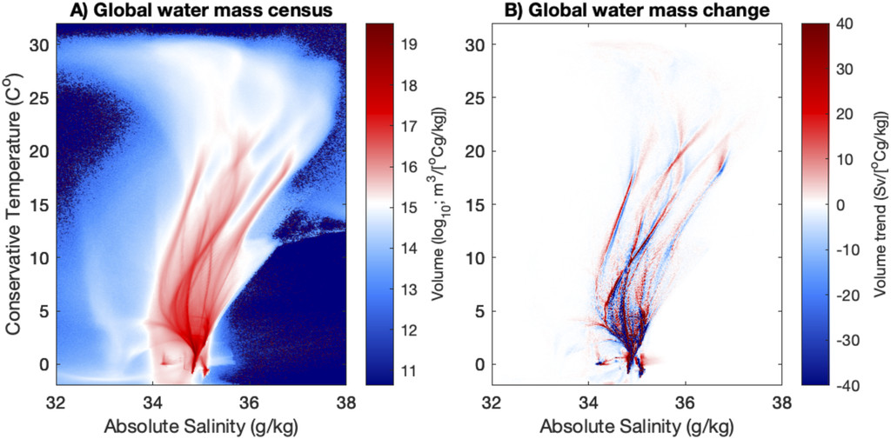
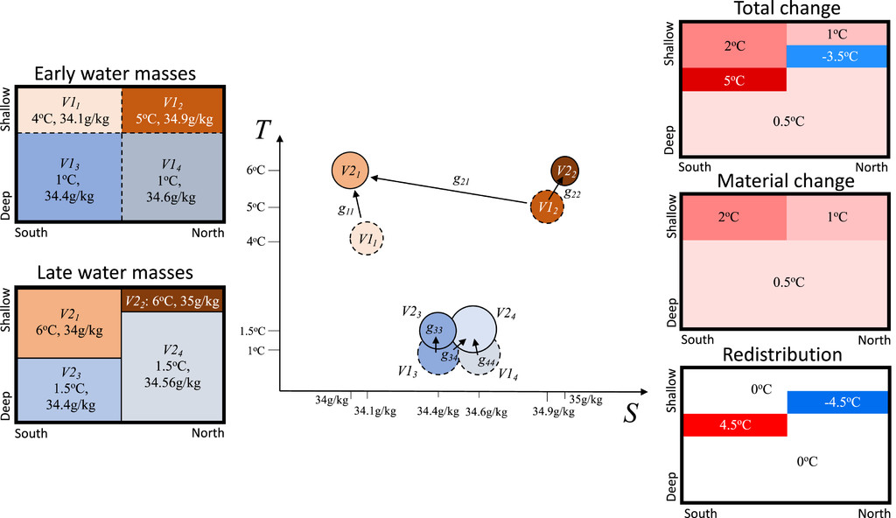
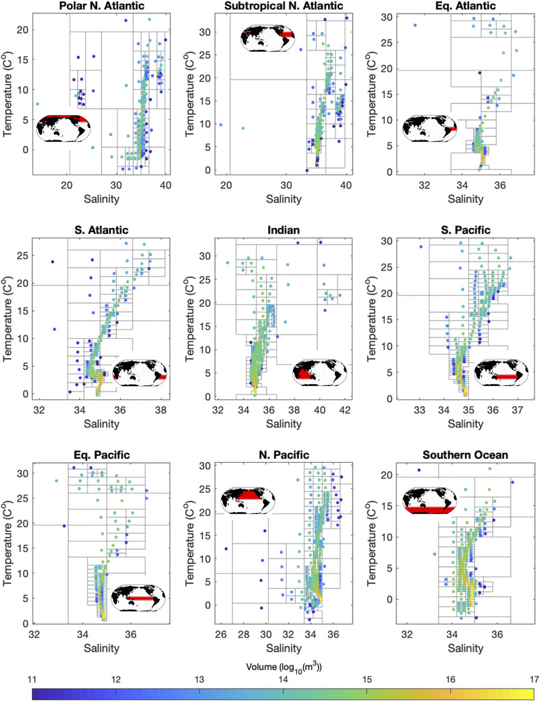
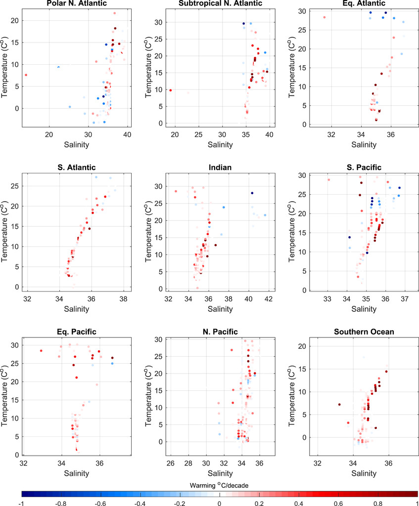
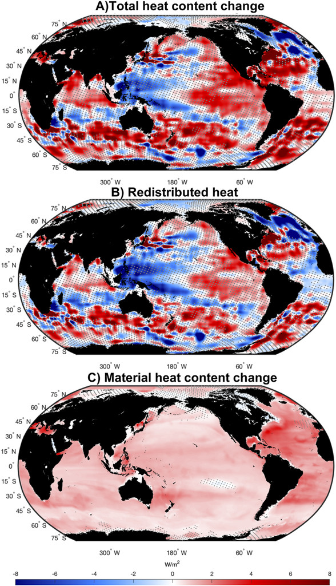
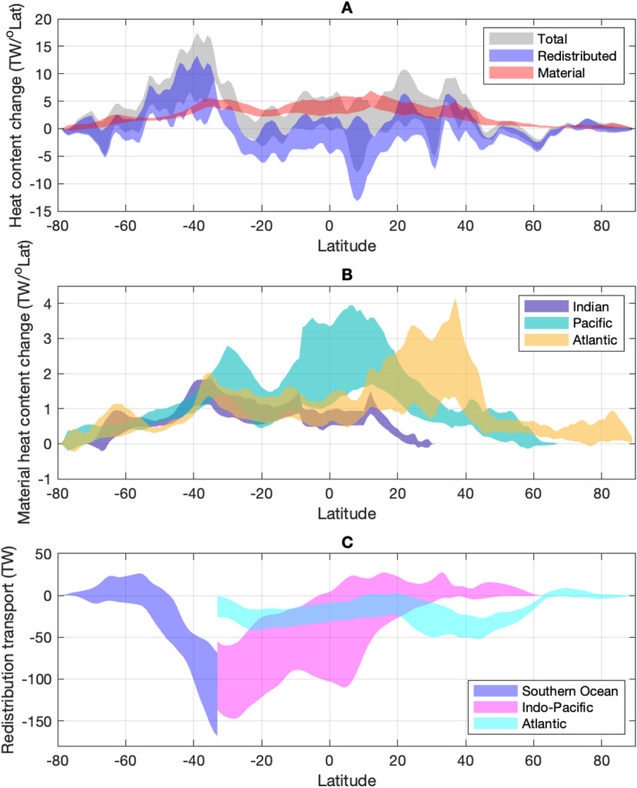

==================
Zika et al. (2021)
==================

:Title: Recent Water Mass Changes Reveal Mechanisms of Ocean Warming

:Corresponding author: J. D. Zika

:Citation: Zika, J. D., Gregory, J. M., McDonagh, E. L., Marzocchi, A., & Clement, L. (2021). Recent Water Mass Changes Reveal Mechanisms of Ocean Warming. Journal of Climate, 34(9), 3461-3479. doi: 10.1175/jcli-d-20-0355.1
           
:Keywords: Ocean, Water masses/storage, Climate change, Heat budgets/fluxes, Climate variability, Trends

Abstract
--------

Over 90% of the buildup of additional heat in the Earth system over recent decades is contained in the ocean. Since 2006, new observational programs have revealed heterogeneous patterns of ocean heat content change. It is unclear how much of this heterogeneity is due to heat being added to and mixed within the ocean leading to material changes in water mass properties or is due to changes in circulation that redistribute existing water masses. Here we present a novel diagnosis of the "material" and "redistributed" contributions to regional heat content change between 2006 and 2017 that is based on a new "minimum transformation method" informed by both water mass transformation and optimal transportation theory. We show that material warming has large spatial coherence. The material change tends to be smaller than the redistributed change at any geographical location; however, it sums globally to the net warming of the ocean, whereas the redistributed component sums, by design, to zero. Material warming is robust over the time period of this analysis, whereas the redistributed signal only emerges from the variability in a few regions. In the North Atlantic Ocean, water mass changes indicate substantial material warming while redistribution cools the subpolar region as a result of a slowdown in the meridional overturning circulation. Warming in the Southern Ocean is explained by material warming and by anomalous southward heat transport of 118 ± 50 TW through redistribution. Our results suggest that near-term projections of ocean heat content change and therefore sea level change will hinge on understanding and predicting changes in ocean redistribution.

Introduction
------------

Over the past 50 years, as atmospheric greenhouse gas concentrations have increased, the ocean has absorbed more than 10 times as much heat as all other components of the climate system combined (Rhein et al. 2013). This warming showed substantial spatial variability between 1993 and 2005, being up to 10 times as much in some regions as the global average (Zhang and Church 2012). It is unclear whether this variability is due to geographical variation in the interior propagation of surface warming versus redistribution of existing heat within the ocean.

Ocean warming is an important issue because ocean thermal expansion is the largest projected contribution to global mean sea level rise in the twenty-first century (Church et al. 2013). Numerical climate models disagree on the pattern and amplitude of ocean heat content (OHC) change and hence on sea level rise under anthropogenic greenhouse warming (Gregory et al. 2016). Understanding how heat has been taken up and redistributed by the ocean is essential for predicting future changes in sea level.

Numerical ocean models forced with historical atmospheric conditions have proved to be useful tools in quantifying how variability in atmospheric forcing can set variability in OHC (Drijfhout et al. 2014) and sea level (Penduff et al. 2011) at interannual to decadal time scales. However, such models can be unrealistic for simulating multidecadal climate change because of model drift and inaccuracies in long-term changes in atmospheric forcing, particularly global mean heat fluxes (GrifÞes et al. 2009). On the other hand, coupled ocean atmosphere climate models are routinely used to capture the effect of long-term climate forcing. But such models only accurately simulate past unforced variability in regional OHC when, by chance, their internal variability is in phase with the observed system.

An advance in terms of numerical ocean climate modeling has come from the separation of OHC change into an "added" and a "redistributed" component in climate model simulations, where the former is due to change in the surface heat flux, and the latter due to rearrangement of existing OHC because of altered ocean heat transports (Banks and Gregory 2006). This decomposition is analogous to the "anthropogenic" and "natural" decomposition that has revolutionized our under standing of oceanic carbon records (Khatiwala et al. 2013). Here we will present a novel method to diagnose the "material" component of OHC change, which we will show is closely related to the "added" component introduced by Banks and Gregory (2006).

Recent work has aimed to reconstruct the drivers of OHC change based on observationally derived airÐsea boundary conditions. Zanna et al. (2019) for example used surface temperature anomalies combined with a tracer-based approach to reconstruct the role of anomalous surface heat fluxes in centennial heat content change. Roberts et al. (2017) estimated the contribution of airÐsea heat flux changes in setting mixed layer and full-depth-integrated OHC budgets over recent decades and inferred the role of ocean circulation as a residual. Here we aim to circumvent reliance on such boundary conditions and infer the mechanisms of ocean heat content change directly based on water mass changes.

Water mass-based methods have been used to decompose local temperature and salinity changes into a dynamic "heave" component and an apparently material component at constant density based on a one-dimensional view of the water column (Bindoff and McDougall 1994). However, their analysis did not distinguish between material processes and horizontal advection, insofar as they affect the water mass properties of an individual water column.

Here we introduce a new method based on water mass theory, called the minimum transformation method, which we use to estimate recent drivers of three-dimensional OHC change. In section 2 we will review water mass theory and establish the relationship between changes in water masses as deÞned by their temperature and salinity and material changes in seawater temperature. We will describe in section 3 how this theory is translated into a practical method to estimate material changes in water masses and map these into geographical space. We present an application of this minimum transformation method to recent data over the Argo period in section 4 and give results in section 5. We discuss the results and compare them with existing work in section 6, and we give conclusions in section 7.

Water mass theory
-----------------

Water mass analysis has long been used in physical oceanography to trace the origin of waters (Montgomery 1958). In the latter half of the twentieth century a quantitative framework emerged to describe the relationship between water masses, airÐsea fluxes, and mixing [Walin 1982; see the review by Groeskamp et al. (2019)]. Recent work has seen this framework advanced in two ways specifically relevant to our work here: to multiple tracer dimensions to understand the thermodynamics of ocean circulation (Nycander et al. 2007; Zika et al. 2012; Doos et al. 2012; Groeskamp et al. 2014; Hieronymus et al. 2014) and to unsteady problems to understand the oceanÕs role in transient climate change (Palmer and Haines 2009; Evans et al. 2014; Zika et al. 2015a,b; Evans et al. 2017, 2018).

An example of the utility of the water mass transformation framework in understanding transient change is provided by Zika et al. (2015a). They demonstrate that the distribution of water in salinity coordinates is influenced by the water cycle and turbulent mixing, the latter only being able to collapse the range of salinities the ocean covers. This means that changes in the width of the salinity distribution indicate an enhancement of the water cycle and/or a reduction in that rate at which salt is mixed. In this project we extend this concept to consider how changes in the temperature-salinity distribution relate to material changes in water masses.

Material changes in Conservative Temperature \Theta (hereinafter simply "temperature" or T) following the motion of an incompressible fluid are related to Eulerian changes and advection by

\frac{DT}{Dt} = \frac{\partial T}{\partial t} + \bf{u} \cdot \nabla{T}, (1)

where \bf{u} is the 3D velocity vector and \frac{DT}{Dt} is the material derivative, which is related to sources and sinks of heat and irreversible mixing. Conservative Temperature is used here since it is a more accurate "heat" variable than potential temperature (McDougall 2003), although the later is still routinely used in ocean models, including the one analyzed in section a of appendix A.

Even if a perfect record of \frac{\partial T}{\partial t} were available at a fixed location, we would not know the relative roles of advection (\bf{u} \cdot \nabla{T}) and material processes (\frac{DT}{Dt}). To separate them, we consider the water mass perspective as an alternative to the Eulerian perspective. The following theory draws directly from Hieronymus et al. (2014).

We characterize water masses by their T and Absolute Salinity S_A (IOC/SCOR/IAPSO 2010; hereinafter simply "salinity" or S). The volume v of water per unit temperature and salinity and at temperature T^* and salinity S^* is 

v(T^*, S^*) = \frac{\partial^2}{\partial T \partial S} \int_{T<T^*, S<S^*}dV, (2)

where the integral is over elements dV of ocean volume that are cooler than T^* and fresher than S^*. An estimate of v that is based on recent observational analysis is given in Fig. 1a. (These data are described in detail in section 4.)

   Figure 1: Portrait of changing ocean water masses: (a) inventory of ocean volume in Conservative Temperature vs Absolute Salinity coordinates (mean of 2006-17 inclusive) and (b) change in water mass volume between the early half and late half of the period divided by the six years (Sv). According to water mass theory, changes in air-sea heat and freshwater fluxes and/or changes in rates of diffusion are required for these changes to occur.

Considering all of the water in the ocean and retaining the incompressibility assumption, the only way v can change is via transformation - that is, by making water parcels warmer, colder, saltier, or fresher as described by the following continuity equation [derived formally in Hieronymus et al. (2014)]:

\frac{\partial v}{\partial t} + \frac{\partial}{\partial T} (v \dot{T}) + \frac{\partial}{\partial S} (v \dot{S}) = 0, (3)

where \dot{T} is the average material derivative of T within a water mass. That is,

\dot{T}(T^*, S^*) = \frac{1}{v} \frac{\partial^2}{\partial T \partial S}  \int_{T<T^*, S<S^*}\frac{DT}{Dt} dV, (4)

and likewise \dot{S} is the average material derivative of S. An estimate of recent changes in v is given in Figure 1b.

In Eq. (3) the terms v\dot{T} and v\dot{S} are the transformation rates in the temperature direction (Sv g^{-1} kg^{-1}; 1 Sv = 10^6 m^3 s^{-1}) and salinity direction (Sv C˚^{-1}) respectively. Equation (3) states that the amount of water between two closely spaced isotherms (T and T + \partial T) and isohalines (S and S + \partial S) will go up if more water is made warmer at T than at T + \partial T and/or more water is made saltier at S than at S + \partial S.

When the system is in a statistically steady state the water mass distribution v remains constant such that

\frac{\partial}{\partial T} \overline{v \dot{T}} + \frac{\partial}{\partial S} \overline{v \dot{S}} = 0, (5)

where the overbar represents a sufficiently long time average. In this steady case, the vector field described by \overline{v \dot{T}} and \overline{v \dot{S}} can be characterized by a thermohaline streamfunction (Zika et al. 2012; Groeskamp et al. 2014).

Here, we will not attempt to estimate this steady-state component of water mass transformation [e.g., as Groeskamp et al. (2017) have done]. Rather we will attempt to quantify only the component required to explain changes in v. That is, we aim to quantify the anomaly in the transformation rate (v \dot{T})' such that v \dot{T} = \overline{v \dot{T}} + (v \dot{T})', and likewise for (v \dot{S})', with

\frac{\partial v}{\partial t} + \frac{\partial}{\partial T} (v \dot{T})' + \frac{\partial}{\partial S} (v \dot{S})' = 0, (6)

Note that a steady-state component like Eq. (5) can always be added to (v \dot{T})'  and (v \dot{S})' such that Eq. (6) is still satisfied. Hwever, we seek only the net change in water mass transformation required to explain changes in v and therefore seek the smallest (in a root-mean-square sense) values of \dot{T}' and \dot{S}' that satisfy Eq. (6). That is, we seek the smallest change in air-sea heat and freshwater fluxes and mixing - in a net sense - that can explain changes in water masses. We call this the minimum transformation.

Here we will use changes in v to infer the minimum transformation and therefore estimate v \dot{T}'. This will allow us to estimate the material processes influencing ocean temperature change.

The minimum transformation method
---------------------------------

We now apply water mass theory to understand changes in a discrete set of water masses describing the ocean over two time periods. We will then describe the application of a minimum transformation method that exploits an "earth moverÕs distance" (EMD) algorithm to estimate the amount of material warming required to affect changes in those water masses.

Discrete water masses
~~~~~~~~~~~~~~~~~~~~~

Consider the set of N discrete water masses with the ith water mass defined by the limits [T_i^{min}, S_i^{min}, \mathbf{x}_i^{min}] and [T_i^{max}, S_i^{max}, \mathbf{x}_i^{max}]. Essentially, our water masses are hypercubes in TÐSÐxÐyÐz space (more arbitrary space-and tim-dependent regions can be defined without affecting the method described below). To indicate whether water is within the ith water mass we define a boxcar function \Pi_i such that 

\begin{equation}

  \Pi_i(\mathbf{x}, t) = \begin{cases}
    1, & T_i^{min} \leq T(\mathbf{x}, t) < T_i^{max}, S_i^{min} \leq S(\mathbf{x}, t) < S_i^{max} \text{and} \mathbf{x}_i^{min} \leq \mathbf{x} < \mathbf{x}_i^{max}\\
    0, & \text{otherwise}.  \end{cases}

\end{equation}

The volume of water in the ith water mass at time t is then \iiint{\Pi_i(\mathbf{x}, t) dV}.

We consider two time periods: an early period (t_0 - \Delta t \leq t < t_0) and a late period (t_0 \leq t < t_0 + \Delta t). The average volume of the ith water mass over the early period is V1_i and the average volume of the jth water mass over the late period is V2_j such that 

V1_i = \frac{1}{\Delta t} \int_{t_0 - \Delta t}^{t_0} \iiint \Pi_i(\mathbf{x}, t) dV dt

and

V2_j = \frac{1}{\Delta t} \int_{t_0}^{t_0 + \Delta t} \iiint \Pi_i(\mathbf{x}, t) dV dt, (8)

and the average temperature and salinity of water within V1_i is

T1_i = \frac{1}{\Delta t V1_i} \int_{t_0 - \Delta t}^{t_0} \iiint \Pi_i(\mathbf{x}, t) T(\mathbf{x}, t) dV dt

and

S1_i = \frac{1}{\Delta t V1_i} \int_{t_0 - \Delta t}^{t_0} \iiint \Pi_i(\mathbf{x}, t) S(\mathbf{x}, t) dV dt, (9)

respectively; likewise for V2_j we have

T2_j = \frac{1}{\Delta t V2_j} \int_{t_0}^{t_0 + \Delta t} \iiint \Pi_j(\mathbf{x}, t) T(\mathbf{x}, t) dV dt

and

S2_j = \frac{1}{\Delta t V2_j} \int_{t_0}^{t_0 + \Delta t} \iiint \Pi_j(\mathbf{x}, t) S(\mathbf{x}, t) dV dt. (10)

To change the set of volumes V1_i into the set of volumes V2_j requires a transformation of water in T-S space. When water transforms, it changes its T and S and can also move geographically.

To understand how water is transformed from the physical location and physical properties of one water mass to another we use the shorthand \tilde{x}(t+\Delta t | \mathbf{x}, t) for the position of a water parcel at time t + \Delta t conditional on it previously being at position \mathbf{x} at time t. That is,

\tilde{x}(t+\Delta t | \mathbf{x}, t) = \mathbf{x} + \int_t^{t+\Delta t} \mathbf{u}[\tilde{x}(t^* | \mathbf{x}, t), t^*] dt^*, (11)

where, as previously, \mathbf{u} is the 3D velocity vector. We describe the transformation rate between the early and late water masses with the matrix \mathbf{g}. The ith column and jth row of this matrix g_{ij} correspond to the average rate of transformation of water from early water mass i to late water mass j such that 

g_{ij} = \frac{1}{\Delta t^2} \int_{t_0 - \Delta t}^{t_0} \iiint \Pi_i(\mathbf{x}, t) \Pi_j[\tilde{x}(t + \Delta t | \mathbf{x}, t),t]dV dt. (12)

In Eq. (12) the term \Pi_i(\mathbf{x}, t) \Pi_j[\tilde{x}(t + \Delta t | \mathbf{x}, t),t] isolates water that was in the ith water mass at time t and was subsequently in the jth water mass at some time \Delta t later. The quantity g_{ij} is therefore the average rate (m^3 s^{-1}) at which water in the ith early water mass is transformed into the jth late water mass.

Since the total volume of water is conserved between the early and late periods all the water from the early water masses (V1_i) must be transformed into late water masses. Likewise, all water masses from the late period (V2_j) are made from water masses of the early period. That is, 

V1_i = \Delta t \sum_{j=1}^N g_{ij}

and

V2_j = \Delta t \sum_{i=1}^N g_{ij}. (13)

The average temperature change of water that transforms from V1_i to V2_j is then 

\Delta T_{ij} = \frac{1}{\Delta t^2 g_{ij}} \int_{t_0-\Delta t}^{t_0} \iiint \Pi_i(\mathbf{x}, t) \Pi_j[\tilde{x}(t + \Delta t | \mathbf{x}, t),t]\{T[\tilde{x}(t + \Delta t | \mathbf{x}, t),t]-T(\mathbf{x}, t)\} dV dt, (14)

where the temperature change of individual parcel is related to the Lagrangian derivative by

T[\tilde{x}(t + \Delta t | \mathbf{x}, t),t] - T(\mathbf{x}, t) = \int_t^{t + \Delta t} \frac{DT}{Dt}[\tilde{x}(t^*|\mathbf{x},t),t^*]dt^*. (15)

We can write Eq. (14) as 

\Delta T_{ij} = \mathcal{T}2_{ji} - \mathcal{T}1_{ij}, (16)

where \mathcal{T}2_{ji} is the volume-weighted average temperature of the water in the jth late water mass that was previously in the ith early water mass and \mathcal{T}1_{ij} is the volume-weighted average temperature of the water in the ith early water mass that is later in the jth late water mass.

The transformation g_{ij} involves a range of water parcels with a range of temperatures T(\mathbf{x}, t), whose mean is \mathcal{T}1_{ij},in the early period moving to a range of temperatures T[\tilde{x}(t + \Delta t | \mathbf{x}, t),t], whose mean is \mathcal{T}2_{ji}, in the late period. To simplify this problem, we assume that in both periods the water masses are well mixed. This means that we expect that the mean temperature of any sample of water parcels from water mass i in the early period will equal the mean temperature of the water mass as a whole, and in particular this is true for the sample of parcels that ends up in water mass j in the late period. Thus mathcal{T}1_{ij} = T1_i with this assumption. By a similar argument, \mathcal{T}2_{ji} = T2_j, and hence the average T and S change of water transforming from the ith early to the jth late water mass as the difference of the average T and S of the two water masses. That is, \Delta T_{ij} = T2_j - T1_j and \Delta S_{ij} = S2_j - S1_j.

This above approximation preserves the following equality relating the change in global volume-weighted temperature to the transformation matrix:

\sum_{j=1}^N V2_j T2_j - \sum_{i=1}^N V1_i T1_i = \Delta t \sum_{i=1}^N\sum_{j=1}^N g_{ij} (T2_j - T1_i), (17)

and likewise for the volume-weighted salinity.

We have effectively discretized the continuum of trajectories from early to late water masses into a finite set of discrete trajectories. This discretization clearly leads to some information loss; however, such losses are unavoidable in any computationally feasible inverse method.

Note that, even if the ith water mass for the early period has the same temperature and salinity bounds as the ith water mass of the late period, the distribution of properties within the water mass can change. That is, in general T1_j ≠ T2_i and S1_j ≠ S2_i, so g_{ij} is always a transformation, even with i = j. For example, assume the ith water mass has temperature bounds 1˚ and 2˚C and that the water between those bounds is on average at 1.9˚C in the early period and 1.1˚C in the late period. Groeskamp et al. (2014) called this a "local effect" and included it as a separate term in their formulation. Here, we find it convenient to consider the transformation from the ith early water mass at 1.9˚C to the ith late water mass at 1.1˚C to be yet another transformation - no different than between any other pair of water masses.

We relate the transformation rate to the average material temperature tendency required to warm the ith early water mass to form the range of destination water masses it arrives at in the late period. That is,

\dot{T}_i = \frac{1}{V1_i} \sum_{j=1}^N (T2_j - T1_i) g_{ij}. (18)

We use \dot{T} to define a 3D material temperature change field \Delta T_{material} such that

\Delta T_{material}(\mathbf{x}) = \int_{t_0-\Delta t}^{t_0} \sum_{i=1}^N \Pi_i(\mathbf{x}, t) \dot{T}_i dt
\approx \frac{1}{\Delta t} \int_{t_0-\Delta t}^{t_0} \left\{\int_t^{t + \Delta t}\frac{DT'}{Dt}[\tilde{x}(t^*|\mathbf{x},t),t^*]dt^*\right\} dt. (19)

Note here that we are relating \dot{T}_i only to the anomaly of the Lagrangian tendency (i.e., \frac{DT'}{Dt} rather than \frac{DT}{Dt}) as it appears in Eq. (19). This is because our \dot{T}_i describes only the changes in the transformation rate required to explain changes in the water mass distribution [as in Eq. (6)]. There can be (and indeed is) an additional "mean" transformation rate that leads to cycles of water in T-S space but does not lead to any changes in water mass inventories with time (Groeskamp et al. 2014). Implicit in Eq. (19) is the assumption that the anomalous warming of a particular water mass occurred evenly (in a volume-and time-weighted sense) over the regions and times during which that water mass existed in the early period.

We will contrast the inferred material warming at one location \mathbf{x} against the total warming

\Delta T(\mathbf{x}) = \int_{t_0 - \Delta t}^{t_0} T(\mathbf{x}, t + \Delta t) - T(\mathbf{x}, t) dt/\Delta t, 

with the residual of the two being a redistribution component such that

\Delta T_{material} = \Delta T - \Delta T_{redistribution}.

By construction, \Delta T_{redistribution} accounts for the advective redistribution of temperature (\mathbf{u} \cdot \nabla{T}), which does not affect the underlying water masses and therefore is not accounted for in \Delta T_{material}.

Finding the minimum transformation using an EMD algorithm
~~~~~~~~~~~~~~~~~~~~~~~~~~~~~~~~~~~~~~~~~~~~~~~~~~~~~~~~~

Our goal now is to estimate the transformation matrix \mathbf{g}. Out of the inÞnite number of choices that could satisfy Eq. (13),we will look for the smallest (in a least squares sense) possible transformation required to change the distribution. We call this the minimum transformation.

Previous studies have diagnosed transformation rates from time-dependent changes in water mass distributions by searching for a minimum least squares solution on a regular T-S (Evans et al. 2014) or density-spiciness grid (Portela et al. 2020). Because of the dramatic variations in volume per unit temperature and salinity of the World Ocean (Fig. 1b) we choose to describe the distribution in an unstructured way. Furthermore, we exploit recent advances in the area of "optimal transportation theory" - in particular, the EMD algorithm that is mentioned at the beginning of section 3 (Pele and Werman 2008, 2009).

The EMD solves the hypothetical problem of moving earth from a set of mounds, each with varying amounts of earth, into a set of holes with varying amounts of empty space to be filled, where the total volume of the mounds is equal to that of the holes. In our case the "mounds" are the early water masses and the "holes" are the late water masses. The optimization problem is to find the set of transfers (from a mound to a hole, or the early to late water masses) that gives the smallest possible total of mass-weighted distance (the product of the mass and the distance of a transfer) that needs to be traveled in order to empty the mounds and fill the holes. For the EMD algorithm, we require a distance metric \mathbf{d} ,which is a matrix whose ith column and jth row d_{ij} is the cost of moving water from the ith early water mass to the jth late water mass. The EMD algorithm then estimates \mathbf{g} such that Eq. (13) is satisÞed and the following total mass-weighted "distance" is minimized:

\sum_{j=1}^N\sum_{i=1}^N g_{ij} d_{ij}. (21)

We use the following distance metric:

d_{ij} = (T1_i - T2_j)^2 + [a(S1_i - S2_j)]^2 + \delta_{ij}, (22)

where temperature and salinity differences are squared so that the distance is positive definite and long trajectories in TÐS space are penalized more than short ones and a is a constant that scales the salinity change relative to the temperature change and whose choice is described in the next section. The intent of \delta_{ij} is to permit movement between water masses that are adjacent geographically without additional penalty but at the same time to stop direct exchange between geographically disconnected water masses, for example between water masses in the Southern Ocean and the Arctic. To achieve this we set \delta_{ij} = 0 where the ith and jth water masses are in the same or adjacent geographical regions and \delta_{ij} >> max{(T1_i - T2_j)^2 + [a(S1_i - S2_j)]^2} otherwise (in practice we use \delta_{ij} = 10^6 in the latter case). Regions that share a meridional or zonal boundary are considered to be adjacent. The Arctic and North PaciÞc Oceans are not considered to be adjacent, whereas the Indian Ocean and equatorial PaciÞc regions are considered to be adjacent.

Our motivation for using EMD is simply to find the smallest amount of transformation (in a least squares sense) required to explain observed water mass change. If T-S changes in the ocean could be explained purely by adiabatic redistribution of existing water masses, then our method would prioritize this solution. Our initial guess is therefore this adiabatic solution (i.e., where g_{ij} = 0 for all i and j). The EMD algorithm finds the smallest deviation possible from this adiabatic case. We cannot rule out larger compensating transformations having taken place. In principle, solutions given different initial guesses (e.g., an initial guess for \mathbf{g} that is based on a numerical simulation) could be explored. We leave this to future work.

Figure 2 summarizes the minimum transformation method schematically. In the schematic just four early and four late water masses are deÞned with two in one geographical area and two in another. The minimum transformation moves water from the ith early to the ith late water masses in all four cases (i.e., g_{ii} ≠ 0 for all i). In addition, a substantial amount of water is moved from the second early water mass to the first late water mass (g_{21}) and from the third early water mass to the fourth late water mass (g_{34}). The observed change in temperature is therefore explained by a material warming of 2˚ and 1˚C of the two warmer shallower water masses and of 0.5˚C for the cooler deeper water masses. The remainder of the Eulerian pattern of temperature change is explained by redistribution. This schematic representation is vastly simplified as compared to our actual implementation of the minimum transformation method, which is described in the next section.
 

   Figure 2: Schematic describing a simplified hypothetical implementation of the minimum transformation method. (left) Between a late and an early period, surface waters warm, especially to the south, where the ocean is fresher and the upper ocean layer becomes thicker. (center) The ocean is split into a southern region containing water masses 1 and 3 and a northern region containing water masses 2 and 4. Between the early and late periods, water masses 1 and 4 increase in volume and 2 and 3 reduce in volume. Taking into account the changing temperatures, salinities, and volumes of the early and late water masses, the "minimum transformations" g_{ij} are found using the EMD algorithm. These suggest modest warming of each water mass with some of early water mass 2 transforming to become late water mass 1 (g_{21}) and some of early water mass 3 transforming to become late water mass 4 (g_{34}). (right) The total temperature change is heterogeneous. A warming of 2˚C explains changes in water mass 1, a warming of 1˚C explains changes in water mass 2, and a warming of 0.5˚C explains changes in water masses 3 and 4. This warming is projected onto the location of those water masses in the early period to show the "material change." The residual of the total and material changes is then explained by a "redistribution" that involves intense subsurface warming in the southern region and intense subsurface cooling in the northern region.

Data and application of the minimum transformation method
---------------------------------------------------------

Observational estimates of T and S come from the objective analysis provided by the Enact Ensemble (V4.0, hereinafter EN4; Good et al. 2013). EN4 has a 1˚-by-1˚ horizontal resolution with 42 vertical levels. We analyze each month between 2006 and 2017 inclusive. We split these data into two time periods: an early period between 2006 and 2011 inclusive and a late period between 2012 and 2017 inclusive (i.e., t_0 = 0000 1 January 2007 and \Delta t = 6 years).

We then define a discrete set of water masses for each time period by splitting the ocean into nine geographical regions and within each region by splitting up the ocean according to T-S bins. Our nine geographical regions are the Southern Ocean south of 35˚S, the subtropical Pacific and Atlantic Oceans between 35˚ and 10˚S, the Indian Ocean north of 35˚S, the tropical Pacific and Atlantic Oceans between 10˚S and 10˚N, the North Pacific north of 10˚N, the Atlantic Ocean between 10˚ and 40˚N, and the Atlantic and Arctic Ocean north of 40˚N. To avoid discontinuities in our resulting analysis we transition linearly from one region to another over a 10˚ band (Figure 5).

We define T and S bin boundaries ([T_{min}, T_{max}] and [S_{min}, S_{max}] respectively) using a quadtree. The quadtree starts with a single (obviously oversized) bin with T boundaries [-6.4˚,96˚C] and S boundaries [-5.2, 46 g kg^{-1}] in which the entirety of the ocean's seawater resides. The single bin is then split into four equally sized bins with the same aspect ratio as the original bin. The same process of splitting into four is repeated for any bin whose volume change is greater than a threshold of 62 \times 10^{12} m^3 (equivalent to the volume of a 5˚ longitude by 5˚ latitude region at the equator with a depth of 200 m) or until the bin size is 0.4˚C by 0.2 g kg^{-1}. Average volumes for each water mass are shown in Figure 3. In the supplementary text we show that changing the size of these bins by a factor of 2 does not substantially change our results. The quadtree is applied within each region and for the change between the late and early periods. This results in bin edges defining N = 1447 water masses. These bins are then used to dedine both the early water masses and the late water masses.

   Figure 3: Gray lines show Conservative Temperature T and Absolute Salinity S bounds of each water mass (or "bin") generated using a quadtree for each geographical region. The average T and S of the water found within each bin are shown by the location of each marker, and the volume is represented by the color scale (log10m3). Inventories and mean T and S values represent the entire period (2006-17 inclusive). Inset panels show masks associated with each geographical region.

We choose the constant a to be the ratio of a typical haline contraction coefficient to a typical thermal expansion coefficient (a = \beta_0/\alpha_0 = 4.28). This does not mean that transformations along density surfaces are necessarily preferred; rather, the squares in Eq. (22) mean that density-compensated changes in T and S are penalized as much as changes of the same magnitude where one of the signs is reversed. The inferred \Delta T_{material} for each water mass is shown in Figure 4. We have tested the sensitivity of our method to varying a by a factor of 2 and found only negligible changes in inferred warming (see section b of appendix A).

   Figure 4: Each symbol shows \Delta T_{material}, the average warming required for each early water mass in order to transform them into the set of late water masses.

In section a of appendix A, we compare the results of our method applied to synthetic data from a climate model simulation with an added-heat variable explicitly simulated by the model. We find good agreement between added heat and our inferred \Delta T_{material} and between simulated redistributed heat and our inferred \Delta T_{redistributed} when ocean temperature and salinity are fed in as "data" to the method. Section b of appendix A also explores sensitivity of our results to parameter choices. The uncertainties we place on OHC change are ±2 standard deviations of a bootstrap ensemble, also described in section c of appendix A.

To produce maps of the total, material and redistributed contributions to the heat content we multiply the density and heat capacity of seawater by the respective temperature change and vertically integrate these through the entire water column. Our method also produces a material salinity change. We leave discussion of those data to future work.

Results
-------

Patterns of total OHC change between early and late periods are heterogeneous (Figure 5a). There are basin-scale patches of decreasing heat content in the western equatorial and tropical Pacific, in the Pacific sector of the Southern Ocean, in the subtropical south Indian Ocean, and in the subpolar North Atlantic. Warming is seen most strongly in the tropical eastern Pacific, South Atlantic Ocean, and subtropical North Atlantic. These changes are highly sensitive to the specific observation years chosen and the length of the epochs reflecting the regional time scale of variability associated with the redistributed component. Uncertainty is far larger than the signal in the majority of regions (stippling in Figure 5a) and coincident with previously identified regions of large sea level anomaly variability (Penduff et al. 2011).

   Figure 5: Heterogeneous pattern of total and redistributed heat content change contrast against robust material heat content change: (a) change in depth-integrated ocean heat content between 2006-11 and 2012-17 inclusive, (b) inferred redistributed heat, and (c) inferred material heat content change based on changing water masses for the same period. Regions where the magnitude of the signal is less significant (less than 2 standard deviations of a bootstrap ensemble) are stippled.

However, there are a few regions (e.g., patches of the Southern Ocean and North Atlantic) where the regional redistributed signal is robust and emerges from the uncertainty (Figure 5b). The patterns of redistributed heat observed in the Pacific are consistent with interdecadal Pacific oscillation (IPO)-driven thermosteric sea level variability (Lyu et al. 2017). The IPO was typically positive in the late period and negative in the early period (see https://psl.noaa.gov/gcos_wgsp/Timeseries/ for these data).

Material heat content change shows a smaller amplitude but more coherent signal than redistributed heat (Figures 5b,c). Material warming is seen across almost the entirety of the globe, with maxima in the Southern Hemisphere and Atlantic subtropical convergence zones (Maximenko et al. 2009), consistent with model simulations of passive ocean heat uptake due to anthropogenic greenhouse warming (Gregory et al. 2016). In such model simulations, anomalous heat fluxes into the ocean predominate at mid-to high latitudes and this heat is distributed throughout the ocean largely passively via subduction (downwelling) in the North Atlantic and the Southern Ocean (Marshall et al. 2015).

Strikingly, the uncertainty in material heat content change is far smaller than that of total OHC change (stippling in Figure 5c). This suggests that heat was added to and distributed within the ocean persistently over the Argo period and that this warming is not an artifact of a particularly warm year or years.

Zonally integrating the net OHC change reveals a signal of roughly the same magnitude as its uncertainty at all latitudes (Figure 6a). Zonally integrated redistributed heat likewise has a small signal to uncertainty ratio except in the Southern Ocean (Figure 6a). Accumulating the redistributed heat contribution from north to south gives the meridional heat transport due to redistribution. Broadly, heat is redistributed from north to south with a southward cross-equatorial transport of 73 ± 60 TW between the two epochs (Figure 6c).

   Figure 6: Material heat content change is accumulating in the tropics and subtropics, whereas existing heat is being redistributed southward. (a) Total heat content change (gray), redistribution contribution (blue), and material contribution (red). (b) Contributions to material heat content change from the Indian (green), Pacific (orange), and Atlantic (yellow) Oceans. (c) Meridional heat transport due to redistribution in the Southern Ocean (blue), Atlantic (cyan), and Indian plus Pacific Oceans (magenta). Shaded areas represent ±2 standard deviations of a bootstrap ensemble.

Material heat content change (Figure 6a) is larger than its uncertainty at most latitudes and shows a peak at 35˚S and at 15˚ and 35˚N. The material heat content change peaks at 35˚S and 35˚N are collocated with climatological wind stress curl minima, where material warming due to anomalous surface heat fluxes may be accumulating due to convergence of surface Ekman transport.

Table 1 shows material, redistributed, and total heat content changes by ocean basin. Material heat content change is distributed among the Indian, South Pacific, and South Atlantic basins approximately according to their area. However, the tropical and subtropical North Atlantic stores close to 20% of the global ocean's material heat content change despite representing less than 10% of its area (Table 1). An outsized role for the North Atlantic in storing material heat content change in the climate system has also been foreseen in numerical modeling studies (Lee et al. 2011).

Table 1: Material, redistribution, and total contributions to heat content change by ocean basin in terawatts and area as fraction of global ocean area. Heat content change estimates are based on differences between the periods 2006–11 and 2012–17 inclusive. Uncertainties are ±2 standard deviations. The Southern Ocean is defined as the entire ocean south of 32˚S. The South Pacific, South Atlantic, and Indian Ocean estimates exclude the ocean south of 32S. The North Atlantic is split into a region south of and a region north of 44˚N. The latter includes the Arctic Ocean.

+------------------------+-------------+---------------+---------+--------------+
|                        | Material    | Redistributed | Total   | Area fraction|
+========================+=============+===============+=========+==============+
| Southern Ocean         | 90 ± 18     | 118 ± 50      | 208 ± 63| 0.27         |
+------------------------+-------------+---------------+---------+--------------+
| South Pacific          | 53 ± 16     | 226 ± 22      | 28 ± 22 | 0.15         |
+------------------------+-------------+---------------+---------+--------------+
| North Pacific          | 82 ± 25     | 261 ± 55      | 21 ± 54 | 0.23         |
+------------------------+-------------+---------------+---------+--------------+
| Indian Ocean           | 45 ± 10     | 213 ± 25      | 32 ± 30 | 0.12         |
+------------------------+-------------+---------------+---------+--------------+
| South Atlantic         | 34 ± 11     | 6 ± 7         | 40 ± 7  | 0.06         |
+------------------------+-------------+---------------+---------+--------------+
| North Atlantic (<44˚N) | 75 ± 33     | 20 ± 17       | 95 ± 46 | 0.10         |
+------------------------+-------------+---------------+---------+--------------+
| North Atlantic (>44˚N) | 19 ± 6      | 240 ± 13      | 220 ± 16| 0.08         |
+------------------------+-------------+---------------+---------+--------------+
| Global Ocean           | 398 ± 81    | 0             | 398 ± 81| 1.00         |
+------------------------+-------------+---------------+---------+--------------+

We identify robust redistributed warming signals in the subtropical North Atlantic and Southern Ocean. Warming in the subtropical North Atlantic is compensated by cooling in the subpolar North Atlantic consistent with a 40 ± 13 TW southward transport of heat across 44˚N (Figure 6c). Southward heat redistribution across 32S brings 118 ± 50 TW into the Southern Ocean.

Discussion
----------

Recent anomalous southward heat transport in the North Atlantic has been well documented and has been attributed to a downturn in the Atlantic meridional overturning circulation (Smeed et al. 2014; Bryden et al. 2020). Observed heat transport anomalies equate to a downturn in meridional heat transport equivalent to -23 ± 60 TW for the period 2006-11 versus 2012–17 at 26˚N in the Atlantic [see appendix B for details of this calculation, which is based on data from Bryden et al. (2020)], which is consistent with our estimate of the change in redistribution heat transport of -23 ± 19 TW (Figure 6; uncertainties are ±2 standard deviations).

The large apparent meridional heat transport we have identified in the Southern Ocean was previously identified by Roberts et al. (2017) based on the residual of observed OHC change and estimates of air-sea heat fluxes. Their approach captures additional heat in the system where it is fluxed into the ocean while our approach estimates how that heat is distributed. Nonetheless, the correspondence between our results and theirs is reassuring and perhaps not surprising if the redistribution signal is large as both approaches indicate.

The approach of Zanna et al. (2019) is more directly comparable to ours. They reconstruct the passive contribution to ocean warming since 1850 by propagating SST anomalies into the ocean interior using Green's functions. They report changes for a much longer time frame (1955-2017 as opposed to our 2006-17), and therefore magnitudes of warming estimates are not comparable, but a comparison of patterns of change is relevant. In terms of our zonally averaged material warming and their "passive warming" the two datasets share peaks at approximately 35˚S and 35˚N potentially attributable to surface Ekman convergence (see their Fig. 3).

Zanna et al. (2019) report relatively small amounts of passive warming at low-latitude regions while we report a peak in material warming there. This may suggest that the material warming we estimate at low latitudes is in fact related to interannual to decadal variability. An explanation of this may be that the lower low-latitude SST corresponds to a predominance of a negative IPO (Lyu et al. 2017), leading to anomalous ocean heat uptake over our study period. This is a commonly cited explanation for the so-called global warming hiatus discussed in the 2010s (Whitmarsh et al. 2015).

Zanna et al. (2019) compare their inferred passive warming between 1955 and 2017 to the warming observed in situ. Based on this they find evidence of a southward redistribution of heat in the Northern Hemisphere but no substantial southward redistribution in the Southern Hemisphere. This suggests that the southward redistribution of heat inferred by both Roberts et al. (2017) and this study in the Southern Hemisphere may be a more recent occurrence. Indeed, two recent studies have shown that the Southern Hemisphere dominance of ocean heat content change during the twenty-first century is not consistently represented in historical climate simulations and is likely linked to internal variability (Bronselaer and Zanna 2020; Rathore et al. 2020).

Here we have exclusively analyzed the Hadley Centre's EN4 dataset. Sensitivity to observational coverage is mitigated in part by our consideration of data during the Argo observing period (2006-17). We consider uncertainties to have been reasonably estimated based on our bootstrapping approach, which subsamples those years (see section c of appendix A). Because of EN4's mapping approach, however, regions where minimal observations were made (e.g., the marginal ice zones in the Southern Hemisphere and below 2000 m) will likely have muted trend estimates. This issue will require special attention when our method is applied to the pre-Argo period and in particular with regard to salinity observations, which are less numerous than temperature observations (Clement et al. 2020).

Conclusions
-----------

In summary we have shown the following:

* Water mass changes between 2006-11 and 2012-17 can be interpreted in terms of material warming across the globe and with the highest concentrations in the tropical and subtropical North Atlantic Ocean, consistent with simulations of the addition of heat into the ocean due to greenhouse forcing.
* The majority of the variance in ocean heat content change at scales of 1˚-by-1˚ over that period can be explained by a redistribution of existing water masses within the ocean.
* The inferred redistribution indicates a downturn in northward meridional heat transport into the subpolar North Atlantic of 40 ± 13 TW and an anomalous southward heat transport into the Southern Ocean of 118 ± 50 TW.

The material warming signal that we have inferred is generally weaker than redistribution, but the signal is far less sensitive to changes in the years over which the analysis was carried out. This suggests that material warming may be giving a robust indication of slow thermodynamic changes in the ocean. This could be a result of anthropogenic forcing, although that would be remarkable since the midpoints of the early and late periods are only 6 years apart.

We expect the strength of the material warming signal to increase into the future as the ocean warms. However, since the redistribution signal is so large, circulation changes and variability must be understood if near-term ocean temperature variability and regional sea level change are to be projected accurately.

